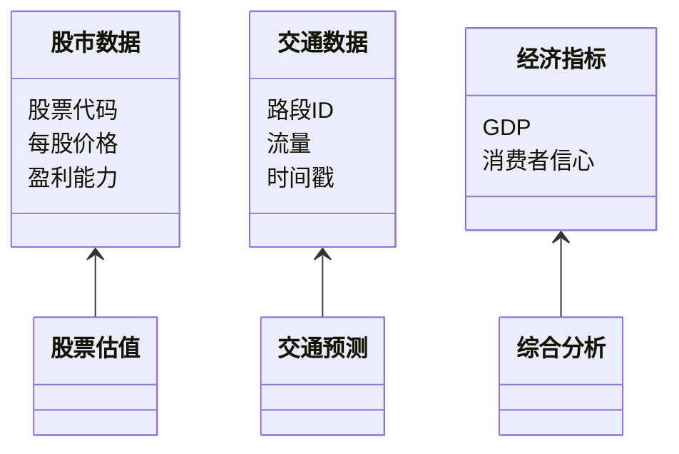

                 


# 《新兴市场股市估值与智慧城市交通拥堵预测系统的互动》

---

## 关键词

- 新兴市场股市估值
- 智慧城市交通拥堵预测
- 系统互动
- 数据分析
- 人工智能

---

## 摘要

本文探讨新兴市场股市估值与智慧城市交通拥堵预测系统的互动关系。通过分析股市估值的核心概念、交通拥堵预测的技术原理，以及两者如何通过数据和算法相互影响，提出一种结合经济指标和交通数据的互动预测模型，为智慧城市建设提供新思路。

---

# 第一部分: 新兴市场股市估值与智慧城市交通拥堵预测系统概述

## 第1章: 新兴市场股市估值概述

### 1.1 股市估值的核心概念

#### 1.1.1 股市估值的基本定义

股市估值是指通过对企业的财务数据和市场因素进行分析，确定其股票的合理价格区间。新兴市场的股市估值受经济结构、政策环境和投资者情绪的影响较大。

#### 1.1.2 股市估值的主要方法

- 市盈率（P/E）：股价与每股收益的比率。
- 市净率（P/B）：股价与每股净资产的比率。
- 股东权益与企业价值评估。

#### 1.1.3 新兴市场的特殊性

新兴市场波动性高，信息不透明，经济指标对股市估值的影响更为显著。

---

## 第2章: 智慧城市交通拥堵预测系统概述

### 2.1 交通拥堵预测的核心概念

#### 2.1.1 交通拥堵的定义与特征

交通拥堵指交通流量超过道路容量，导致通行效率下降。

#### 2.1.2 智慧城市中的交通管理技术

- 数据采集：传感器、摄像头、GPS。
- 数据分析：时间序列分析、机器学习模型。
- 实时优化：动态调整信号灯、路径规划。

#### 2.1.3 交通数据采集与分析

通过实时数据采集和分析，预测交通流量变化。

---

## 第3章: 两者的互动关系

### 3.1 股市估值与交通拥堵的关联性

#### 3.1.1 经济活动与交通流量的关系

经济繁荣导致交通流量增加。

#### 3.1.2 市场情绪对交通拥堵的影响

股市波动影响经济活动，进而影响交通拥堵。

#### 3.1.3 城市化进程中的互动机制

城市化推动交通需求，股市估值反映城市化进程的经济表现。

---

## 第4章: 核心概念对比与ER实体关系图

### 4.1 核心概念属性特征对比

| 属性        | 股市估值                | 交通拥堵预测            |
|-------------|------------------------|--------------------------|
| 数据类型     | 财务数据、市场指标       | 交通流量、传感器数据    |
| 分析方法     | 时间序列分析、机器学习  | 数据挖掘、实时预测       |
| 应用场景     | 投资决策、风险管理       | 交通管理、城市规划      |

### 4.2 ER实体关系图

```mermaid
erd
    项目: 股市估值与交通拥堵预测系统
    实体: 股市数据(股票代码, 每股价格, 盈利能力)
    实体: 交通数据(路段ID, 流量, 时间戳)
    实体: 经济指标(国内生产总值, 消费者信心指数)
    关系: 股市数据 <--(属于)- 经济指标
    关系: 交通数据 <--(影响)- 经济指标
    关系: 交通数据 <--(互动)- 股市数据
```

---

# 第二部分: 核心概念与联系

## 第5章: 核心概念原理

### 5.1 股市估值的核心原理

#### 5.1.1 市盈率与市净率的计算方法

$$ P/E = \frac{\text{股价}}{\text{每股收益}} $$

$$ P/B = \frac{\text{股价}}{\text{每股净资产}} $$

#### 5.1.2 股东权益与企业价值的评估

企业价值 = 股东权益 + 长期负债 - 现金。

### 5.2 交通拥堵预测的核心原理

#### 5.2.1 数据驱动的交通流量预测

使用历史流量数据，通过ARIMA模型进行预测。

$$ ARIMA(p, d, q) $$

---

## 第6章: 算法原理讲解

### 6.1 时间序列分析

#### 6.1.1 ARIMA模型

$$ ARIMA(p, d, q) $$

#### 6.1.2 LSTM网络

使用LSTM进行交通流量预测，代码示例如下：

```python
import numpy as np
from tensorflow.keras.models import Sequential
from tensorflow.keras.layers import LSTM, Dense

# 数据准备
data = ...  # 时间序列数据

# 模型构建
model = Sequential()
model.add(LSTM(50, input_shape=(timesteps, features)))
model.add(Dense(1))
model.compile(optimizer='adam', loss='mse')

# 训练
model.fit(X_train, y_train, epochs=100, batch_size=32)
```

### 6.2 机器学习模型

#### 6.2.1 随机森林回归

使用随机森林模型预测交通拥堵指数。

---

## 第7章: 系统分析与架构设计方案

### 7.1 项目介绍

构建一个结合股市估值和交通拥堵预测的互动系统。

### 7.2 系统功能设计

#### 7.2.1 领域模型



---

## 第8章: 项目实战

### 8.1 环境安装

安装Python、Pandas、TensorFlow。

### 8.2 核心代码实现

#### 8.2.1 股市估值代码

```python
import pandas as pd

# 加载数据
df = pd.read_csv('stock_data.csv')

# 计算市盈率
df['PE'] = df['股价'] / df['每股收益']
```

#### 8.2.2 交通拥堵预测代码

```python
from sklearn.ensemble import RandomForestRegressor

# 训练模型
model = RandomForestRegressor()
model.fit(X_train, y_train)

# 预测交通拥堵指数
y_pred = model.predict(X_test)
```

### 8.3 案例分析

分析新兴市场股市波动对交通拥堵的影响。

---

## 第9章: 总结与展望

### 9.1 总结

股市估值与交通拥堵预测系统的互动关系为智慧城市建设提供了新思路。

### 9.2 展望

未来，随着AI和大数据技术的发展，互动预测模型将更加精准。

---

## 第10章: 注意事项与拓展阅读

### 10.1 注意事项

数据质量和模型优化是关键。

### 10.2 拓展阅读

建议学习时间序列分析、深度学习模型和交通管理技术。

---

通过本文，读者可以深入理解新兴市场股市估值与智慧交通拥堵预测系统的互动关系，并掌握相关技术和方法。

