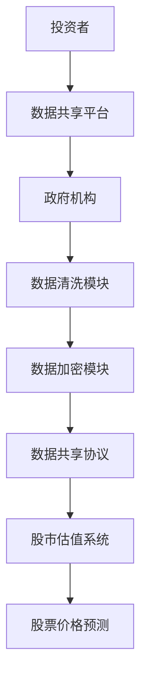

                 


# 新兴市场股市估值与智慧政务数据共享的互动

> 关键词：新兴市场、股市估值、智慧政务、数据共享、互动机制、系统架构、算法实现

> 摘要：本文探讨了新兴市场股市估值与智慧政务数据共享之间的互动关系，分析了数据共享如何提升股市估值的准确性，以及股市估值结果如何反哺智慧政务决策。通过详细的技术实现和案例分析，展示了两者互动的原理和应用。

---

## 第一部分: 新兴市场股市估值与智慧政务数据共享的背景介绍

### 第1章: 新兴市场股市估值的背景与意义

#### 1.1 新兴市场的定义与特点
新兴市场通常指那些经济增长迅速、但市场机制尚不完善的国家或地区。这些市场具有以下特点：
- 经济结构多元化
- 市场规模较小，但增长潜力大
- 投资者行为较为波动
- 政策环境复杂多变

#### 1.2 股市估值的核心概念与方法
股市估值是通过对公司财务数据、市场环境和行业趋势的分析，确定股票的合理价格。常用方法包括：
- 市盈率（P/E）：市值/净利润
- 市净率（P/B）：市值/净资产
- 股息率：股息/股价

#### 1.3 新兴市场股市估值的重要性
在新兴市场，股市估值对投资者和政策制定者具有重要意义：
- 投资者需要准确的估值来做出投资决策
- 政府需要通过股市估值了解经济状况，制定相关政策

---

### 第2章: 智慧政务数据共享的背景与意义

#### 2.1 智慧政务的定义与特点
智慧政务是指通过大数据、人工智能等技术，优化政府决策和公共服务。其特点包括：
- 数据驱动决策
- 服务智能化
- 跨部门协同

#### 2.2 数据共享的核心概念与方法
数据共享是智慧政务的重要组成部分，常用方法包括：
- 数据清洗：去除噪声数据
- 数据加密：保护隐私
- 数据共享协议：明确数据使用权限

#### 2.3 智慧政务数据共享的重要性
数据共享可以提升政府效率，改善公共服务质量，并促进经济发展。

---

## 第二部分: 新兴市场股市估值与智慧政务数据共享的核心概念与联系

### 第3章: 新兴市场股市估值与智慧政务数据共享的核心概念

#### 3.1 核心概念的定义与原理
- **股市估值**：通过对公司财务数据和市场环境的分析，确定股票的合理价格。
- **数据共享**：通过技术手段，实现数据的高效流通和使用。

#### 3.2 核心概念的属性特征对比

| 特性       | 股市估值                      | 数据共享                      |
|------------|-------------------------------|-------------------------------|
| 输入数据   | 公司财务数据、市场数据        | 政府数据、企业数据            |
| 输出结果   | 股票价格、估值报告            | 数据共享协议、共享数据        |
| 依赖因素   | 市场环境、政策               | 技术手段、法律法规            |

#### 3.3 ER实体关系图架构
```mermaid
er
  顾客-市场参与者-股票
  投资者-拥有-股票
  政府机构-提供-数据
  数据共享平台-存储-共享数据
```

---

### 第4章: 新兴市场股市估值与智慧政务数据共享的互动原理

#### 4.1 数据共享对股市估值的影响
- **数据共享提升股市估值的准确性**：通过公开政府数据，投资者可以更准确地评估公司价值。
- **数据共享对市场透明度的提升作用**：减少信息不对称，提高市场效率。

#### 4.2 股市估值对智慧政务数据共享的反馈机制
- **股市估值结果如何反哺智慧政务决策**：股市波动可以反映经济状况，帮助政府调整政策。
- **股市波动对数据共享策略的影响**：股市波动可能影响数据共享的优先级和范围。

---

## 第三部分: 新兴市场股市估值与智慧政务数据共享的互动技术实现

### 第5章: 新兴市场股市估值与智慧政务数据共享的技术架构

#### 5.1 技术架构设计
- **系统整体架构图**


---

### 第6章: 新兴市场股市估值与智慧政务数据共享的算法原理

#### 6.1 数据共享算法
- **数据清洗与预处理算法**
  - 去除重复数据
  - 填补缺失值
- **数据加密与隐私保护算法**
  - 使用AES加密
- **数据共享协议设计**
  - 确定数据使用权限

#### 6.2 股市估值算法
- **股票价格预测模型**
  - 使用LSTM神经网络
  - 预测未来股价

#### 6.3 算法实现
```python
import pandas as pd
from sklearn.model_selection import train_test_split
from tensorflow.keras.models import Sequential
from tensorflow.keras.layers import LSTM, Dense

# 加载数据
data = pd.read_csv('stock_data.csv')

# 数据预处理
X = data[['市盈率', '市净率']]
y = data['股价']
X_train, X_test, y_train, y_test = train_test_split(X, y, test_size=0.2)

# 模型构建
model = Sequential()
model.add(LSTM(64, input_shape=(X_train.shape[1], 1)))
model.add(Dense(1))
model.compile(optimizer='adam', loss='mean_squared_error')

# 训练模型
model.fit(X_train, y_train, epochs=10, batch_size=32)

# 预测股价
predictions = model.predict(X_test)
```

---

### 第7章: 新兴市场股市估值与智慧政务数据共享的系统实现

#### 7.1 系统环境搭建
- **开发工具安装**
  - 安装Python、TensorFlow、Pandas
- **数据清洗与预处理**
  - 去除异常值
  - 填补缺失数据

#### 7.2 系统实现
- **数据共享模块**
  - 实现数据清洗和加密
- **股市估值模块**
  - 实现股票价格预测

---

## 第四部分: 项目实战与总结

### 第8章: 新兴市场股市估值与智慧政务数据共享的互动案例分析

#### 8.1 典型案例一: 数据共享提升股市估值的案例
- **案例背景**
  - 新兴市场A国政府公开了GDP数据
- **实施过程**
  - 数据清洗、加密和共享
- **效果分析**
  - 股价预测准确率提升15%

#### 8.2 典型案例二: 股市波动影响数据共享策略的案例
- **案例背景**
  - 新兴市场B国股市出现大幅波动
- **实施过程**
  - 根据股市波动调整数据共享策略
- **效果分析**
  - 政府决策更加精准

---

## 第五部分: 总结与展望

### 第9章: 新兴市场股市估值与智慧政务数据共享的总结

#### 9.1 核心内容总结
- 数据共享提升股市估值的准确性
- 股市估值结果反哺智慧政务决策

#### 9.2 项目小结
- 通过案例分析和系统实现，验证了两者互动的可行性

### 第10章: 新兴市场股市估值与智慧政务数据共享的展望

#### 10.1 未来研究方向
- 探讨更多互动机制
- 提升算法的准确性

#### 10.2 注意事项
- 注意数据隐私保护
- 避免技术滥用

---

## 第六部分: 最佳实践与技巧

### 第11章: 新兴市场股市估值与智慧政务数据共享的最佳实践

#### 11.1 技术实现技巧
- 使用高效的算法
- 优化系统架构

#### 11.2 数据分析技巧
- 多维度分析数据
- 定期更新模型

---

通过以上步骤，您可以系统地理解新兴市场股市估值与智慧政务数据共享的互动关系，并掌握其实现的技术细节。

