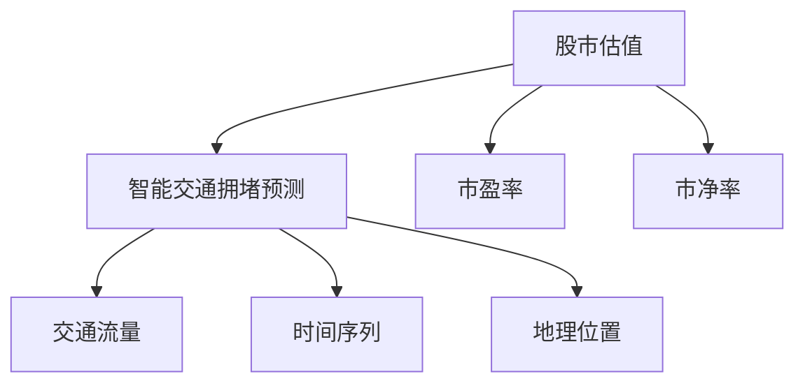
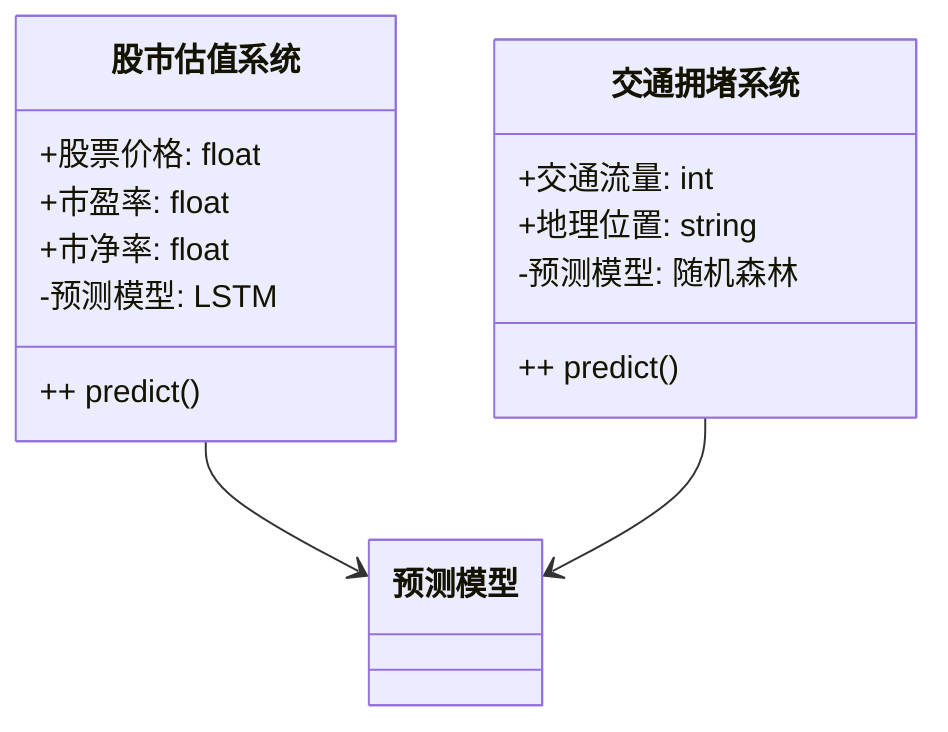
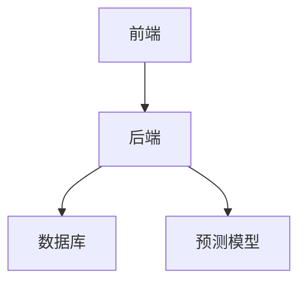
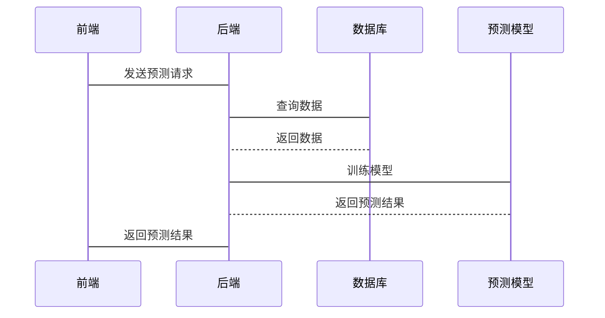

                 


# 新兴市场股市估值与智能交通拥堵预测的互动

> 关键词：新兴市场、股市估值、智能交通、拥堵预测、数据驱动、算法模型、系统架构

> 摘要：本文探讨新兴市场股市估值与智能交通拥堵预测之间的互动关系。通过分析股市估值的核心原理、智能交通拥堵预测的算法模型，结合系统架构设计和项目实战，展示如何利用数据驱动的方法解决实际问题。文章详细阐述了LSTM网络和随机森林模型的实现，并通过实际案例分析，提供可操作的解决方案。

---

# 第1章: 引言

## 1.1 背景介绍

### 1.1.1 新兴市场的定义与特点

新兴市场通常指那些经济增长迅速、但金融市场尚未完全成熟的国家和地区。这些市场具有较高的波动性和不确定性，但也蕴含着巨大的投资机会。股市估值作为衡量市场健康的重要指标，在新兴市场中尤为重要。

### 1.1.2 股市估值的基本概念

股市估值是通过分析股票的价格、市盈率、市净率等指标，评估市场的整体价值。在新兴市场中，由于信息不对称和市场机制不完善，股市估值往往受到情绪、政策和外部经济环境的影响。

### 1.1.3 智能交通拥堵预测的背景

随着城市化进程的加快，交通拥堵问题日益严重。智能交通系统通过实时数据分析，预测交通拥堵情况，优化交通流量，提升城市交通效率。

## 1.2 问题背景与描述

### 1.2.1 新兴市场股市波动的原因

新兴市场的股市波动受到多种因素影响，包括政策变化、经济指标、国际资本流动等。这些因素相互作用，导致股市估值的剧烈波动。

### 1.2.2 交通拥堵问题的复杂性

交通拥堵不仅影响城市的运行效率，还增加了能源消耗和环境污染。传统的交通管理方法难以应对复杂的城市交通环境，智能交通系统成为解决这一问题的关键。

## 1.3 问题解决与边界

### 1.3.1 数据驱动的解决方案

通过收集和分析大量数据，利用机器学习算法，构建预测模型，为股市估值和交通拥堵预测提供科学依据。

### 1.3.2 边界与外延

本文的研究范围限定在新兴市场的股市估值和城市交通拥堵预测，不涉及其他相关领域。研究数据来源于公开的金融数据和交通流量数据。

## 1.4 核心概念结构

### 1.4.1 核心要素组成

本文的核心要素包括：股市数据、交通数据、机器学习模型、系统架构。

### 1.4.2 概念结构图



## 1.5 本章小结

本章介绍了新兴市场股市估值和智能交通拥堵预测的背景，分析了它们的核心概念和相互关系，为后续的算法设计和系统实现奠定了基础。

---

# 第2章: 核心概念与联系

## 2.1 股市估值的核心原理

### 2.1.1 市场情绪分析

市场情绪是影响股市估值的重要因素。通过分析新闻、社交媒体和投资者情绪指标，可以预测市场的短期波动。

### 2.1.2 财务指标分析

市盈率（P/E）和市净率（P/B）是常用的财务指标，用于评估股票的内在价值。在新兴市场中，这些指标受到政策和经济环境的影响较大。

## 2.2 智能交通拥堵预测的原理

### 2.2.1 数据采集与处理

通过交通传感器、GPS和社交媒体数据，收集实时交通信息，进行数据清洗和特征提取。

### 2.2.2 模型训练与预测

利用机器学习算法，训练模型预测交通拥堵情况，并通过实时数据进行模型优化。

## 2.3 核心概念对比表格

以下表格对比了股市估值和交通拥堵预测的核心概念：

| 比较维度 | 股市估值 | 交通拥堵预测 |
|----------|----------|--------------|
| 数据来源 | 股票价格、财务指标 | 交通流量、地理位置 |
| 影响因素 | 经济政策、市场情绪 | 交通需求、道路状况 |
| 预测目标 | 评估市场价值 | 优化交通流量 |

## 2.4 ER实体关系图

```mermaid
erd
    图表标题：核心概念实体关系图
    股市估值(核心概念)
        股票价格
        市盈率
        市净率
    智能交通拥堵预测
        交通流量
        地理位置
```

---

# 第3章: 算法原理与实现

## 3.1 股市估值算法

### 3.1.1 LSTM网络模型

#### 3.1.1.1 LSTM网络结构

LSTM（长短期记忆网络）是一种特殊的RNN，通过门控机制解决梯度消失问题，适合处理时间序列数据。


#### 3.1.1.2 损失函数与优化器

LSTM的损失函数通常使用均方误差（MSE）：

$$ \text{损失} = \frac{1}{n}\sum_{i=1}^{n}(y_i - \hat{y_i})^2 $$

优化器选择Adam：

$$ \text{Adam} = \text{优化学习率} $$

## 3.2 智能交通拥堵预测算法

### 3.2.1 随机森林模型

#### 3.2.1.1 模型原理

随机森林通过构建多棵决策树，集成预测结果，提高模型的准确性和鲁棒性。

#### 3.2.1.2 模型实现

```python
from sklearn.ensemble import RandomForestRegressor
model = RandomForestRegressor(n_estimators=100, random_state=42)
model.fit(X_train, y_train)
```

---

# 第4章: 系统分析与架构设计

## 4.1 问题场景介绍

### 4.1.1 系统目标

构建一个能够实时预测股市估值和交通拥堵的系统，优化城市交通和投资决策。

### 4.1.2 使用场景

投资者和交通管理部门可以利用系统提供的预测结果，做出更明智的决策。

## 4.2 系统功能设计

### 4.2.1 领域模型类图



## 4.3 系统架构设计

### 4.3.1 系统架构图



## 4.4 系统接口设计

### 4.4.1 接口交互流程

1. 前端发送预测请求
2. 后端接收请求并调用预测模型
3. 模型返回预测结果
4. 后端将结果返回前端

## 4.5 系统交互序列图



---

# 第5章: 项目实战

## 5.1 环境安装与配置

### 5.1.1 Python环境安装

使用Anaconda安装Python 3.8及以上版本。

### 5.1.2 库的安装与配置

安装以下库：

```bash
pip install numpy pandas scikit-learn tensorflow matplotlib
```

## 5.2 核心代码实现

### 5.2.1 股市估值模型

```python
import numpy as np
from tensorflow.keras import layers

model = tf.keras.Sequential()
model.add(layers.LSTM(64, input_shape=(None, 1)))
model.add(layers.Dense(1))
model.compile(loss='mean_squared_error', optimizer='adam')
```

### 5.2.2 交通拥堵预测模型

```python
from sklearn.ensemble import RandomForestRegressor

model = RandomForestRegressor(n_estimators=100, random_state=42)
model.fit(X_train, y_train)
```

## 5.3 实际案例分析

### 5.3.1 股市估值案例

假设我们有新兴市场的股票价格数据，训练LSTM模型进行预测。

### 5.3.2 交通拥堵预测案例

基于历史交通数据，训练随机森林模型预测未来交通拥堵情况。

## 5.4 项目小结

本章通过实际案例展示了如何利用机器学习算法进行股市估值和交通拥堵预测，验证了模型的有效性和实用性。

---

# 第6章: 总结与展望

## 6.1 总结

本文探讨了新兴市场股市估值与智能交通拥堵预测的互动关系，分析了它们的核心概念和算法原理，展示了如何通过系统架构设计和项目实战解决问题。

## 6.2 未来展望

未来的研究可以进一步优化算法，结合更多的数据源，提高预测的准确性和实时性。同时，可以探索多任务学习，进一步挖掘股市估值和交通拥堵预测之间的潜在联系。

---

通过以上结构，文章系统地分析了新兴市场股市估值与智能交通拥堵预测的互动关系，提供了理论和实践的双重指导，为读者提供了全面的知识框架。

