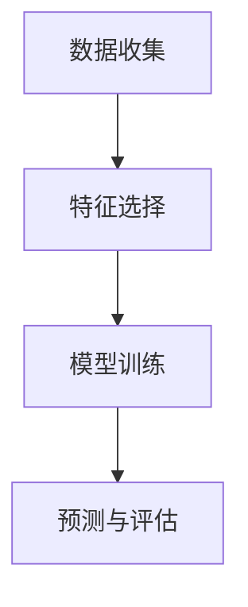
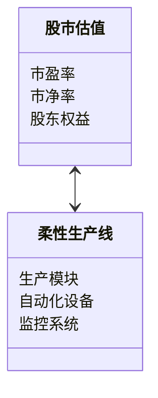

                 


# 新兴市场股市估值与智能制造柔性生产线的互动

## 关键词：新兴市场、股市估值、智能制造、柔性生产线、互动关系

## 摘要：本文探讨了新兴市场股市估值与智能制造柔性生产线之间的互动关系。通过分析股市估值的方法和智能制造技术，揭示两者如何相互影响，为企业和投资者提供理论支持和实践指导。

---

# 第1章: 背景介绍

## 1.1 新兴市场与股市估值
### 1.1.1 新兴市场的定义与特征
新兴市场是指经济快速发展、产业结构转型中的国家，如中国、印度等。这些市场通常具有高增长潜力，但也伴随着高波动性和不确定性。

### 1.1.2 股市估值的基本概念
股市估值是评估企业内在价值的过程，常用指标包括市盈率（PE）、市净率（PB）和股息率等。这些指标帮助投资者判断股票的合理价格。

### 1.1.3 新兴市场股市估值的独特性
新兴市场的企业可能面临更多不确定因素，如政策风险和市场波动，这使得估值更加复杂。投资者需要考虑宏观环境和行业趋势。

## 1.2 智能制造与柔性生产线
### 1.2.1 智能制造的定义与发展
智能制造是通过物联网、大数据和人工智能优化生产流程，提高效率和灵活性。它强调智能化和自动化，以适应市场变化。

### 1.2.2 柔性生产线的核心要素
柔性生产线具备快速调整生产的能力，适应多种产品类型和小批量生产。关键要素包括模块化设计、自动化设备和实时监控系统。

### 1.2.3 柔性生产线在制造业中的应用
柔性生产线广泛应用于汽车、电子等行业，帮助企业在需求变化时快速响应，降低生产成本，提高效率。

## 1.3 互动关系的背景与意义
### 1.3.1 新兴市场与智能制造的结合
新兴市场制造业升级推动了智能制造的发展，而智能制造技术的应用也促进了新兴市场的经济增长。

### 1.3.2 股市估值与柔性生产线的互动机制
企业采用柔性生产线后，生产效率提升，可能带来业绩增长，进而影响股市估值。反过来，股市估值的变化也会影响企业的投资决策。

### 1.3.3 互动对经济发展的潜在影响
股市估值与智能制造的互动可以促进资源优化配置，推动技术创新，增强企业竞争力，从而推动整体经济发展。

---

# 第2章: 核心概念与联系

## 2.1 股市估值的原理
### 2.1.1 市盈率与市净率的计算方法
市盈率（PE）= 股价 / 每股收益  
市净率（PB）= 股价 / 每股净资产  

### 2.1.2 股东权益与现金流分析
股东权益=资产 - 负债  
现金流=经营活动现金流 + 投资活动现金流 + 筹资活动现金流  

### 2.1.3 行业比较法与DCF模型
行业比较法通过比较同行业公司的估值指标来确定目标公司的合理估值。  
DCF模型基于自由现金流的折现值计算企业价值。

## 2.2 柔性生产线的原理
### 2.2.1 柔性生产线的模块化设计
模块化设计允许生产线快速调整，以适应不同产品类型和生产规模。

### 2.2.2 自动化与智能化技术的应用
自动化技术如机器人和物联网设备，智能化技术如AI和大数据分析，提升了生产效率和产品质量。

### 2.2.3 生产过程中的实时监控与调整
通过实时监控生产数据，系统可以快速识别问题并进行调整，确保生产过程的高效和稳定。

## 2.3 互动关系的实体关系图


---

# 第3章: 股市估值算法

## 3.1 回归分析法
### 3.1.1 算法步骤
1. 数据收集：收集相关变量数据，如PE、PB、ROE等。
2. 特征选择：确定影响股市估值的关键因素。
3. 模型训练：使用回归模型拟合数据。
4. 预测与评估：利用模型预测股市估值并评估准确性。



## 3.2 代码实现
```python
import pandas as pd
from sklearn.linear_model import LinearRegression

data = pd.read_csv('market_data.csv')
X = data[['PE', 'PB', 'ROE']]
y = data['Price']

model = LinearRegression()
model.fit(X, y)
print('Coefficients:', model.coef_)
```

---

# 第4章: 系统分析与架构设计

## 4.1 领域模型


## 4.2 系统架构设计


---

# 第5章: 项目实战

## 5.1 环境安装
安装Python、Pandas、Scikit-learn等库。

## 5.2 核心实现
实现回归分析模型，进行股市估值预测。

## 5.3 案例分析
分析某新兴市场企业的柔性生产线投资对股市估值的影响。

## 5.4 总结
项目实现展示了股市估值与智能制造互动的可能性和潜力。

---

# 第6章: 最佳实践

## 6.1 小结
股市估值与智能制造的互动关系对经济发展至关重要，企业应重视技术创新和高效管理。

## 6.2 注意事项
投资者需关注宏观经济因素和企业基本面，避免单一依赖技术指标。

## 6.3 拓展阅读
建议阅读相关文献，深入理解股市估值和智能制造的技术细节。

---

通过以上分析，我们详细探讨了新兴市场股市估值与智能制造柔性生产线的互动关系，为企业和投资者提供了理论依据和实践指导。

