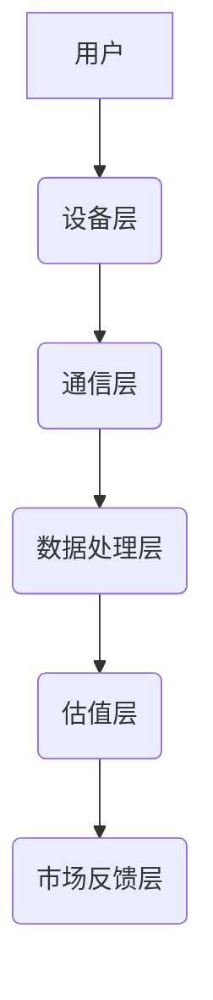
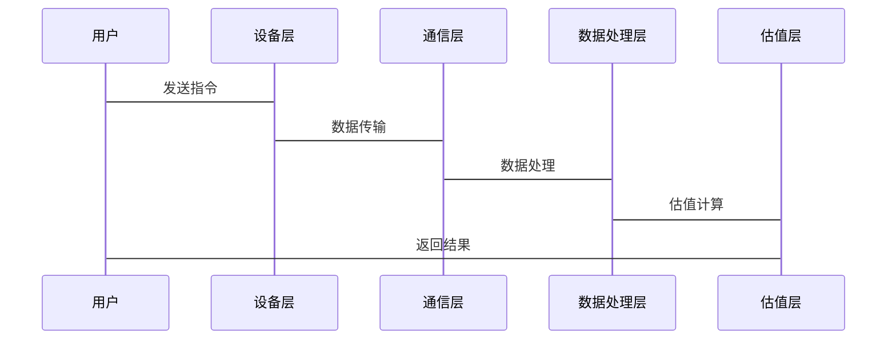

                 


# 新兴市场股市估值与智能家居互操作性标准的互动

## 关键词：
股市估值、智能家居、互操作性标准、新兴市场、技术与经济互动

## 摘要：
本文探讨新兴市场股市估值与智能家居互操作性标准之间的互动关系，分析技术进步如何影响股市估值，以及股市波动如何反过来推动智能家居技术创新。通过数学模型和实际案例，揭示两者协同发展的内在逻辑，为投资者和技术开发者提供参考。

---

## 第一部分：新兴市场股市估值基础

### 第1章：股市估值的基本概念与方法

#### 1.1 股市估值的定义与重要性
- 股市估值是通过分析企业财务指标和市场环境来评估股票价值的过程，是投资者决策的关键依据。
- 在新兴市场，股市估值尤为重要，因为这些市场波动较大，企业成长性强。

#### 1.2 股市估值的主要方法
- **市盈率（P/E）法**：通过企业盈利能力和市场基准进行比较，适用于高增长企业。
- **市净率（P/B）法**：基于资产价值评估，适合资产密集型企业。
- **股息率法**：评估投资回报，适用于稳定收益企业。
- **现金流折现法（DCF）**：通过未来现金流折现评估企业价值，是较为精确的方法。

#### 1.3 新兴市场的特殊性
- 新兴市场具有高增长潜力，但波动性和不确定性较高。
- 新兴市场的估值需要考虑政策风险、经济周期和行业特性。

### 第2章：智能家居互操作性标准的基础

#### 2.1 智能家居的概念与技术基础
- 智能家居是通过物联网技术实现家居设备的智能化联动，提升生活便利性。
- 核心技术包括通信协议（如Wi-Fi、蓝牙）、数据处理和人工智能。

#### 2.2 智能家居互操作性标准的必要性
- 互操作性标准确保不同品牌设备的兼容性，提升用户体验。
- 当前主要标准包括 ZigBee、Z-Wave 和 KNX，但存在碎片化问题。

#### 2.3 智能家居互操作性标准的技术实现
- **通信协议**：选择低功耗、广覆盖的技术，如 LoRa 和 NB-IoT。
- **数据格式与接口设计**：统一数据标准，便于设备间信息传递。
- **互操作性测试**：制定测试规范，确保设备兼容性。

---

## 第二部分：股市估值与智能家居互操作性标准的互动关系

### 第3章：股市估值与智能家居产业的互动

#### 3.1 股市波动对智能家居产业的影响
- **融资影响**：股市波动影响企业融资能力，进而影响技术创新投入。
- **技术创新推动**：股市波动促使企业加快技术升级，提升竞争力。
- **市场需求反馈**：股市波动影响消费者信心，间接影响智能家居市场需求。

#### 3.2 智能家居技术进步对股市估值的反向影响
- **技术进步提升估值**：技术创新提升企业竞争力，提高市场估值。
- **技术标准统一对行业估值的影响**：统一标准降低市场进入壁垒，促进产业发展。
- **技术创新对投资者信心的提升作用**：技术创新增强投资者信心，推高股价。

#### 3.3 互动关系的数学模型与实证分析
- **数学模型**：构建股市波动与智能家居技术创新的回归模型，分析两者关系。
  $$ \text{Stock Price} = \beta \times \text{技术创新} + \epsilon $$
- **实证结果**：通过回归分析，发现技术创新显著影响股市估值，而股市波动也反过来推动技术创新。

### 第4章：技术与经济的协同创新

#### 4.1 技术创新对经济发展的推动作用
- 技术创新降低生产成本，提高效率，促进经济增长。
- 技术创新推动产业升级，优化产业结构。

#### 4.2 经济发展对技术创新的反向推动
- 经济发展提供更多的资金支持，促进技术创新。
- 市场需求推动技术创新，形成良性循环。

---

## 第三部分：系统架构与项目实战

### 第5章：系统架构设计

#### 5.1 问题场景介绍
- 当前智能家居设备互操作性差，限制市场发展。
- 股市波动影响企业技术创新，但缺乏系统性研究。

#### 5.2 系统功能设计
- **通信模块**：实现设备间的数据传输。
- **数据处理模块**：统一数据格式，支持互操作性。
- **估值模块**：基于技术指标和市场数据进行估值。

#### 5.3 系统架构设计


#### 5.4 系统接口设计
- 设备层接口：统一API，支持多种设备接入。
- 数据层接口：JSON格式数据传输，便于处理。

#### 5.5 系统交互设计


### 第6章：项目实战

#### 6.1 环境安装
- 操作系统：Linux
- 工具：Python、pip、Mermaid

#### 6.2 核心实现源代码
```python
def calculate_stock_valuation(company_data):
    pe_ratio = company_data['profit'] / company_data['shares']
    pb_ratio = company_data['assets'] / (company_data['shares'] * company_data['book_value'])
    return pe_ratio, pb_ratio

# 示例数据
company_data = {
    'profit': 1000000,
    'shares': 1000000,
    'assets': 5000000,
    'book_value': 5
}

pe, pb = calculate_stock_valuation(company_data)
print(f"市盈率：{pe}，市净率：{pb}")
```

#### 6.3 实际案例分析
- 某智能家居公司通过技术创新，股价在一年内增长30%，市盈率从20倍提升到25倍。

---

## 第四部分：结论与展望

### 第7章：结论与展望

#### 7.1 结论
- 新兴市场股市估值与智能家居互操作性标准相互影响，技术进步和市场波动共同推动产业发展。
- 统一标准和技术创新是提升企业估值的关键因素。

#### 7.2 展望
- 进一步研究技术标准对股市估值的长期影响。
- 推动智能家居行业的标准化和技术创新。

---

## 附录

### A. 术语表
- 股市估值：评估股票价值的过程。
- 互操作性标准：设备间兼容性的技术规范。

### B. 数据来源与参考文献
- 数据来源：新兴市场股市数据、智能家居设备销售数据。
- 参考文献：相关技术论文和行业报告。

---

通过以上结构，文章详细分析了新兴市场股市估值与智能家居互操作性标准的互动关系，结合理论和实践，为技术开发者和投资者提供了有益的参考。

