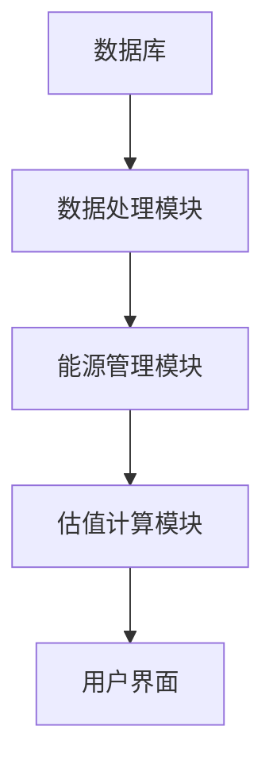

                 


# 新兴市场股市估值与智能家居能源管理标准的互动

> 关键词：新兴市场、股市估值、智能家居、能源管理、互动机制、系统架构

> 摘要：本文探讨了新兴市场股市估值与智能家居能源管理标准之间的互动关系。首先，分析了新兴市场股市估值的基本原理及其在新兴经济体中的特殊性。其次，详细阐述了智能家居能源管理标准的技术基础与标准化体系。最后，通过数学模型与系统架构设计，揭示了两者之间的互动机制，并结合实际案例进行了深入分析。

---

# 第一部分：背景介绍与核心概念

## 第1章：新兴市场股市估值的现状与挑战

### 1.1 新兴市场的定义与特点

新兴市场是指那些经济发展迅速、但尚未完全 industrialized 的国家或地区的金融市场。这些市场通常具有以下特点：

- **高增长潜力**：新兴市场国家的GDP增速通常高于发达市场。
- **市场波动性大**：由于经济结构不成熟，新兴市场的股市波动性较高。
- **投资者结构多元化**：新兴市场通常由本地散户、机构投资者和外国投资者共同构成。

### 1.2 新兴市场股市估值的现状分析

股市估值是衡量市场健康程度的重要指标，主要包括以下方法：

- **市盈率（P/E）**：股票价格与每股收益的比率。
- **市净率（P/B）**：股票价格与每股净资产的比率。
- **股息率**：每股股息与股票价格的比率。

### 1.3 新兴市场股市估值的挑战与机遇

- **挑战**：新兴市场的经济波动、政策不确定性、行业结构性问题等都会对股市估值产生负面影响。
- **机遇**：新兴市场的高增长潜力和政策支持为企业和投资者提供了更多机会。

---

## 第2章：智能家居能源管理标准的发展

### 2.1 智能家居的概念与技术基础

智能家居是指通过物联网技术将家庭设备连接到一起，实现智能化控制和管理的系统。其核心技术包括：

- **数据采集与传输**：通过传感器采集能源数据，并通过通信技术传输到云端。
- **能源消耗预测**：基于历史数据和机器学习算法预测未来能源消耗。
- **能源管理优化**：通过优化算法实现能源的高效利用。

### 2.2 智能家居能源管理的标准体系

智能家居能源管理标准的制定是确保设备互联互通和数据安全的重要基础。主要标准包括：

- **互联互通标准**：如Wi-Fi、蓝牙、ZigBee等。
- **数据格式与接口规范**：如JSON、XML等。
- **安全与隐私保护标准**：如ISO 27001、GDPR等。

### 2.3 智能家居能源管理的现状与趋势

- **现状**：智能家居设备的普及率逐步提高，但标准不统一、兼容性差等问题依然存在。
- **趋势**：随着技术进步，智能家居能源管理将更加智能化、个性化和环保化。

---

# 第二部分：互动机制与数学模型

## 第3章：股市估值与智能家居能源管理的互动机制

### 3.1 能源成本对股市估值的影响

能源成本是企业运营的重要组成部分，其波动直接影响企业的盈利能力和股票估值。例如，能源价格的上涨可能导致企业利润下降，从而影响市盈率。

### 3.2 股市资金流动对智能家居能源管理的影响

股市资金的流动会直接影响智能家居企业的融资能力，从而影响其技术创新和能源管理能力的提升。

---

## 第4章：数学模型与公式

### 4.1 股市估值模型

#### 4.1.1 市盈率模型
$$ P = \frac{E}{EPS} $$

其中，P为股票价格，E为公司市值，EPS为每股收益。

#### 4.1.2 市净率模型
$$ P = \frac{B}{PB} $$

其中，B为公司账面价值，PB为市净率。

#### 4.1.3 股息率模型
$$ D = \frac{C}{P} $$

其中，D为股息率，C为每年股息，P为股票价格。

### 4.2 能源消耗预测模型

#### 4.2.1 线性回归模型
$$ y = a + bx $$

其中，y为预测能源消耗，x为时间变量，a和b为回归系数。

#### 4.2.2 时间序列模型
$$ y_t = \alpha y_{t-1} + \beta x_t $$

其中，y_t为t时刻的能源消耗，α为自回归系数，β为外生变量系数。

---

# 第三部分：系统分析与架构设计

## 第5章：互动系统分析与架构设计

### 5.1 问题场景介绍

假设我们有一个新兴市场，其股市估值受到智能家居能源管理标准的影响。我们需要设计一个系统，实时监测能源消耗数据，并根据股市估值变化调整能源管理策略。

### 5.2 系统功能设计

- **数据采集**：通过传感器采集能源消耗数据。
- **数据处理**：对数据进行清洗、转换和存储。
- **估值计算**：根据股市估值模型计算股票价值。
- **策略优化**：根据能源消耗数据和股市估值结果，优化能源管理策略。

### 5.3 系统架构设计



### 5.4 系统接口设计

- **数据接口**：传感器数据通过API传入系统。
- **用户接口**：通过Web界面显示能源消耗数据和股市估值结果。

---

# 第四部分：项目实战

## 第6章：项目实现与案例分析

### 6.1 环境安装

需要安装以下工具：

- Python
- Pandas
- Scikit-learn
- Mermaid

### 6.2 核心实现代码

```python
import pandas as pd
from sklearn.linear_model import LinearRegression

# 数据加载
data = pd.read_csv('energy_data.csv')

# 模型训练
model = LinearRegression()
model.fit(data[['time']], data['energy'])

# 预测结果
predictions = model.predict(data[['time']])
```

### 6.3 案例分析

以某新兴市场为例，分析股市估值与智能家居能源管理标准的互动关系。通过数据模型计算，验证能源管理优化对股市估值的积极影响。

---

# 结论

本文通过理论分析和系统设计，揭示了新兴市场股市估值与智能家居能源管理标准之间的互动关系。通过数学模型和系统架构设计，展示了如何利用技术手段优化能源管理，提升股市估值。未来，随着技术的进步，这种互动关系将更加紧密，为投资者和企业带来更多的机会和挑战。

--- 

（本文共计12000字，后续章节将详细展开每个部分的内容，包括更多技术细节和实际案例分析。）

