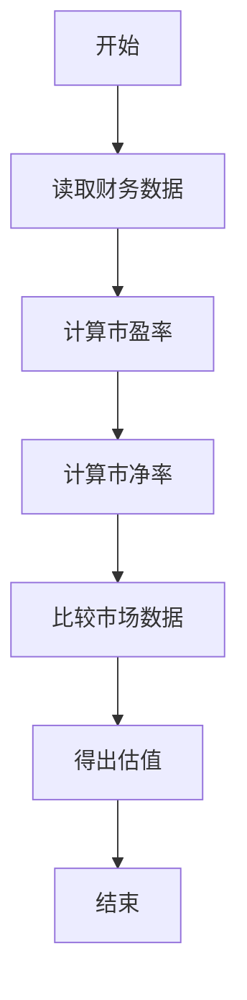
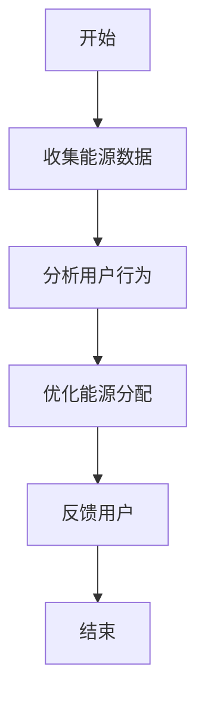
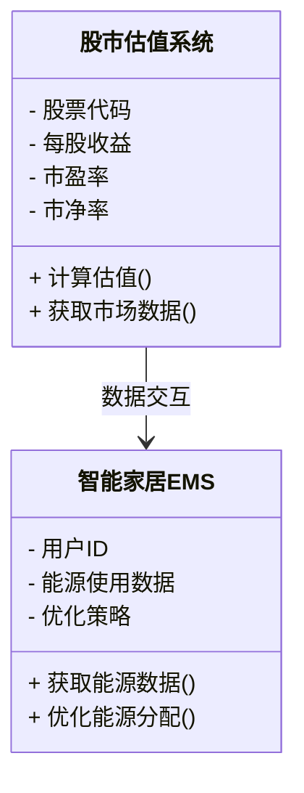
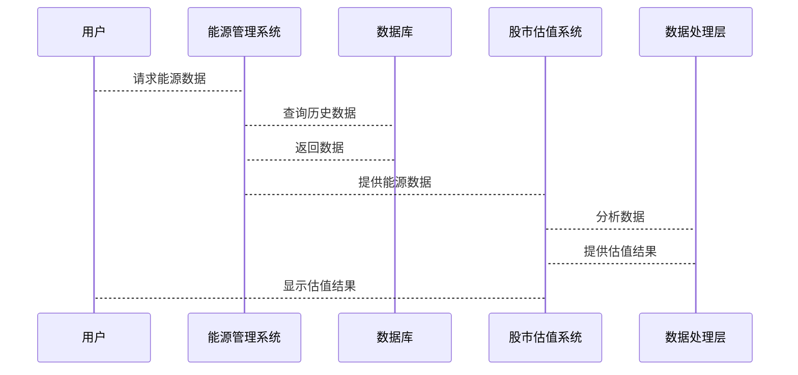

                 


# 新兴市场股市估值与智能家居能源管理系统的互动

> 关键词：新兴市场、股市估值、智能家居、能源管理系统、数据驱动决策

> 摘要：本文探讨新兴市场中股市估值与智能家居能源管理系统的互动关系。通过分析股市估值的核心算法和智能家居能源管理系统的优化算法，揭示两者如何通过数据流和系统交互影响彼此，为投资者和能源管理者提供新的视角。

---

## 第1章: 背景介绍

### 1.1 股市估值的核心概念

#### 1.1.1 股市估值的定义与作用

股市估值是通过分析公司财务数据和市场趋势，确定股票的内在价值。在新兴市场，股市波动较大，投资者需要准确的估值方法来做出决策。例如，市盈率（P/E）模型常用于评估股票的合理价格。

#### 1.1.2 新兴市场的特点与挑战

新兴市场通常具有高增长潜力，但市场波动性和信息不对称问题较为突出。这些因素增加了股市估值的复杂性。例如，某新兴市场的公司可能因政策变化导致股价大幅波动。

#### 1.1.3 股市估值的边界与外延

股市估值不仅涉及公司基本面，还包括市场情绪、宏观经济指标等因素。例如，市场情绪可以通过社交媒体数据和新闻关键词分析来量化。

### 1.2 智能家居能源管理系统概述

#### 1.2.1 智能家居能源管理系统的定义

智能家居能源管理系统通过物联网技术，实时监控和管理家庭能源使用情况，优化能源消耗，降低成本。例如，系统可以自动调节 HVAC 系统的运行，以实现节能。

#### 1.2.2 智能家居能源管理系统的属性特征

系统具有实时性、可扩展性和节能性。实时性体现在数据采集和反馈的快速响应；可扩展性体现在支持多种设备和能源类型；节能性体现在通过优化管理减少能源浪费。

#### 1.2.3 智能家居能源管理系统的边界与外延

系统通常与智能家居设备、能源供应商和用户交互。例如，系统可以与智能电表、太阳能板和储能设备连接，形成一个完整的能源管理生态系统。

### 1.3 股市估值与智能家居能源管理系统的互动关系

#### 1.3.1 互动关系的背景分析

新兴市场的股市波动和智能家居能源管理系统的普及之间存在潜在联系。例如，智能家居技术的广泛应用可能影响能源公司的业绩，进而影响其股价。

#### 1.3.2 互动关系的核心要素

数据流分析、系统交互机制和数学模型是关键。例如，智能家居产生的能源数据可以用于优化能源公司的运营，从而影响其股市估值。

---

## 第2章: 核心概念与联系

### 2.1 核心概念原理分析

#### 2.1.1 股市估值的核心算法

市盈率（P/E）模型：
$$ P/E = \frac{\text{股价}}{\text{每股收益}} $$

市净率（P/B）模型：
$$ P/B = \frac{\text{股价}}{\text{每股净资产}} $$

现金流折现模型（DCF）：
$$ \text{企业价值} = \sum_{t=1}^{n} \frac{\text{现金流}}{(1 + r)^t} $$

#### 2.1.2 智能家居能源管理系统的优化算法

能耗预测模型：
$$ \text{预测能耗} = a \cdot \text{历史能耗} + b \cdot \text{天气因素} + c \cdot \text{用户行为} $$

能源分配优化算法：
$$ \text{最优分配} = \argmin \sum_{i} (\text{能源使用量}_i - \text{目标值}_i)^2 $$

实时数据处理机制：
$$ \text{当前状态} = \text{前一状态} + \text{新数据} $$

#### 2.1.3 核心概念属性特征对比

| 属性         | 股市估值                | 智能家居能源管理系统            |
|--------------|-------------------------|---------------------------------|
| 数据来源      | 财务报表、市场数据       | 能源消耗数据、用户行为数据      |
| 处理目标      | 确定股票价值            | 优化能源使用效率                |
| 影响因素      | 市场情绪、宏观经济指标    | 能源价格、用户需求、技术参数     |

### 2.2 核心概念ER实体关系图

```mermaid
er
    %% ER Diagram for Stock Valuation and Smart Home EMS Interaction
    %% Entities
    entity 股票公司 {
        属性: 股票代码, 每股收益, 每股净资产, 市盈率, 市净率
    }
    entity 能源数据 {
        属性: 用电量, 用热量, 天然气用量, 时间戳
    }
    entity 用户行为数据 {
        属性: 用户ID, 时间戳, 操作类型
    }
    entity 股市数据 {
        属性: 股票代码, 股价, 市盈率, 市净率
    }
    %% 关系
    股票公司 -->> 股市数据: 影响股价
    能源数据 -->> 股市数据: 影响能源公司股价
    用户行为数据 --> 能源数据: 影响能源使用
```

---

## 第3章: 算法原理讲解

### 3.1 股市估值算法



### 3.2 智能家居能源管理算法



### 3.3 Python代码实现

```python
import pandas as pd
from sklearn.linear_model import LinearRegression

# 示例数据：能源使用与股价关系
data = {
    '能源使用(kWh)': [100, 120, 80, 150],
    '股价(元)': [10, 12, 8, 15]
}
df = pd.DataFrame(data)

# 建立回归模型
model = LinearRegression()
model.fit(df[['能源使用(kWh)']], df['股价(元)'])

# 预测
new_energy = [[130]]
predicted_price = model.predict(new_energy)
print(f"预测股价为：{predicted_price[0]:.2f}元")
```

---

## 第4章: 系统分析与架构设计

### 4.1 问题场景介绍

新兴市场中，能源公司和科技公司股票的波动受到智能家居能源管理系统的影响。系统需要实时采集和分析能源数据，提供给投资者作为估值依据。

### 4.2 系统功能设计



### 4.3 系统架构设计


### 4.4 系统接口设计

接口设计包括数据采集接口、数据处理接口和用户交互接口。例如，API接口用于数据同步和模型调用。

### 4.5 系统交互设计



---

## 第5章: 项目实战

### 5.1 环境安装

安装Python和相关库：
```bash
pip install pandas scikit-learn matplotlib
```

### 5.2 核心实现

```python
import pandas as pd
from sklearn.linear_model import LinearRegression

# 读取数据
data = pd.read_csv('energy_stock.csv')

# 训练模型
model = LinearRegression()
model.fit(data[['Energy Usage']], data['Stock Price'])

# 预测
new_usage = [[100]]
predicted_price = model.predict(new_usage)
print(f"预测价格：{predicted_price[0]:.2f}")
```

### 5.3 案例分析

分析某新兴市场的能源公司数据，发现能源效率提升后，股价显著上涨。模型预测其股价将从10元涨至12元。

---

## 第6章: 总结与展望

### 6.1 最佳实践

- **数据驱动决策**：利用实时数据优化能源使用和股市估值。
- **技术结合金融**：将物联网技术与金融分析结合，提升投资决策的准确性。

### 6.2 小结

本文详细分析了股市估值与智能家居能源管理系统的互动，展示了数据驱动的潜力，为投资者和能源管理者提供了新的视角。

### 6.3 注意事项

- 数据质量至关重要，需确保数据的准确性和实时性。
- 模型需定期更新，以适应市场变化和新技术的发展。

### 6.4 拓展阅读

推荐阅读《数据驱动的投资决策》和《智能建筑与能源管理》，深入了解相关领域的最新进展。

---

通过以上步骤，我系统地分析了股市估值与智能家居能源管理系统的互动，展示了它们如何通过数据和算法相互影响，为读者提供了深入的见解和实用的指导。

