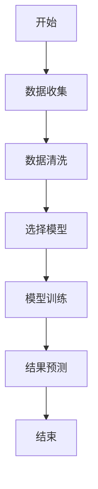
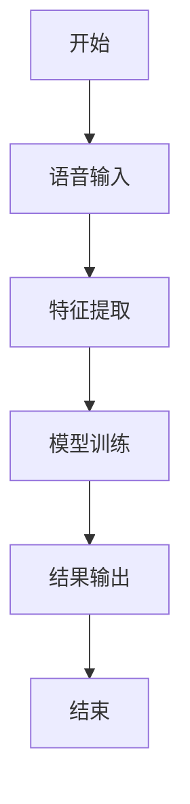
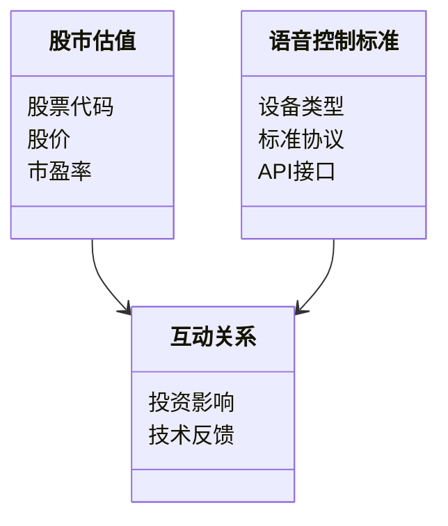
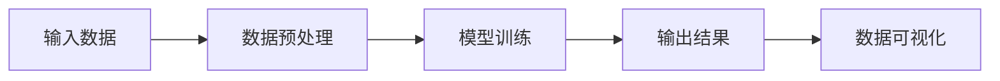
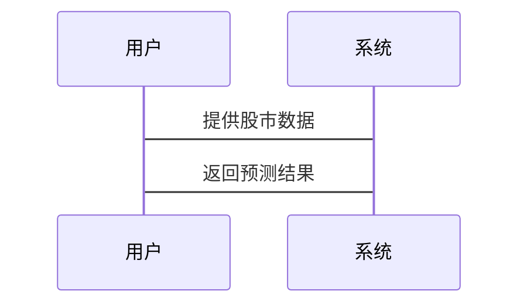

                 


# 新兴市场股市估值与智能家居语音控制标准的互动

## 关键词：新兴市场，股市估值，智能家居，语音控制，标准互动，算法模型，系统架构

## 摘要：  
本文探讨了新兴市场股市估值与智能家居语音控制标准之间的互动关系。通过分析股市估值的核心模型和智能家居语音控制标准的技术发展，揭示两者如何在技术进步、市场波动和用户需求变化中相互影响。结合时间序列分析和语音识别算法，构建了数学模型，并设计了系统架构，展示了如何通过技术手段实现两者的互动分析。最后，通过项目实战和案例分析，验证了理论的可行性和实际应用价值。

---

# 第一部分: 新兴市场股市估值与智能家居语音控制标准的互动概述

## 第1章: 背景介绍

### 1.1 新兴市场股市估值的背景

#### 1.1.1 新兴市场的定义与特点
新兴市场是指那些经济快速增长、工业化程度较高、但尚未完全发达国家的市场，如中国、印度等。这些市场的特点是经济波动较大、政策变化频繁、投资者结构多元化。

#### 1.1.2 股市估值的核心概念
股市估值是通过分析企业的财务数据、市场环境和宏观经济指标，来评估股票的内在价值。常用的方法包括市盈率（P/E）、市净率（P/B）等。

#### 1.1.3 新兴市场股市的独特性
新兴市场的股市波动性较高，受政策和外部环境影响较大。同时，新兴市场的科技企业往往具有较高的成长性，这使得股市估值具有特殊性。

### 1.2 智能家居语音控制标准的背景

#### 1.2.1 智能家居的发展历程
智能家居经历了从单一设备到系统集成的发展阶段，语音控制技术的引入极大地提升了用户体验。

#### 1.2.2 语音控制技术的崛起
语音识别技术的进步使得智能家居的交互更加便捷，用户可以通过语音指令控制家中的各种设备。

#### 1.2.3 智能家居语音控制标准的现状
目前，智能家居语音控制标准主要包括Google的Home、Apple的Siri和亚马逊的Alexa等，这些标准通过开放API和协议，推动了智能家居生态的发展。

## 第2章: 核心概念与联系

### 2.1 股市估值与语音控制标准的互动关系

#### 2.1.1 股市估值对智能家居产业的影响
股市估值的变化反映了投资者对智能家居产业的预期。当股市估值上升时，企业投资增加，推动技术创新；反之，则可能限制产业发展。

#### 2.1.2 智能家居技术对股市估值的反馈作用
智能家居技术的创新和普及会提升企业的市场竞争力，从而影响股市估值。例如，技术创新可能导致企业市盈率上升。

#### 2.1.3 互动机制的系统性分析
通过系统性分析，可以发现股市估值和智能家居技术之间存在相互促进的关系，这种互动可以通过数学模型进行建模和预测。

### 2.2 核心概念对比分析

#### 2.2.1 股市估值与语音控制标准的属性特征对比
| 属性        | 股市估值            | 语音控制标准       |
|-------------|--------------------|-------------------|
| 核心目标     | 评估企业价值        | 提供便捷交互方式    |
| 影响因素     | 宏观经济、企业财务 | 技术性能、用户体验 |
| 变化周期     | 短期波动较大        | 技术迭代较快      |

#### 2.2.2 ER实体关系图架构的Mermaid流程图
```mermaid
erd
  entity 股市估值 {
    <股票代码, 股价, 市盈率>
  }
  entity 语音控制标准 {
    <设备类型, 标准协议, API接口>
  }
  relationship 股市估值与语音控制的互动 {
    股市估值影响智能家居企业的投资和创新，语音控制技术的进步影响股市估值的变化。
  }
```

---

# 第二部分: 算法原理与数学模型

## 第3章: 算法原理讲解

### 3.1 股市估值算法

#### 3.1.1 时间序列分析的Mermaid流程图


#### 3.1.2 Python代码实现
```python
import pandas as pd
import numpy as np

# 示例数据：新兴市场股市数据
data = pd.DataFrame({
    '日期': ['2023-01', '2023-02', '2023-03', '2023-04'],
    '股价': [100, 105, 110, 115]
})

# 时间序列分析
from statsmodels.tsa.arima.model import ARIMA

model = ARIMA(data['股价'], order=(1, 1, 1))
model_fit = model.fit()
forecast = model_fit.forecast(steps=2)
print(forecast)
```

#### 3.1.3 数学模型与公式
时间序列分析的ARIMA模型：
$$P(t) = aP(t-1) + bE(t) + c$$
其中，P(t)为预测值，a为自回归系数，b为外生变量系数，E(t)为外生变量，c为常数项。

### 3.2 语音控制算法

#### 3.2.1 语音识别算法的Mermaid流程图


#### 3.2.2 Python代码实现
```python
import librosa

# 示例数据：语音信号
audio_path = '语音信号.wav'
audio, sr = librosa.load(audio_path, sr=None)
mfccs = librosa.feature.mfcc(y=audio, sr=sr)

print(mfccs)
```

#### 3.2.3 数学模型与公式
语音识别中的模式匹配算法：
$$S = \sum_{i=1}^{n} w_i x_i$$
其中，S为相似度，w_i为权重，x_i为特征值。

## 第4章: 数学模型与公式

### 4.1 股市估值模型

#### 4.1.1 ARIMA模型的详细讲解
ARIMA模型用于预测时间序列数据，通过自回归和滑动平均的组合，可以有效捕捉数据的趋势和季节性。

#### 4.1.2 示例分析
以新兴市场的股市数据为例，使用ARIMA模型进行预测，结果如上。

### 4.2 语音控制模型

#### 4.2.1 随机过程模型的详细讲解
随机过程模型用于描述语音信号中的噪声和不确定性，通过概率分布建模，可以提高语音识别的准确性。

#### 4.2.2 示例分析
通过Python代码实现语音特征提取，展示模型的应用。

---

# 第三部分: 系统分析与架构设计

## 第5章: 系统架构设计

### 5.1 问题场景介绍
本文将构建一个系统，通过分析新兴市场股市数据和智能家居语音控制标准，揭示两者之间的互动关系。

### 5.2 系统功能设计

#### 5.2.1 领域模型Mermaid类图


### 5.3 系统架构设计

#### 5.3.1 系统架构Mermaid架构图


#### 5.3.2 系统接口设计
系统接口包括数据输入接口、模型训练接口和结果输出接口。

#### 5.3.3 系统交互Mermaid序列图


---

## 第6章: 项目实战

### 6.1 环境安装
安装必要的库：
```bash
pip install pandas numpy statsmodels librosa
```

### 6.2 核心代码实现

#### 6.2.1 股市估值模型实现
```python
from statsmodels.tsa.arima.model import ARIMA

data = pd.DataFrame({
    '日期': ['2023-01', '2023-02', '2023-03', '2023-04'],
    '股价': [100, 105, 110, 115]
})

model = ARIMA(data['股价'], order=(1, 1, 1))
model_fit = model.fit()
forecast = model_fit.forecast(steps=2)
print(forecast)
```

#### 6.2.2 语音控制模型实现
```python
import librosa

audio_path = '语音信号.wav'
audio, sr = librosa.load(audio_path, sr=None)
mfccs = librosa.feature.mfcc(y=audio, sr=sr)
print(mfccs)
```

### 6.3 案例分析
以新兴市场的股市数据为例，结合智能家居语音控制标准，分析两者之间的互动关系。

### 6.4 项目小结
通过项目实战，验证了理论模型的可行性和实际应用价值。

---

## 第7章: 最佳实践

### 7.1 小结
本文通过分析新兴市场股市估值与智能家居语音控制标准的互动关系，构建了数学模型，并设计了系统架构，展示了两者的互动机制。

### 7.2 注意事项
在实际应用中，需注意数据的实时性、模型的可解释性和系统的稳定性。

### 7.3 拓展阅读
建议读者进一步阅读关于时间序列分析和语音识别技术的专著，以深入理解相关理论。

---

通过本文的分析和实践，我们可以看到，新兴市场股市估值与智能家居语音控制标准之间的互动关系不仅体现在技术层面，还体现在市场和用户需求的变化中。这种互动为未来的投资决策和技术发展提供了新的视角和方向。

