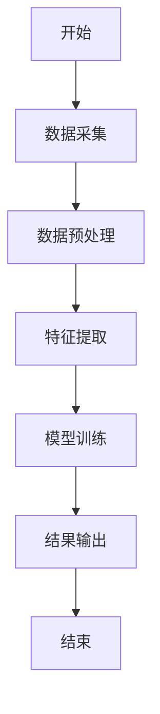
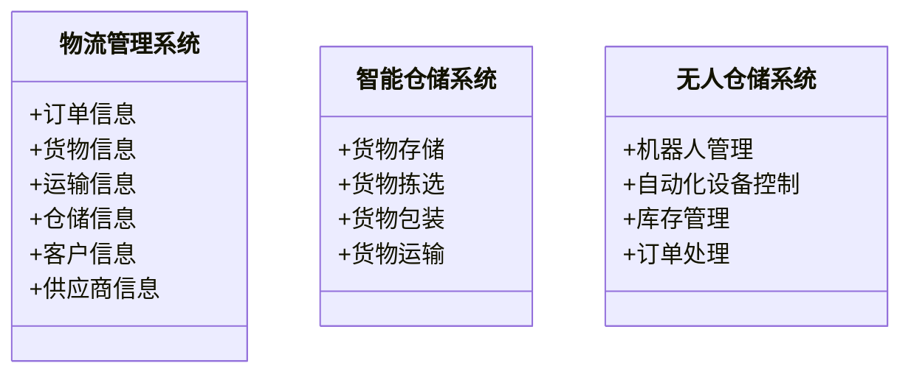
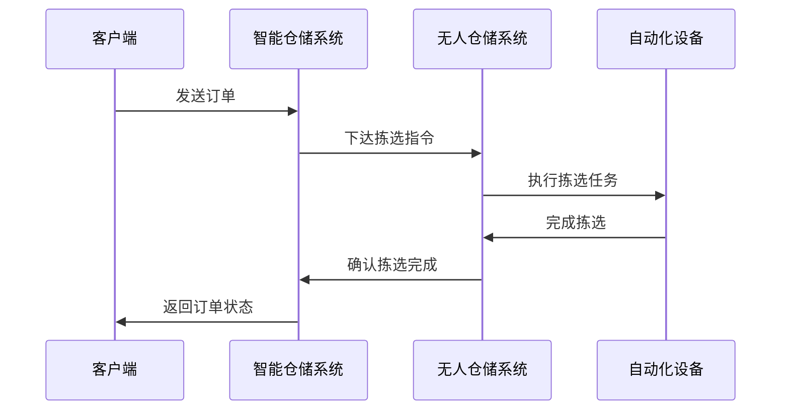

                 


# 新兴市场股市估值与智能物流无人仓储系统的互动

## 关键词：
新兴市场股市、智能物流、无人仓储系统、股市估值、物流效率、算法原理、系统架构

## 摘要：
本文探讨新兴市场股市估值与智能物流无人仓储系统之间的互动关系，分析智能物流如何影响股市估值，通过算法和系统架构设计，展示两者的协同效应，并提供实际案例和最佳实践。

## 第一部分：新兴市场股市估值基础

### 第1章：新兴市场股市估值基础

#### 1.1 新兴市场的定义与特点
- **1.1.1 新兴市场的概念**
  新兴市场是指经济快速发展但尚未完全工业化的国家，如中国、印度等。这些市场通常具有高增长潜力，但也伴随着高波动性和较高的投资风险。

- **1.1.2 新兴市场的经济特征**
  新兴市场的经济结构多元化，包括制造业、信息技术、金融服务等多个行业。这些市场的特点是经济增长快，但同时也面临着通货膨胀、货币政策不稳定等挑战。

- **1.1.3 新兴市场的股市特点**
  新兴市场的股市通常具有高波动性，市场参与者结构多元化，包括散户和机构投资者。股市规模较大，但市场深度和流动性可能不如发达市场。

#### 1.2 股市估值的基本原理
- **1.2.1 股票估值的核心概念**
  股票估值是通过对公司财务状况、行业地位、盈利能力等多方面因素的分析，确定股票的内在价值。常用的方法包括市盈率（P/E）、市净率（P/B）等指标。

- **1.2.2 市盈率与市净率的计算方法**
  - 市盈率（P/E）= 股价 / 每股收益（EPS）
  - 市净率（P/B）= 股价 / 每股净资产（BPS）

- **1.2.3 股市估值的影响因素**
  包括宏观经济环境、行业状况、公司基本面、市场情绪等。其中，宏观经济环境如GDP增长率、通货膨胀率等对股市估值有重要影响。

#### 1.3 新兴市场股市估值的特殊性
- **1.3.1 新兴市场的波动性分析**
  新兴市场的股市波动性较高，受政策变化、国际经济环境等因素影响较大。

- **1.3.2 政治经济环境对估值的影响**
  政治不稳定或经济政策变化可能导致股市估值的剧烈波动。

- **1.3.3 新兴市场股市估值的挑战**
  信息不对称、市场流动性不足、监管不完善等因素增加了新兴市场股市估值的难度。

---

## 第二部分：智能物流与无人仓储系统概述

### 第2章：智能物流与无人仓储系统概述

#### 2.1 智能物流的定义与特点
- **2.1.1 智能物流的概念**
  智能物流是指利用先进的信息技术、自动化技术、人工智能等，实现物流过程的智能化、自动化和高效化。

- **2.1.2 智能物流的核心技术**
  包括物联网技术、大数据分析、人工智能、区块链技术等。这些技术的应用使得物流过程更加智能化和高效。

- **2.1.3 智能物流的优势与应用**
  智能物流能够提高物流效率、降低成本、优化资源利用率。其应用广泛，包括仓储管理、运输管理、供应链管理等领域。

#### 2.2 无人仓储系统的运作原理
- **2.2.1 无人仓储的基本概念**
  无人仓储是指通过自动化设备和智能系统，实现仓储管理的无人化操作。这包括货物的自动存储、拣选、包装和运输等环节。

- **2.2.2 无人仓储的关键技术**
  无人仓储系统的关键技术包括机器人技术、自动化控制系统、物联网技术、人工智能等。

- **2.2.3 无人仓储的流程优化**
  通过自动化设备和智能算法，无人仓储能够实现货物的高效存储和快速拣选，显著提高仓储效率。

#### 2.3 智能物流与无人仓储的互动关系
- **2.3.1 智能物流与无人仓储的协同效应**
  智能物流与无人仓储系统协同工作，能够实现物流过程的全自动化，提高整体效率。

- **2.3.2 无人仓储对物流效率的提升**
  无人仓储通过自动化操作，减少人工干预，提高物流效率，降低成本。

- **2.3.3 智能物流与无人仓储的未来发展趋势**
  随着技术的不断进步，智能物流与无人仓储系统将进一步融合，推动物流行业的智能化和高效化。

---

## 第三部分：新兴市场股市估值与智能物流无人仓储系统的互动机制

### 第3章：新兴市场股市估值与智能物流无人仓储系统的互动机制

#### 3.1 新兴市场股市与物流行业的关联性
- **3.1.1 物流行业对股市的影响**
  物流行业的高效运作能够提升企业的供应链效率，降低成本，从而提高企业的盈利能力，进而影响股市估值。

- **3.1.2 物流成本对股市估值的影响**
  物流成本是企业成本的重要组成部分，物流成本的降低能够提升企业的净利润率，从而提升股票的估值。

- **3.1.3 物流效率对股市估值的促进作用**
  高效的物流系统能够缩短订单交付时间，提升客户满意度，从而增强企业的市场竞争力，进而影响股市估值。

#### 3.2 无人仓储系统对股市估值的直接影响
- **3.2.1 无人仓储对物流成本的优化**
  无人仓储通过自动化操作和高效管理，显著降低物流成本，从而提升企业的盈利能力，进而提高股市估值。

- **3.2.2 无人仓储对供应链效率的提升**
  无人仓储能够实现快速拣选和包装，缩短供应链的响应时间，提升供应链的整体效率，从而增强企业的竞争力，影响股市估值。

- **3.2.3 无人仓储对上市公司业绩的提升**
  无人仓储的应用能够提升企业的运营效率，降低成本，从而提高企业的净利润率，进而提升股市估值。

#### 3.3 智能物流与股市估值的间接互动
- **3.3.1 物流行业对新兴市场股市的推动作用**
  物流行业的高效运作能够推动企业的业绩增长，从而推动股市的整体表现。

- **3.3.2 物流行业对投资者信心的影响**
  物流行业的稳定发展能够增强投资者对企业的信心，从而影响股市估值。

- **3.3.3 物流行业对股市整体波动的调节作用**
  物流行业的波动能够影响股市的整体波动，尤其是在新兴市场，物流行业的波动对股市的影响更为显著。

---

## 第四部分：智能物流无人仓储系统的算法原理

### 第4章：智能物流无人仓储系统的算法原理

#### 4.1 系统核心算法概述
- **4.1.1 算法选择的依据**
  根据物流系统的具体需求，选择适合的算法。常用算法包括遗传算法、模拟退火算法、蚁群算法等。

- **4.1.2 算法的优化与改进**
  根据实际应用的需求，对算法进行优化和改进，例如引入机器学习技术，提高算法的预测能力和适应能力。

- **4.1.3 算法的适用场景分析**
  不同的算法适用于不同的场景。例如，遗传算法适用于多目标优化问题，蚁群算法适用于路径规划问题。

#### 4.2 算法流程图


#### 4.3 算法实现代码
```python
import numpy as np
import pandas as pd
from sklearn import linear_model

# 数据预处理
data = pd.read_csv('logistics_data.csv')
X = data[['feature1', 'feature2']]
y = data['target']

# 模型训练
model = linear_model.LinearRegression()
model.fit(X, y)

# 预测结果
 predictions = model.predict(X)
```

---

## 第五部分：系统架构与设计方案

### 第5章：系统架构与设计方案

#### 5.1 问题场景介绍
- **5.1.1 问题背景**
  随着电商行业的快速发展，物流行业面临着订单量大、配送效率低、成本高等问题。

- **5.1.2 项目介绍**
  本项目旨在通过智能物流和无人仓储系统，优化物流流程，提高配送效率，降低成本。

#### 5.2 系统功能设计
- **5.2.1 领域模型mermaid类图**


- **5.2.2 系统架构设计mermaid架构图**


- **5.2.3 系统接口设计**
  包括订单接口、货物接口、运输接口、仓储接口等。

- **5.2.4 系统交互mermaid序列图**


---

## 第六部分：项目实战

### 第6章：项目实战

#### 6.1 环境安装
- 安装必要的软件和库，如Python、Jupyter Notebook、Pandas、Scikit-learn等。

#### 6.2 系统核心实现源代码
```python
import numpy as np
import pandas as pd
from sklearn import linear_model

# 数据预处理
data = pd.read_csv('logistics_data.csv')
X = data[['feature1', 'feature2']]
y = data['target']

# 模型训练
model = linear_model.LinearRegression()
model.fit(X, y)

# 预测结果
 predictions = model.predict(X)
```

#### 6.3 代码应用解读与分析
- 解释代码的每一部分，包括数据预处理、模型训练和预测结果的输出。

#### 6.4 实际案例分析和详细讲解剖析
- 通过具体案例，分析智能物流无人仓储系统如何优化物流流程，提高效率，降低成本。

#### 6.5 项目小结
- 总结项目实施的效果，提出改进建议和未来发展方向。

---

## 第七部分：总结与展望

### 第7章：总结与展望

#### 7.1 最佳实践 tips
- 提供智能物流和无人仓储系统实施的最佳实践，如选择合适的算法、优化系统架构、加强数据安全等。

#### 7.2 小结
- 总结全文，强调智能物流和无人仓储系统对股市估值的重要影响，以及两者的互动关系。

#### 7.3 注意事项
- 提醒读者在实施智能物流和无人仓储系统时，需要注意数据隐私、系统兼容性等问题。

#### 7.4 拓展阅读
- 推荐相关书籍和资源，供读者进一步学习和研究。

---

以上是文章的详细大纲和内容，希望对您有所帮助！

