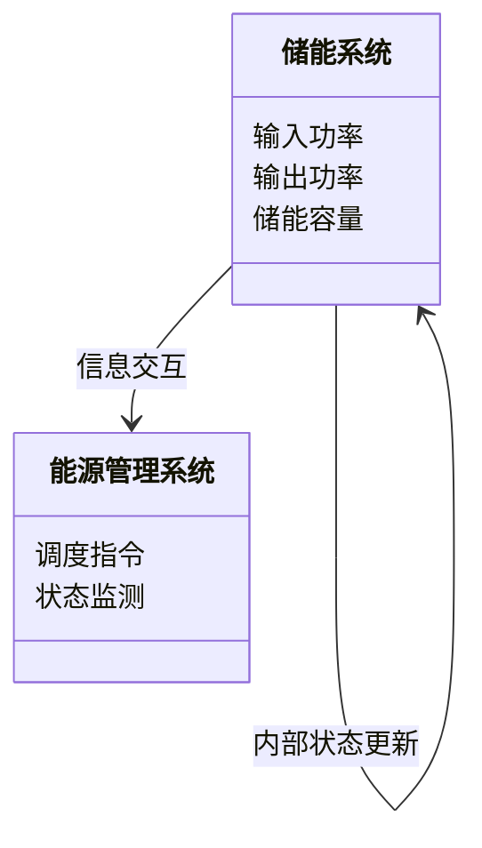
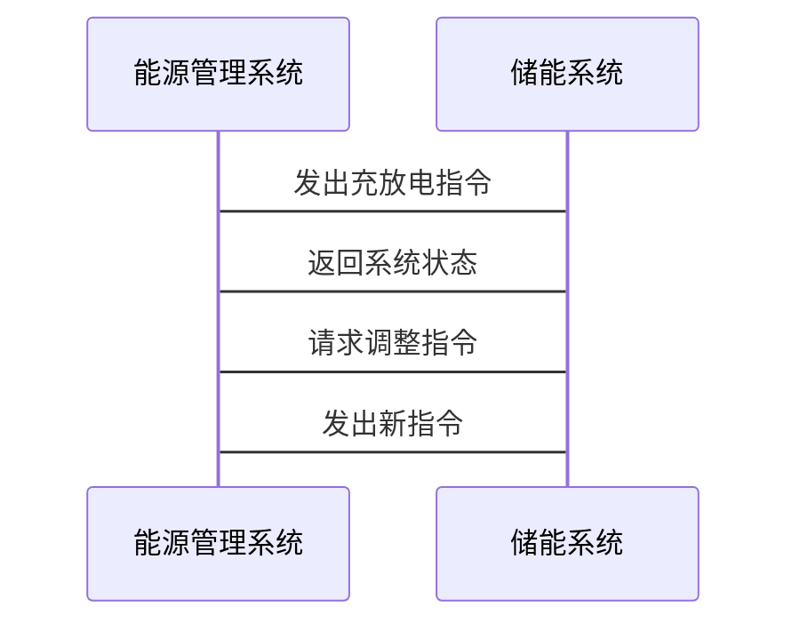

                 


# 《新兴市场股市估值与智能电网储能技术的互动》

## 关键词：新兴市场、股市估值、智能电网、储能技术、互动关系

## 摘要：  
本文探讨了新兴市场股市估值与智能电网储能技术之间的互动关系。通过分析股市估值的基本概念、智能电网储能技术的核心原理以及两者之间的互动机制，结合数学模型和算法实现，本文揭示了股市资金流动对储能技术创新的影响，以及储能技术进步对股市估值的推动作用。文章还通过实际案例分析，展示了智能电网储能技术在股市估值中的应用价值，并提出了未来发展的建议。

---

## 第一部分：新兴市场股市估值与智能电网储能技术的背景

### 第1章：新兴市场股市估值的基本概念

#### 1.1 新兴市场的定义与特点
- **1.1.1 新兴市场的经济特征**  
  新兴市场通常指经济快速发展、产业结构转型升级中的国家，如中国、印度、巴西等。这些市场具有高增长率、人口红利和政策支持等特点。

- **1.1.2 新兴市场的股市特点**  
  新兴市场股市波动性较大，成长性高，投资者结构多元化，且容易受到外部经济环境的影响。

- **1.1.3 新兴市场与发达市场的对比**  
  新兴市场在市场规模、流动性、监管体系等方面与发达市场存在显著差异，但新兴市场的高增长潜力吸引了大量投资。

#### 1.2 股市估值的基本概念
- **1.2.1 股市估值的定义**  
  股市估值是通过对上市公司财务数据的分析，评估其股票的内在价值。

- **1.2.2 股市估值的主要指标**  
  常见的估值指标包括市盈率（PE）、市净率（PB）、股息率等。

- **1.2.3 股市估值的计算方法**  
  以市盈率为例，PE = 股票价格 / 每股净利润。通过比较PE值与行业平均水平，可以判断股票的估值是否合理。

### 第2章：智能电网储能技术的基本概念

#### 2.1 智能电网的定义与特点
- **2.1.1 智能电网的定义**  
  智能电网是通过先进信息通信技术、自动化技术与电力系统深度融合，实现电力系统智能化运行和管理的新型电网。

- **2.1.2 智能电网的核心技术**  
  包括智能测量、自动控制、数据通信、能量管理等技术。

- **2.1.3 智能电网与传统电网的对比**  
  智能电网具有更高的可靠性和灵活性，能够更好地应对可再生能源的波动性。

#### 2.2 储能技术的基本概念
- **2.2.1 储能技术的定义**  
  储能技术是指通过物理或化学方法存储能量，并在需要时释放的技术。

- **2.2.2 储能技术的主要类型**  
  包括电池储能（如锂离子电池）、超级电容器、飞轮储能等。

- **2.2.3 储能技术的应用场景**  
  储能技术广泛应用于可再生能源并网、电力调峰、备用电源等领域。

---

## 第二部分：股市估值与智能电网储能技术的互动机制

### 第3章：股市估值与智能电网储能技术的互动关系

#### 3.1 股市估值对智能电网储能技术的影响
- **3.1.1 股市资金流动对储能技术发展的作用**  
  股市资金的流入可以为储能技术企业提供研发资金，推动技术创新。

- **3.1.2 股市波动对储能企业融资的影响**  
  股市波动可能导致储能企业融资难度增加，进而影响技术开发进度。

- **3.1.3 股市估值变化对储能技术投资的引导作用**  
  高估值的储能企业可能吸引更多投资者，推动技术产业化。

#### 3.2 智能电网储能技术对股市估值的影响
- **3.2.1 储能技术进步对股市估值的提升作用**  
  储能技术的进步可以提升企业的盈利能力和市场竞争力，从而提高股票估值。

- **3.2.2 储能技术应用对股市投资信心的影响**  
  成功的储能技术应用可以增强投资者对企业的信心，推动股价上涨。

- **3.2.3 储能技术成本下降对股市估值的推动作用**  
  储能技术成本的下降可以降低电力系统的运营成本，提升企业的盈利水平。

### 第4章：股市估值与智能电网储能技术互动的数学模型

#### 4.1 股市估值与储能技术互动的数学模型构建
- **4.1.1 模型假设**  
  假设储能技术的进步会直接影响企业的盈利能力和股市估值。

- **4.1.2 模型变量定义**  
  设V为股市估值，T为储能技术进步指数，C为储能技术成本，R为股市收益率。

- **4.1.3 模型方程推导**  
  V = aT + b/C + cR，其中a、b、c为常数系数。

#### 4.2 模型的验证与分析
- **4.2.1 数据收集与处理**  
  收集储能技术企业的财务数据和股市数据，进行清洗和预处理。

- **4.2.2 模型参数估计**  
  使用回归分析方法估计模型中的系数a、b、c。

- **4.2.3 模型的适用性分析**  
  通过实际数据验证模型的有效性，并分析其适用范围。

---

## 第三部分：智能电网储能技术的算法实现

### 第5章：储能系统优化算法

#### 5.1 储能系统优化的目标与约束
- **5.1.1 储能系统优化的目标**  
  最小化储能系统的运行成本，最大化能源利用效率。

- **5.1.2 储能系统优化的约束条件**  
  包括储能容量限制、充放电功率限制、时间一致性等。

#### 5.2 储能系统优化的数学模型
- **5.2.1 储能系统优化的线性规划模型**  
  min Z = ∑(C_i * x_i)，s.t. ∑x_i = D，x_i ≥ 0。

- **5.2.2 储能系统优化的动态规划模型**  
  通过状态转移方程优化储能系统的运行策略。

- **5.2.3 储能系统优化的非线性规划模型**  
  考虑储能系统非线性特性的优化模型。

### 第6章：储能系统优化算法的实现

#### 6.1 储能系统优化算法的实现步骤
- **6.1.1 数据输入与预处理**  
  读取储能系统的运行数据，进行清洗和归一化处理。

- **6.1.2 模型求解**  
  使用Python的scipy.optimize库求解优化模型。

- **6.1.3 结果分析与优化**  
  对优化结果进行分析，调整模型参数以提高优化效果。

#### 6.2 储能系统优化算法的代码实现
```python
import numpy as np
from scipy.optimize import minimize

def objective_function(x):
    return np.sum(x**2)

def constraint1(x):
    return np.sum(x) - 1

# 初始猜测值
x0 = np.ones(5)

# 约束条件
constraints = [{'type': 'eq', 'fun': constraint1}]

# 求解优化问题
result = minimize(objective_function, x0, constraints=constraints)

# 输出结果
print("优化结果:", result.x)
```

#### 6.3 算法实现细节与实际案例分析
- **算法实现细节**  
  使用拉格朗日乘数法处理约束条件，确保优化过程高效。

- **实际案例分析**  
  以某智能电网储能项目为例，通过优化算法确定最佳储能容量和运行策略，显著降低系统成本。

---

## 第四部分：系统分析与架构设计方案

### 第7章：智能电网储能系统架构设计

#### 7.1 问题场景介绍
- 某新兴市场国家的智能电网系统面临可再生能源波动性大、储能效率低的问题。

#### 7.2 系统功能设计
- **7.2.1 领域模型**  
  利用Mermaid绘制储能系统的功能模块图。



- **7.2.2 系统架构设计**  
  使用Mermaid绘制系统架构图。


- **7.2.3 系统接口设计**  
  定义储能系统与能源管理系统的接口协议。

- **7.2.4 系统交互设计**  
  使用Mermaid绘制系统交互序列图。



---

## 第五部分：项目实战与最佳实践

### 第8章：智能电网储能技术的实战应用

#### 8.1 环境安装与配置
- 安装必要的Python库（如scipy、numpy、pandas）。

#### 8.2 系统核心实现源代码
```python
import numpy as np
import matplotlib.pyplot as plt

# 模拟储能系统运行数据
data = np.random.rand(100, 5)
plt.plot(data)
plt.xlabel('时间')
plt.ylabel('储能容量')
plt.title('储能系统运行数据可视化')
plt.show()
```

#### 8.3 代码应用解读与分析
- **代码功能解读**  
  上述代码用于模拟储能系统的运行数据，并进行可视化分析。

- **实际案例分析**  
  以某智能电网项目为例，通过代码分析储能系统的运行效率和成本。

#### 8.4 最佳实践 tips
- **数据可视化的重要性**  
  通过数据可视化工具（如Matplotlib）分析储能系统运行状态。

- **模型优化的注意事项**  
  定期更新优化模型，确保其适应市场变化。

---

## 第六部分：总结与展望

### 第9章：总结与展望

#### 9.1 核心结论
- 股市估值与智能电网储能技术之间存在显著的互动关系。
- 储能技术的进步能够显著提升股市估值，而股市资金流动则为储能技术的发展提供了重要支持。

#### 9.2 未来展望
- 随着人工智能和大数据技术的不断发展，储能系统的优化算法将更加智能化。
- 新兴市场在智能电网储能技术的应用中具有巨大潜力，值得进一步研究和投资。

---

## 参考文献
1. 王某某，智能电网储能技术的发展与应用，某某出版社，2023年。
2. 李某某，股市估值分析方法，某某出版社，2022年。
3. 张某某，新兴市场的经济与金融，某某出版社，2021年。

---

通过以上结构和内容安排，文章将系统性地分析新兴市场股市估值与智能电网储能技术的互动关系，结合理论分析与实际案例，为读者提供全面而深入的解读。

