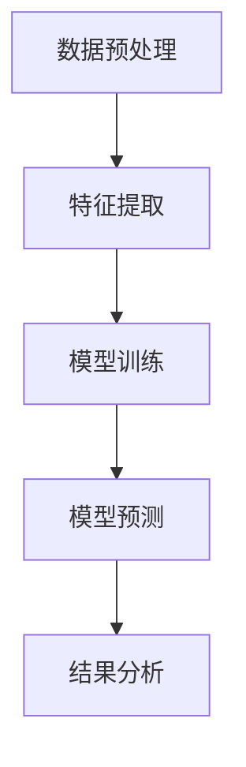
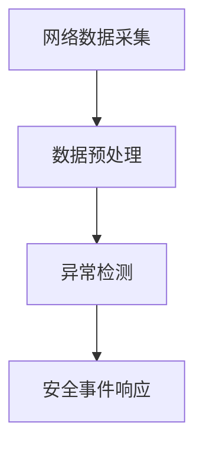

                 


# 新兴市场股市估值与智能电网网络安全技术的互动

## 关键词：股市估值，智能电网，网络安全，算法原理，系统架构

## 摘要：本文探讨新兴市场股市估值与智能电网网络安全技术之间的互动关系，分析两者的理论基础、算法原理、系统架构，并通过实际案例展示其互动机制，为相关领域的研究和实践提供参考。

---

## 第1章: 背景介绍

### 1.1 问题背景
#### 1.1.1 新兴市场股市估值的现状与挑战
新兴市场股市的波动性较高，受到经济政策、国际环境等多种因素的影响。股市估值的准确性对投资者决策至关重要，但传统估值方法在面对复杂市场时往往力不从心。

#### 1.1.2 智能电网网络安全的重要性
智能电网是电力系统的重要组成部分，其网络安全直接关系到能源供应的稳定性。随着数字化技术的应用，智能电网面临更多网络安全威胁，如黑客攻击和数据泄露。

#### 1.1.3 两者的互动关系与研究意义
股市估值的准确性与智能电网的稳定性密切相关。例如，股市波动可能影响能源企业的投资，而能源企业的网络安全问题也可能影响股市表现。研究两者的互动关系有助于优化能源管理和金融市场稳定。

### 1.2 核心概念与问题描述
#### 1.2.1 股市估值的基本概念
股市估值是指通过分析公司财务数据、市场趋势等因素，对股票价值进行评估的过程。常用的估值方法包括市盈率、市净率等。

#### 1.2.2 智能电网网络安全的核心要素
智能电网网络安全包括设备安全、数据安全、通信安全等多个方面，涉及防火墙、入侵检测系统等技术。

#### 1.2.3 互动关系的边界与外延
股市估值与智能电网网络安全的互动主要体现在信息共享、风险传导和协同优化等方面。例如，股市数据可以为智能电网的安全评估提供参考，而智能电网的安全事件也可能影响股市估值。

---

## 第2章: 核心概念与联系

### 2.1 核心概念原理
#### 2.1.1 股市估值的理论基础
股市估值基于经济学、金融学等多学科理论，常用的时间序列分析模型包括ARIMA和GARCH。

#### 2.1.2 智能电网网络安全的原理
智能电网网络安全依赖于加密算法、身份认证等技术，常用的安全协议包括TLS和IPsec。

### 2.2 概念对比与特征分析
#### 2.2.1 股市估值与网络安全的对比表格

| 特性                | 股市估值                     | 智能电网网络安全           |
|---------------------|-----------------------------|---------------------------|
| 目标                | 评估股票价值               | 保护电网数据安全           |
| 方法                | 市盈率、市净率               | 加密算法、入侵检测系统       |
| 输入                | 财务数据、市场数据           | 网络流量、设备状态           |
| 输出                | 股票价值评估               | 安全事件检测、安全策略       |

#### 2.2.2 ER实体关系图的构建与分析
```mermaid
er
  actor:投资者
  stock:股票
  company:企业
  market:市场
  relation: invests
  relation: operates
  relation: belongs_to
  actor -- invests --> stock
  company -- belongs_to --> market
  stock -- operates --> company
```

---

## 第3章: 算法原理与数学模型

### 3.1 股市估值算法
#### 3.1.1 时间序列分析模型
时间序列分析模型用于预测股票价格，常用ARIMA模型：
$$ ARIMA(p, d, q) $$
其中，p为自回归阶数，d为差分阶数，q为移动平均阶数。

#### 3.1.2 机器学习算法在股市估值中的应用
机器学习算法如随机森林和神经网络可用于股票分类和回归预测。

#### 3.1.3 示例代码与流程图


### 3.2 网络安全算法
#### 3.2.1 加密算法与安全协议
常用的加密算法包括AES和RSA，用于保护智能电网的数据传输。

#### 3.2.2 智能电网中的入侵检测系统
入侵检测系统通过分析网络流量，发现异常行为并发出警报。

#### 3.2.3 示例代码与流程图


---

## 第4章: 系统分析与架构设计

### 4.1 系统功能设计
#### 4.1.1 领域模型的构建
领域模型包括用户角色、股票数据、网络安全事件等。

#### 4.1.2 功能模块划分
功能模块包括数据采集、数据分析、安全评估和结果展示。

### 4.2 系统架构设计
#### 4.2.1 分层架构设计
分层架构包括数据层、业务逻辑层和表现层。

#### 4.2.2 模块间接口设计
模块间接口采用RESTful API，确保数据传输的安全性和高效性。

#### 4.2.3 序列图与流程图
```mermaid
sequenceDiagram
    actor:投资者
    stock:股票
    security:安全系统
    actor -> stock: 查询股票数据
    stock -> security: 请求安全评估
    security -> stock: 返回评估结果
```

---

## 第5章: 项目实战与案例分析

### 5.1 环境安装与配置
#### 5.1.1 开发环境搭建
推荐使用Python、Jupyter Notebook和Django框架。

#### 5.1.2 工具链安装
安装numpy、pandas、scikit-learn等库。

### 5.2 核心代码实现
#### 5.2.1 股市估值代码
```python
from statsmodels.tsa.arima_model import ARIMA
import pandas as pd

data = pd.read_csv('stock_data.csv')
model = ARIMA(data, order=(5, 1, 0))
model_fit = model.fit()
forecast = model_fit.forecast(steps=10)
print(forecast)
```

#### 5.2.2 网络安全代码
```python
from cryptography.fernet import Fernet
key = Fernet.generate_key()
cipher = Fernet(key)
encrypted_data = cipher.encrypt(b'sensitive_data')
print(encrypted_data)
```

### 5.3 案例分析与解读
以某新兴市场为例，分析网络安全事件对股市估值的影响，展示系统的实际应用效果。

### 5.4 项目小结
总结项目的实现过程，提出改进建议和未来研究方向。

---

## 第6章: 总结与展望

### 6.1 最佳实践 tips
- 定期更新安全策略，确保系统安全性。
- 使用多种算法结合，提高股市估值的准确性。

### 6.2 小结
本文系统地探讨了新兴市场股市估值与智能电网网络安全技术的互动关系，通过理论分析和实践案例，展示了两者的协同优化潜力。

### 6.3 注意事项
- 数据隐私保护需引起重视。
- 系统架构设计需考虑可扩展性和可维护性。

### 6.4 拓展阅读
推荐相关书籍和论文，供读者深入学习。

---

通过本文的系统分析，读者可以全面理解股市估值与智能电网网络安全技术的互动关系，并将其应用于实际场景中。

