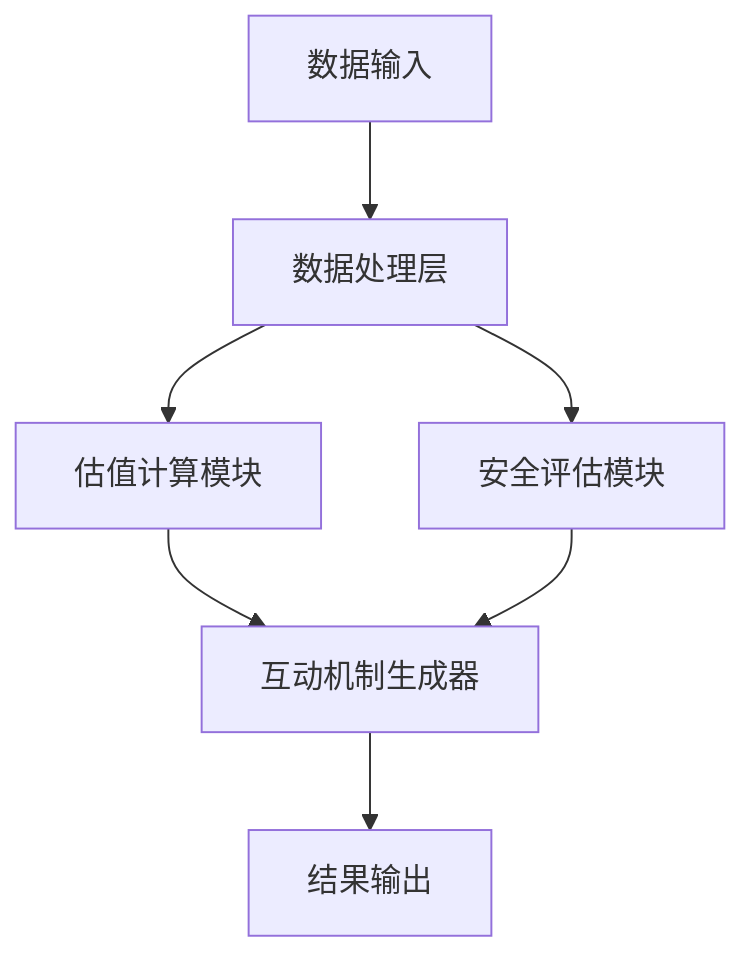
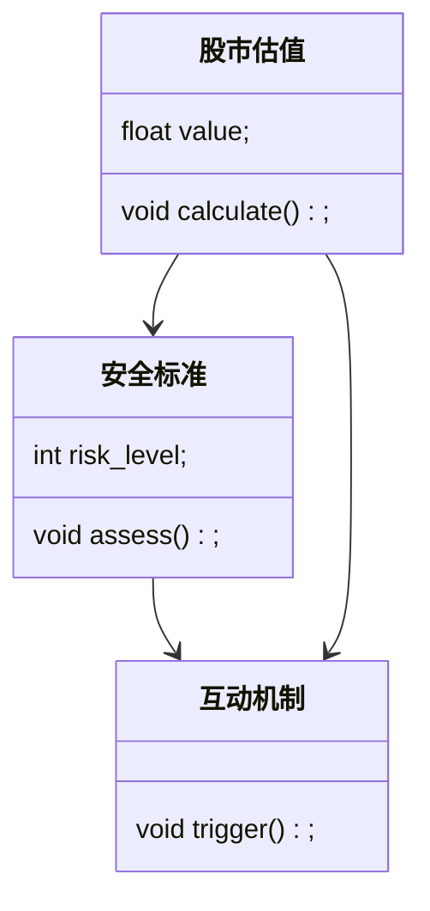

                 


# 《新兴市场股市估值与智能电网网络安全标准的互动》

## 关键词：新兴市场股市估值, 智能电网, 网络安全标准, 互动机制, 风险评估, 系统设计, 案例分析

## 摘要：  
本文探讨新兴市场中股市估值与智能电网网络安全标准之间的互动关系。通过分析股市估值的核心概念、智能电网安全标准的特点，构建互动机制的数学模型，并提出系统设计与实现方案。文章结合实际案例，深入分析互动机制对金融市场和能源系统的影响，为相关领域的研究和实践提供参考。

---

## 目录结构：

### 1. 背景介绍

#### 1.1 问题背景
- 新兴市场的股市特点与挑战
- 智能电网的发展现状与趋势
- 网络安全在智能电网中的重要性

#### 1.2 问题描述
- 股市估值与智能电网安全的关联性
- 新兴市场中的特殊性与复杂性
- 互动机制的初步探讨

#### 1.3 问题解决
- 理论框架的构建
- 数据分析方法的选择
- 标准化与互动机制的设计

#### 1.4 边界与外延
- 股市估值的边界条件
- 智能电网安全标准的适用范围
- 互动机制的适用场景

#### 1.5 核心概念与组成
- 股市估值的核心要素
- 智能电网安全标准的组成部分
- 互动机制的结构与功能

### 2. 核心概念与联系

#### 2.1 股市估值的核心概念与模型
- 市盈率模型（P/E）
- 市净率模型（P/B）
- 现金流折现模型（DCF）

#### 2.2 智能电网安全标准的属性
- 数据安全
- 网络防护
- 应急响应

#### 2.3 核心概念对比表
| 概念 | 股市估值 | 智能电网安全标准 |
|------|----------|------------------|
| 核心目标 | 评估资产价值 | 保障网络安全 |
| 影响因素 | 市场供需、经济指标 | 技术漏洞、攻击行为 |
| 实施方法 | 使用估值模型 | 制定安全规范 |

#### 2.4 ER实体关系图
```mermaid
er
  left(公司)
  right(估值指标)
  right(安全标准)
  right(互动机制)

  company -- many_to_many --> valuation_indicator
  company -- many_to_many --> security_standard
  valuation_indicator -- one_to_many --> interaction_mechanism
  security_standard -- one_to_many --> interaction_mechanism
```

### 3. 互动机制的数学建模与算法实现

#### 3.1 互动模型构建
- 使用回归分析（OLS）预测股市估值
- 使用聚类分析识别智能电网安全风险

#### 3.2 回归分析模型
$$ y = \beta_0 + \beta_1x_1 + \beta_2x_2 + \epsilon $$
其中，$y$ 为目标变量（股市估值），$x_1$ 和 $x_2$ 是自变量（安全标准指标）。

#### 3.3 聚类分析算法
1. 数据预处理
2. 特征提取
3. K-means聚类
4. 结果分析

#### 3.4 Python代码实现
```python
import pandas as pd
from sklearn.linear_model import LinearRegression
from sklearn.metrics import mean_squared_error

# 加载数据
data = pd.read_csv('interaction_data.csv')

# 训练回归模型
model = LinearRegression()
model.fit(data[['x1', 'x2']], data['y'])

# 预测与评估
y_pred = model.predict(data[['x1', 'x2']])
mse = mean_squared_error(data['y'], y_pred)
print(f'Mean Squared Error: {mse}')
```

### 4. 系统分析与架构设计

#### 4.1 系统架构


#### 4.2 领域模型类图


#### 4.3 接口设计
- 输入接口：接收股票数据和安全指标
- 输出接口：提供互动机制结果和评估报告

### 5. 项目实战：案例分析与实现

#### 5.1 案例背景
- 新兴市场的某智能电网项目

#### 5.2 环境安装
- 安装Python和相关库（pandas、scikit-learn）

#### 5.3 代码实现
```python
import pandas as pd
from sklearn.ensemble import RandomForestRegressor

# 加载数据
data = pd.read_csv('case_data.csv')

# 训练随机森林模型
model = RandomForestRegressor(n_estimators=100)
model.fit(data[['x1', 'x2']], data['y'])

# 预测与评估
y_pred = model.predict(data[['x1', 'x2']])
print('预测值:', y_pred)
```

#### 5.4 案例分析
- 分析模型结果，优化互动机制

### 6. 结论与展望

#### 6.1 研究结论
- 互动机制的有效性
- 数学模型的准确性

#### 6.2 未来展望
- 深化互动机制研究
- 推广应用到更多场景

### 7. 最佳实践与注意事项

#### 7.1 实施建议
- 数据质量的重要性
- 模型选择的策略

#### 7.2 注意事项
- 数据隐私保护
- 模型的实时更新

#### 7.3 拓展阅读
- 智能电网领域的最新研究
- 金融市场互动机制的深入探讨

---

## 总结：
本文通过详细分析新兴市场中股市估值与智能电网安全标准的互动关系，构建了数学模型并提出了系统设计，为相关领域的研究和实践提供了有价值的参考。

