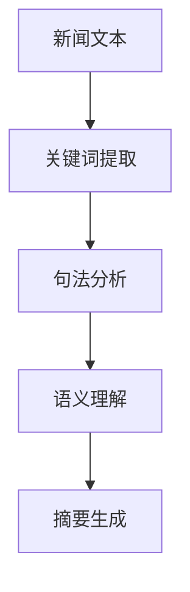
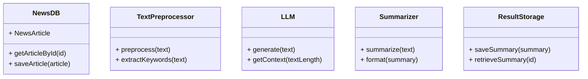

                 


# 新闻摘要 AI Agent：LLM 驱动的信息提取与总结

## 关键词：
新闻摘要，LLM，信息提取，自然语言处理，人工智能，文本摘要

## 摘要：
本文探讨了利用大语言模型（LLM）驱动的新闻摘要AI Agent，从信息提取到文本总结的全过程。通过分析LLM的算法原理、系统设计、项目实战及最佳实践，深入解析新闻摘要技术的核心概念与实现方法，帮助读者理解如何构建高效的信息处理系统。

---

# 第一部分: 新闻摘要 AI Agent 的背景与基础

## 第1章: 新闻摘要与信息提取的背景

### 1.1 问题背景与挑战

#### 1.1.1 传统新闻摘要技术的局限性
传统的新闻摘要技术主要依赖于关键词提取和句法分析，存在以下问题：
- **内容片面性**：仅依赖关键词可能导致摘要遗漏关键信息。
- **语义理解不足**：传统方法难以准确捕捉上下文语义。
- **效率低下**：面对海量数据，传统方法难以高效处理。

#### 1.1.2 AI驱动新闻摘要的优势
人工智能技术，特别是大语言模型（LLM），为新闻摘要带来了革命性的改进：
- **语义理解能力**：LLM能够深度理解文本语义，生成更准确的摘要。
- **高效处理能力**：基于LLM的摘要系统可以快速处理大量数据。
- **自适应学习**：通过大量训练数据，模型能够不断优化摘要效果。

#### 1.1.3 当前新闻摘要的主要应用场景
- **新闻网站**：快速生成新闻头条。
- **社交媒体**：实时摘要热点话题。
- **企业信息管理**：高效整理内部文档。

### 1.2 问题描述与目标

#### 1.2.1 新闻摘要的核心目标
新闻摘要的目标是：
- **准确提取关键信息**：抓住新闻的核心内容。
- **简洁明了**：用简短的语言概括全文。
- **保持中立客观**：避免主观判断影响摘要结果。

#### 1.2.2 新闻摘要的边界与外延
- **边界**：仅限于新闻文本，不涉及图片、视频等其他媒体。
- **外延**：可扩展至多语言、多领域摘要。

#### 1.2.3 新闻摘要的评价指标
| 指标 | 描述 | 权重 |
|------|------|------|
| 准确性 | 摘要内容与原文的匹配程度 | 50% |
| 简洁性 | 摘要长度是否适中 | 30% |
| 语义相关性 | 摘要是否涵盖原文主要信息 | 20% |

### 1.3 核心概念与属性

#### 1.3.1 大语言模型（LLM）的基本概念
大语言模型通过大量数据训练，能够理解并生成人类语言。其核心特征包括：
- **大规模训练**：利用海量数据进行预训练。
- **多任务学习**：支持多种自然语言处理任务。
- **自适应能力**：能够根据上下文调整生成内容。

#### 1.3.2 LLM 在新闻摘要中的角色
LLM在新闻摘要中的作用：
- **信息提取**：识别文本中的关键信息。
- **内容生成**：基于提取的信息生成摘要。

#### 1.3.3 信息提取与总结的关键属性对比

| 属性 | 信息提取 | 文本总结 |
|------|----------|----------|
| 输入 | 原始文本 | 关键信息 |
| 输出 | 关键词/实体 | 摘要文本 |
| 方法 | 基于规则或模型 | 基于模型生成 |

---

## 第2章: LLM 驱动的信息提取与总结的核心概念

### 2.1 实体关系图



---

# 第二部分: LLM 的算法原理与数学模型

## 第3章: LLM 的训练与调优

### 3.1 基本原理

#### 3.1.1 大语言模型的训练目标
LLM的训练目标是学习语言的分布，优化以下目标：
$$ P(y|x) = \frac{P(x,y)}{P(x)} $$

#### 3.1.2 损失函数与优化方法
常用的损失函数为交叉熵损失：
$$ L = -\sum_{i=1}^{n} \log P(y_i|x) $$

优化方法通常采用随机梯度下降：
$$ \theta = \theta - \eta \cdot \nabla L(\theta) $$

#### 3.1.3 模型的并行训练策略
并行训练策略包括：
- 数据并行：将数据分成多个批次，分别训练。
- 模型并行：将模型参数分散到多个GPU上训练。

---

## 第4章: LLM 的生成机制

### 4.1 生成模型的原理

#### 4.1.1 解码器的结构
解码器通常采用自注意力机制：
$$ \text{Attention}(Q,K,V) = \text{softmax}(\frac{QK^T}{\sqrt{d}})V $$

#### 4.1.2 注意力机制的作用
注意力机制通过计算Query与Key的相似度，确定每个词的关注程度。

#### 4.1.3 温度参数对生成结果的影响
温度参数$T$控制生成的多样性：
- $T$越大，生成结果越多样化。
- $T$越小，生成结果越集中。

---

## 第5章: 新闻摘要的系统设计

### 5.1 系统架构设计

```mermaid
graph LR
    Client[客户端] --> API Gateway[API网关]
    API Gateway --> NewsDB[新闻数据库]
    NewsDB --> TextPreprocessor[文本预处理]
    TextPreprocessor --> LLM[大语言模型]
    LLM --> Summarizer[摘要生成器]
    Summarizer --> ResultStorage[结果存储]
    ResultStorage --> Client
```

### 5.2 系统功能设计



### 5.3 系统接口设计

| 接口名称 | 输入 | 输出 | 描述 |
|----------|------|------|------|
| getArticle | articleId | NewsArticle | 获取新闻文章 |
| preprocess | text | processedText | 文本预处理 |
| generate | prompt | generatedText | 生成文本 |
| summarize | text | summary | 生成摘要 |

---

## 第6章: 项目实战

### 6.1 环境安装

```bash
pip install transformers torch
```

### 6.2 核心实现代码

```python
from transformers import BartTokenizer, BartForConditionalGeneration

tokenizer = BartTokenizer.from_pretrained('facebook/bart-large')
model = BartForConditionalGeneration.from_pretrained('facebook/bart-large')

def summarize(text):
    inputs = tokenizer.encode(text, max_length=1024, truncation=True, return_tensors='pt')
    outputs = model.generate(inputs, max_length=100, min_length=50, do_sample=False)
    summary = tokenizer.decode(outputs[0], skip_special_tokens=True)
    return summary
```

### 6.3 案例分析

假设输入文本为一篇关于最新科技新闻的文章，代码生成摘要如下：
```python
article = "..."  # 输入新闻文本
print(summarize(article))  # 输出摘要
```

---

## 第7章: 总结与展望

### 7.1 最佳实践 tips
- **数据质量**：确保训练数据的多样性和代表性。
- **模型调优**：根据具体任务调整超参数。
- **性能优化**：采用并行计算加速处理。

### 7.2 小结
本文详细探讨了基于LLM的新闻摘要技术，从算法原理到系统设计，再到项目实战，全面解析了新闻摘要AI Agent的实现过程。

### 7.3 注意事项
- **数据隐私**：注意保护用户数据隐私。
- **模型更新**：定期更新模型以保持性能。

### 7.4 拓展阅读
- 《Transformers: Pre-training of auto-regressive language models》
- 《A survey on neural text summarization》

---

通过本文的详细讲解，读者可以全面理解并掌握基于LLM的新闻摘要技术，为实际应用提供有力的技术支持。

