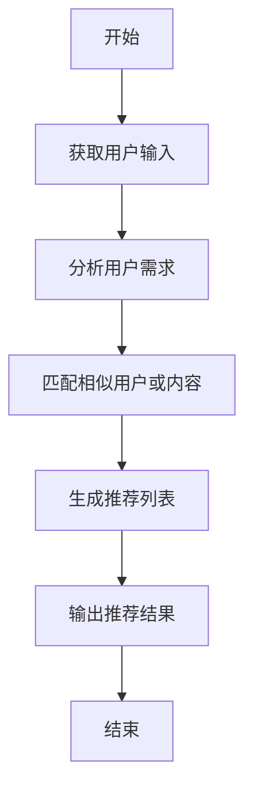
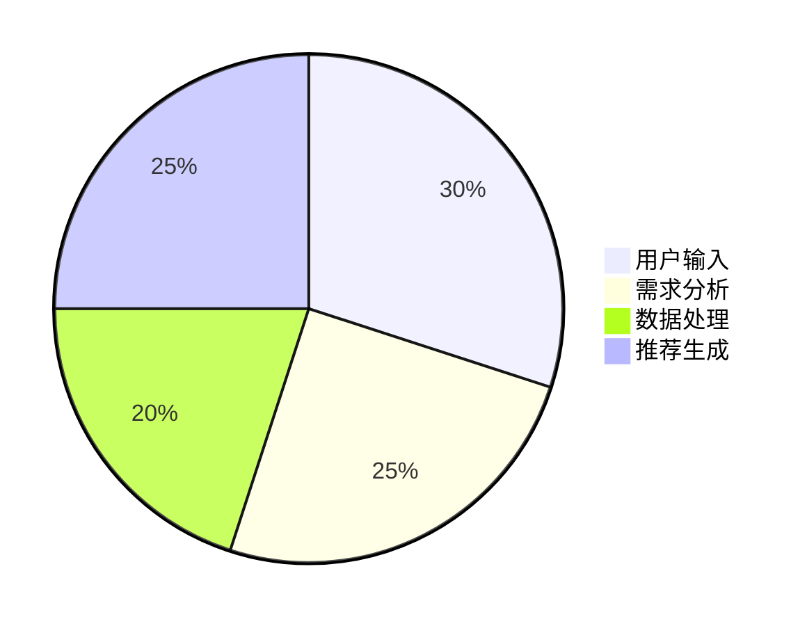

                 


# 旅游业AI Agent：个性化行程规划

> 关键词：旅游业，AI Agent，个性化行程规划，推荐算法，系统架构，Python实现

> 摘要：本文深入探讨了AI Agent在旅游业中的应用，特别是个性化行程规划这一领域。通过分析用户需求、算法原理、系统架构以及实际案例，详细介绍了如何利用AI技术为用户提供高效、个性化的旅游行程建议。文章内容涵盖了从理论基础到实际应用的全过程，旨在为读者提供全面的技术指导和实践参考。

---

## 第1章：旅游业AI Agent的背景与问题分析

### 1.1 旅游业的现状与挑战

#### 1.1.1 旅游业的快速发展与痛点

随着全球化和互联网技术的发展，旅游业迎来了前所未有的增长。然而，行业的快速发展也带来了诸多挑战：

- **信息过载**：用户在规划行程时，面对海量信息难以筛选。
- **个性化需求**：用户对旅游体验的需求日益多样化，传统的一-size-fits-all服务难以满足。
- **服务效率**：如何快速响应用户需求并提供个性化服务，成为行业痛点。

#### 1.1.2 用户需求的多样化与个性化

用户在选择旅游行程时，关注的点包括但不限于：

- **兴趣偏好**：如喜欢自然风光、历史文化、美食体验等。
- **行程安排**：如时间、预算、交通方式等。
- **服务体验**：如服务质量、导游专业性、酒店舒适度等。

#### 1.1.3 传统旅游服务的局限性

传统旅游服务主要依赖人工推荐或固定套餐，难以满足用户的个性化需求。此外，人工服务效率低下，且难以覆盖所有用户群体。

---

### 1.2 AI Agent的基本概念与特点

#### 1.2.1 AI Agent的定义与核心功能

AI Agent（人工智能代理）是一种能够感知环境、自主决策并执行任务的智能体。在旅游业中，AI Agent的核心功能包括：

- **用户需求分析**：通过数据挖掘和自然语言处理技术，分析用户的兴趣和偏好。
- **行程推荐**：基于用户需求和历史数据，推荐个性化行程方案。
- **实时反馈**：根据用户反馈实时调整推荐结果。

#### 1.2.2 AI Agent在旅游业中的独特优势

AI Agent能够通过大数据分析和机器学习算法，为用户提供高效、精准的服务。其优势体现在：

- **高效率**：能够在短时间内处理大量数据并生成推荐结果。
- **个性化**：基于用户需求生成专属行程方案。
- **实时性**：能够实时调整推荐结果，满足用户动态需求。

#### 1.2.3 个性化行程规划的核心要素

个性化行程规划的核心要素包括：

- **用户偏好**：如兴趣、预算、时间安排等。
- **行程结构**：包括目的地、景点、交通方式、住宿等。
- **推荐策略**：基于用户需求和数据的推荐算法。

---

### 1.3 问题背景与目标

#### 1.3.1 个性化行程规划的必要性

随着用户需求的多样化，传统的一-size-fits-all服务已无法满足市场需求。个性化行程规划能够提高用户满意度，增强企业竞争力。

#### 1.3.2 用户需求与行程规划的关系

用户需求是行程规划的基础，行程规划需要根据用户需求进行动态调整。AI Agent能够通过分析用户需求，生成最优的行程方案。

#### 1.3.3 本书的研究目标与范围

本文旨在探讨AI Agent在旅游业中的应用，重点分析个性化行程规划的核心技术、算法实现和系统架构。研究范围涵盖从理论分析到实际应用的全过程。

---

## 第2章：旅游业AI Agent的核心概念与联系

### 2.1 AI Agent的核心原理

#### 2.1.1 AI Agent的基本工作流程

AI Agent的工作流程包括以下几个步骤：

1. **数据收集**：通过用户输入、历史数据等获取相关信息。
2. **需求分析**：通过数据分析和自然语言处理技术，识别用户需求。
3. **推荐生成**：基于推荐算法，生成个性化行程方案。
4. **结果输出**：将推荐结果呈现给用户，并根据反馈进行调整。

#### 2.1.2 个性化行程规划的关键技术

个性化行程规划的关键技术包括：

- **推荐算法**：如协同过滤、基于内容的推荐等。
- **自然语言处理**：用于理解和分析用户需求。
- **机器学习**：用于模型训练和优化。

#### 2.1.3 用户行为分析与需求挖掘

通过分析用户行为数据，可以挖掘用户的兴趣偏好和潜在需求。常用的方法包括：

- **用户画像**：基于用户数据构建用户画像。
- **行为分析**：通过分析用户的浏览、点击等行为，挖掘用户需求。

---

### 2.2 核心概念的属性对比

#### 2.2.1 不同AI Agent算法的对比分析

以下是几种常见的AI Agent算法对比：

| 算法类型        | 描述                                                                 | 优点                          | 缺点                          |
|-----------------|----------------------------------------------------------------------|-------------------------------|-------------------------------|
| 协同过滤        | 基于用户相似性推荐相关内容                                     | 推荐结果精准                   | 对冷启动用户效果较差          |
| 基于内容的推荐  | 基于内容特征推荐相关内容                                       | 对冷启动用户效果较好           | 推荐结果可能不够个性化         |
| 混合推荐         | 结合协同过滤和基于内容的推荐                                   | 推荐结果精准且多样化           | 实现复杂                     |

#### 2.2.2 个性化行程规划与通用行程规划的差异

| 对比维度         | 个性化行程规划                        | 通用行程规划                      |
|------------------|---------------------------------------|------------------------------------|
| 用户需求         | 高度个性化                            | 标准化                            |
| 推荐算法         | 基于用户数据的定制化推荐              | 基于通用数据的推荐                |
| 服务效果         | 用户满意度高                          | 用户满意度较低                   |

#### 2.2.3 用户偏好与行程推荐的关联性

用户偏好是行程推荐的核心依据。通过分析用户的兴趣、预算、时间等偏好，AI Agent能够生成更加精准的行程推荐。

---

### 2.3 ER实体关系图

```mermaid
er
  actor: 用户
  agent: AI Agent
  destination: 目的地
  activity: 活动
  preference: 用户偏好
  relation1: 用户 -> 喜欢 -> 活动
  relation2: 用户 -> 喜欢 -> 目的地
  relation3: AI Agent -> 推荐 -> 活动
  relation4: AI Agent -> 推荐 -> 目的地
```

---

## 第3章：算法原理与数学模型

### 3.1 推荐算法的原理

#### 3.1.1 基于协同过滤的推荐算法

协同过滤是一种常见的推荐算法，其核心思想是通过分析用户行为数据，找到与目标用户相似的用户，并推荐这些用户喜欢的内容。

##### 实现步骤：

1. **数据预处理**：对用户行为数据进行清洗和归一化处理。
2. **计算相似度**：通过余弦相似度或其他相似度算法计算用户相似度。
3. **生成推荐列表**：基于相似用户的喜好，生成推荐列表。

#### 3.1.2 基于内容的推荐算法

基于内容的推荐算法通过分析内容特征，推荐与用户兴趣相符的内容。其核心思想是通过内容本身的属性进行推荐。

##### 实现步骤：

1. **内容特征提取**：对内容进行特征提取，如文本关键词提取。
2. **计算相似度**：通过计算内容之间的相似度，生成推荐列表。

#### 3.1.3 混合推荐算法的优势

混合推荐算法结合了协同过滤和基于内容的推荐算法的优点，能够提高推荐结果的准确性和多样性。

---

### 3.2 数学模型与公式

#### 3.2.1 协同过滤算法的数学模型

余弦相似度公式：

$$\text{相似度} = \frac{\sum (x_i - \bar{x})(y_i - \bar{y})}{\sqrt{\sum (x_i - \bar{x})^2} \sqrt{\sum (y_i - \bar{y})^2}}$$

其中，\(x_i\)和\(y_i\)分别表示两个用户的评分，\(\bar{x}\)和\(\bar{y}\)分别表示评分的平均值。

#### 3.2.2 基于内容的推荐算法

基于内容的推荐算法可以通过词袋模型或词嵌模型进行特征提取。以下是词袋模型的简单实现：

$$\text{相似度} = \frac{\sum w_{ij} x_i}{\sum w_{ij}}$$

其中，\(w_{ij}\)表示第\(i\)个关键词的权重，\(x_i\)表示第\(i\)个关键词的出现次数。

---

### 3.3 算法流程图



---

## 第4章：系统架构与设计

### 4.1 系统架构设计

#### 4.1.1 系统模块划分

系统主要包括以下几个模块：

1. **用户输入模块**：获取用户的输入信息。
2. **需求分析模块**：分析用户的兴趣和偏好。
3. **数据处理模块**：对数据进行清洗和预处理。
4. **推荐生成模块**：基于推荐算法生成推荐结果。
5. **结果输出模块**：将推荐结果呈现给用户。

#### 4.1.2 系统架构图



---

### 4.2 系统交互流程图

```mermaid
sequenceDiagram
    actor 用户
    participant AI Agent
    participant 数据库
    actor 用户 -> AI Agent: 提交需求
    AI Agent -> 数据库: 查询相关数据
    AI Agent -> 用户: 返回推荐结果
    用户 -> AI Agent: 提供反馈
    AI Agent -> 数据库: 更新推荐模型
```

---

## 第5章：项目实战

### 5.1 环境安装与配置

以下是Python环境的安装步骤：

1. **安装Python**：从官网下载并安装Python 3.8及以上版本。
2. **安装依赖库**：使用pip安装必要的库，如numpy、pandas、scikit-learn等。

```bash
pip install numpy pandas scikit-learn
```

---

### 5.2 核心代码实现

以下是基于协同过滤算法的推荐系统实现：

```python
import numpy as np
from sklearn.metrics.pairwise import cosine_similarity

# 示例数据
users = ['user1', 'user2', 'user3']
items = ['item1', 'item2', 'item3']
ratings = {
    'user1': {'item1': 5, 'item2': 4, 'item3': 3},
    'user2': {'item1': 4, 'item2': 5, 'item3': 2},
    'user3': {'item1': 3, 'item2': 2, 'item3': 5}
}

# 创建评分矩阵
rating_matrix = np.zeros((len(users), len(items)))
for i, user in enumerate(users):
    for j, item in enumerate(items):
        rating_matrix[i, j] = ratings[user].get(item, 0)

# 计算余弦相似度
similarity = cosine_similarity(rating_matrix)
print("相似度矩阵：\n", similarity)
```

---

### 5.3 实际案例分析

以下是基于上述代码的案例分析：

1. **输入数据**：用户对不同物品的评分数据。
2. **计算相似度矩阵**：使用余弦相似度计算用户之间的相似度。
3. **生成推荐列表**：基于相似度矩阵，为每个用户生成推荐列表。

---

## 第6章：最佳实践与小结

### 6.1 最佳实践

- **数据质量**：确保数据的准确性和完整性。
- **模型优化**：定期更新模型，提高推荐精度。
- **用户体验**：注重用户反馈，优化推荐结果。

### 6.2 小结

本文详细探讨了AI Agent在旅游业中的应用，特别是个性化行程规划这一领域。通过分析用户需求、算法原理、系统架构以及实际案例，为读者提供了全面的技术指导和实践参考。

---

## 参考文献

- [1] 书籍名：《机器学习实战》
- [2] 书籍名：《Python机器学习》
- [3] 网站名：https://www.tourism.gov.cn/

---

## 拓展阅读

- 推荐系统的研究与应用
- 人工智能在旅游行业的创新应用
- 基于深度学习的推荐算法

