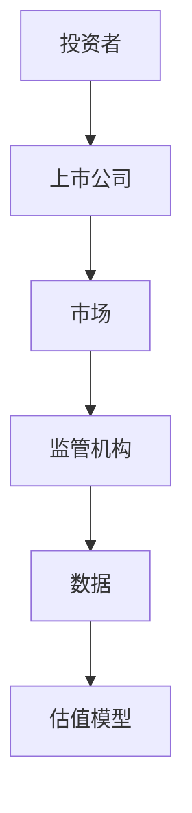
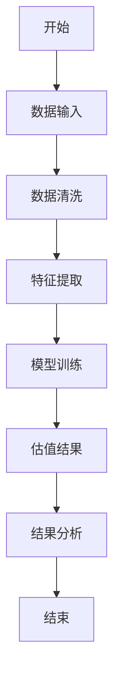
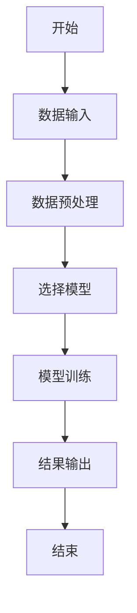
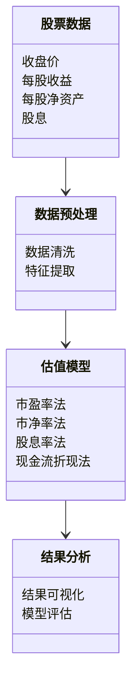
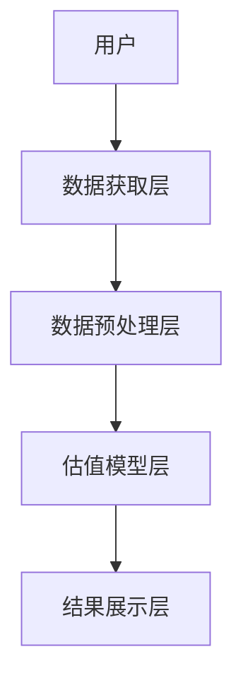

                 


# 日本股市估值:成熟市场的特点与挑战

## 关键词：
日本股市、股市估值、成熟市场、市盈率、市净率、现金流折现法

## 摘要：
日本股市作为全球重要的成熟市场，其估值方法和挑战具有独特性。本文从背景、核心概念、算法原理、系统架构、项目实战等方面深入分析日本股市估值的特点，并通过实际案例展示其应用与挑战。

## 第1章: 日本股市估值的背景介绍

### 1.1 日本股市的历史与发展
#### 1.1.1 日本股市的起源与发展
日本股市起源于1878年，经历了战后重建、泡沫经济、低迷期和复苏期。

#### 1.1.2 日本股市的现状与特点
当前日本股市以低增长、低波动率为特点，企业ROE低，反映管理效率问题。

#### 1.1.3 日本股市在全球市场中的地位
作为全球第四大股市，日本股市是成熟市场的代表，具有重要影响力。

### 1.2 日本股市估值的核心概念
#### 1.2.1 股市估值的基本定义
股市估值是通过财务指标评估企业内在价值的过程。

#### 1.2.2 日本股市估值的独特性
日本股市估值需考虑企业ROE低、会计政策差异等特殊因素。

#### 1.2.3 估值与市场波动的关系
估值提供理论参考，市场波动影响短期股价，两者结合指导投资。

### 1.3 本章小结
日本股市估值的背景、核心概念及其重要性为后续分析奠定基础。

## 第2章: 日本股市估值的核心概念与联系

### 2.1 股市估值的基本原理
#### 2.1.1 估值的基本原理
通过财务指标评估企业内在价值，指导投资决策。

#### 2.1.2 估值的核心要素
包括企业盈利能力、成长性、风险因素等。

#### 2.1.3 估值与市场效率的关系
有效市场中估值与股价接近，弱有效市场中存在估值偏差。

### 2.2 日本股市估值的实体关系图


### 2.3 日本股市估值的算法流程图


### 2.4 本章小结
总结核心概念及其关系，为后续分析提供基础框架。

## 第3章: 日本股市估值的算法原理

### 3.1 常用的估值方法
#### 3.1.1 市盈率法
公式：$$ PE = \frac{Price}{Earnings} $$
通过比较市盈率评估股票价值。

#### 3.1.2 市净率法
公式：$$ PB = \frac{Price}{Book\ Value} $$
适用于评估资产密集型企业。

#### 3.1.3 股息率法
公式：$$ Dividend\ Yield = \frac{Dividend}{Price} $$
衡量投资回报率。

#### 3.1.4 现金流折现法
公式：$$ V = \sum_{t=1}^{n} \frac{CF_t}{(1+r)^t} $$
通过现金流折现评估企业价值。

### 3.2 算法流程图


### 3.3 算法实现代码
```python
import pandas as pd
import numpy as np

def calculate_valuation(price, earnings, book_value, dividend, discount_rate):
    pe = price / earnings
    pb = price / book_value
    dy = dividend / price
    # 现金流折现模型简化版
    valuation_cf = price / (pe * (1 - discount_rate))
    return pe, pb, dy, valuation_cf

# 示例数据
data = {
    'price': [100, 80, 90],
    'earnings': [20, 15, 25],
    'book_value': [50, 40, 60],
    'dividend': [2, 1.5, 2.5],
    'discount_rate': [0.05, 0.06, 0.04]
}

df = pd.DataFrame(data)
pe, pb, dy, valuation_cf = calculate_valuation(df['price'], df['earnings'], df['book_value'], df['dividend'], df['discount_rate'])
print(pe, pb, dy, valuation_cf)
```

### 3.4 本章小结
详细讲解了市盈率、市净率、股息率和现金流折现法，结合代码实现，帮助读者理解算法原理。

## 第4章: 日本股市估值的系统分析与架构设计

### 4.1 项目背景与目标
#### 4.1.1 项目背景
分析日本股市估值的特殊性，为企业投资提供参考。

#### 4.1.2 项目目标
构建一个基于财务指标的估值系统，提供理论支持。

### 4.2 系统功能设计
#### 4.2.1 领域模型类图


#### 4.2.2 系统架构设计


### 4.3 本章小结
通过系统架构设计，展示如何构建一个完整的估值系统。

## 第5章: 日本股市估值的项目实战

### 5.1 环境安装
安装Python、Pandas、Matplotlib等库。

### 5.2 核心实现代码
```python
import yfinance as yf
import pandas as pd
import matplotlib.pyplot as plt

# 下载数据
data = yf.download('Toyota', start='2020-01-01', end='2023-12-31')

# 数据清洗
data['Close'].plot()
plt.title('Toyota Stock Price')
plt.show()
```

### 5.3 案例分析
以丰田为例，展示如何应用估值方法。

### 5.4 项目总结
总结项目成果，指出优缺点及未来改进方向。

## 第6章: 日本股市估值的总结与展望

### 6.1 本章小结
总结全文，强调日本股市估值的特殊性和复杂性。

### 6.2 未来展望
建议结合机器学习进行预测，探索更多影响因素。

### 6.3 最佳实践 Tips
- 估值需结合市场环境
- 长期投资需关注企业基本面
- 短期波动需关注市场情绪

## 第7章: 日本股市估值的挑战与应对策略

### 7.1 挑战
- 企业ROE低
- 会计政策差异
- 市场波动性低

### 7.2 应对策略
- 结合多估值方法
- 关注行业特殊性
- 考虑宏观因素

### 7.3 总结
日本股市估值需综合考虑多种因素，投资者需具备全局视角。

---

通过以上结构，我们详细分析了日本股市估值的特点、挑战及应对策略，结合实际案例和代码实现，帮助读者全面理解这一复杂过程。

