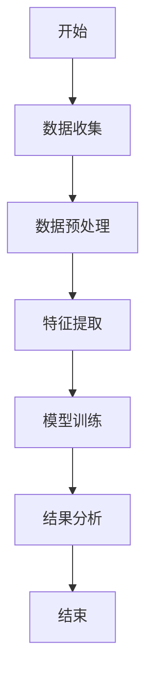
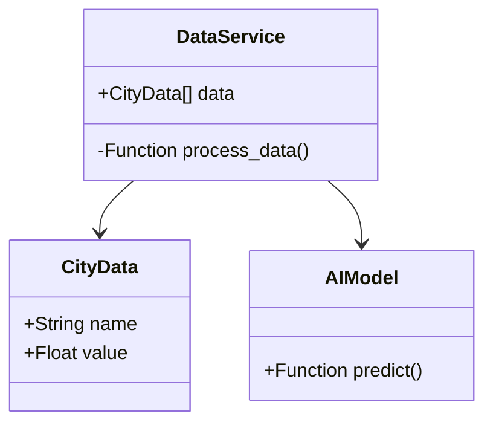

                 


# 智慧城市建设中的投资机会挖掘

## 关键词：智慧城市、投资机会、人工智能、大数据、系统架构、项目实战

## 摘要：  
智慧城市建设是当前科技发展的重要方向，涉及人工智能、大数据、5G、物联网等技术的深度应用。本文从智慧城市建设的背景出发，分析其核心概念与投资机会的关系，通过算法与数学模型的构建，探讨如何挖掘智慧城市建设中的投资机会。文章还结合实际案例，分析系统架构设计与项目实战，最后总结投资机会挖掘的最佳实践与未来发展。

---

## 第1章 智慧城市建设的背景与现状

### 1.1 智慧城市的定义与核心概念

#### 1.1.1 智慧城市的定义  
智慧城市是指通过数字化技术（如人工智能、大数据、物联网等）对城市资源进行优化配置和智能管理，以提高居民生活质量、降低资源消耗并提升城市运行效率的城市发展模式。

#### 1.1.2 智慧城市的核心要素  
智慧城市的建设涉及多个核心要素，包括：  
1. **数据采集**：通过传感器、摄像头等设备收集城市运行数据。  
2. **数据处理**：利用大数据技术对数据进行清洗、分析和建模。  
3. **智能决策**：基于AI算法生成优化方案并辅助决策。  
4. **系统集成**：将各子系统（如交通、能源、医疗等）整合为统一的平台。  
5. **用户交互**：通过APP、Web端等界面为居民提供便捷服务。  

#### 1.1.3 智慧城市建设的背景与意义  
随着城市化进程的加快，传统城市发展模式面临资源短缺、环境污染等问题。智慧城市建设通过技术创新，为解决这些问题提供了新的思路。例如，智慧交通可以减少交通拥堵，智慧能源可以提高能源利用效率。

---

### 1.2 智慧城市建设的技术趋势

#### 1.2.1 数字化与智能化技术的发展  
智慧城市建设的核心是数据的采集、处理与应用。随着5G、AI和大数据技术的成熟，智慧城市的数据处理能力大幅提升。

#### 1.2.2 5G、AI与大数据在智慧城市中的应用  
- **5G**：低延迟和高带宽为智慧城市提供了实时数据传输的条件。  
- **AI**：用于智能决策和预测，例如交通流量预测。  
- **大数据**：支持城市资源的优化配置和问题分析。  

#### 1.2.3 智慧城市建设的全球发展趋势  
全球范围内，许多国家都在推进智慧城市建设。例如，新加坡的智慧城市建设在交通、能源等领域取得了显著成效。

---

### 1.3 智慧城市建设中的投资机会

#### 1.3.1 智慧城市建设的主要领域  
智慧城市建设涉及多个领域，包括：  
1. 智慧交通  
2. 智慧能源  
3. 智慧医疗  
4. 智慧教育  
5. 智慧政务  

#### 1.3.2 投资机会的初步分析  
- 智慧交通领域：自动驾驶和智能交通管理系统是投资热点。  
- 智慧能源领域：可再生能源和智能电网是未来发展方向。  

#### 1.3.3 智慧城市建设的商业模式  
智慧城市建设通常采用政府和社会资本合作（PPP）模式，企业通过提供技术和服务获得收益。

---

## 第2章 智慧城市建设的核心概念与联系

### 2.1 智慧城市建设的核心要素

#### 2.1.1 数据驱动的智慧城市  
智慧城市建设的核心是数据的采集、处理和应用。数据是智慧城市的“血液”，贯穿整个系统的运行。

#### 2.1.2 智慧城市的技术架构  
智慧城市的技术架构可以分为三层：  
1. **感知层**：通过传感器等设备采集数据。  
2. **网络层**：实现数据的传输和通信。  
3. **应用层**：对数据进行分析并提供服务。  

#### 2.1.3 智慧城市的社会经济效益  
智慧城市建设可以提高居民生活质量，同时降低城市运营成本。例如，智能路灯可以节省能源，智慧交通可以减少拥堵。

---

### 2.2 投资机会的核心概念

#### 2.2.1 投资机会的定义与分类  
投资机会是指在智慧城市建设中，可以带来经济回报的领域。根据技术领域，投资机会可以分为AI、大数据、物联网等类别。

#### 2.2.2 智慧城市建设中的投资热点  
- AI技术：用于智能决策和预测。  
- 物联网技术：用于数据采集和设备连接。  
- 大数据技术：用于数据处理和分析。  

#### 2.2.3 投资机会的评估标准  
1. 市场需求：是否有明确的市场需求。  
2. 技术成熟度：技术是否成熟且可应用。  
3. 投资回报：是否有较高的投资回报率。  

---

### 2.3 核心概念的联系与对比

#### 2.3.1 智慧城市与投资机会的关系  
智慧城市建设为投资者提供了多种机会，而投资则为智慧城市建设提供了资金支持。

#### 2.3.2 不同技术领域的投资机会对比  
| 技术领域 | 投资机会 | 优势 |
|----------|----------|------|
| AI       | 智能决策 | 高效 |
| 物联网   | 数据采集 | 精准 |
| 大数据   | 数据分析 | 全面 |

#### 2.3.3 投资机会与城市发展阶段的匹配  
不同城市发展阶段需要不同类型的投资。例如，发展初期需要基础设施建设，成熟期则需要智能化服务。

---

## 第3章 智慧城市建设中的投资机会挖掘算法

### 3.1 投资机会挖掘的算法原理

#### 3.1.1 算法选择与适用场景  
在智慧城市建设中，决策树算法适用于投资机会的分类与预测。

#### 3.1.2 算法的输入与输出  
- 输入：智慧城市相关数据（如GDP、人口等）。  
- 输出：投资机会的分类结果。  

#### 3.1.3 算法的优缺点分析  
- 优点：易于理解和实现。  
- 缺点：对数据分布敏感，可能受噪声影响较大。  

---

### 3.2 投资机会挖掘的流程图



---

### 3.3 投资机会挖掘的Python实现

#### 3.3.1 数据预处理代码

```python
import pandas as pd
data = pd.read_csv('smart_city_data.csv')
data = data.dropna()
```

#### 3.3.2 模型训练代码

```python
from sklearn.tree import DecisionTreeClassifier
model = DecisionTreeClassifier()
model.fit(X_train, y_train)
```

---

### 3.4 投资机会挖掘的数学模型

#### 3.4.1 线性回归模型

$$ y = \beta_0 + \beta_1x_1 + \beta_2x_2 + \dots + \beta_nx_n $$

#### 3.4.2 决策树模型

$$ prediction = \text{DecisionTreeModel}(X) $$

---

## 第4章 智慧城市建设中的数学模型与公式

### 4.1 投资机会评估的数学模型

$$ \text{投资价值} = \sum_{i=1}^{n} w_i \cdot x_i $$

其中，$w_i$是权重，$x_i$是影响因素。

### 4.2 智慧城市资源优化的数学模型

$$ \text{资源优化} = \min_{x} \sum_{i=1}^{m} c_i x_i $$

---

## 第5章 智慧城市建设的系统分析与架构设计

### 5.1 系统功能设计

#### 5.1.1 领域模型



---

## 第6章 智慧城市建设的项目实战

### 6.1 环境安装

```bash
pip install numpy pandas scikit-learn
```

### 6.2 核心代码实现

```python
from sklearn.ensemble import RandomForestClassifier
model = RandomForestClassifier()
model.fit(X_train, y_train)
```

---

## 第7章 最佳实践与总结

### 7.1 投资机会挖掘的最佳实践

1. **数据驱动**：投资决策应基于数据和分析。  
2. **技术选型**：选择适合的技术和算法。  
3. **风险管理**：评估潜在风险并制定应对策略。  

### 7.2 总结与展望

智慧城市建设是一个长期而复杂的过程，但其带来的投资机会是巨大的。未来，随着技术的进步，智慧城市建设将更加智能化和高效化。

---

### 7.3 注意事项

- 数据隐私问题需重视。  
- 投资需结合城市实际情况。  
- 技术实现需考虑可扩展性。  

---

### 7.4 拓展阅读

- 《智慧城市建设的挑战与对策》  
- 《人工智能在智慧城市中的应用》  

--- 

通过以上步骤，我们可以系统地分析和挖掘智慧城市建设中的投资机会，为投资者和城市建设者提供有价值的参考。

