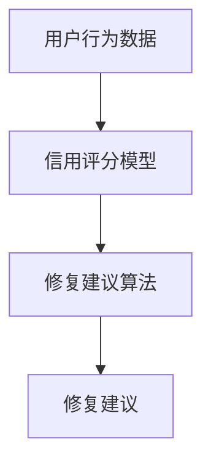
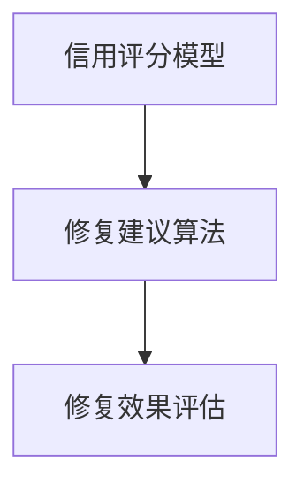
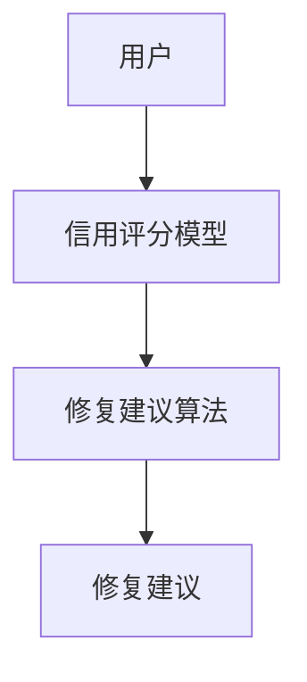
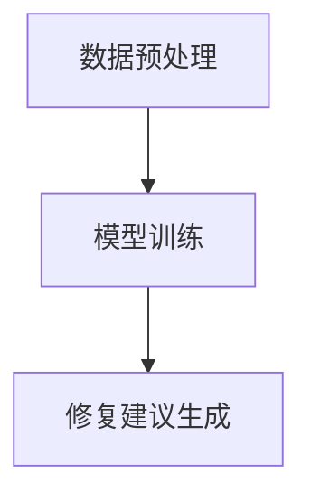
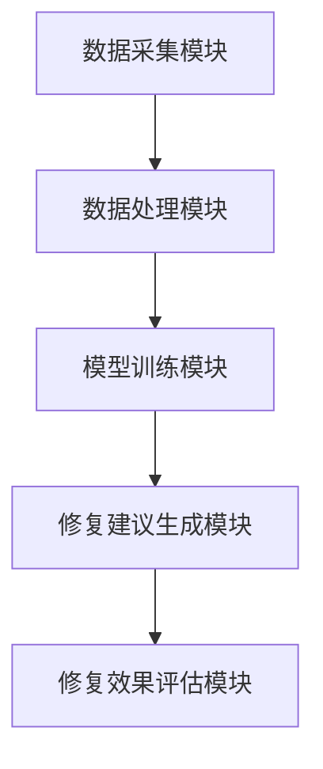
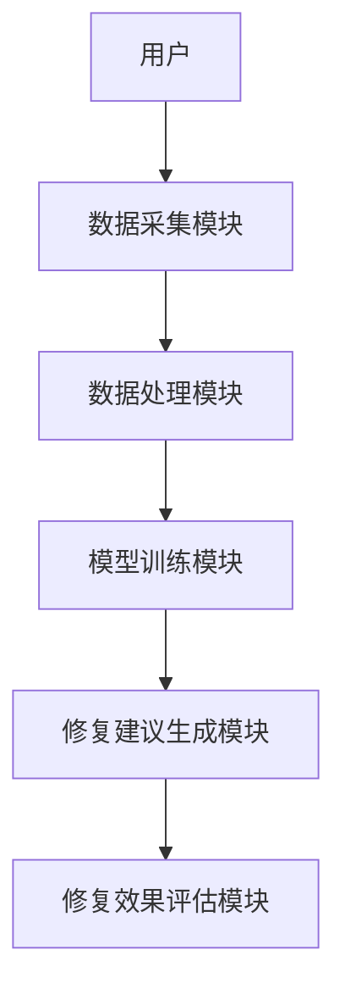

                 


# 智能个人信用修复建议系统

> 关键词：人工智能、信用修复、信用评估、机器学习、系统设计

> 摘要：随着信用评分在金融领域的日益重要性，个人信用修复的需求也在不断增加。传统的信用修复方法依赖于人工分析和经验判断，效率低下且缺乏个性化。本篇文章将介绍一种基于人工智能的智能个人信用修复建议系统，通过机器学习算法和数据分析技术，为用户提供个性化、高效的信用修复建议。文章将从系统背景、核心概念、算法原理、系统架构到项目实战进行详细阐述，帮助读者全面理解该系统的实现和应用。

---

## 第一部分: 背景与概念

### 第1章: 背景介绍

#### 1.1 问题背景

##### 1.1.1 个人信用评估的重要性
在现代社会，信用评分已成为个人和企业金融活动的重要指标。无论是申请贷款、信用卡还是其他金融服务，信用评分都直接影响到能否获得服务以及服务的利率或额度。然而，信用评分并非一成不变，个人的行为和财务状况的变化都会影响信用评分。

##### 1.1.2 传统信用修复的局限性
传统的信用修复方法主要依赖人工分析和经验判断。这种方式效率低下，且修复建议缺乏个性化，难以满足不同用户的多样化需求。此外，人工分析容易受到主观因素的影响，导致修复建议不够精准。

##### 1.1.3 智能信用修复的必要性
随着人工智能技术的快速发展，利用机器学习算法对信用数据进行自动化分析成为可能。智能信用修复系统可以通过对海量数据的深度学习，提供精准、个性化的修复建议，显著提高修复效率和效果。

#### 1.2 问题描述

##### 1.2.1 信用修复的核心问题
信用修复的核心问题是通过优化个人的信用行为，提升信用评分。这需要对个人的信用记录、财务状况和行为模式进行深入分析，找出影响信用评分的关键因素，并制定相应的修复策略。

##### 1.2.2 现有信用修复系统的不足
现有的信用修复系统大多依赖人工分析，修复建议缺乏个性化和科学性。此外，传统方法难以快速响应用户的信用变化，修复过程耗时长且效率低。

##### 1.2.3 智能信用修复的目标与意义
智能信用修复的目标是通过自动化分析和个性化建议，帮助用户快速、有效地提升信用评分。其意义在于提高信用修复的效率和精准度，降低用户的经济和时间成本。

#### 1.3 问题解决

##### 1.3.1 智能信用修复的核心思路
智能信用修复的核心思路是利用机器学习算法对用户的信用数据进行分析，识别影响信用评分的关键因素，并基于这些因素制定个性化的修复建议。

##### 1.3.2 数据驱动的信用修复方法
数据驱动的信用修复方法通过收集和分析用户的信用数据、财务数据和行为数据，利用大数据技术识别信用风险和修复机会。

##### 1.3.3 人工智能在信用修复中的应用
人工智能在信用修复中的应用主要体现在信用评分预测、修复策略优化和修复效果评估等方面。通过机器学习算法，系统可以自动识别信用风险，并提供个性化的修复建议。

#### 1.4 边界与外延

##### 1.4.1 智能信用修复的适用范围
智能信用修复系统适用于个人信用评估和修复，尤其适用于那些希望通过改善信用记录来提升信用评分的用户。

##### 1.4.2 与其他信用管理系统的区别
与其他信用管理系统相比，智能信用修复系统的独特之处在于其智能化和个性化。它利用人工智能技术提供实时、精准的修复建议，而不仅仅是基于规则的信用评估。

##### 1.4.3 系统的边界与限制
智能信用修复系统的边界主要在于其数据来源和应用场景。系统依赖于高质量的信用数据和用户行为数据，且修复建议的效果受到数据质量和模型算法的限制。

#### 1.5 概念结构与核心要素

##### 1.5.1 系统的核心概念框架
智能信用修复系统的核心概念包括信用评分模型、修复建议算法、用户行为分析和修复效果评估。

##### 1.5.2 核心要素的定义与关系
- **信用评分模型**：用于预测用户的信用评分，是系统的核心模块。
- **修复建议算法**：基于信用评分模型的输出，生成个性化的修复建议。
- **用户行为分析**：分析用户的信用行为，识别影响信用评分的关键因素。
- **修复效果评估**：评估修复建议的实施效果，优化修复策略。

##### 1.5.3 系统的模块划分
智能信用修复系统可以划分为数据采集、数据处理、模型训练、修复建议生成和效果评估五个模块。

---

## 第二部分: 核心概念与联系

### 第2章: 核心概念与原理

#### 2.1 系统核心概念

##### 2.1.1 信用评分模型
信用评分模型是智能信用修复系统的核心模块，负责预测用户的信用评分。常用的信用评分模型包括逻辑回归、决策树和随机森林等。

##### 2.1.2 修复建议算法
修复建议算法是基于信用评分模型的输出，生成个性化修复建议的模块。常用的修复建议算法包括基于规则的策略和基于机器学习的策略。

##### 2.1.3 用户行为分析
用户行为分析是通过分析用户的信用行为，识别影响信用评分的关键因素的模块。常用的用户行为分析方法包括聚类分析和关联规则挖掘。

#### 2.2 核心概念的联系

##### 2.2.1 数据流与系统模块的关系


##### 2.2.2 算法与数据的交互


##### 2.2.3 系统功能的协同作用
智能信用修复系统的功能模块协同工作，通过数据采集、分析和模型训练，生成个性化的修复建议，并通过修复效果评估不断优化修复策略。

#### 2.3 实体关系图

##### 2.3.1 实体关系图


---

## 第三部分: 算法原理与数学模型

### 第3章: 算法原理

#### 3.1 算法概述

##### 3.1.1 算法的基本思路
智能信用修复系统的核心算法包括信用评分预测算法和修复建议生成算法。信用评分预测算法用于预测用户的信用评分，修复建议生成算法基于评分预测结果，生成个性化的修复建议。

##### 3.1.2 算法的核心步骤
1. 数据预处理：对信用数据进行清洗、特征提取和数据增强。
2. 模型训练：使用机器学习算法训练信用评分预测模型。
3. 修复建议生成：基于模型预测结果，生成修复建议。

##### 3.1.3 算法的优化方向
- 提高模型的准确性和稳定性。
- 优化修复建议的生成策略，提高修复效果。

#### 3.2 算法流程图

##### 3.2.1 算法流程图


#### 3.3 算法实现代码

##### 3.3.1 信用评分预测模型
```python
import pandas as pd
from sklearn.model_selection import train_test_split
from sklearn.linear_model import LogisticRegression

# 数据预处理
data = pd.read_csv('credit_data.csv')
X = data.drop('credit_score', axis=1)
y = data['credit_score']

# 划分训练集和测试集
X_train, X_test, y_train, y_test = train_test_split(X, y, test_size=0.2, random_state=42)

# 训练逻辑回归模型
model = LogisticRegression()
model.fit(X_train, y_train)

# 模型预测
y_pred = model.predict(X_test)
```

##### 3.3.2 修复建议生成算法
```python
def generate_repair_advice(credit_score):
    if credit_score < 600:
        return "建议您优化信用记录，提高信用评分。"
    elif 600 <= credit_score < 700:
        return "信用评分良好，但仍需关注信用行为。"
    else:
        return "信用评分优秀，继续保持。"
```

#### 3.4 数学模型与公式

##### 3.4.1 信用评分预测模型
信用评分预测模型可以使用逻辑回归模型，其数学公式为：
$$ P(y=1) = \frac{e^{\beta_0 + \beta_1 x_1 + \beta_2 x_2 + \dots + \beta_n x_n}}{1 + e^{\beta_0 + \beta_1 x_1 + \beta_2 x_2 + \dots + \beta_n x_n}} $$

##### 3.4.2 修复建议生成策略
修复建议生成策略可以通过分类模型实现，例如使用决策树模型进行分类，根据信用评分的高低生成不同的修复建议。

---

## 第四部分: 系统分析与架构设计

### 第4章: 系统分析与架构设计

#### 4.1 系统功能设计

##### 4.1.1 功能模块划分
智能信用修复系统可以划分为数据采集模块、数据处理模块、模型训练模块、修复建议生成模块和修复效果评估模块。

##### 4.1.2 功能模块描述
- **数据采集模块**：负责采集用户的信用数据、财务数据和行为数据。
- **数据处理模块**：对采集的数据进行清洗、特征提取和数据增强。
- **模型训练模块**：使用机器学习算法训练信用评分预测模型。
- **修复建议生成模块**：基于模型预测结果，生成个性化的修复建议。
- **修复效果评估模块**：评估修复建议的实施效果，优化修复策略。

#### 4.2 系统架构设计

##### 4.2.1 系统架构图


#### 4.3 系统接口设计

##### 4.3.1 系统接口描述
- **数据接口**：用于与外部数据源交互，获取用户的信用数据。
- **模型接口**：用于与信用评分预测模型交互，获取信用评分预测结果。
- **修复建议接口**：用于生成和输出修复建议。

#### 4.4 系统交互流程图

##### 4.4.1 系统交互流程


---

## 第五部分: 项目实战

### 第5章: 项目实战

#### 5.1 环境安装

##### 5.1.1 环境要求
- Python 3.6+
- Scikit-learn
- Pandas
- Mermaid

##### 5.1.2 安装依赖
```bash
pip install scikit-learn pandas mermaid
```

#### 5.2 系统核心实现

##### 5.2.1 信用评分预测模型实现
```python
import pandas as pd
from sklearn.model_selection import train_test_split
from sklearn.linear_model import LogisticRegression

# 数据预处理
data = pd.read_csv('credit_data.csv')
X = data.drop('credit_score', axis=1)
y = data['credit_score']

# 划分训练集和测试集
X_train, X_test, y_train, y_test = train_test_split(X, y, test_size=0.2, random_state=42)

# 训练逻辑回归模型
model = LogisticRegression()
model.fit(X_train, y_train)

# 模型预测
y_pred = model.predict(X_test)
```

##### 5.2.2 修复建议生成算法实现
```python
def generate_repair_advice(credit_score):
    if credit_score < 600:
        return "建议您优化信用记录，提高信用评分。"
    elif 600 <= credit_score < 700:
        return "信用评分良好，但仍需关注信用行为。"
    else:
        return "信用评分优秀，继续保持。"
```

#### 5.3 实际案例分析

##### 5.3.1 案例描述
假设一位用户的信用评分为650分，系统会生成修复建议：“信用评分良好，但仍需关注信用行为。”

##### 5.3.2 案例分析
修复建议生成算法根据用户的信用评分，生成个性化的修复建议。修复效果评估模块会对修复建议的实施效果进行评估，并根据评估结果优化修复策略。

#### 5.4 项目小结

##### 5.4.1 项目总结
智能信用修复系统通过机器学习算法和大数据分析技术，为用户提供个性化、高效的信用修复建议。系统的核心模块包括数据采集、数据处理、模型训练、修复建议生成和修复效果评估。

##### 5.4.2 项目意义
智能信用修复系统的应用可以显著提高信用修复的效率和效果，帮助用户快速提升信用评分，降低信用风险。

---

## 第六部分: 总结与展望

### 第6章: 总结与展望

#### 6.1 最佳实践 tips

##### 6.1.1 数据质量的重要性
在智能信用修复系统中，数据质量直接影响模型的准确性和修复建议的效果。因此，数据预处理和清洗是系统实现的关键步骤。

##### 6.1.2 模型优化的注意事项
模型优化需要结合实际业务需求，选择合适的模型和算法。同时，模型的解释性和可扩展性也是重要的考虑因素。

#### 6.2 小结

##### 6.2.1 系统总结
智能信用修复系统通过机器学习算法和大数据分析技术，为用户提供个性化、高效的信用修复建议。系统的核心模块包括数据采集、数据处理、模型训练、修复建议生成和修复效果评估。

##### 6.2.2 项目意义
智能信用修复系统的应用可以显著提高信用修复的效率和效果，帮助用户快速提升信用评分，降低信用风险。

#### 6.3 注意事项

##### 6.3.1 数据隐私与安全
在智能信用修复系统中，用户数据的隐私和安全是需要重点关注的问题。系统需要采取严格的数据加密和访问控制措施，确保用户数据的安全。

##### 6.3.2 系统的可扩展性
系统的可扩展性是智能信用修复系统设计的重要考虑因素。随着数据量和用户规模的增加，系统需要具备良好的扩展性，以满足业务需求。

#### 6.4 拓展阅读

##### 6.4.1 推荐书籍
- 《机器学习实战》
- 《Python机器学习》
- 《信用评分模型与应用》

##### 6.4.2 推荐博客
- [机器学习博客](https://example.com/ml-blog)
- [信用评分技术博客](https://example.com/credit-score-blog)

---

# 结语

智能个人信用修复建议系统通过人工智能技术，为用户提供高效、个性化的信用修复建议。本文详细介绍了系统的背景、核心概念、算法原理、系统架构和项目实战。希望读者通过本文能够深入了解智能信用修复系统的实现和应用，为实际业务提供参考和借鉴。

