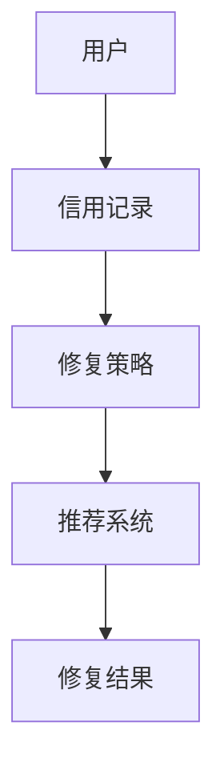
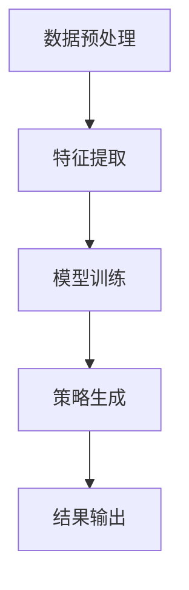
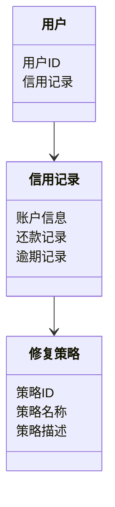
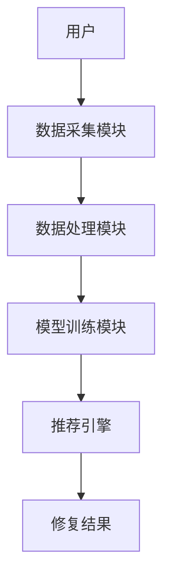
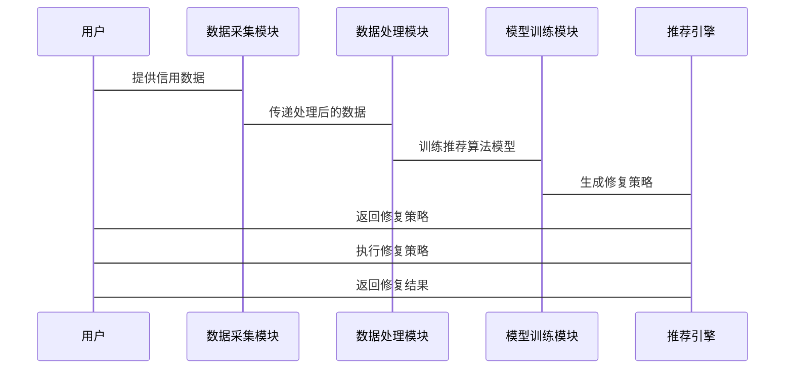

                 


# 智能个人信用修复策略推荐系统

## 关键词：智能信用修复、推荐系统、人工智能、信用评估、策略优化

## 摘要：本文探讨了如何利用人工智能技术设计智能个人信用修复推荐系统，通过分析个人信用数据，采用推荐算法生成最优修复策略，并实时监控修复效果，帮助个人优化信用记录。

---

## 第1章: 智能个人信用修复策略推荐系统背景介绍

### 1.1 信用修复的背景与意义

#### 1.1.1 信用修复的背景
在现代社会中，信用记录已成为个人和企业的核心资产之一。良好的信用记录能够帮助个人获得贷款、信用卡和其他金融服务，而不良信用记录则可能限制个人的金融活动。随着金融业务的普及，个人信用修复的需求日益增加。

#### 1.1.2 信用修复的重要性
信用修复不仅仅是解决当前的信用问题，更是为了未来更好地获得金融服务和信用额度。传统的信用修复方法通常依赖人工操作，效率低下且难以应对复杂的信用问题。因此，引入智能技术来优化信用修复过程显得尤为重要。

#### 1.1.3 智能修复的必要性
人工智能技术的发展为信用修复带来了新的可能性。通过智能算法，可以快速分析大量信用数据，找出最优的修复策略，从而提高修复效率和效果。

---

### 1.2 问题描述与目标

#### 1.2.1 个人信用修复的常见问题
- 信用数据分散，难以整合和分析。
- 修复策略缺乏个性化，难以满足不同用户的需求。
- 修复过程耗时长，用户体验差。

#### 1.2.2 智能修复的目标
- 实现信用数据的自动化整合和分析。
- 根据用户具体情况推荐最优修复策略。
- 提供实时信用评估和修复效果监控。

#### 1.2.3 边界与外延
- 本系统专注于个人信用修复，不涉及企业信用。
- 系统仅提供修复策略推荐，不直接操作用户的信用记录。

---

### 1.3 核心概念与系统架构

#### 1.3.1 核心概念
- **数据驱动**：系统通过收集和分析用户的信用数据，生成修复建议。
- **个性化推荐**：根据用户的信用状况和行为习惯，推荐最优修复策略。
- **实时评估**：系统实时监控信用修复进展，并动态调整修复策略。

#### 1.3.2 系统架构简述
- 数据采集模块：收集用户的信用数据。
- 数据处理模块：对数据进行清洗和预处理。
- 模型训练模块：基于处理后的数据，训练推荐算法模型。
- 推荐引擎：根据模型输出修复策略，并实时监控修复效果。

---

## 第2章: 智能个人信用修复策略推荐系统的核心概念

### 2.1 核心概念原理

#### 2.1.1 数据驱动的修复策略
系统通过收集用户的信用数据，包括贷款记录、信用卡使用情况等，分析数据中的规律，找出影响信用评分的关键因素。

#### 2.1.2 个性化推荐算法
系统根据用户的信用状况和行为习惯，推荐适合的修复策略。例如，对于信用评分较低的用户，系统可能会推荐优先偿还逾期贷款的策略。

#### 2.1.3 实时信用评估机制
系统实时监控用户的信用修复进展，根据最新的信用数据调整修复策略，确保修复过程的有效性。

---

### 2.2 核心概念对比分析

#### 2.2.1 数据驱动与传统修复方法对比
- 数据驱动方法：基于大量数据进行分析，能够发现传统方法难以察觉的修复机会。
- 传统方法：依赖人工经验，修复策略可能存在主观性和片面性。

#### 2.2.2 个性化推荐与通用修复策略对比
- 个性化推荐：根据用户具体情况推荐修复策略，提高修复效率。
- 通用修复策略：适用于所有用户，可能无法满足个性化需求。

#### 2.2.3 实时评估与定期评估对比
- 实时评估：能够及时发现修复过程中的问题，动态调整修复策略。
- 定期评估：只能在固定时间点评估修复效果，修复过程可能无法及时调整。

---

### 2.3 ER实体关系图



---

## 第3章: 智能个人信用修复策略推荐系统的算法原理

### 3.1 推荐算法概述

#### 3.1.1 协同过滤推荐
协同过滤是一种基于用户相似性推荐算法。通过分析用户的信用数据，找到与用户信用状况相似的其他用户，推荐他们常用的修复策略。

#### 3.1.2 基于内容的推荐
基于内容的推荐算法分析信用数据的特征，推荐与用户信用状况相关的修复策略。例如，如果用户的信用卡逾期率较高，系统可能会推荐优先偿还信用卡欠款的策略。

#### 3.1.3 混合推荐算法
混合推荐算法结合协同过滤和基于内容的推荐方法，利用两种方法的优势，提高推荐的准确性和多样性。

---

### 3.2 算法实现流程



---

### 3.3 数学模型与公式

#### 3.3.1 协同过滤模型
协同过滤的预测评分公式如下：
$$\text{预测评分} = \text{用户平均评分} + (\text{物品平均评分} - \text{全局平均评分})$$

#### 3.3.2 基于内容的推荐模型
基于内容的推荐模型通常使用向量空间模型（例如TF-IDF）来表示物品的特征向量，然后计算用户与物品之间的相似度。相似度计算公式如下：
$$\text{相似度} = \frac{\vec{u} \cdot \vec{i}}{|\vec{u}| \cdot |\vec{i}|}$$

---

## 第4章: 智能个人信用修复策略推荐系统的系统架构设计

### 4.1 问题场景介绍
系统需要解决个人信用修复过程中数据分散、修复策略单一、修复过程耗时长等问题。

### 4.2 项目介绍
本项目旨在开发一个智能信用修复推荐系统，帮助用户优化信用记录，提升信用评分。

### 4.3 系统功能设计

#### 4.3.1 领域模型


#### 4.3.2 系统架构


#### 4.3.3 系统接口设计
系统主要接口包括：
- 数据采集接口：用于收集用户的信用数据。
- 推荐接口：根据用户输入返回修复策略。
- 修复结果接口：返回修复策略的执行结果。

#### 4.3.4 系统交互


---

## 第5章: 项目实战

### 5.1 环境安装
需要安装以下工具和库：
- Python 3.8+
- Pandas
- Scikit-learn
- Mermaid
- Jupyter Notebook

### 5.2 核心代码实现

#### 5.2.1 数据预处理代码
```python
import pandas as pd

# 加载数据
data = pd.read_csv('credit_data.csv')

# 数据清洗
data.dropna()
data = data[~data.duplicated()]
```

#### 5.2.2 推荐算法实现
```python
from sklearn.metrics.pairwise import cosine_similarity

# 特征提取
X = data.drop('target', axis=1).values

# 计算相似度
similarity_matrix = cosine_similarity(X)
```

#### 5.2.3 模型训练代码
```python
from sklearn.model_selection import train_test_split
from sklearn.metrics import accuracy_score

# 划分数据集
X_train, X_test, y_train, y_test = train_test_split(X, data['target'], test_size=0.2)

# 训练模型
model = ...  # 具体模型实现
model.fit(X_train, y_train)

# 模型评估
print(accuracy_score(model.predict(X_test), y_test))
```

### 5.3 代码解读与分析
- 数据预处理代码用于清理和标准化数据，确保模型输入数据的质量。
- 推荐算法实现基于余弦相似度计算用户之间的相似性，为每个用户推荐相似用户的修复策略。
- 模型训练代码使用训练数据训练推荐模型，并在测试数据上评估模型性能。

### 5.4 案例分析
假设用户A的信用记录显示有多笔逾期贷款，系统会分析类似信用状况的其他用户，推荐优先偿还逾期贷款的策略，并实时监控修复进展，动态调整修复策略。

---

## 第6章: 总结与展望

### 6.1 项目小结
智能个人信用修复策略推荐系统通过整合信用数据、分析用户信用状况、推荐最优修复策略，有效提高了信用修复的效率和效果。

### 6.2 注意事项
- 数据隐私保护：系统需要严格保护用户的信用数据，防止数据泄露。
- 模型维护：定期更新模型，确保推荐策略的有效性。
- 用户教育：向用户解释推荐策略的依据，提高用户信任度。

### 6.3 拓展阅读
- 推荐阅读《推荐系统导论》（Introduction to Recommendation Systems）。
- 关注人工智能在金融领域的最新应用，如《人工智能与金融》（Artificial Intelligence in Finance）。

---

通过以上章节的内容，我们详细探讨了智能个人信用修复策略推荐系统的背景、核心概念、算法原理、系统架构设计和项目实战。希望本文能够为读者提供有价值的技术见解，并为实际应用提供参考。

