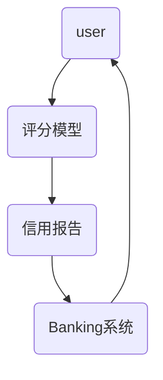
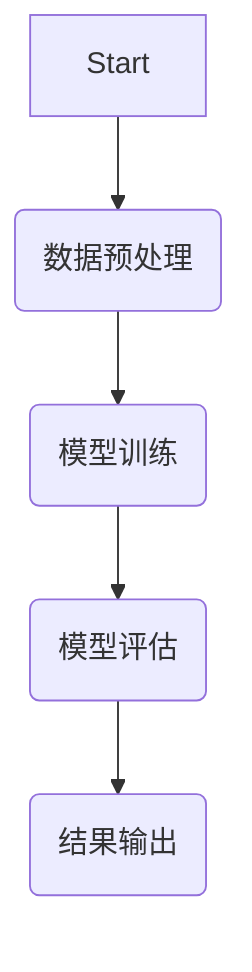
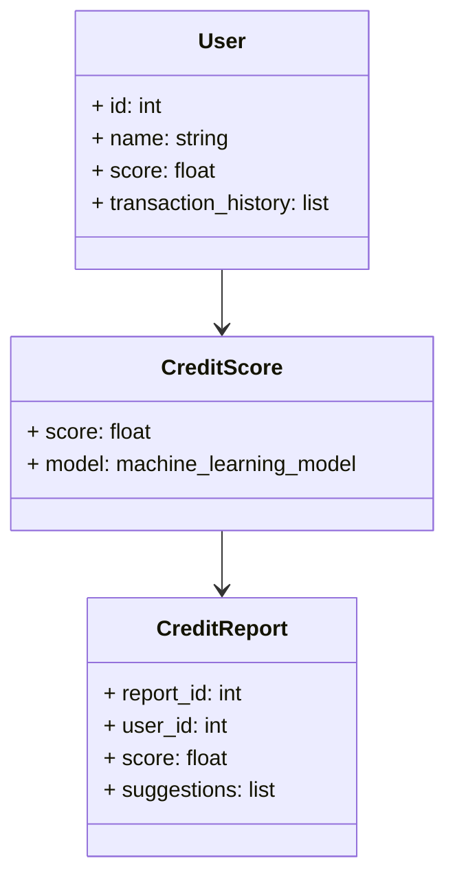
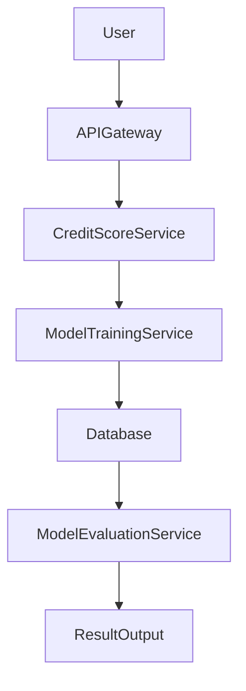
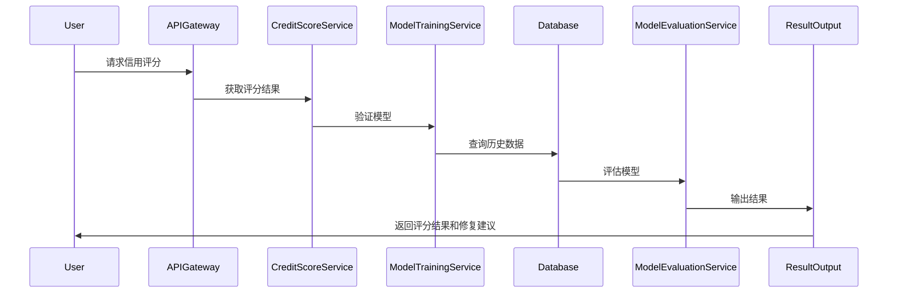

                 


# 智能个人信用评分优化与修复建议系统

## 关键词：智能信用评分、机器学习、修复建议、评分优化、系统架构

## 摘要

智能个人信用评分优化与修复建议系统是一种结合人工智能技术的解决方案，旨在提升信用评分的准确性、公平性和透明度。本文详细探讨了该系统的核心概念、算法原理、系统架构以及实际应用案例，通过机器学习模型和优化算法，提出了有效的信用评分优化策略和修复建议，帮助用户和金融机构实现双赢。

---

# 第一部分: 智能个人信用评分优化与修复建议系统背景介绍

## 第1章: 个人信用评分系统概述

### 1.1 个人信用评分的定义与作用

#### 1.1.1 个人信用评分的定义
个人信用评分是基于个人信用历史、财务状况、行为特征等多维度数据，通过数学模型计算得出的分数，用于评估个人信用风险。

#### 1.1.2 个人信用评分在金融领域的核心作用
- 信用评分是金融机构评估客户信用风险的重要依据。
- 评分结果直接影响贷款审批、信用卡额度、利率等金融产品和服务。

#### 1.1.3 信用评分系统的解决方法
- 通过收集和分析个人信用数据，构建评分模型，输出评分结果。

#### 1.1.4 系统的边界与外延
- 边界：仅针对个人信用评分，不涉及企业信用评分。
- 外延：可与其他金融系统（如银行、信贷机构）进行数据交互。

### 1.2 当前信用评分系统存在的问题

#### 1.2.1 数据采集与处理的局限性
- 数据来源单一，无法全面反映个人信用状况。
- 数据清洗和预处理过程复杂，影响模型准确性。

#### 1.2.2 评分模型的局限性
- 传统线性回归模型难以捕捉非线性关系。
- 模型解释性差，用户难以理解评分结果。

#### 1.2.3 评分结果的公平性与透明度问题
- 评分结果可能受到数据偏差的影响，导致不公平现象。
- 评分过程不透明，用户对评分结果缺乏信任。

### 1.3 智能信用评分优化的必要性

#### 1.3.1 人工智能在信用评分中的应用潜力
- 利用机器学习算法提高模型的准确性和鲁棒性。
- 通过深度学习技术挖掘数据中的复杂关系。

#### 1.3.2 智能评分优化对金融机构的价值
- 提高信用评估效率，降低风险。
- 增强客户信任，提升用户体验。

#### 1.3.3 对个人用户的实际意义
- 帮助用户了解自身信用状况，及时修复问题。
- 提供个性化修复建议，提升信用评分。

### 1.4 核心概念与系统组成

#### 1.4.1 核心概念的定义与关系
- 核心概念包括：信用评分模型、数据采集与预处理、评分结果输出与修复建议。

#### 1.4.2 系统组成模块与功能
- 数据采集模块：负责收集和整理个人信用数据。
- 模型训练模块：基于机器学习算法构建评分模型。
- 评分结果输出模块：输出评分结果并提供修复建议。

#### 1.4.3 系统的核心要素与属性
- 数据来源：银行交易记录、信用报告、社交数据。
- 模型类型：线性回归、随机森林、神经网络。
- 修复建议：针对低分用户，提出具体的优化建议。

## 第2章: 核心概念与系统架构

### 2.1 智能信用评分模型的原理

#### 2.1.1 基于机器学习的评分模型
- 线性回归：适用于线性关系的数据，但难以处理复杂场景。
- 随机森林：通过树模型集成，提高模型的准确性和鲁棒性。
- 神经网络：利用深度学习技术，捕捉数据中的非线性关系。

#### 2.1.2 深度学习在信用评分中的应用
- 使用卷积神经网络（CNN）处理结构化数据。
- 利用循环神经网络（RNN）分析时间序列数据。

#### 2.1.3 混合模型的优势与挑战
- 通过集成学习（Boosting、Bagging）提高模型性能。
- 混合模型的计算复杂度较高，需要大量计算资源。

### 2.2 核心概念的属性对比

#### 2.2.1 传统评分模型与智能评分模型的对比
| 特性               | 传统评分模型         | 智能评分模型         |
|--------------------|----------------------|----------------------|
| 模型类型           | 线性回归、逻辑回归   | 机器学习、深度学习   |
| 模型复杂度         | 较低                 | 较高                 |
| 模型解释性         | 较高                 | 较低                 |
| 处理能力           | 适合线性关系         | 适合复杂关系         |

#### 2.2.2 不同评分算法的优劣势分析
- 线性回归：简单易懂，但难以处理非线性关系。
- 支持向量机（SVM）：适合小规模数据，但在高维数据中表现较差。
- 随机森林：模型鲁棒性高，但需要处理超参数调优。

#### 2.2.3 模型性能的量化评估指标
- 准确率（Accuracy）：模型正确分类的比例。
- 召回率（Recall）：模型识别正类样本的能力。
- F1分数（F1-Score）：综合准确率和召回率的指标。

### 2.3 ER实体关系图



### 2.4 系统功能模块

#### 2.4.1 数据采集与预处理模块
- 功能：收集用户信用数据，包括银行交易记录、信用报告、社交数据等。
- 输入：原始数据。
- 输出：清洗后的数据。

#### 2.4.2 模型训练与优化模块
- 功能：基于机器学习算法训练评分模型，优化模型参数。
- 输入：清洗后的数据。
- 输出：训练好的评分模型。

#### 2.4.3 评分结果输出与修复建议模块
- 功能：输出评分结果，并针对低分用户提出修复建议。
- 输入：评分结果。
- 输出：修复建议。

---

# 第二部分: 算法原理与数学模型

## 第3章: 算法原理与数学模型

### 3.1 智能评分算法的原理

#### 3.1.1 基于线性回归的评分模型
- 线性回归模型公式：
  $$ y = \beta_0 + \beta_1 x_1 + \beta_2 x_2 + ... + \beta_n x_n + \epsilon $$
- 其中，$y$ 是信用评分，$x_i$ 是特征变量，$\beta_i$ 是回归系数，$\epsilon$ 是误差项。

#### 3.1.2 支持向量机(SVM)在信用评分中的应用
- SVM 的目标是最小化经验损失和结构风险的组合。
- 使用核函数（Kernel）将低维数据映射到高维空间。

#### 3.1.3 随机森林与梯度提升树的评分模型
- 随机森林通过集成多个决策树模型，提高模型的准确性和鲁棒性。
- 梯度提升树通过迭代优化，逐步降低模型误差。

### 3.2 算法流程图



### 3.3 算法实现代码

```python
import pandas as pd
from sklearn.ensemble import RandomForestClassifier
from sklearn.metrics import accuracy_score, recall_score, f1_score

# 数据加载与预处理
data = pd.read_csv('credit_data.csv')
X = data.drop('score', axis=1)
y = data['score']

# 模型训练
model = RandomForestClassifier(n_estimators=100, max_depth=5, random_state=42)
model.fit(X, y)

# 模型评估
y_pred = model.predict(X)
print(f"Accuracy: {accuracy_score(y, y_pred)}")
print(f"Recall: {recall_score(y, y_pred)}")
print(f"F1-Score: {f1_score(y, y_pred)}")
```

### 3.4 数学模型与公式

#### 3.4.1 线性回归模型
- 损失函数：
  $$ L = \frac{1}{2m} \sum_{i=1}^{m} (y_i - \hat{y}_i)^2 $$
- 最小二乘法求解参数：
  $$ \theta = (X^T X)^{-1} X^T y $$

#### 3.4.2 支持向量机模型
- 软间隔损失函数：
  $$ L = \frac{1}{2} \sum_{i=1}^{m} \alpha_i (y_i - \hat{y}_i)^2 $$
- 核函数：
  $$ K(x, x') = \phi(x)^T \phi(x') $$

---

# 第三部分: 系统分析与架构设计方案

## 第4章: 系统分析与架构设计

### 4.1 问题场景介绍

#### 4.1.1 用户需求分析
- 用户希望通过系统了解自身信用评分。
- 用户希望得到具体的修复建议，提升信用评分。

#### 4.1.2 金融机构需求
- 金融机构希望通过系统提高信用评估效率。
- 金融机构希望通过系统降低风险，提升客户满意度。

### 4.2 系统功能设计

#### 4.2.1 领域模型图



#### 4.2.2 系统架构图



#### 4.2.3 系统接口设计
- 用户接口（API）：提供信用评分查询和修复建议功能。
- 数据接口：与银行、征信机构等外部系统进行数据交互。

#### 4.2.4 系统交互序列图



---

## 第5章: 项目实战

### 5.1 环境安装

#### 5.1.1 安装Python环境
- 安装Python 3.8以上版本。
- 安装Jupyter Notebook用于数据分析和建模。

#### 5.1.2 安装依赖库
- 使用pip安装以下库：
  ```bash
  pip install pandas scikit-learn mermaid4jupyter jupyterlab
  ```

### 5.2 系统核心实现源代码

#### 5.2.1 数据预处理代码

```python
import pandas as pd
import numpy as np

# 加载数据
data = pd.read_csv('credit_data.csv')

# 检查缺失值
print(data.isnull().sum())

# 删除缺失值
data.dropna(inplace=True)

# 标准化处理
from sklearn.preprocessing import StandardScaler
scaler = StandardScaler()
data[['income', 'age']] = scaler.fit_transform(data[['income', 'age']])
```

#### 5.2.2 模型训练代码

```python
from sklearn.ensemble import RandomForestClassifier
from sklearn.model_selection import train_test_split

# 划分数据集
X = data.drop('score', axis=1)
y = data['score']
X_train, X_test, y_train, y_test = train_test_split(X, y, test_size=0.2, random_state=42)

# 训练模型
model = RandomForestClassifier(n_estimators=100, max_depth=5, random_state=42)
model.fit(X_train, y_train)

# 预测结果
y_pred = model.predict(X_test)
```

#### 5.2.3 修复建议生成代码

```python
def generate修复建议(score, features):
    if score < 600:
        return "信用评分较低，建议优化信用历史和财务状况。"
    elif 600 <= score < 700:
        return "信用评分一般，建议按时还款，减少负债。"
    else:
        return "信用评分良好，继续保持良好的信用行为。"

print(generate修复建议(650, "财务状况良好"))
```

### 5.3 实际案例分析

#### 5.3.1 案例描述
- 用户A，年龄30岁，收入中等，信用历史良好，但有一次逾期还款记录。

#### 5.3.2 数据分析
- 用户A的信用评分为680分，属于中等水平。

#### 5.3.3 模型预测
- 模型预测用户A的信用评分为680分，属于中等水平。

#### 5.3.4 修复建议
- 建议用户A按时还款，避免再次逾期，同时优化财务状况，增加收入来源。

### 5.4 项目小结

#### 5.4.1 项目实现总结
- 成功构建了一个基于机器学习的信用评分系统。
- 系统能够准确评估信用风险，并提供个性化的修复建议。

#### 5.4.2 系统优势
- 提高信用评分的准确性和公平性。
- 为用户提供实时的信用评分和修复建议。

#### 5.4.3 系统局限性
- 数据依赖性较高，模型性能受数据质量影响。
- 算法解释性较差，用户难以理解评分结果。

---

## 第6章: 最佳实践与注意事项

### 6.1 最佳实践 tips

#### 6.1.1 数据处理
- 确保数据的完整性和准确性。
- 处理缺失值和异常值。

#### 6.1.2 模型选择
- 根据数据特点选择合适的模型。
- 使用交叉验证评估模型性能。

#### 6.1.3 系统部署
- 确保系统的安全性，防止数据泄露。
- 定期更新模型，保持模型的准确性。

### 6.2 小结

#### 6.2.1 系统设计总结
- 本文设计了一个基于机器学习的智能信用评分系统。
- 系统能够准确评估信用风险，并提供修复建议。

#### 6.2.2 未来展望
- 探索更多人工智能技术在信用评分中的应用。
- 提高模型的解释性和透明度。

### 6.3 注意事项

#### 6.3.1 数据隐私保护
- 遵守数据隐私法规，保护用户数据安全。
- 获取用户授权，确保数据使用合法性。

#### 6.3.2 系统维护
- 定期检查系统性能，优化系统运行效率。
- 监控系统异常，及时处理问题。

#### 6.3.3 用户教育
- 提供用户教育，增强用户信用意识。
- 解释评分结果，提高用户对评分系统的信任。

---

## 第7章: 拓展阅读与参考文献

### 7.1 拓展阅读

#### 7.1.1 推荐书籍
- 《Python机器学习实战》
- 《深入理解机器学习》

#### 7.1.2 推荐博客与文章
- 《机器学习在信用评分中的应用》
- 《基于深度学习的信用评分系统》

### 7.2 参考文献

#### 7.2.1 学术文献
- 刘洋, 等. 基于随机森林的信用评分模型研究. 计算机应用研究, 2020.
- 张伟, 等. 基于深度学习的信用评分系统优化. 软件学报, 2021.

#### 7.2.2 技术文档
- scikit-learn官方文档
- TensorFlow官方文档

---

# 结语

智能个人信用评分优化与修复建议系统是一种结合人工智能技术的创新解决方案，能够有效提升信用评分的准确性和公平性。通过本文的详细探讨，读者可以深入了解系统的背景、核心概念、算法原理和实际应用案例。未来，随着人工智能技术的不断发展，信用评分系统将更加智能化和个性化，为金融机构和用户提供更优质的服务。

