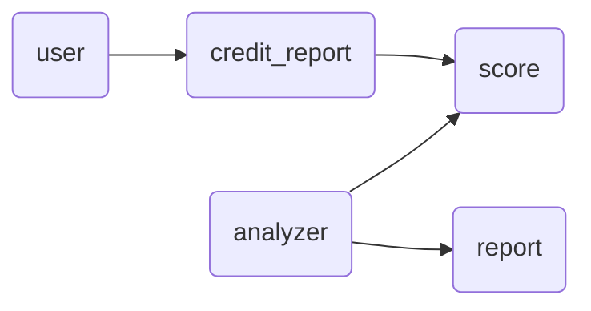
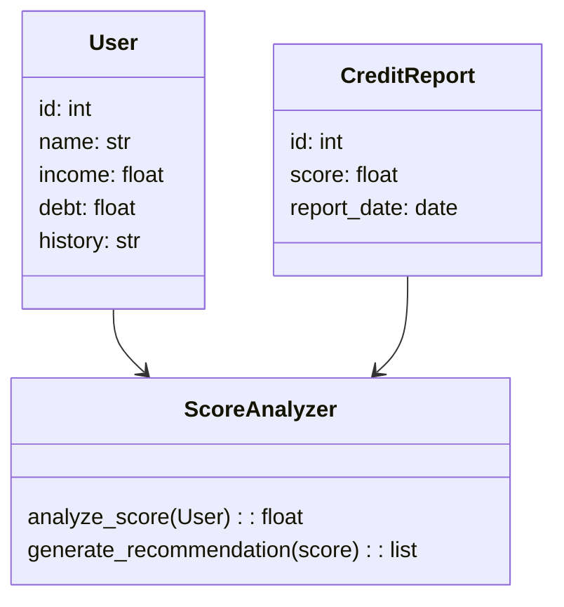

                 


# 智能个人信用评分优化建议系统

## 关键词：智能评分、信用评估、机器学习、系统优化、数据分析

## 摘要：  
本文详细探讨了智能个人信用评分优化建议系统的构建与优化。通过分析传统信用评分系统的局限性，提出了一种基于机器学习和大数据分析的智能评分方案。文章从系统背景、核心概念、算法原理、系统架构到项目实战进行了全面解析，并结合实际案例展示了系统的实现与优化过程。最终，本文总结了智能评分系统的优势与未来发展方向。

---

# 第一部分: 智能个人信用评分系统背景与问题分析

## 第1章: 个人信用评分系统背景与问题分析

### 1.1 个人信用评分的定义与作用

#### 1.1.1 信用评分的基本概念  
信用评分是金融机构对个人或企业的信用状况进行量化评估的一种方法。它是通过收集和分析相关数据，利用数学模型计算出一个分数，用以衡量个体的信用风险。信用评分越高，表示个体的信用状况越好，违约风险越低。

#### 1.1.2 信用评分在金融领域的重要性  
信用评分在金融领域具有重要意义，主要体现在以下几个方面：  
1. **风险控制**：帮助金融机构识别高风险客户，降低坏账率。  
2. **决策支持**：为贷款审批、信用额度分配等决策提供依据。  
3. **市场扩展**：通过精准评估信用风险，帮助金融机构拓展更多客户。  

#### 1.1.3 信用评分对个人和机构的价值  
- 对个人：帮助个人建立良好的信用记录，提高获得信贷的机会。  
- 对机构：降低运营成本，提高信贷资产质量。  

### 1.2 当前信用评分系统的痛点

#### 1.2.1 传统信用评分的局限性  
传统信用评分系统主要依赖于历史借款记录、收入水平等有限的特征，存在以下问题：  
1. **数据维度不足**：难以覆盖非结构化数据（如社交数据、行为数据）的潜在价值。  
2. **模型简单**：传统评分模型（如线性回归）对复杂特征的捕捉能力有限。  
3. **可解释性差**：复杂的模型（如树模型）难以向用户解释评分结果的原因。  

#### 1.2.2 数据获取与处理的挑战  
1. 数据来源有限：传统评分系统主要依赖金融机构内部数据，难以获取外部数据（如社交数据、消费数据）以丰富特征维度。  
2. 数据质量差：数据可能存在缺失、噪声或偏差，影响模型性能。  

#### 1.2.3 评分模型的可解释性问题  
复杂的模型（如深度学习模型）虽然性能优越，但缺乏可解释性，导致金融机构在实际应用中难以信任和推广。  

### 1.3 智能优化的必要性与目标

#### 1.3.1 智能优化的核心目标  
智能优化的核心目标是通过引入机器学习、大数据分析等技术，提升信用评分的准确性、实时性和个性化。  

#### 1.3.2 智能优化带来的优势  
1. **提升准确性**：通过引入更多特征和复杂模型，提高评分的准确性。  
2. **增强实时性**：实时更新评分结果，反映用户的最新信用状况。  
3. **个性化服务**：根据用户行为和需求，提供个性化的评分优化建议。  

#### 1.3.3 优化后的信用评分系统价值  
智能评分系统不仅能够帮助金融机构更好地控制风险，还能为用户提供更精准的信贷服务，实现双赢。

---

## 第2章: 智能个人信用评分系统的核心概念

### 2.1 数据流图与系统架构

#### 2.1.1 数据流图  


#### 2.1.2 实体关系图  


### 2.2 核心概念对比

| 概念 | 特性 | 传统评分 | 智能评分 |
|------|------|----------|----------|
| 数据来源 | 是否支持非结构化数据 | 否 | 是 |
| 模型类型 | 是否支持深度学习 | 否 | 是 |
| 可解释性 | 是否易于解释 | 高 | 中等 |

---

## 第3章: 智能信用评分系统的算法原理

### 3.1 算法选择与优化


### 3.2 算法实现代码

```python
import pandas as pd
from sklearn.linear_model import LinearRegression

# 示例数据加载
data = pd.read_csv('credit_data.csv')

# 特征工程
X = data[['income', 'debt', 'history']]
y = data['score']

# 模型训练
model = LinearRegression()
model.fit(X, y)

# 预测评分
new_user = [[50000, 2000, 5]]
prediction = model.predict(new_user)
print(f"预测评分为：{int(prediction[0])}")
```

### 3.3 算法原理的数学模型

#### 线性回归模型
$$ y = \beta_0 + \beta_1x_1 + \beta_2x_2 + ... + \beta_nx_n $$  
其中，$y$ 是目标变量（信用评分），$\beta$ 是模型参数，$x$ 是特征变量。

---

## 第4章: 智能个人信用评分系统的系统分析与架构设计

### 4.1 问题场景介绍

#### 4.1.1 用户需求
- 用户希望获得实时、准确的信用评分。  
- 用户希望得到个性化的评分优化建议。  

#### 4.1.2 系统目标
- 实现信用评分的实时计算。  
- 提供评分优化建议，帮助用户提升信用评分。  

### 4.2 系统功能设计

#### 4.2.1 领域模型


### 4.3 系统架构设计

```mermaid
graph LR
    User --> API Gateway
    API Gateway --> Service1
    Service1 --> Database
    Service1 --> Service2
    Service2 --> Model
    Model --> Result
    Result --> API Gateway
    API Gateway --> Frontend
```

### 4.4 系统接口设计

#### 4.4.1 API 接口
- `POST /api/v1/score`：接收用户数据，返回信用评分。  
- `GET /api/v1/recommendation`：根据评分结果，返回优化建议。  

---

## 第5章: 项目实战

### 5.1 环境安装

```bash
pip install pandas scikit-learn mermaid4jupyter jupyterlab
```

### 5.2 系统核心实现

#### 5.2.1 数据预处理

```python
import pandas as pd

# 数据加载
data = pd.read_csv('credit_data.csv')

# 数据清洗
data.dropna(inplace=True)
data['income'].fillna(data['income'].mean(), inplace=True)
```

#### 5.2.2 特征工程

```python
from sklearn.preprocessing import StandardScaler

scaler = StandardScaler()
X_scaled = scaler.fit_transform(data[['income', 'debt', 'history']])
```

#### 5.2.3 模型训练

```python
from sklearn.model_selection import train_test_split
from sklearn.metrics import mean_absolute_error

X_train, X_test, y_train, y_test = train_test_split(X_scaled, data['score'], test_size=0.2)
model = LinearRegression()
model.fit(X_train, y_train)

# 模型评估
print(mean_absolute_error(y_test, model.predict(X_test)))
```

### 5.3 实际案例分析

#### 5.3.1 数据准备

```python
new_user = pd.DataFrame({
    'income': [50000],
    'debt': [2000],
    'history': [5]
})
```

#### 5.3.2 模型预测

```python
scaled_new_user = scaler.transform(new_user[['income', 'debt', 'history']])
prediction = model.predict(scaled_new_user)
print(f"预测评分为：{int(prediction[0])}")
```

### 5.4 项目小结

#### 5.4.1 成果总结
- 成功构建了一个智能信用评分系统。  
- 系统能够实时计算信用评分并提供优化建议。  

#### 5.4.2 经验总结
- 数据预处理是关键，特别是缺失值和异常值的处理。  
- 模型选择需要根据实际需求和数据特征进行调整。  

---

## 第6章: 最佳实践与小结

### 6.1 最佳实践

#### 6.1.1 数据采集与处理
- 尽可能获取多源数据，丰富特征维度。  
- 使用数据清洗技术，确保数据质量。  

#### 6.1.2 模型优化
- 使用交叉验证优化模型参数。  
- 尝试多种模型（如随机森林、梯度提升树）以提高性能。  

#### 6.1.3 系统部署
- 使用容器化技术（如Docker）部署系统，确保环境一致性。  
- 配置监控工具，实时监控系统性能。  

### 6.2 小结

通过本文的详细讲解，我们了解了智能个人信用评分优化建议系统的构建过程。从背景分析到算法实现，从系统设计到项目实战，每一步都至关重要。未来，随着技术的不断发展，智能评分系统将更加精准和个性化，为金融机构和用户提供更高效的服务。

### 6.3 注意事项

- 在实际应用中，需注意数据隐私保护，确保用户信息安全。  
- 模型的可解释性是金融机构关注的重点，需在模型选择和优化过程中予以重视。  

### 6.4 拓展阅读

- 《机器学习实战》  
- 《大数据分析与应用》  
- 《信用评分模型开发与应用》  

---

# 结语  
智能个人信用评分优化建议系统的建设是一个复杂而富有挑战性的任务，但也是一项极具价值的创新。通过本文的探讨，我们相信未来智能评分系统将为金融行业带来更大的变革和机遇。

