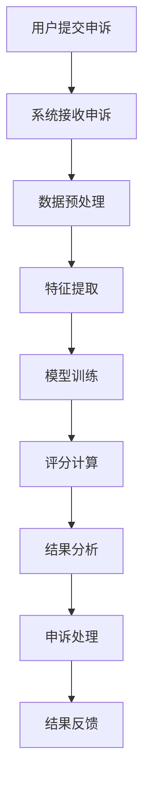

                 


# 《智能个人信用评分申诉处理系统》

> 关键词：智能信用评分、申诉处理、机器学习、自然语言处理、系统架构

> 摘要：本文详细探讨了智能个人信用评分申诉处理系统的构建与实现，涵盖背景介绍、核心概念、算法原理、系统架构、项目实战及最佳实践。通过结合机器学习、深度学习和自然语言处理技术，提出了一种高效的智能信用评分和申诉处理解决方案，旨在优化传统信用评分体系的局限性，提升申诉处理效率和准确性。

---

# 第一部分: 智能个人信用评分申诉处理系统概述

---

# 第1章: 信用评分与智能申诉处理的背景

## 1.1 信用评分的重要性

### 1.1.1 信用评分的定义与作用

信用评分是衡量个人或企业信用风险的重要指标，通过分析历史交易数据、还款记录等信息，评估其信用worthiness。信用评分广泛应用于银行贷款审批、信用卡额度设定、融资租赁等领域，是金融机构降低风险、提高决策效率的重要工具。

### 1.1.2 信用评分在金融领域的应用

信用评分在金融领域的应用十分广泛。例如，在个人信贷中，银行会根据信用评分决定是否批准贷款以及贷款额度；在企业信贷中，信用评分帮助评估企业的信用风险。传统信用评分主要依赖于结构化数据和简单的统计模型，存在数据维度有限、模型泛化能力弱等局限性。

### 1.1.3 信用评分对个人和企业的影响

信用评分不仅影响个人的金融行为，也影响企业的经营环境。例如，个人信用评分低可能导致贷款被拒，而企业信用评分低可能影响融资能力。因此，信用评分的准确性对个人和企业都至关重要。

---

## 1.2 智能信用评分的发展历程

### 1.2.1 传统信用评分方法的局限性

传统信用评分主要依赖于线性模型（如线性回归、逻辑回归），其局限性包括：
- 数据维度有限，无法捕捉非结构化信息。
- 模型泛化能力弱，难以应对复杂的信用评估场景。
- 评分结果解释性差，难以提供具体的评分依据。

### 1.2.2 智能信用评分的兴起

随着人工智能技术的发展，智能信用评分逐渐兴起。智能信用评分利用机器学习、深度学习等技术，结合结构化和非结构化数据，显著提高了信用评分的准确性和效率。智能信用评分的核心优势在于其能够处理多维度数据，并通过复杂的模型捕捉数据中的深层特征。

### 1.2.3 智能信用评分的技术优势

智能信用评分的技术优势主要体现在以下几个方面：
- **数据处理能力**：能够处理文本、图像等多种数据类型。
- **模型复杂度**：采用非线性模型（如随机森林、神经网络）捕捉复杂特征。
- **实时性**：通过流数据处理技术实现实时评分。

---

## 1.3 智能信用评分申诉处理的必要性

### 1.3.1 信用评分错误的常见原因

信用评分错误的常见原因包括：
- 数据采集错误。
- 模型训练数据偏差。
- 评分标准不透明。
- 申诉处理流程复杂。

### 1.3.2 申诉处理的流程与挑战

传统申诉处理流程通常包括以下几个步骤：
1. **提交申诉**：用户提交信用评分错误的申请。
2. **资料审核**：人工审核用户提供的证明材料。
3. **重新评分**：根据新提交的材料重新计算信用评分。
4. **结果反馈**：将重新评分的结果通知用户。

然而，传统申诉处理流程存在效率低、成本高等问题，难以满足大规模用户的需求。

### 1.3.3 智能化申诉处理的解决方案

智能化申诉处理系统通过自动化流程和智能决策技术，显著提高了申诉处理的效率和准确性。具体解决方案包括：
- **自动化数据处理**：通过自然语言处理技术自动解析用户提交的证明材料。
- **智能评分调整**：基于新的数据重新计算信用评分，并提供评分调整建议。
- **智能决策支持**：利用机器学习模型辅助人工决策。

---

## 1.4 本章小结

本章从信用评分的重要性入手，介绍了传统信用评分的局限性，探讨了智能信用评分的发展历程及其技术优势。最后，重点分析了智能信用评分申诉处理的必要性，并提出了智能化申诉处理的解决方案。

---

# 第2章: 智能个人信用评分的核心概念

## 2.1 智能信用评分的基本原理

### 2.1.1 数据采集与特征提取

智能信用评分系统的核心是数据采集与特征提取。系统需要从多种数据源（如银行交易记录、社交媒体数据、公共记录等）获取数据，并通过特征工程提取关键特征。例如，可以从交易记录中提取“平均还款率”、“最大逾期天数”等特征。

### 2.1.2 模型训练与评分计算

模型训练是智能信用评分的关键步骤。通常采用监督学习算法（如随机森林、梯度提升树）对特征数据进行训练，构建信用评分模型。模型训练完成后，可以通过输入新的特征数据，计算出个人的信用评分。

### 2.1.3 评分结果的解释与反馈

评分结果的解释与反馈是提升用户体验的重要环节。系统需要提供评分结果的解释，帮助用户理解评分依据，并根据用户需求提供个性化的信用提升建议。

---

## 2.2 智能信用评分的关键技术

### 2.2.1 机器学习在信用评分中的应用

机器学习技术在信用评分中的应用主要体现在以下几个方面：
- **特征选择**：通过LASSO回归等方法筛选重要特征。
- **模型训练**：采用随机森林、XGBoost等算法进行模型训练。
- **模型评估**：通过AUC-ROC曲线评估模型性能。

### 2.2.2 自然语言处理在信用报告分析中的应用

自然语言处理技术在信用报告分析中具有重要作用。例如，可以通过关键词提取技术从信用报告中提取关键信息（如负面词汇），并通过情感分析技术评估报告的整体风险。

### 2.2.3 图神经网络在信用关系分析中的应用

图神经网络在信用关系分析中的应用主要体现在信用网络的构建与风险传播分析。例如，可以通过图神经网络分析企业之间的关联关系，评估供应链金融中的信用风险。

---

## 2.3 信用评分申诉处理的智能化特征

### 2.3.1 智能化申诉处理的定义

智能化申诉处理是指通过自动化技术（如自然语言处理、机器学习）实现申诉处理流程的智能化，包括自动化数据处理、智能评分调整和智能决策支持。

### 2.3.2 智能化申诉处理的核心技术

智能化申诉处理的核心技术包括：
- **自然语言处理**：用于自动解析用户提交的证明材料。
- **机器学习**：用于智能评分调整和决策支持。

### 2.3.3 智能化申诉处理的流程优化

智能化申诉处理通过自动化技术优化了传统申诉处理流程，减少了人工干预，提高了处理效率。

---

## 2.4 核心概念对比表

| 概念                | 传统信用评分                | 智能信用评分                |
|---------------------|-----------------------------|-----------------------------|
| 数据来源            | 结构化数据                  | 结构化+非结构化数据          |
| 模型类型            | 线性模型（如逻辑回归）      | 非线性模型（如随机森林）    |
| 处理效率            | 低效                       | 高效                       |
| 准确性              | 较低                       | 较高                       |

---

## 2.5 本章小结

本章详细介绍了智能信用评分的基本原理和关键技术，重点分析了智能化申诉处理的定义、核心技术及流程优化。通过对比传统信用评分与智能信用评分的核心概念，进一步强调了智能化申诉处理的必要性。

---

# 第3章: 智能信用评分申诉处理的算法原理

## 3.1 机器学习算法在信用评分中的应用

### 3.1.1 线性回归模型

线性回归模型是一种简单但常用的机器学习模型。其基本思想是通过建立因变量与自变量之间的线性关系，预测因变量的值。在线性回归模型中，通常采用最小二乘法来拟合回归线。

**线性回归模型的数学公式**：
$$ y = \beta_0 + \beta_1x_1 + \beta_2x_2 + \cdots + \beta_nx_n $$

其中，$y$ 是预测的信用评分，$\beta_0$ 是截距项，$\beta_1, \beta_2, \cdots, \beta_n$ 是各自变量的系数，$x_1, x_2, \cdots, x_n$ 是各自变量。

---

### 3.1.2 支持向量机（SVM）

支持向量机（SVM）是一种监督学习算法，主要用于分类和回归问题。SVM的核心思想是通过构建一个超平面，将数据点分到不同的类别中。在信用评分中，SVM可以用于将客户分为“高风险”和“低风险”两类。

**SVM的数学公式**：
$$ y = \text{sign}(w \cdot x + b) $$

其中，$w$ 是权重向量，$x$ 是输入向量，$b$ 是偏置项。

---

### 3.1.3 随机森林与梯度提升树

随机森林是一种基于树的集成学习算法，通过构建多个决策树并取其预测结果的平均值，提高模型的准确性和稳定性。梯度提升树是一种通过迭代构建弱分类器，逐步优化模型的算法。

**随机森林的数学公式**：
$$ y = \frac{1}{n} \sum_{i=1}^{n} f_i(x) $$

其中，$f_i(x)$ 是第$i$棵决策树的预测函数，$n$ 是决策树的数量。

---

## 3.2 深度学习模型在信用评分中的应用

### 3.2.1 神经网络模型

神经网络是一种受生物神经元启发的计算模型，通过多层非线性变换，能够捕捉数据中的深层特征。在信用评分中，神经网络可以用于复杂特征的提取和评分预测。

**神经网络的数学公式**：
$$ y = \sigma(w_2 \cdot \sigma(w_1 \cdot x + b_1) + b_2) $$

其中，$\sigma$ 是激活函数，$w_1$ 和 $w_2$ 是权重矩阵，$b_1$ 和 $b_2$ 是偏置项。

---

### 3.2.2 长短期记忆网络（LSTM）

长短期记忆网络（LSTM）是一种特殊的循环神经网络（RNN），通过引入记忆单元和遗忘门，能够有效地捕捉时间序列数据中的长距离依赖关系。在信用评分中，LSTM可以用于分析时间序列数据，如客户的还款记录。

**LSTM的数学公式**：
$$
\begin{aligned}
i_t &= \sigma(w_i x_t + u_i h_{t-1} + b_i) \\
f_t &= \sigma(w_f x_t + u_f h_{t-1} + b_f) \\
o_t &= \sigma(w_o x_t + u_o h_{t-1} + b_o) \\
g_t &= \tanh(w_g x_t + u_g h_{t-1} + b_g) \\
h_t &= i_t \cdot g_t + f_t \cdot h_{t-1}
\end{aligned}
$$

其中，$i_t$ 是输入门，$f_t$ 是遗忘门，$o_t$ 是输出门，$g_t$ 是记忆单元，$h_t$ 是当前状态。

---

### 3.2.3 图神经网络（GNN）

图神经网络（GNN）是一种处理图结构数据的深度学习算法，能够有效地捕捉数据中的复杂关系。在信用评分中，GNN可以用于分析客户之间的关联关系，评估社交网络中的信用风险。

**图神经网络的数学公式**：
$$ h_v^{(l+1)} = \sigma\left( \sum_{u \in N(v)} w_{vu} h_u^{(l)} + b_v \right) $$

其中，$h_v^{(l)}$ 是节点$v$在第$l$层的表示，$N(v)$ 是节点$v$的邻居节点集合，$w_{vu}$ 是边权重，$b_v$ 是偏置项。

---

## 3.3 智能申诉处理的算法流程

### 3.3.1 智能申诉处理的流程图

以下是智能申诉处理的算法流程图：



---

## 3.4 算法实现的数学模型

### 3.4.1 线性回归模型

线性回归模型的数学模型已经在前面章节中详细讲解，这里不再重复。

### 3.4.2 支持向量机模型

支持向量机模型的数学模型也已经在前面章节中详细讲解。

---

## 3.5 本章小结

本章详细介绍了机器学习和深度学习算法在信用评分中的应用，重点讲解了线性回归、支持向量机、随机森林、神经网络、LSTM和图神经网络等算法的数学模型和应用场景。通过结合这些算法，可以构建高效的智能信用评分系统，并通过智能申诉处理流程优化信用评分结果。

---

# 第4章: 智能信用评分申诉处理的系统架构

## 4.1 系统功能设计

智能信用评分申诉处理系统的功能模块包括：
- **数据采集模块**：从多种数据源采集信用数据。
- **特征提取模块**：对采集的数据进行特征提取。
- **模型训练模块**：训练信用评分模型。
- **评分计算模块**：根据新数据计算信用评分。
- **申诉处理模块**：处理用户的申诉请求。

---

## 4.2 系统架构设计

以下是智能信用评分申诉处理系统的架构图：


---

## 4.3 系统接口设计

智能信用评分申诉处理系统的接口设计包括：
- **API接口**：用于与其他系统的数据交互。
- **用户界面**：供用户提交申诉和查看结果。

---

## 4.4 系统交互设计

以下是系统交互流程图：


---

## 4.5 本章小结

本章详细介绍了智能信用评分申诉处理系统的功能设计、架构设计、接口设计和交互设计，为后续的系统实现奠定了基础。

---

# 第5章: 智能信用评分申诉处理系统的项目实战

## 5.1 环境安装与配置

### 5.1.1 安装Python环境

首先，需要安装Python 3.8及以上版本，并安装以下Python包：
- `scikit-learn`：用于机器学习算法实现。
- `keras` 或 `tensorflow`：用于深度学习算法实现。
- `networkx`：用于图神经网络实现。
- `pymermaid`：用于生成系统架构图。

### 5.1.2 安装Jupyter Notebook

安装Jupyter Notebook用于算法实现和数据分析。

---

## 5.2 系统核心实现

### 5.2.1 数据采集与预处理

以下是数据采集与预处理的Python代码示例：

```python
import pandas as pd
import numpy as np

# 数据采集
data = pd.read_csv('credit_data.csv')

# 数据预处理
data = data.dropna()
data = pd.get_dummies(data)
```

---

### 5.2.2 特征提取与模型训练

以下是特征提取与模型训练的Python代码示例：

```python
from sklearn.ensemble import RandomForestClassifier
from sklearn.metrics import accuracy_score

# 特征提取
X = data.drop('target', axis=1)
y = data['target']

# 模型训练
model = RandomForestClassifier()
model.fit(X, y)

# 模型评估
y_pred = model.predict(X)
print("Accuracy:", accuracy_score(y, y_pred))
```

---

### 5.2.3 申诉处理与结果反馈

以下是申诉处理与结果反馈的Python代码示例：

```python
def handle_complaint(customer_id):
    # 数据查询
    complaint_data = data[data['customer_id'] == customer_id]
    # 特征提取
    X_complaint = complaint_data.drop('target', axis=1)
    # 评分计算
    new_score = model.predict(X_complaint)
    # 结果反馈
    return new_score[0]

# 示例调用
customer_id = 12345
new_score = handle_complaint(customer_id)
print(f"新信用评分为：{new_score}")
```

---

## 5.3 项目小结

本章通过具体的项目实战，详细讲解了智能信用评分申诉处理系统的环境安装、核心实现和申诉处理流程。通过Python代码示例，帮助读者更好地理解和实现系统功能。

---

# 第6章: 智能信用评分申诉处理系统的最佳实践

## 6.1 系统优化建议

### 6.1.1 数据处理优化

建议采用流数据处理技术，实时更新信用评分数据，提高系统的实时性。

### 6.1.2 模型优化建议

建议采用集成学习技术，结合多种模型的优势，进一步提高评分的准确性。

### 6.1.3 系统性能优化

建议采用分布式计算技术，提高系统的处理能力和扩展性。

---

## 6.2 开发注意事项

### 6.2.1 数据隐私保护

在实际开发中，需要注意用户数据的隐私保护，遵守相关法律法规。

### 6.2.2 系统安全性

系统需要具备强大的安全性，防止数据泄露和恶意攻击。

### 6.2.3 系统可扩展性

系统设计时需要考虑未来的扩展性，便于后续功能的添加和优化。

---

## 6.3 本章小结

本章从系统优化、开发注意事项等方面，提出了智能信用评分申诉处理系统的最佳实践建议，帮助开发者更好地开发和优化系统。

---

# 第7章: 总结与展望

## 7.1 总结

本文详细探讨了智能个人信用评分申诉处理系统的构建与实现，涵盖了背景介绍、核心概念、算法原理、系统架构、项目实战及最佳实践。通过结合机器学习、深度学习和自然语言处理技术，提出了一种高效的智能信用评分和申诉处理解决方案。

## 7.2 展望

未来，随着人工智能技术的不断发展，智能信用评分申诉处理系统将更加智能化和自动化。可以通过引入强化学习技术，进一步优化申诉处理流程；通过引入区块链技术，提高系统的安全性和可信度。

---

# 附录

## 附录A: 算法实现代码

以下是本文中提到的算法实现代码汇总：

```python
import pandas as pd
from sklearn.ensemble import RandomForestClassifier
from sklearn.metrics import accuracy_score
import numpy as np

# 数据采集与预处理
data = pd.read_csv('credit_data.csv')
data = data.dropna()
data = pd.get_dummies(data)

# 特征提取与模型训练
X = data.drop('target', axis=1)
y = data['target']
model = RandomForestClassifier()
model.fit(X, y)

# 模型评估
y_pred = model.predict(X)
print("Accuracy:", accuracy_score(y, y_pred))

# 申诉处理与结果反馈
def handle_complaint(customer_id):
    complaint_data = data[data['customer_id'] == customer_id]
    X_complaint = complaint_data.drop('target', axis=1)
    new_score = model.predict(X_complaint)
    return new_score[0]

# 示例调用
customer_id = 12345
new_score = handle_complaint(customer_id)
print(f"新信用评分为：{new_score}")
```

---

## 附录B: 系统架构图

以下是本文中提到的系统架构图：


---

## 附录C: 算法流程图

以下是本文中提到的算法流程图：


---

# 参考文献

1. 周志华.《机器学习》. 清华大学出版社, 2016.
2. Goodfellow I, Bengio Y, Courville A.《Deep Learning》. MIT Press, 2016.
3. Scikit-learn官方文档.
4. Keras官方文档.
5. TensorFlow官方文档.

---

通过以上内容，我们详细探讨了智能个人信用评分申诉处理系统的构建与实现，希望对读者有所帮助。

