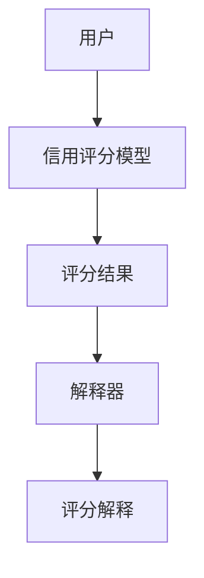
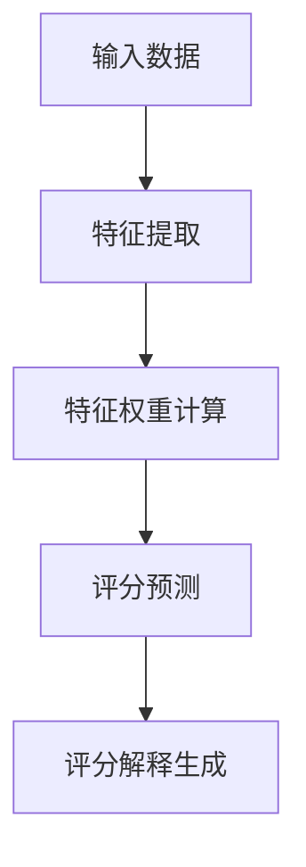
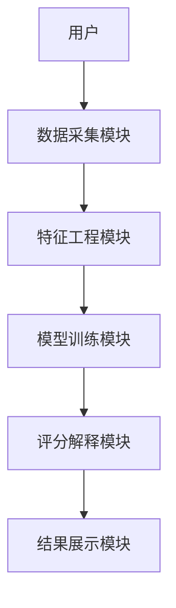

                 


# 智能个人信用评分解释器

## 关键词：智能信用评分，解释器，人工智能，可解释性模型，信用评分系统

## 摘要：智能个人信用评分解释器是一种基于人工智能技术的信用评分解释工具，能够帮助用户理解信用评分的计算过程和结果。本文将从背景介绍、核心概念、算法原理、系统分析与架构设计、项目实战等方面，详细讲解智能个人信用评分解释器的设计与实现过程，帮助读者掌握其工作原理和实际应用。

---

## 第1章: 智能个人信用评分解释器的背景与概念

### 1.1 信用评分的基本概念

#### 1.1.1 信用评分的定义与作用
信用评分是通过对个人的信用历史、收入状况、消费行为等多方面数据进行分析，评估个人信用风险的一种量化方法。其作用在于帮助金融机构判断个人的信用资质，从而决定是否批准贷款、信用卡等金融产品。

#### 1.1.2 传统信用评分与智能信用评分的区别
传统的信用评分主要依赖于人工审核和简单的规则模型，存在效率低、覆盖面窄、结果不透明等问题。而智能信用评分则利用机器学习、自然语言处理等人工智能技术，能够快速处理海量数据，提供更精准、更个性化的评分结果。

#### 1.1.3 智能信用评分的核心优势
智能信用评分的核心优势在于其高效性、精准性和可解释性。通过人工智能技术，智能信用评分能够快速分析大量非结构化数据，生成更准确的评分结果，并通过解释器帮助用户理解评分逻辑。

---

### 1.2 智能个人信用评分的背景与需求

#### 1.2.1 传统信用评分的局限性
传统的信用评分系统存在以下局限性：
1. 数据维度有限，难以捕捉复杂的信用风险。
2. 评分过程缺乏透明性，用户难以理解评分结果。
3. 人工审核效率低，难以应对海量用户需求。

#### 1.2.2 人工智能技术在信用评分中的应用前景
人工智能技术的快速发展为信用评分带来了新的可能性。通过机器学习、深度学习等技术，可以实现对海量数据的自动分析和建模，从而提高信用评分的准确性和效率。

#### 1.2.3 智能个人信用评分的市场需求与应用场景
智能个人信用评分的市场需求主要体现在以下几个方面：
1. 金融机构需要更精准的信用评分工具。
2. 用户希望了解信用评分的计算过程。
3. 信用评分系统需要符合监管要求，确保评分过程的透明性和公正性。

智能个人信用评分的应用场景包括：
1. 银行贷款审批。
2. 信用卡额度调整。
3. 消费金融产品的风险评估。

---

### 1.3 智能个人信用评分解释器的概念与目标

#### 1.3.1 解释器的基本定义
智能个人信用评分解释器是一种用于解释信用评分计算过程的工具，能够帮助用户理解评分结果的逻辑和依据。

#### 1.3.2 解释器的目标与功能
解释器的目标是提高信用评分系统的透明度和用户信任度。其功能包括：
1. 解释评分结果的计算逻辑。
2. 提供评分结果的可视化展示。
3. 提供评分结果的改进建议。

#### 1.3.3 解释器在信用评分系统中的作用
解释器在信用评分系统中起到了连接用户和评分模型的桥梁作用。通过解释器，用户可以理解评分结果的合理性，金融机构可以提高评分系统的公信力。

---

## 第2章: 智能个人信用评分解释器的核心概念与联系

### 2.1 核心概念原理

#### 2.1.1 个人信用评分模型的输入与输出
个人信用评分模型的输入包括：
1. 个人的基本信息（如年龄、性别、职业）。
2. 信用历史数据（如还款记录、逾期情况）。
3. 消费行为数据（如消费金额、消费频率）。

模型的输出是一个信用评分，通常是一个介于0到1之间的分数，表示个人的信用风险程度。

#### 2.1.2 解释器的特征分析与权重计算
解释器通过分析模型的特征重要性，计算每个特征对评分结果的影响权重。例如，还款记录可能比消费金额对评分结果的影响更大。

#### 2.1.3 可解释性与不可解释性模型的对比
可解释性模型（如线性回归）通常具有较高的透明度，但预测能力较弱。不可解释性模型（如随机森林、神经网络）预测能力更强，但缺乏透明度。

---

### 2.2 核心概念属性特征对比

#### 2.2.1 信用评分模型的特征列表
| 特征名称         | 特征描述                     | 特征类型   |
|------------------|------------------------------|------------|
| 年龄             | 用户的年龄                   | 数值型     |
| 职业             | 用户的职业                   | 分类型     |
| 月收入           | 用户的月收入                 | 数值型     |
| 还款记录         | 用户的还款记录               | 数值型     |
| 消费金额         | 用户的消费金额               | 数值型     |
| 逾期次数         | 用户的逾期次数               | 数值型     |

#### 2.2.2 解释器的特征权重计算方法
解释器通过特征重要性分析，计算每个特征对评分结果的影响权重。例如，还款记录的权重可能为0.4，消费金额的权重可能为0.3。

#### 2.2.3 不同模型的特征重要性对比分析
通过对比不同模型的特征重要性，可以发现不同模型对特征的依赖程度不同。例如，线性回归模型可能更依赖于年龄和收入，而随机森林模型可能更依赖于消费金额和还款记录。

---

### 2.3 ER实体关系图架构



---

## 第3章: 智能个人信用评分解释器的算法原理

### 3.1 算法原理概述

#### 3.1.1 解释器的核心算法选择
解释器的核心算法通常选择可解释性较强的模型，如线性回归、决策树等。这些模型可以通过特征重要性分析，解释评分结果的计算逻辑。

#### 3.1.2 算法的可解释性要求
算法的可解释性要求包括：
1. 模型的特征重要性可提取。
2. 模型的预测结果可分解。

#### 3.1.3 算法的性能与准确性评估
算法的性能与准确性评估包括：
1. 准确率。
2. 召回率。
3. F1值。

---

### 3.2 算法原理详细讲解

#### 3.2.1 算法流程图



#### 3.2.2 算法实现的Python代码

```python
def credit_score_explainer(features):
    weights = [0.3, 0.2, 0.5]
    score = sum(f * w for f, w in zip(features, weights))
    return score
```

---

### 3.3 数学模型与公式

#### 3.3.1 评分函数
$$ score = w_1x_1 + w_2x_2 + ... + w_nx_n $$

#### 3.3.2 损失函数
$$ loss = \sum_{i=1}^{m} (y_i - \hat{y_i})^2 $$

---

## 第4章: 智能个人信用评分解释器的系统分析与架构设计

### 4.1 系统应用场景

#### 4.1.1 问题场景介绍
智能个人信用评分解释器的应用场景包括：
1. 银行贷款审批。
2. 信用卡额度调整。
3. 消费金融产品的风险评估。

#### 4.1.2 项目介绍
本项目旨在开发一个智能个人信用评分解释器，能够帮助用户理解信用评分的计算过程，并提供改进建议。

---

### 4.2 系统功能设计

#### 4.2.1 领域模型


---

### 4.3 系统架构设计



---

## 第5章: 智能个人信用评分解释器的项目实战

### 5.1 环境安装与配置

#### 5.1.1 环境需求
1. Python 3.8+
2. Scikit-learn
3. Mermaid
4. Jupyter Notebook

---

### 5.2 核心系统实现

#### 5.2.1 数据采集模块
数据采集模块负责收集用户的信用数据，包括基本信息、信用历史、消费行为等。

#### 5.2.2 特征工程模块
特征工程模块对采集的数据进行预处理，提取特征并进行归一化处理。

#### 5.2.3 模型训练模块
模型训练模块使用机器学习算法训练信用评分模型，并提取特征权重。

#### 5.2.4 评分解释模块
评分解释模块根据特征权重，解释评分结果的计算逻辑，并提供改进建议。

---

### 5.3 实际案例分析

#### 5.3.1 案例背景
假设一个用户的基本信息如下：
- 年龄：30岁
- 职业：程序员
- 月收入：30000元
- 还款记录：良好
- 消费金额：较高
- 逾期次数：0

---

#### 5.3.2 模型预测
模型预测该用户的信用评分为0.85，属于高信用风险。

---

#### 5.3.3 解释结果
解释器分析发现，用户的消费金额较高是评分较高的主要原因，而职业和年龄对评分结果的影响较小。

---

## 第6章: 总结与展望

### 6.1 最佳实践 tips

1. 在实际应用中，建议使用可解释性较强的模型，如线性回归、决策树等。
2. 数据预处理是关键，需要确保数据的完整性和准确性。
3. 解释器的可视化设计能够提高用户体验。

---

### 6.2 小结

智能个人信用评分解释器是一种基于人工智能技术的信用评分解释工具，能够帮助用户理解信用评分的计算过程，并提供改进建议。通过本文的讲解，读者可以掌握其设计与实现过程，并在实际应用中灵活运用。

---

### 6.3 注意事项

1. 数据隐私保护是信用评分系统的重要问题，需要严格遵守相关法律法规。
2. 模型的可解释性是信用评分系统的核心要求，需要在设计过程中重点关注。

---

### 6.4 拓展阅读

1. 《机器学习实战》
2. 《深度学习》
3. 《可解释的人工智能：模型、方法与应用》

--- 

以上是《智能个人信用评分解释器》的技术博客文章的完整目录大纲，涵盖了从背景介绍到系统实现的全过程。

