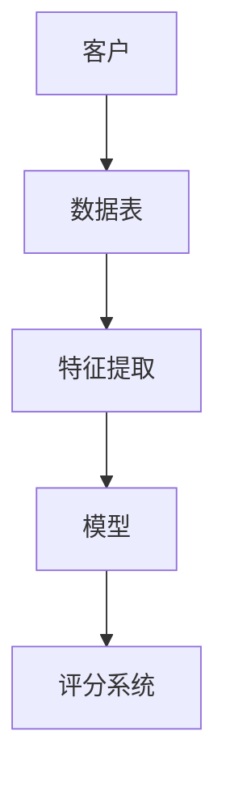
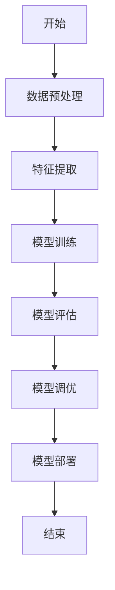
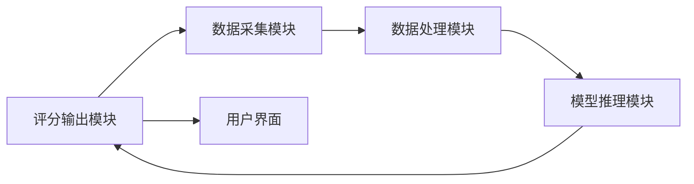

                 


# 智能个人信贷审批系统

## 关键词：智能信贷审批、机器学习、大数据处理、系统架构、NLP、评分模型、金融系统

## 摘要：智能个人信贷审批系统利用人工智能技术，通过机器学习、大数据分析和自然语言处理等手段，实现高效、精准的个人信贷审批。本文从背景、技术原理到系统实现，详细剖析智能信贷审批系统的构建过程，探讨其在金融领域的应用价值。

---

## 第1章：智能个人信贷审批系统背景与概念

### 1.1 传统信贷审批的痛点与挑战

传统信贷审批流程存在诸多问题，主要体现在以下几个方面：

1. **低效性**：人工审核流程繁琐，耗时较长，尤其是在处理大量申请时，效率低下。
2. **主观性**：审核人员的主观判断可能导致审批结果不一致，甚至出现人为错误。
3. **信息孤岛**：不同机构之间的数据难以共享，导致信息不对称，影响审核结果的准确性。
4. **风险控制不足**：传统方法难以捕捉复杂多变的信用风险，特别是在应对新兴金融欺诈手段时显得力不从心。

### 1.2 智能信贷审批的定义与优势

智能信贷审批系统利用人工智能技术，通过自动化处理和智能分析，显著提升了信贷审批的效率和准确性。其主要优势包括：

1. **高效性**：自动化处理申请，大幅缩短审批时间。
2. **准确性**：基于大量数据训练的模型能够更精准地评估信用风险。
3. **一致性**：系统化的审核标准确保了每份申请都得到公正对待。
4. **风险控制**：通过实时数据分析和模型优化，有效识别潜在风险。

### 1.3 智能信贷审批的边界与外延

智能信贷审批系统的边界主要限定在个人信贷领域，专注于个人信用评估和风险控制。其外延则包括与其他金融系统的集成，如征信系统、支付平台等，形成完整的金融生态系统。此外，系统还需要考虑数据隐私和安全问题，确保合规性。

### 1.4 智能信贷审批的核心要素

智能信贷审批系统的核心要素包括：

1. **数据来源**：系统需要整合结构化和非结构化的数据，如信用报告、社交数据、交易记录等。
2. **模型算法**：采用机器学习算法，如逻辑回归、随机森林等，构建信用评分模型。
3. **系统架构**：设计高效的系统架构，确保数据处理和模型推理的性能。

---

## 第2章：智能信贷审批的核心技术与原理

### 2.1 核心概念的原理

智能信贷审批系统的核心技术包括：

1. **机器学习模型**：用于信用评分和风险评估。
2. **大数据处理**：整合和分析多源数据。
3. **自然语言处理（NLP）**：处理非结构化数据，如社交评论。

### 2.2 核心概念的属性特征对比

| 概念       | 属性特征                       |
|------------|-------------------------------|
| 数据来源   | 结构化数据、非结构化数据       |
| 模型类型   | 监督学习、无监督学习           |
| 应用场景   | 风险评估、信用评分、欺诈检测   |

### 2.3 ER实体关系图



---

## 第3章：智能信贷审批的算法实现

### 3.1 基于机器学习的评分模型

#### 算法流程图



#### 代码实现

```python
import pandas as pd
from sklearn.model_selection import train_test_split
from sklearn.linear_model import LogisticRegression
from sklearn.metrics import accuracy_score

# 数据加载
data = pd.read_csv('credit_data.csv')

# 数据预处理
X = data.drop('target', axis=1)
y = data['target']

# 划分训练集和测试集
X_train, X_test, y_train, y_test = train_test_split(X, y, test_size=0.2)

# 模型训练
model = LogisticRegression()
model.fit(X_train, y_train)

# 模型预测
y_pred = model.predict(X_test)

# 模型评估
print('Accuracy:', accuracy_score(y_test, y_pred))
```

#### 数学模型

逻辑回归模型的损失函数为：
$$ L(\theta) = -\frac{1}{m} \sum_{i=1}^{m} [y_i \ln h(x_i) + (1 - y_i)\ln(1 - h(x_i))] $$
其中，$$ h(x_i) = \frac{e^{\theta^T x_i}}{1 + e^{\theta^T x_i}} $$

---

## 第4章：系统架构设计与实现

### 4.1 系统架构设计



### 4.2 系统实现

#### 4.2.1 环境配置

```bash
# 安装依赖
pip install pandas scikit-learn flask
```

#### 4.2.2 数据处理

```python
import pandas as pd
from sklearn.preprocessing import StandardScaler

# 加载数据
data = pd.read_csv('credit_data.csv')

# 特征工程
scaler = StandardScaler()
X_scaled = scaler.fit_transform(data.drop('target', axis=1))
```

#### 4.2.3 模型训练

```python
from sklearn.ensemble import RandomForestClassifier

# 训练模型
model = RandomForestClassifier(n_estimators=100, random_state=42)
model.fit(X_scaled, data['target'])
```

#### 4.2.4 API开发

```flask
from flask import Flask, request, jsonify

app = Flask(__name__)

@app.route('/api/credit_score', methods=['POST'])
def predict_credit_score():
    data = request.json
    # 处理数据
    prediction = model.predict(data)
    return jsonify({'credit_score': int(prediction[0])})
```

---

## 第5章：系统优化与扩展

### 5.1 性能优化

1. **模型优化**：使用超参数调优和特征选择提高模型准确率。
2. **分布式处理**：利用分布式计算框架处理大规模数据。

### 5.2 系统扩展

1. **多模型集成**：结合多种模型提升预测精度。
2. **实时处理**：实现流数据处理，支持实时信贷评估。

### 5.3 安全与合规

1. **数据隐私保护**：采用加密技术保护用户隐私。
2. **合规性检查**：确保系统符合相关金融法规。

---

## 第6章：总结与展望

### 6.1 总结

智能个人信贷审批系统通过结合人工智能和大数据技术，显著提升了信贷审批的效率和准确性。系统的设计与实现涵盖了数据处理、模型训练、系统架构等多个方面，展现了强大的技术实力。

### 6.2 展望

未来，随着人工智能技术的不断进步，智能信贷审批系统将更加智能化和个性化。可能的发展方向包括：

1. **联邦学习**：在保护数据隐私的前提下，联合多个机构共同训练模型。
2. **实时反馈机制**：根据实时数据动态调整信用评分。
3. **多模态数据处理**：整合更多类型的数据，如图像和视频，进一步提升模型的准确性。

---

## 第7章：最佳实践与注意事项

### 7.1 最佳实践

1. **数据质量**：确保数据的准确性和完整性。
2. **模型解释性**：选择可解释性强的模型，便于分析和优化。
3. **持续监控**：定期监控模型性能，及时进行调优和更新。

### 7.2 注意事项

1. **数据隐私**：严格遵守数据隐私保护法规。
2. **系统稳定性**：确保系统的高可用性和容错能力。
3. **模型鲁棒性**：设计鲁棒的模型，避免过拟合和欠拟合。

---

## 第8章：参考文献与拓展阅读

1. **书籍**：
   - 《机器学习实战》
   - 《数据挖掘导论》
2. **论文**：
   - “Credit Risk Assessment Using Machine Learning”
   - “Deep Learning for Financial Applications”
3. **在线资源**：
   - TensorFlow官方文档
   - Scikit-learn官方文档

---

通过以上内容，我们详细介绍了智能个人信贷审批系统的构建过程、技术原理和实际应用。希望本文能够为读者提供有价值的技术参考和启发。

