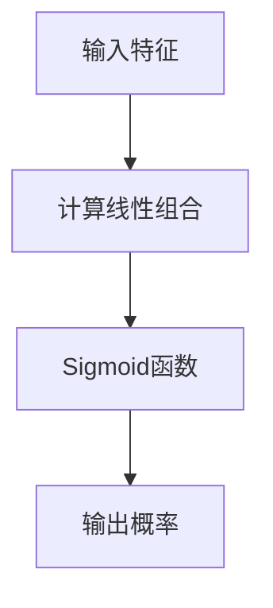
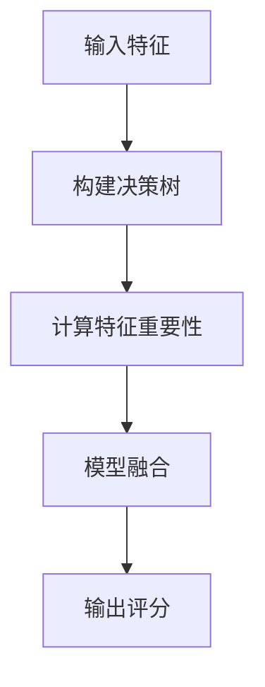
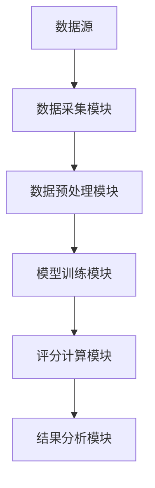
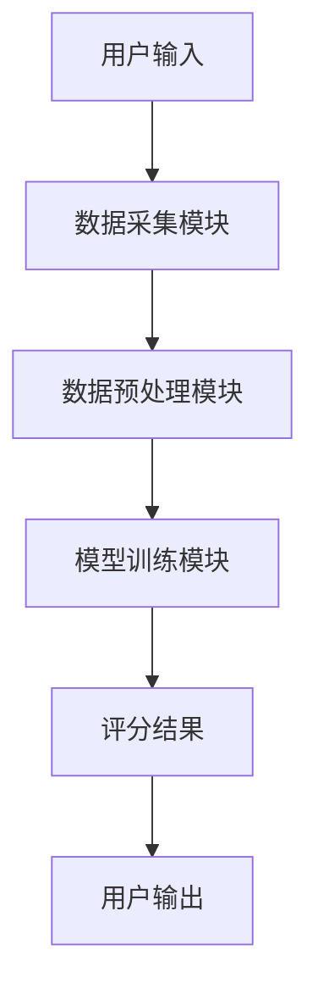

                 


# 《智能个人信贷评分卡优化》

## 关键词：智能评分卡、信贷评分、机器学习、优化算法、金融风控

## 摘要：本文深入探讨了智能个人信贷评分卡优化的核心概念、算法原理和系统设计。通过分析传统评分卡的局限性，结合人工智能和大数据技术，提出了基于逻辑回归和XGBoost的优化方法，并通过系统架构设计和项目实战展示了优化方案的实现过程。本文旨在为金融行业提供一种高效、智能的信贷评分优化方案。

---

# 第二部分: 智能个人信贷评分卡优化的核心概念与原理

## 第4章: 评分卡优化的算法原理

### 4.1 逻辑回归算法原理

#### 4.1.1 逻辑回归简介
逻辑回归是一种广泛应用于分类问题的算法，其核心思想是通过sigmoid函数将线性回归的结果映射到概率空间。

#### 4.1.2 逻辑回归的数学模型
$$ P(y=1|x) = \frac{1}{1 + e^{-\beta x}} $$
其中，$\beta$ 是模型参数，$x$ 是输入特征。

#### 4.1.3 逻辑回归的工作流程


#### 4.1.4 逻辑回归在评分卡优化中的应用
通过将客户特征输入逻辑回归模型，计算客户违约的概率，从而生成评分。评分结果用于判断客户信用等级。

#### 4.1.5 逻辑回归的优缺点
- 优点：模型简单、易于解释、计算效率高。
- 缺点：对非线性关系的捕捉能力有限。

### 4.2 XGBoost算法原理

#### 4.2.1 XGBoost简介
XGBoost是一种基于树的集成算法，通过构建多个弱分类器（决策树）来提升模型性能。

#### 4.2.2 XGBoost的数学模型
$$ y = \sum_{i=1}^{n} \theta_i h_i(x) $$
其中，$\theta_i$ 是模型系数，$h_i(x)$ 是弱分类器。

#### 4.2.3 XGBoost的工作流程


#### 4.2.4 XGBoost在评分卡优化中的应用
通过构建多个决策树，对客户特征进行非线性拟合，生成更精准的评分结果。

#### 4.2.5 XGBoost的优缺点
- 优点：模型表达能力强、能够捕捉复杂特征关系。
- 缺点：模型复杂度高、解释性较差。

### 4.3 算法对比与选择

#### 4.3.1 逻辑回归与XGBoost的对比
| 特性 | 逻辑回归 | XGBoost |
|------|-----------|----------|
| 模型复杂度 | 低       | 高       |
| 解释性 | 高       | 低       |
| 性能 | 中等      | 高       |

#### 4.3.2 算法选择策略
- 数据特征线性关系为主：选择逻辑回归。
- 数据特征复杂且非线性关系为主：选择XGBoost。

---

## 第5章: 智能评分卡优化的系统分析与架构设计

### 5.1 系统分析

#### 5.1.1 项目背景
为了提高信贷评分的准确性和效率，我们需要构建一个基于机器学习的智能评分卡系统。

#### 5.1.2 项目目标
- 实现评分卡的智能优化。
- 提升评分结果的准确性。
- 实现系统的可扩展性和实时性。

### 5.2 系统架构设计

#### 5.2.1 系统功能模块
- 数据采集模块：负责采集客户数据。
- 数据预处理模块：对数据进行清洗和特征工程。
- 模型训练模块：基于逻辑回归和XGBoost训练评分模型。
- 评分计算模块：根据模型生成客户评分。
- 结果分析模块：对评分结果进行分析和优化。

#### 5.2.2 系统架构图


#### 5.2.3 系统交互流程


### 5.3 系统实现细节

#### 5.3.1 数据采集模块
- 数据来源：数据库、API接口。
- 数据格式：结构化数据。

#### 5.3.2 数据预处理模块
- 数据清洗：处理缺失值、异常值。
- 特征工程：特征选择、特征转换。

#### 5.3.3 模型训练模块
- 训练逻辑回归模型。
- 训练XGBoost模型。

#### 5.3.4 评分计算模块
- 基于训练好的模型生成评分。
- 根据评分结果生成信用等级。

---

## 第6章: 项目实战——智能评分卡优化的实现

### 6.1 环境安装与配置

#### 6.1.1 安装Python环境
```bash
python --version
pip install -r requirements.txt
```

#### 6.1.2 安装依赖库
```bash
pip install numpy
pip install pandas
pip install scikit-learn
pip install xgboost
```

### 6.2 核心代码实现

#### 6.2.1 数据加载与预处理
```python
import pandas as pd
import numpy as np

# 加载数据
data = pd.read_csv('credit.csv')

# 处理缺失值
data = data.dropna()

# 特征选择
features = ['income', 'debt', 'age']
target = 'default'

X = data[features]
y = data[target]
```

#### 6.2.2 模型训练
```python
from sklearn.linear_model import LogisticRegression
from xgboost import XGBClassifier

# 逻辑回归模型
lr_model = LogisticRegression()
lr_model.fit(X, y)

# XGBoost模型
xgb_model = XGBClassifier()
xgb_model.fit(X, y)
```

#### 6.2.3 模型预测与评估
```python
from sklearn.metrics import accuracy_score

# 逻辑回归预测
lr_pred = lr_model.predict(X)
lr_accuracy = accuracy_score(y, lr_pred)
print(f"Logistic Regression Accuracy: {lr_accuracy}")

# XGBoost预测
xgb_pred = xgb_model.predict(X)
xgb_accuracy = accuracy_score(y, xgb_pred)
print(f"XGBoost Accuracy: {xgb_accuracy}")
```

### 6.3 实际案例分析

#### 6.3.1 数据分析
- 输入特征：收入、负债、年龄。
- 目标变量：违约情况。

#### 6.3.2 模型优化
- 调整逻辑回归的正则化参数。
- 调整XGBoost的树深度和学习率。

### 6.4 代码实现与解读

#### 6.4.1 逻辑回归模型
- 训练逻辑回归模型，计算客户违约概率。
- 根据概率生成评分。

#### 6.4.2 XGBoost模型
- 构建决策树模型，捕捉复杂特征关系。
- 根据模型生成评分。

### 6.5 项目小结

#### 6.5.1 项目总结
通过本项目，我们实现了基于逻辑回归和XGBoost的智能评分卡优化，显著提高了评分的准确性。

#### 6.5.2 经验总结
- 数据预处理是关键。
- 模型选择需结合业务需求。
- 系统设计需注重可扩展性。

---

## 第7章: 智能个人信贷评分卡优化的最佳实践与小结

### 7.1 最佳实践

#### 7.1.1 数据质量控制
- 确保数据完整性。
- 处理异常值和缺失值。

#### 7.1.2 模型监控
- 定期监控模型性能。
- 及时更新模型参数。

### 7.2 注意事项

#### 7.2.1 模型解释性
- 选择合适的模型，平衡准确性和解释性。

#### 7.2.2 系统安全性
- 确保系统数据安全。
- 防止模型被攻击。

### 7.3 小结

#### 7.3.1 核心内容回顾
本文详细讲解了智能个人信贷评分卡优化的核心概念、算法原理和系统设计，通过项目实战展示了优化方案的实现过程。

#### 7.3.2 未来展望
- 结合更多机器学习算法。
- 探索实时评分的实现。

---

# 结语

智能个人信贷评分卡优化是一项复杂的系统工程，需要结合人工智能和大数据技术，通过深入分析和实践，才能实现评分的精准化和智能化。希望本文能为金融行业提供有价值的参考和启发。

--- 

如果需要进一步扩展或调整，请随时告诉我！

