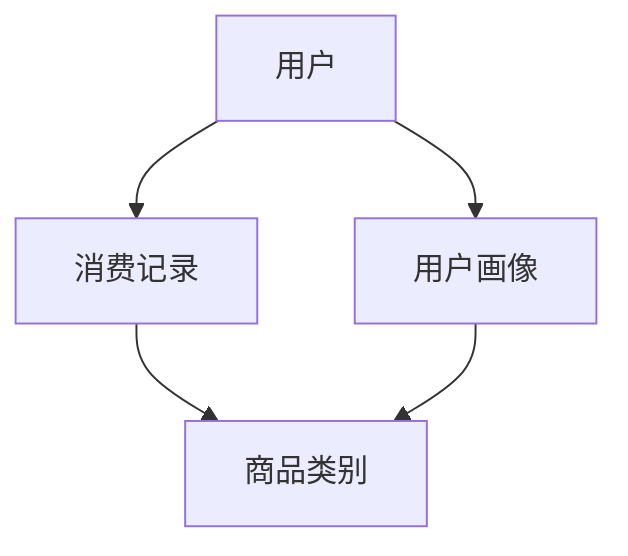
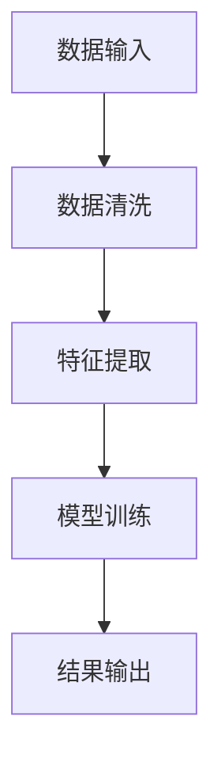
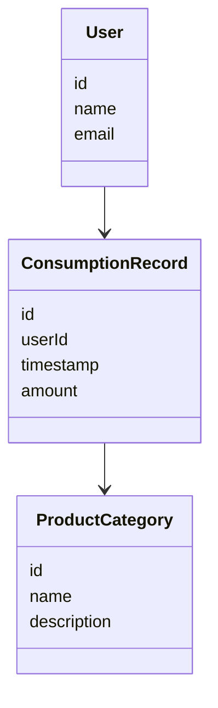
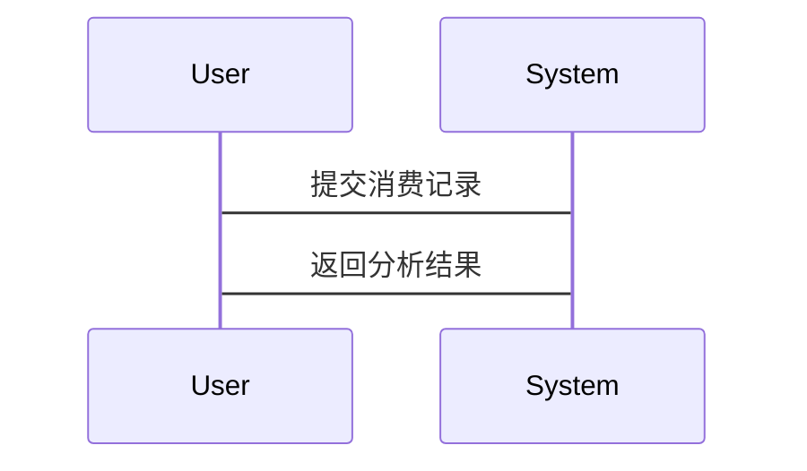

                 


# 智能个人消费模式分析器

## 关键词：
智能消费模式、数据分析、机器学习、行为预测、决策支持

## 摘要：
智能个人消费模式分析器是一种基于人工智能和大数据分析的工具，用于预测和优化个人消费行为。本文详细探讨了其核心概念、算法原理、系统架构以及实际应用，为读者提供从理论到实践的全面指导。

---

# 第1章 智能个人消费模式分析器的背景与概念

## 1.1 问题背景与描述

### 1.1.1 当前消费模式的演变
随着科技的发展，消费模式从传统的线下购物逐渐向线上转移，消费者行为变得更加复杂多样。智能设备的普及使得数据采集更加便捷，为分析个人消费行为提供了丰富的数据来源。

### 1.1.2 智能分析的必要性
传统的消费分析方法依赖于人工统计和简单的数据分析，难以应对海量数据和复杂场景。智能分析器通过机器学习和大数据技术，能够实时捕捉消费行为中的潜在规律，帮助消费者和商家做出更明智的决策。

### 1.1.3 核心问题与解决方法
分析器的核心问题在于如何从海量数据中提取有用的信息，并将其转化为可操作的决策建议。解决方法包括数据清洗、特征提取、模型训练和结果优化等步骤。

## 1.2 核心问题解决

### 1.2.1 数据采集与处理
智能分析器需要从多种渠道（如电商平台、社交媒体、移动应用）收集消费数据，并进行清洗和预处理，确保数据的准确性和完整性。

### 1.2.2 消费行为预测与优化
通过机器学习模型，分析器能够预测用户的消费倾向，并根据预测结果提出优化建议，如推荐适合的消费产品或调整消费预算。

### 1.2.3 智能决策支持
分析器提供实时的决策支持，帮助用户在复杂的消费环境中做出最优选择，同时为商家提供精准的市场分析和营销策略。

## 1.3 概念结构与核心要素

### 1.3.1 分析器的基本组成
智能分析器主要由数据采集模块、数据处理模块、模型训练模块和结果展示模块组成。

### 1.3.2 核心要素的定义与属性
- **用户数据**：包括用户的消费记录、浏览行为、购买偏好等。
- **行为分析模型**：用于识别用户的消费模式和偏好。
- **决策算法**：基于分析结果生成优化建议。

### 1.3.3 边界与外延
智能分析器的边界在于其数据来源和应用场景。外延则包括与其他系统的集成，如支付系统、推荐系统等。

---

# 第2章 智能个人消费模式分析器的核心概念与联系

## 2.1 核心概念原理

### 2.1.1 数据采集与预处理
数据采集是分析的第一步，需要确保数据的全面性和准确性。预处理步骤包括去重、补全和标准化。

### 2.1.2 消费行为分析模型
模型通过分析用户的消费记录，识别其消费习惯和偏好。常用的模型包括聚类分析和关联规则挖掘。

### 2.1.3 智能决策算法
基于分析结果，算法生成优化建议，如推荐产品或调整预算。

## 2.2 核心概念对比分析

### 2.2.1 数据来源对比
| 数据来源 | 优点 | 缺点 |
|----------|------|------|
| 电商平台 | 数据全面 | 数据量大，处理复杂 |
| 社交媒体 | 行为真实 | 数据分散，难以整合 |

### 2.2.2 分析模型对比
| 模型名称 | 适用场景 | 优缺点 |
|----------|----------|--------|
| 聚类分析 | 用户分群 | 易懂，但结果不够精确 |
| 关联规则挖掘 | 关联推荐 | 效果显著，但计算复杂 |

### 2.2.3 决策算法对比
| 算法名称 | 适用场景 | 优缺点 |
|----------|----------|--------|
| 基于规则的决策 | 简单场景 | 易实现，但灵活性差 |
| 机器学习算法 | 复杂场景 | 精度高，但需要大量数据 |

## 2.3 ER实体关系图



---

# 第3章 智能个人消费模式分析器的算法原理

## 3.1 算法原理概述

### 3.1.1 数据预处理
数据预处理是确保模型准确性的关键步骤，包括去重、补全和标准化。

### 3.1.2 模型训练
使用机器学习算法（如随机森林、支持向量机）对数据进行训练，提取特征并建立预测模型。

### 3.1.3 模型优化
通过交叉验证和网格搜索优化模型参数，提高预测精度。

## 3.2 算法流程图



## 3.3 算法实现代码

### 3.3.1 数据预处理
```python
import pandas as pd

def preprocess(data):
    # 删除重复记录
    data.drop_duplicates(inplace=True)
    # 填补缺失值
    data.fillna(method='ffill', inplace=True)
    # 标准化处理
    from sklearn.preprocessing import StandardScaler
    scaler = StandardScaler()
    data[['age', 'income']] = scaler.fit_transform(data[['age', 'income']])
    return data
```

### 3.3.2 模型训练
```python
from sklearn.ensemble import RandomForestClassifier
from sklearn.metrics import accuracy_score

def train_model(X_train, y_train, X_test, y_test):
    model = RandomForestClassifier(n_estimators=100, random_state=42)
    model.fit(X_train, y_train)
    y_pred = model.predict(X_test)
    print("Accuracy:", accuracy_score(y_test, y_pred))
    return model
```

### 3.3.3 模型优化
```python
from sklearn.model_selection import GridSearchCV

def optimize_model(model, X_train, y_train):
    param_grid = {'n_estimators': [100, 200], 'max_depth': [None, 5]}
    grid_search = GridSearchCV(model, param_grid, cv=5)
    grid_search.fit(X_train, y_train)
    best_model = grid_search.best_estimator_
    return best_model
```

## 3.4 数学模型与公式

### 3.4.1 数据预处理公式
$$ x' = \frac{x - \mu}{\sigma} $$
其中，$\mu$ 是均值，$\sigma$ 是标准差。

### 3.4.2 模型训练公式
随机森林算法的预测概率公式：
$$ P(y=1|x) = \sum_{i=1}^{n} w_i \cdot I(t_i(x)=1) $$
其中，$w_i$ 是每个决策树的权重，$t_i(x)$ 是决策树的预测结果。

---

# 第4章 智能个人消费模式分析器的系统分析与架构设计

## 4.1 系统功能设计

### 4.1.1 领域模型类图


### 4.1.2 系统架构设计


### 4.1.3 系统接口设计
- 数据接口：RESTful API，支持数据上传和查询。
- 用户接口：图形化界面，展示消费分析结果。

### 4.1.4 系统交互流程


---

# 第5章 智能个人消费模式分析器的项目实战

## 5.1 项目背景与目标

### 5.1.1 项目背景
以电商平台为例，分析用户的消费行为，优化营销策略。

## 5.2 核心代码实现

### 5.2.1 环境安装
```bash
pip install pandas scikit-learn matplotlib
```

### 5.2.2 数据预处理
```python
import pandas as pd

def load_data(file_path):
    data = pd.read_csv(file_path)
    return data

def preprocess_data(data):
    # 去重
    data.drop_duplicates(inplace=True)
    # 填补缺失值
    data['income'].fillna(data['income'].mean(), inplace=True)
    return data
```

### 5.2.3 模型训练
```python
from sklearn.model_selection import train_test_split
from sklearn.ensemble import RandomForestClassifier

def train_model(data):
    X = data[['age', 'income', 'purchase_count']]
    y = data['label']
    X_train, X_test, y_train, y_test = train_test_split(X, y, test_size=0.2, random_state=42)
    model = RandomForestClassifier(n_estimators=200)
    model.fit(X_train, y_train)
    return model, X_test, y_test
```

### 5.2.4 案例分析
以一个用户的消费数据为例，分析其消费偏好，并生成优化建议。

---

# 第6章 智能个人消费模式分析器的最佳实践与总结

## 6.1 核心要点总结

### 6.1.1 数据质量的重要性
数据的准确性和完整性直接影响分析结果的准确性。

### 6.1.2 模型选择与调优
选择合适的模型并进行充分的调优是提高预测精度的关键。

## 6.2 实践中的注意事项

### 6.2.1 数据隐私保护
在处理用户数据时，必须遵守相关法律法规，确保数据安全。

### 6.2.2 模型的泛化能力
避免过拟合，确保模型在不同场景下的适用性。

## 6.3 全文总结

智能个人消费模式分析器通过先进的数据分析和机器学习技术，能够帮助用户和商家更好地理解和优化消费行为。本文从理论到实践，详细探讨了其核心概念、算法原理和系统架构，为读者提供了全面的指导。

## 6.4 拓展阅读

建议进一步学习深度学习和联邦学习，以应对更复杂的数据分析场景。

---

通过以上步骤，我们可以系统地构建和实现智能个人消费模式分析器，为个人和商业应用提供强大的数据支持和决策建议。

