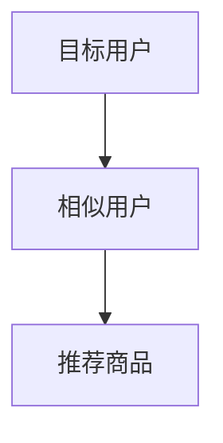
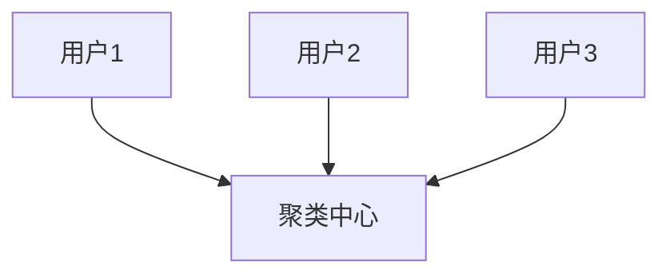
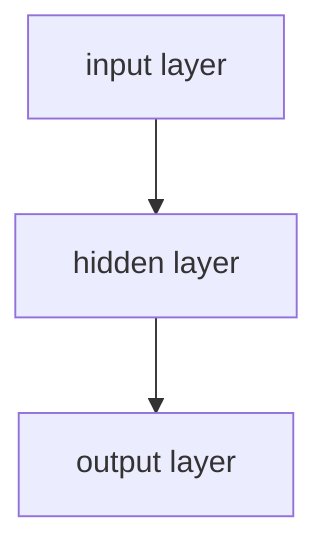
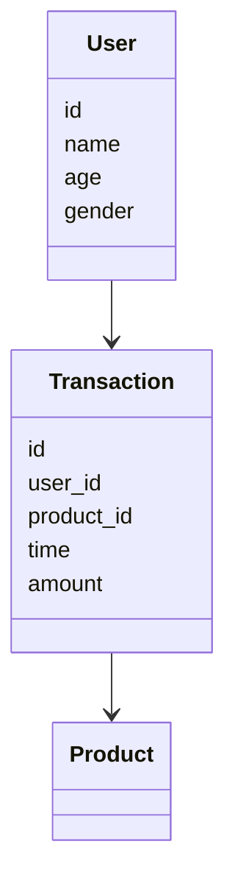
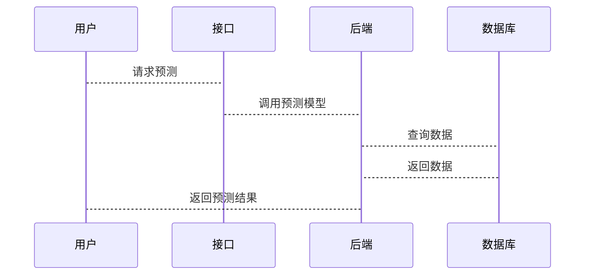

                 


# 智能个人消费行为分析与预测

> 关键词：智能消费行为分析、预测模型、机器学习、用户画像、推荐系统

> 摘要：本文从智能个人消费行为分析与预测的背景出发，结合实际案例，系统性地阐述了消费行为分析的核心概念、算法原理、系统架构设计以及项目实战。通过数据挖掘、机器学习等技术手段，详细讲解了如何构建智能消费行为分析与预测模型，并给出了系统的解决方案和实现步骤。文章最后总结了智能消费行为分析与预测的最佳实践和未来发展趋势。

---

# 第一部分: 智能个人消费行为分析与预测的背景与核心概念

## 第1章: 智能个人消费行为分析与预测的背景

### 1.1 问题背景

#### 1.1.1 从传统消费分析到智能预测的演进
传统消费行为分析依赖于统计学方法和人工经验，分析过程复杂且耗时。随着大数据和人工智能技术的发展，消费行为分析逐渐向智能化方向演进，通过机器学习算法实现对个人消费行为的精准预测。

#### 1.1.2 智能消费行为分析的重要性
在数字经济时代，企业需要通过精准的用户画像和行为预测来优化营销策略、提升用户体验。智能消费行为分析能够帮助企业更好地理解用户需求，从而制定更加精准的市场策略。

#### 1.1.3 当前消费行为分析的痛点与挑战
- 数据量大、维度复杂，传统分析方法效率低。
- 用户行为的动态变化使得模型需要不断更新和优化。
- 数据隐私和安全问题。

### 1.2 问题描述

#### 1.2.1 消费行为分析的核心问题
消费行为分析的核心问题是如何从海量数据中提取有用的信息，挖掘用户的消费偏好和行为模式。

#### 1.2.2 智能预测的目标与意义
智能预测的目标是通过机器学习算法，建立消费行为预测模型，预测用户的未来消费行为，帮助企业提前制定营销策略。

#### 1.2.3 数据驱动的消费行为分析与预测
数据驱动的方法能够从海量数据中提取规律，为消费行为分析提供科学依据。

### 1.3 问题解决

#### 1.3.1 数据挖掘与机器学习的应用
数据挖掘技术能够从海量数据中提取有用的信息，机器学习算法能够建立消费行为预测模型。

#### 1.3.2 智能算法在消费预测中的作用
智能算法能够通过历史数据，预测用户的未来消费行为，帮助企业制定精准的营销策略。

#### 1.3.3 技术与业务的结合
技术与业务的结合是消费行为分析与预测成功的关键。只有将技术手段与业务需求紧密结合，才能真正发挥技术的价值。

### 1.4 边界与外延

#### 1.4.1 消费行为分析的边界
消费行为分析的边界包括数据范围、时间范围和用户范围。

#### 1.4.2 智能预测的适用范围
智能预测适用于用户行为可量化的场景，如用户的消费频率、消费金额预测。

#### 1.4.3 与其他领域的区别与联系
消费行为分析与预测与其他领域的区别在于其专注于用户的消费行为，而与其他领域（如社交网络分析）有一定的联系，但侧重点不同。

### 1.5 概念结构与核心要素

#### 1.5.1 消费行为分析的层次结构
消费行为分析可以分为数据采集、数据分析、模型建立和结果应用四个层次。

#### 1.5.2 核心要素的定义与关系
核心要素包括用户数据、行为数据、消费数据和预测模型。这些要素相互关联，共同构成消费行为分析与预测的完整体系。

#### 1.5.3 智能预测的实现路径
智能预测的实现路径包括数据采集、数据预处理、模型训练、模型评估和模型部署。

---

## 第2章: 核心概念与联系

### 2.1 核心概念原理

#### 2.1.1 数据驱动的消费行为分析
数据驱动的消费行为分析通过收集和分析用户数据，挖掘用户的消费偏好和行为模式。

#### 2.1.2 智能预测的算法基础
智能预测的算法基础包括协同过滤、聚类分析和深度学习等算法。

#### 2.1.3 用户画像与行为建模
用户画像是通过用户数据构建的用户特征模型，行为建模是通过建模用户行为数据，预测用户的未来行为。

### 2.2 核心概念属性对比

| 概念       | 数据性 | 行为性 | 时间性 |
|------------|--------|--------|--------|
| 消费行为    | 高     | 高     | 高     |
| 智能预测    | 高     | 中     | 高     |

### 2.3 ER实体关系图

```mermaid
er
  User
  Product
  Transaction
  Time
  User --|> Transaction: 多对多
  Transaction --|> Product: 一对一
  Transaction --|> Time: 一对一
```

---

## 第3章: 算法原理

### 3.1 协同过滤算法

#### 3.1.1 协同过滤算法原理
协同过滤算法通过寻找与目标用户行为相似的用户，预测目标用户的消费行为。

#### 3.1.2 协同过滤算法实现



#### 3.1.3 协同过滤算法数学模型

$$ 相似度计算：similarity(u, v) = \frac{\sum_{i=1}^{n} (u_i - \bar{u})(v_i - \bar{v})}{\sqrt{\sum_{i=1}^{n} (u_i - \bar{u})^2} \sqrt{\sum_{i=1}^{n} (v_i - \bar{v})^2}} $$

---

### 3.2 聚类分析算法

#### 3.2.1 聚类分析算法原理
聚类分析算法通过将用户聚类，发现用户群体的消费行为特征。

#### 3.2.2 聚类分析算法实现



#### 3.2.3 聚类分析算法数学模型

$$ 聚类中心计算：center = \frac{1}{n} \sum_{i=1}^{n} x_i $$

---

### 3.3 深度学习模型

#### 3.3.1 深度学习模型原理
深度学习模型通过多层神经网络，学习用户的消费行为特征。

#### 3.3.2 深度学习模型实现



#### 3.3.3 深度学习模型数学模型

$$ 损失函数：L = \sum_{i=1}^{n} (y_i - \hat{y_i})^2 $$

---

## 第4章: 系统分析与架构设计

### 4.1 问题场景介绍

#### 4.1.1 系统目标
系统目标是构建一个智能消费行为分析与预测系统，实现用户消费行为的实时分析与预测。

#### 4.1.2 系统输入
系统输入包括用户数据、行为数据和消费数据。

#### 4.1.3 系统输出
系统输出包括用户画像、消费行为预测结果和推荐结果。

### 4.2 系统功能设计

#### 4.2.1 领域模型



#### 4.2.2 系统架构设计


#### 4.2.3 系统接口设计
系统接口包括数据接口、模型接口和结果接口。

#### 4.2.4 系统交互设计



---

## 第5章: 项目实战

### 5.1 环境安装

#### 5.1.1 安装Python
安装Python 3.x，建议使用Anaconda。

#### 5.1.2 安装依赖库
安装numpy、pandas、scikit-learn等依赖库。

### 5.2 系统核心实现

#### 5.2.1 数据预处理

```python
import pandas as pd

data = pd.read_csv('transaction.csv')
data.head()
```

#### 5.2.2 模型训练

```python
from sklearn.neighbors import NearestNeighbors

model = NearestNeighbors(n_neighbors=5)
model.fit(X)
```

#### 5.2.3 模型预测

```python
distances, indices = model.kneighbors(X_new)
```

### 5.3 实际案例分析

#### 5.3.1 案例背景
某电商平台希望通过分析用户的购买记录，预测用户的未来消费行为。

#### 5.3.2 数据分析

```python
data['amount'].describe()
```

#### 5.3.3 模型评估

```python
from sklearn.metrics import accuracy_score

accuracy_score(y_true, y_pred)
```

### 5.4 项目小结

#### 5.4.1 项目总结
通过本项目，我们实现了智能消费行为分析与预测系统，验证了协同过滤算法的有效性。

#### 5.4.2 项目经验
项目实施过程中，需要注意数据预处理和模型调优。

---

## 第6章: 总结与展望

### 6.1 最佳实践 tips

#### 6.1.1 数据预处理的重要性
数据预处理是模型训练的基础，直接影响模型的性能。

#### 6.1.2 模型调优的技巧
模型调优需要结合实际业务需求，选择合适的评估指标。

### 6.2 小结

通过本文的介绍，我们系统性地阐述了智能个人消费行为分析与预测的核心概念、算法原理、系统架构设计以及项目实战。通过实际案例分析，验证了消费行为分析与预测系统的可行性。

### 6.3 注意事项

#### 6.3.1 数据隐私问题
在实际应用中，需要注意数据隐私和安全问题。

#### 6.3.2 模型的实时性
智能预测需要考虑模型的实时性，确保模型能够及时更新。

### 6.4 拓展阅读

#### 6.4.1 推荐系统
推荐阅读《推荐系统实践》。

#### 6.4.2 深度学习
推荐阅读《深度学习》。

---

通过以上章节的详细介绍，我们希望能够为读者提供一个全面的智能个人消费行为分析与预测的系统性解决方案，帮助读者在实际应用中更好地理解和应用这些技术。

