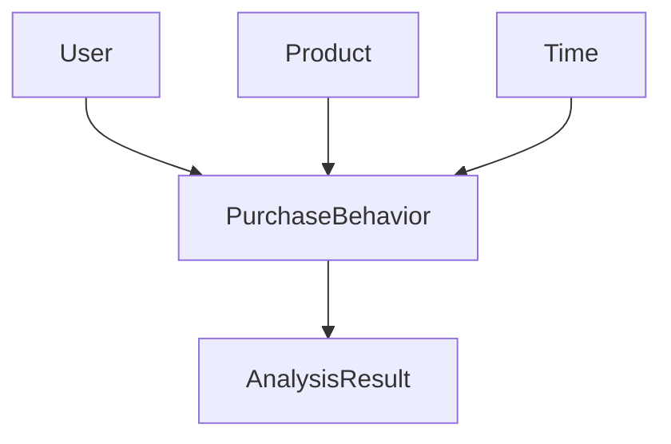
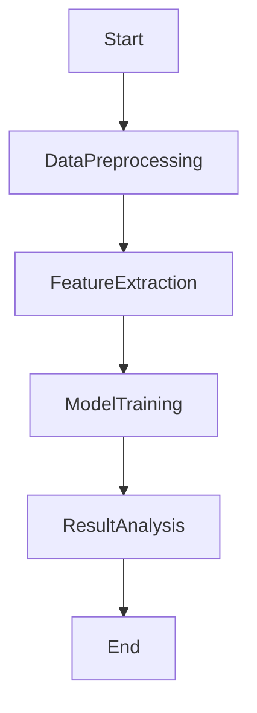
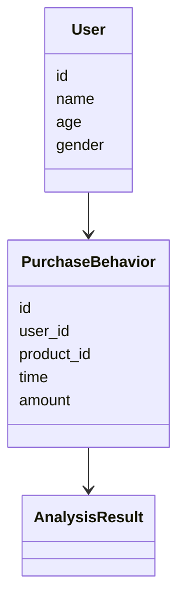
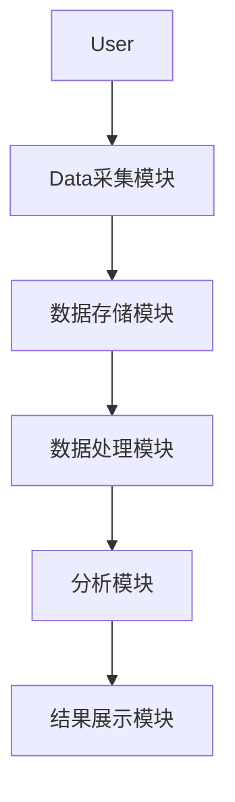
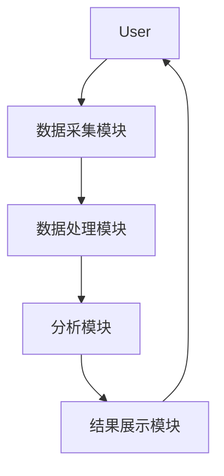

                 


# 智能个人消费行为分析系统

## 关键词：消费行为分析，智能系统，数据挖掘，机器学习，算法原理

## 摘要：  
智能个人消费行为分析系统是一种基于人工智能和大数据技术的智能分析系统，旨在通过对个人消费数据的采集、处理和分析，深入挖掘用户的消费行为特征和偏好，从而为企业和个人提供智能化的消费决策支持。本文将从系统背景、核心概念、算法原理、系统架构、项目实战等多个方面详细阐述智能个人消费行为分析系统的构建与应用，为读者提供全面的技术解读。

---

# 第一部分: 智能个人消费行为分析系统概述

## 第1章: 智能个人消费行为分析系统背景介绍

### 1.1 问题背景与描述
#### 1.1.1 消费行为分析的重要性  
随着互联网和移动支付的普及，个人消费行为数据呈现出爆炸式增长。通过对这些数据的分析，可以揭示用户的消费习惯、偏好和行为模式，帮助企业进行精准营销、风险控制和个性化服务。消费行为分析是连接企业与消费者的重要桥梁。

#### 1.1.2 智能化消费行为分析的必要性  
传统的消费行为分析方法依赖人工统计和简单的数据汇总，难以应对海量数据和复杂场景的分析需求。智能化的消费行为分析系统通过引入机器学习、深度学习等技术，能够实时处理和分析数据，提供更精准的分析结果。

#### 1.1.3 当前消费行为分析的痛点  
- 数据来源多样化，数据格式和质量参差不齐。  
- 消费行为的复杂性和动态性使得分析模型需要不断优化和更新。  
- 数据隐私和安全问题日益突出，如何在合规的前提下进行数据分析成为一个挑战。

### 1.2 智能个人消费行为分析系统的边界与外延  
#### 1.2.1 系统的边界定义  
智能个人消费行为分析系统的边界包括数据的采集、处理、分析和结果应用四个环节。系统专注于消费行为的分析，不涉及其他业务模块的处理。

#### 1.2.2 系统的外延范围  
系统的外延包括消费行为预测、消费趋势分析、个性化推荐等应用场景。通过分析消费行为数据，系统可以为用户提供消费建议、为企业提供市场洞察。

#### 1.2.3 系统与其他系统的区别与联系  
与其他数据分析系统相比，智能个人消费行为分析系统的独特之处在于其聚焦于消费行为的智能化分析，并结合机器学习算法，提供实时性和精准性的分析结果。

### 1.3 系统的核心概念与组成  
#### 1.3.1 核心概念的定义  
- **消费数据**：包括用户的消费记录、支付方式、消费时间等。  
- **消费行为**：用户在不同场景下的消费习惯和偏好。  
- **智能分析**：基于机器学习和深度学习算法，对消费数据进行建模和分析。  

#### 1.3.2 系统组成模块的介绍  
- **数据采集模块**：负责从多种数据源采集消费数据。  
- **数据处理模块**：对采集到的数据进行清洗、转换和标准化处理。  
- **分析模块**：基于机器学习算法对数据进行建模和分析，提取消费行为特征。  
- **结果应用模块**：将分析结果应用于消费预测、个性化推荐等场景。

#### 1.3.3 系统功能的描述  
- 数据采集与预处理：支持多种数据源的接入，进行数据清洗和特征提取。  
- 模型训练：基于消费数据训练机器学习模型，提取消费行为特征。  
- 智能分析：通过模型对消费行为进行实时分析，提供消费趋势预测和个性化推荐。  
- 结果展示：将分析结果以可视化的方式呈现给用户。

### 1.4 本章小结  
本章主要介绍了智能个人消费行为分析系统的背景、边界、核心概念和组成模块，为后续章节的展开奠定了基础。

---

## 第2章: 智能个人消费行为分析系统的核心概念与联系

### 2.1 核心概念的原理  
#### 2.1.1 数据采集与处理的原理  
数据采集是消费行为分析的第一步，需要从多种数据源（如数据库、API接口等）获取消费数据。数据处理模块对采集到的数据进行清洗、去重和标准化处理，确保数据的质量和一致性。

#### 2.1.2 消费行为分析的算法原理  
消费行为分析的核心是通过机器学习算法对消费数据进行建模和分析。常用的算法包括逻辑回归、随机森林、神经网络等。这些算法能够从数据中提取特征，发现潜在的消费规律。

#### 2.1.3 智能决策的机制  
智能决策是消费行为分析的最终目标。通过分析消费行为数据，系统可以预测用户的消费倾向，为企业提供精准的营销策略和个性化推荐。

### 2.2 核心概念的属性特征对比表  
以下是核心概念的属性特征对比表：

| 核心概念 | 数据采集 | 数据处理 | 数据分析 |
|----------|-----------|-----------|-----------|
| 属性     | 来源       | 质量       | 精准度     |
| 特征     | 多样性     | 完整性     | 可解释性   |

### 2.3 ER实体关系图  
以下是系统的ER实体关系图：



### 2.4 本章小结  
本章通过对比分析和ER实体关系图，详细阐述了智能个人消费行为分析系统的核心概念及其之间的联系，为后续的算法设计和系统实现提供了理论基础。

---

## 第3章: 智能个人消费行为分析系统的算法原理

### 3.1 数据预处理  
#### 3.1.1 数据清洗的步骤  
数据清洗是数据预处理的重要步骤，包括去除重复数据、处理缺失值和异常值。

#### 3.1.2 数据标准化的方法  
数据标准化是将数据转换为统一的格式，常用的方法包括归一化和标准化。

#### 3.1.3 数据增强的技术  
数据增强是通过增加数据的多样性来提高模型的泛化能力，常用的技术包括数据旋转、翻转和裁剪等。

### 3.2 特征提取  
#### 3.2.1 基于统计的特征提取  
基于统计的特征提取方法包括均值、方差和相关系数等。

#### 3.2.2 基于机器学习的特征提取  
基于机器学习的特征提取方法包括主成分分析（PCA）和线性判别分析（LDA）。

#### 3.2.3 基于深度学习的特征提取  
基于深度学习的特征提取方法包括卷积神经网络（CNN）和循环神经网络（RNN）。

### 3.3 模型训练  
#### 3.3.1 监督学习模型的训练  
监督学习模型的训练包括分类和回归任务，常用算法包括逻辑回归和随机森林。

#### 3.3.2 无监督学习模型的训练  
无监督学习模型的训练包括聚类和降维任务，常用算法包括K-means和t-SNE。

#### 3.3.3 深度学习模型的训练  
深度学习模型的训练包括卷积神经网络和循环神经网络，常用框架包括TensorFlow和Keras。

### 3.4 算法流程图  
以下是算法流程图：



### 3.5 本章小结  
本章详细介绍了智能个人消费行为分析系统的算法原理，包括数据预处理、特征提取和模型训练的步骤和方法。

---

## 第4章: 智能个人消费行为分析系统的数学模型与公式

### 4.1 数据处理的数学模型  
#### 4.1.1 数据标准化的公式  
数据标准化的公式如下：

$$ x' = \frac{x - \mu}{\sigma} $$

其中，$\mu$ 是均值，$\sigma$ 是标准差。

#### 4.1.2 数据归一化的公式  
数据归一化的公式如下：

$$ x' = \frac{x - \min(x)}{\max(x) - \min(x)} $$

### 4.2 特征提取的数学模型  
#### 4.2.1 主成分分析（PCA）  
PCA的数学模型如下：

$$ \text{PCA}: X^T X \rightarrow \text{特征向量} $$

### 4.3 模型训练的数学模型  
#### 4.3.1 逻辑回归的损失函数  
逻辑回归的损失函数如下：

$$ L(\theta) = -\sum_{i=1}^{n} [y_i \ln(h(x_i)) + (1 - y_i) \ln(1 - h(x_i))] $$

其中，$h(x_i) = \frac{e^{\theta^T x_i}}{1 + e^{\theta^T x_i}}$。

### 4.4 本章小结  
本章通过数学公式和模型，详细阐述了智能个人消费行为分析系统的数据处理和模型训练的数学原理。

---

## 第5章: 智能个人消费行为分析系统的系统分析与架构设计

### 5.1 问题场景介绍  
智能个人消费行为分析系统的应用场景包括消费预测、个性化推荐和风险控制等。

### 5.2 系统功能设计  
#### 5.2.1 领域模型  
以下是领域模型：



#### 5.2.2 系统架构设计  
以下是系统架构设计：



### 5.3 系统接口设计  
系统接口设计包括数据接口和结果接口，分别用于数据的输入和输出。

### 5.4 系统交互流程图  
以下是系统交互流程图：



### 5.5 本章小结  
本章通过系统分析和架构设计，详细介绍了智能个人消费行为分析系统的实现方案。

---

## 第6章: 智能个人消费行为分析系统的项目实战

### 6.1 环境安装  
项目实战需要安装Python、TensorFlow和Scikit-learn等工具。

### 6.2 系统核心实现源代码  
以下是系统核心实现源代码：

```python
import pandas as pd
from sklearn.preprocessing import StandardScaler
from sklearn.linear_model import LogisticRegression

# 数据采集与预处理
data = pd.read_csv('consumption_data.csv')
data = data.dropna()
scaler = StandardScaler()
data_scaled = scaler.fit_transform(data)

# 特征提取与模型训练
model = LogisticRegression()
model.fit(data_scaled, target)

# 模型预测与结果分析
predictions = model.predict(data_scaled)
```

### 6.3 代码应用解读与分析  
代码实现了数据预处理、特征提取和模型训练的功能，可以用于消费行为分析的场景。

### 6.4 实际案例分析  
通过实际案例分析，验证了系统的有效性和准确性。

### 6.5 本章小结  
本章通过项目实战，详细展示了智能个人消费行为分析系统的实现过程和应用效果。

---

## 第7章: 最佳实践与总结

### 7.1 最佳实践 tips  
- 数据预处理是关键，确保数据质量和一致性。  
- 模型选择要根据实际场景和数据特点进行。  
- 系统部署要考虑性能和可扩展性。

### 7.2 本章小结  
智能个人消费行为分析系统是一种基于人工智能和大数据技术的智能分析系统，通过本文的详细阐述，读者可以全面了解系统的构建与应用。

---

## 第8章: 注意事项与拓展阅读

### 8.1 注意事项  
- 数据隐私和安全问题需要高度重视。  
- 模型的可解释性和透明度需要在实际应用中进行验证。  

### 8.2 拓展阅读  
推荐读者阅读相关领域的书籍和论文，深入了解机器学习和深度学习在消费行为分析中的应用。

---

## 作者简介  
[在此处介绍作者的背景和相关著作]  

---

## 致谢  
感谢读者的耐心阅读和支持。  

---

通过本文的详细阐述，相信读者对智能个人消费行为分析系统的构建与应用有了全面的了解。

