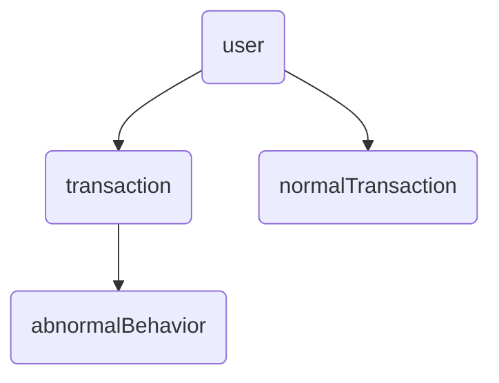
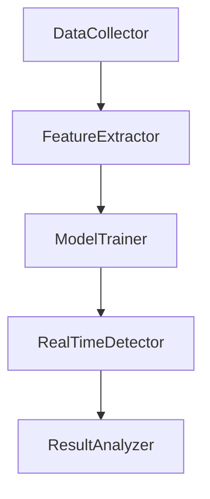

                 


# 智能个人消费行为异常检测

## 关键词：异常检测，消费行为，人工智能，机器学习，数据挖掘

## 摘要：  
智能个人消费行为异常检测是一种利用人工智能和机器学习技术，通过对个人消费数据的分析和建模，识别出异常的消费行为，从而帮助个人和企业防范金融风险、欺诈行为等潜在问题的技术。本文将从背景、原理、算法、系统设计、项目实战等多方面进行详细探讨，帮助读者全面理解智能个人消费行为异常检测的核心思想和实现方法。

---

# 第一部分: 智能个人消费行为异常检测概述

## 第1章: 智能个人消费行为异常检测的背景与问题

### 1.1 智能个人消费行为异常检测的背景  
在当今数字化时代，个人消费行为的数据量呈爆炸式增长。从线上购物到线下支付，从社交网络到金融交易，每个人的消费行为都产生了大量的数据。然而，这些数据中可能存在一些异常行为，例如欺诈交易、违规消费、异常支出等。传统的基于规则的检测方法已经难以应对复杂多变的异常行为模式。因此，智能个人消费行为异常检测应运而生，它利用人工智能和机器学习技术，通过分析消费数据的特征和模式，自动识别异常行为，从而为个人和企业提供了智能化的风险管理工具。

### 1.2 问题背景与问题描述  
#### 1.2.1 问题背景  
消费行为异常检测的核心目标是识别那些偏离正常消费模式的行为。这些异常行为可能包括：  
1. **欺诈交易**：例如信用卡欺诈、虚假交易等。  
2. **违规消费**：例如过度消费、超出预算等。  
3. **异常支出**：例如短时间内频繁交易、金额远超正常水平等。  

#### 1.2.2 问题解决思路  
智能消费行为异常检测的核心思路是通过以下步骤实现：  
1. **数据采集**：收集个人的消费数据，包括时间、金额、地点、交易类型等。  
2. **特征提取**：从原始数据中提取有助于区分正常和异常行为的特征。  
3. **模型训练**：利用机器学习算法训练分类模型，识别异常行为。  
4. **实时检测**：基于训练好的模型，实时监控消费行为，快速识别异常。  

#### 1.2.3 问题的边界与外延  
消费行为异常检测的边界包括：  
- 数据范围：仅限于个人消费行为数据，不涉及其他领域（如社交行为、工作行为等）。  
- 时间范围：通常关注近期的消费行为，历史数据用于训练模型。  
- 异常类型：主要关注欺诈、违规消费等与经济利益相关的行为。  

### 1.3 核心概念与组成结构  
消费行为异常检测的核心概念包括：  
- **正常行为**：符合个人消费习惯和模式的行为。  
- **异常行为**：偏离正常消费习惯，可能带来风险的行为。  
- **检测模型**：用于区分正常和异常行为的机器学习模型。  

---

## 第2章: 智能个人消费行为异常检测的核心概念与联系  

### 2.1 异常检测与正常交易的关系  
#### 2.1.1 正常交易的特征分析  
正常交易通常具有以下特征：  
- 时间分布：集中在工作日或特定时间段。  
- 交易金额：符合个人消费习惯，金额波动较小。  
- 交易频率：稳定，无突变。  

#### 2.1.2 异常行为的典型特征  
异常行为通常表现为：  
- 时间分布：集中在非工作日或深夜。  
- 交易金额：远超个人消费能力，或突然大幅波动。  
- 交易频率：短时间内频繁交易，或突然减少。  

#### 2.1.3 两者之间的对比与联系  
通过对比正常交易和异常行为的特征，可以更好地理解消费行为异常检测的核心目标。例如，如果一个人的消费金额突然大幅增加，且集中在深夜，这可能是异常行为的信号。

### 2.2 实体关系与特征对比  
#### 2.2.1 实体关系图（ER图）  
以下是一个简单的ER图，展示了消费行为异常检测中的实体关系：  


#### 2.2.2 特征对比表格  
以下是正常交易和异常行为的特征对比：  

| 特征维度 | 正常交易 | 异常行为 |
|----------|----------|----------|
| 时间分布 | 集中于工作日 | 集中于非工作日 |
| 交易金额 | 符合消费习惯 | 明显偏离消费习惯 |
| 交易频率 | 稳定 | 突然增加或减少 |

---

## 第3章: 智能个人消费行为异常检测的算法原理  

### 3.1 监督学习算法  
#### 3.1.1 基于监督学习的异常检测流程  
监督学习是一种常用的方法，其流程如下：  
1. 数据预处理：清洗数据，处理缺失值和异常值。  
2. 特征提取：从原始数据中提取有助于区分正常和异常行为的特征。  
3. 模型训练：使用监督学习算法（如随机森林、支持向量机等）训练分类模型。  
4. 模型评估：通过准确率、召回率等指标评估模型性能。  
5. 实时检测：将新的交易数据输入模型，预测是否为异常行为。  

#### 3.1.2 监督学习算法的优缺点  
- **优点**：基于有标签的数据训练，模型性能较高。  
- **缺点**：需要大量标注数据，且可能无法捕捉到数据中的隐含模式。  

---

## 第4章: 智能个人消费行为异常检测的系统设计  

### 4.1 系统功能设计  
#### 4.1.1 数据采集模块  
- 负责采集用户的消费数据，包括时间、金额、地点等。  
#### 4.1.2 特征提取模块  
- 从原始数据中提取有助于区分正常和异常行为的特征。  
#### 4.1.3 模型训练模块  
- 使用机器学习算法训练消费行为异常检测模型。  
#### 4.1.4 实时检测模块  
- 对新的交易数据进行实时检测，判断是否为异常行为。  

### 4.2 系统架构设计  
以下是一个简化的系统架构图：  


---

## 第5章: 智能个人消费行为异常检测的项目实战  

### 5.1 环境安装与数据准备  
#### 5.1.1 环境安装  
- 安装Python、TensorFlow、Scikit-learn等工具。  
#### 5.1.2 数据准备  
- 收集用户消费数据，包括时间、金额、地点等。  

### 5.2 核心代码实现  
#### 5.2.1 数据预处理  
```python
import pandas as pd
# 读取数据
data = pd.read_csv('consumption.csv')
# 处理缺失值
data = data.dropna()
```

#### 5.2.2 特征提取  
```python
from sklearn.preprocessing import StandardScaler
scaler = StandardScaler()
X_scaled = scaler.fit_transform(data[['amount', 'time', 'location']])
```

#### 5.2.3 模型训练  
```python
from sklearn.ensemble import RandomForestClassifier
model = RandomForestClassifier()
model.fit(X_scaled, data['label'])
```

#### 5.2.4 模型评估  
```python
from sklearn.metrics import accuracy_score
y_pred = model.predict(X_test_scaled)
print(accuracy_score(y_test, y_pred))
```

---

## 第6章: 智能个人消费行为异常检测的最佳实践  

### 6.1 小结  
智能个人消费行为异常检测是一种重要的技术，可以帮助企业和个人防范金融风险。通过机器学习算法和系统设计，可以有效地识别异常行为。

### 6.2 注意事项  
- 数据隐私保护：确保用户数据的安全和隐私。  
- 模型优化：定期更新模型，以应对新的异常行为模式。  

### 6.3 拓展阅读  
- 《异常检测：理论与应用》  
- 《机器学习实战》  

---

## 作者简介  
作者是一位在人工智能和机器学习领域有着深厚造诣的技术专家，擅长通过简洁易懂的语言和丰富的案例，帮助读者理解复杂的技术原理。

