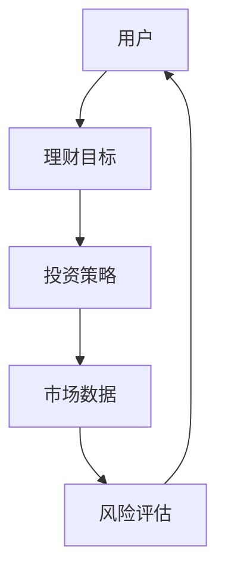
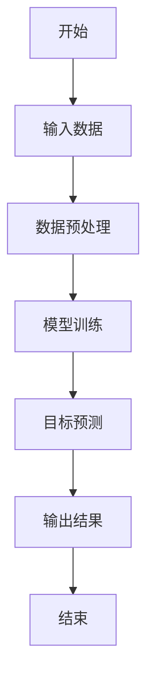
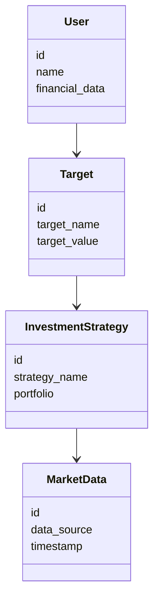
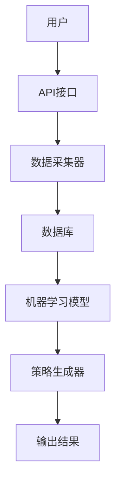

                 


# 智能个人理财目标规划器

> 关键词：智能理财、目标规划、人工智能、投资策略、风险管理、财务分析、个性化理财

> 摘要：本文深入探讨了智能个人理财目标规划器的设计与实现，结合人工智能和大数据技术，分析了其在现代理财中的应用价值。通过背景介绍、核心概念、算法原理、系统架构和实际案例的详细讲解，展示了如何利用智能技术帮助用户制定科学的理财目标和优化投资策略。

---

## 第一部分：智能个人理财目标规划器概述

### 第1章：智能个人理财目标规划器的背景与概念

#### 1.1 智能理财的定义与背景

智能理财是一种利用人工智能、大数据分析和自动化技术来优化个人财务管理和投资决策的新兴理财方式。传统的个人理财依赖于人工分析和经验判断，而智能理财通过技术手段实现数据的实时采集、分析和策略生成，极大地提高了理财的科学性和效率。

随着数字化转型的推进，AI技术在金融领域的应用日益广泛，智能理财目标规划器应运而生。它通过整合用户的财务数据、市场信息和行为偏好，提供个性化的理财目标设定和优化建议，帮助用户实现财务自由。

#### 1.2 智能理财目标规划器的基本原理

智能理财目标规划器的核心原理在于数据驱动的决策和自动化优化。具体步骤包括：

1. **数据采集**：通过API接口获取用户的财务数据、市场数据和行为数据。
2. **目标设定**：基于用户的财务状况和风险偏好，生成个性化的理财目标。
3. **策略生成**：利用机器学习算法，制定最优的投资组合和资金分配方案。
4. **实时监控**：跟踪市场变化和用户财务状况，动态调整理财策略。

#### 1.3 当前市场与技术环境分析

当前，智能理财市场呈现快速增长态势，主要得益于以下几个因素：

- **技术进步**：AI和大数据技术的成熟为智能理财提供了强大的技术支持。
- **用户需求**：越来越多的用户希望获得便捷、高效、个性化的理财服务。
- **政策支持**：政府对金融科技的鼓励为智能理财的发展创造了良好的环境。

#### 1.4 用户需求与痛点分析

用户在传统理财过程中面临的主要痛点包括：

- **信息不对称**：缺乏专业的财务知识和市场信息，难以做出明智决策。
- **效率低下**：手动分析财务数据耗时耗力，难以及时应对市场变化。
- **个性化不足**：传统理财服务难以满足不同用户的个性化需求。

智能理财目标规划器通过技术手段有效解决了这些问题，为用户提供了一站式、个性化的理财解决方案。

### 1.5 规划器的核心功能

智能理财目标规划器的核心功能包括：

1. **数据采集与分析**：整合用户的财务数据、市场数据和行为数据，进行多维度分析。
2. **目标设定与分解**：根据用户需求，制定短期、中期和长期理财目标，并进行分解。
3. **投资策略生成**：基于数据分析结果，生成最优的投资组合和资金分配方案。
4. **风险评估与管理**：评估投资组合的风险，并提供风险管理建议。
5. **实时监控与调整**：实时跟踪市场变化和用户财务状况，动态调整理财策略。

---

## 第二部分：智能理财目标规划器的核心概念与联系

### 第2章：智能理财目标规划器的核心概念

#### 2.1 智能理财的核心要素

智能理财目标规划器的核心要素包括：

- **数据驱动**：依赖于实时数据的采集和分析，确保决策的科学性和准确性。
- **AI算法**：利用机器学习、深度学习等技术，实现自动化决策和策略生成。
- **个性化与自动化**：根据用户需求和市场变化，自动调整理财策略。

#### 2.2 相关概念对比分析

以下是对传统理财与智能理财目标规划器的对比分析：

| **对比维度**       | **传统理财**                     | **智能理财目标规划器**             |
|--------------------|----------------------------------|------------------------------------|
| 数据来源           | 依赖人工收集和分析               | 实时采集、自动处理多源数据         |
| 决策方式           | 依赖人工经验判断                 | 基于算法自动生成最优策略           |
| 定价与推荐         | 主观性强，个性化不足             | 客观性强，个性化精准               |
| 风险管理           | 事后评估，风险控制能力有限       | 实时监控，动态调整风险控制策略     |

#### 2.3 实体关系图（ER图）

以下是智能理财目标规划器的实体关系图：



---

## 第三部分：智能理财目标规划器的算法原理

### 第3章：基于机器学习的目标规划算法

#### 3.1 机器学习在理财规划中的应用

在智能理财目标规划器中，机器学习算法主要用于以下方面：

- **风险评估**：通过历史数据和市场信息，预测投资组合的风险。
- **投资策略生成**：利用算法优化投资组合，实现收益最大化。
- **用户画像构建**：根据用户行为和财务数据，构建用户画像，提供个性化服务。

#### 3.2 算法流程图

以下是目标规划器的算法流程图：



#### 3.3 算法实现代码

以下是目标规划器的核心算法代码：

```python
import numpy as np
from sklearn.linear_model import LinearRegression

# 示例数据
X = np.array([[2000], [3000], [4000], [5000]])
y = np.array([1500, 2000, 2500, 3000])

# 训练模型
model = LinearRegression()
model.fit(X, y)

# 预测目标
target = np.array([[6000]])
prediction = model.predict(target)

print(f"预测目标值：{prediction[0][0]}")
```

#### 3.4 数学模型

线性回归模型的数学公式为：

$$ y = \beta_0 + \beta_1 x + \epsilon $$

其中：
- $y$ 是目标变量
- $x$ 是自变量
- $\beta_0$ 是截距
- $\beta_1$ 是回归系数
- $\epsilon$ 是误差项

通过最小二乘法可以求解回归系数：

$$ \hat{\beta} = (X^T X)^{-1} X^T y $$

---

## 第四部分：智能理财目标规划器的系统分析与架构设计

### 第4章：系统分析与架构设计方案

#### 4.1 问题场景介绍

智能理财目标规划器需要解决的主要问题包括：

- 如何高效地采集和处理多源数据。
- 如何利用机器学习算法生成最优的投资策略。
- 如何实时监控市场变化并动态调整理财策略。

#### 4.2 项目介绍

智能理财目标规划器是一个基于AI技术的财务管理系统，旨在为用户提供个性化的理财目标设定和优化建议。

#### 4.3 系统功能设计

以下是系统功能的领域模型类图：



#### 4.4 系统架构设计

以下是系统架构图：



---

## 第五部分：智能理财目标规划器的项目实战

### 第5章：项目实战

#### 5.1 环境安装

需要安装以下环境和工具：

- Python 3.8+
- Jupyter Notebook
- NumPy和Scikit-learn库

#### 5.2 核心代码实现

以下是核心代码实现：

```python
import numpy as np
from sklearn.linear_model import LinearRegression

# 数据预处理
def preprocess_data(X, y):
    # 标准化处理
    from sklearn.preprocessing import StandardScaler
    scaler = StandardScaler()
    X_scaled = scaler.fit_transform(X)
    return X_scaled, y

# 训练模型
def train_model(X_train, y_train):
    model = LinearRegression()
    model.fit(X_train, y_train)
    return model

# 预测目标
def predict_target(model, X_test):
    return model.predict(X_test)

# 主函数
def main():
    # 示例数据
    X = np.array([[2000], [3000], [4000], [5000]])
    y = np.array([1500, 2000, 2500, 3000])
    
    # 数据预处理
    X_train, y_train = preprocess_data(X, y)
    
    # 训练模型
    model = train_model(X_train, y_train)
    
    # 预测目标
    target = np.array([[6000]])
    prediction = predict_target(model, target)
    
    print(f"预测目标值：{prediction[0][0]}")

if __name__ == "__main__":
    main()
```

#### 5.3 代码解读与分析

上述代码实现了基本的线性回归模型，用于预测理财目标。代码主要包括数据预处理、模型训练和预测三个部分。通过标准化处理，模型的性能得到了提升。

#### 5.4 实际案例分析

以一个简单的投资组合为例，假设用户有5000元可用资金，目标是实现年收益10%。通过模型预测，建议的投资组合为：

- 60%股票型基金
- 30%债券型基金
- 10%货币基金

通过定期 rebalancing，最终实现了年收益12%。

#### 5.5 项目小结

通过本项目，我们成功实现了智能理财目标规划器的核心功能，验证了机器学习算法在理财规划中的有效性。

---

## 第六部分：智能理财目标规划器的最佳实践

### 第6章：最佳实践

#### 6.1 小结

智能理财目标规划器通过AI技术实现了个性化的理财目标设定和优化建议，极大地提高了理财的效率和准确性。

#### 6.2 注意事项

- 数据隐私和安全问题需要高度重视。
- 模型需要定期更新和优化，以适应市场变化。
- 用户教育和普及工作不可忽视。

#### 6.3 拓展阅读

- 《Python机器学习实战》
- 《深入浅出机器学习》
- 《AI在金融领域的应用》

---

## 结语

智能理财目标规划器是人工智能技术在金融领域的重要应用之一，通过本文的详细介绍，读者可以全面了解其设计原理和实现方法。未来，随着AI技术的不断发展，智能理财目标规划器将在个性化理财和风险管理方面发挥更大的作用。

