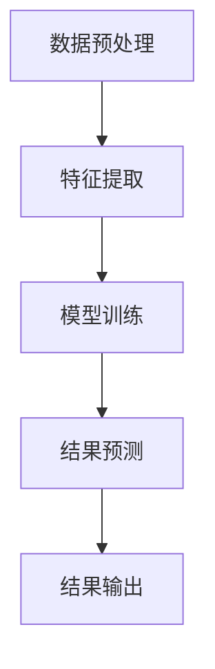
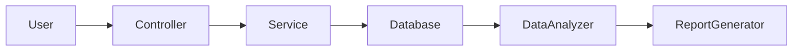
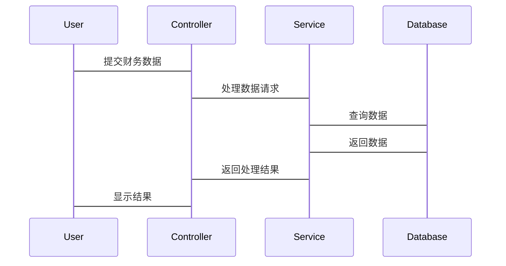

                 


# 智能个人理财目标追踪器

> 关键词：智能理财、目标追踪、人工智能、大数据分析、机器学习

> 摘要：本文详细探讨了智能个人理财目标追踪器的设计与实现，结合人工智能和大数据分析技术，从背景、核心概念、算法原理、系统架构到项目实战，全面解析如何利用智能化工具优化个人财务管理。

---

## 第一部分：背景与核心概念

### 第1章：个人理财与目标追踪的背景与挑战

#### 1.1 个人理财的重要性
现代社会的财务压力日益增大，个人理财已成为提升生活质量的重要手段。通过科学的财务管理，可以实现资产保值、增值，降低生活压力。个人理财的核心目标是帮助用户实现财务自由，而财务自由不仅仅是资产的积累，还包括风险控制、现金流管理等多个方面。

#### 1.2 目标追踪的必要性
在个人理财中，设定明确的财务目标是成功的关键。目标追踪能够帮助用户实时了解财务状况，及时调整理财策略。当前的目标追踪工具存在诸多痛点，例如数据分散、分析深度不足、用户体验差等，这些问题限制了传统工具的应用效果。

#### 1.3 智能化工具的引入
智能化工具通过人工智能和大数据分析，能够实现自动化、个性化的财务管理。智能个人理财目标追踪器不仅能够实时监控财务数据，还能根据用户需求提供智能化的建议，显著提升了理财效率和准确性。

---

### 第2章：智能个人理财目标追踪器的核心概念与联系

#### 2.1 核心概念原理
智能个人理财目标追踪器的核心在于人工智能和大数据分析。通过机器学习算法，系统能够识别用户的财务模式，预测未来走势，并提供优化建议。自然语言处理技术则用于解析用户的财务需求，进一步提升个性化服务。

#### 2.2 实体关系图
智能个人理财目标追踪器的实体关系图展示了用户、目标、交易和通知之间的关联。通过这些关系，系统能够实现数据的高效整合和分析。

```mermaid
erd
    user --(拥有)-- goal
    goal --(属于)-- category
    transaction --(关联)-- goal
    notification --(触发)-- action
```

#### 2.3 核心概念的属性对比
以下是传统理财工具与智能目标追踪器在功能和性能上的对比：

| **属性**       | **传统理财工具**               | **智能目标追踪器**            |
|----------------|-------------------------------|-----------------------------|
| 数据处理能力   | 离线数据分析，效率低           | 实时数据分析，效率高           |
| 个性化服务     | 无个性化推荐                   | 提供个性化理财建议             |
| 用户交互方式   | �界⾯简单，操作复杂             | 界⾯友好，操作简便             |
| 智能性          | 无智能化功能                   | 具备机器学习和预测功能         |

---

## 第二部分：算法原理

### 第3章：智能个人理财目标追踪器的算法原理

#### 3.1 机器学习在目标追踪中的应用
机器学习算法在智能理财中的应用主要体现在预测和分类两个方面。例如，使用监督学习算法预测用户的财务目标达成时间，或者使用非监督学习算法对用户的消费行为进行分群。

#### 3.2 自然语言处理在财务信息分析中的应用
自然语言处理技术能够从用户的财务记录中提取关键信息，例如支出类别、收入来源等。通过情感分析技术，系统还能判断用户的财务情绪，进一步优化理财建议。

#### 3.3 算法实现流程
以下是机器学习算法的实现流程：



#### 3.4 核心算法的Python实现
以下是机器学习算法的Python实现示例：

```python
import pandas as pd
from sklearn.tree import DecisionTreeRegressor

# 数据预处理
data = pd.read_csv('finance_data.csv')
X = data.drop('target', axis=1)
y = data['target']

# 特征提取
features = X.columns

# 模型训练
model = DecisionTreeRegressor()
model.fit(X, y)

# 结果预测
predictions = model.predict(X)
```

---

### 第4章：智能个人理财目标追踪器的系统分析与架构设计

#### 4.1 系统功能设计
智能个人理财目标追踪器的系统功能包括数据采集、目标设定、数据分析、智能提醒和报告生成。通过这些功能，用户可以实现对财务数据的全方位管理。

#### 4.2 系统架构设计
以下是系统的架构图：



#### 4.3 系统接口设计
系统接口主要分为数据接口和用户接口。数据接口用于与其他财务系统对接，用户接口则用于展示数据和接收用户指令。

#### 4.4 系统交互设计
以下是用户与系统的交互流程：



---

## 第三部分：项目实战

### 第5章：智能个人理财目标追踪器的实现与案例分析

#### 5.1 环境安装
项目实现需要以下环境：
- Python 3.8+
- Pandas、Scikit-learn、NLTK 等库
- Jupyter Notebook 或其他IDE

#### 5.2 核心代码实现
以下是核心代码实现：

```python
import numpy as np
from sklearn.ensemble import RandomForestClassifier

# 数据预处理
data = pd.read_csv('finance_data.csv')
X = data.drop('label', axis=1)
y = data['label']

# 特征工程
from sklearn.preprocessing import StandardScaler
scaler = StandardScaler()
X_scaled = scaler.fit_transform(X)

# 模型训练
model = RandomForestClassifier(n_estimators=100)
model.fit(X_scaled, y)

# 模型预测
new_data = pd.read_csv('new_data.csv')
X_new = new_data.drop('label', axis=1)
X_new_scaled = scaler.transform(X_new)
predictions = model.predict(X_new_scaled)
```

#### 5.3 代码应用解读与分析
通过上述代码，我们可以实现对用户财务数据的分类和预测。模型能够识别用户的财务模式，预测未来的财务状况，并提供相应的建议。

#### 5.4 实际案例分析
以一个用户的月度支出为例，系统能够识别其支出模式，并预测未来几个月的支出趋势。通过这种分析，用户可以更好地进行预算管理。

#### 5.5 项目小结
本项目通过机器学习和大数据分析，实现了智能个人理财目标追踪器的开发与应用。系统的实现不仅提升了用户的理财效率，还显著优化了用户的财务管理体验。

---

## 第四部分：最佳实践与总结

### 第6章：智能个人理财目标追踪器的最佳实践

#### 6.1 使用建议
- 定期更新财务数据，确保系统的准确性。
- 根据系统建议调整理财策略。
- 注意保护个人隐私，确保数据安全。

#### 6.2 注意事项
- 系统的准确性依赖于数据的完整性和质量。
- 需要根据用户需求进行功能扩展。
- 系统的性能优化需要结合具体应用场景。

#### 6.3 拓展阅读
- 《Python机器学习实战》
- 《数据驱动的决策分析》
- 《智能金融系统设计》

---

## 第五部分：总结

智能个人理财目标追踪器通过结合人工智能和大数据分析技术，为个人财务管理提供了全新的解决方案。本文从背景、核心概念、算法原理到系统实现，全面解析了智能理财工具的设计与应用。未来，随着技术的不断进步，智能理财工具将更加智能化、个性化，为用户的财务管理提供更多可能性。

