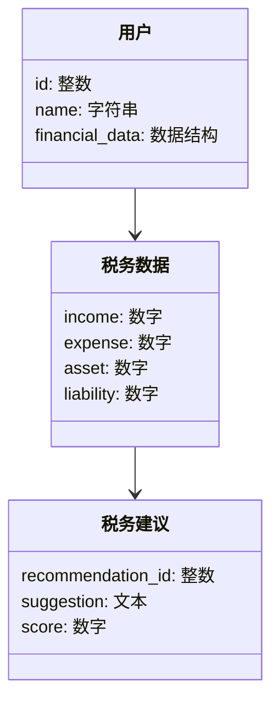

                 


# 智能个人税务筹划助手

## 关键词：智能税务筹划、人工智能、推荐算法、系统架构、项目实战

## 摘要

智能个人税务筹划助手是一种利用人工智能技术帮助个人优化税务规划的工具。本文从背景介绍、核心概念、算法原理、系统架构、项目实战到最佳实践，全面阐述了智能个人税务筹划助手的开发与应用。通过协同过滤推荐算法的实现，结合系统架构设计，为读者提供了一个完整的智能税务筹划解决方案。

---

## 第一部分：智能个人税务筹划助手的背景与核心概念

### 第1章：智能个人税务筹划助手的背景介绍

#### 1.1 税务筹划的定义与重要性

税务筹划是通过合法手段优化个人或企业的税务负担，以实现财务利益最大化的过程。对于个人而言，税务筹划可以帮助减少纳税金额、优化资产配置、降低税务风险。随着经济全球化和法律法规的复杂化，个人税务筹划的需求日益增长。

智能个人税务筹划助手通过自动化和智能化的方式，帮助用户快速找到最优的税务规划方案，避免传统税务筹划中效率低、成本高的问题。

#### 1.2 智能个人税务筹划助手的定义与特点

智能个人税务筹划助手是一种基于人工智能技术的应用工具，能够根据用户的财务数据、税务法规和市场环境，提供个性化的税务优化建议。其特点包括：

1. **智能化**：利用机器学习算法，能够自动分析用户的财务数据，推荐最优的税务规划方案。
2. **个性化**：根据用户的财务状况和需求，提供定制化的税务建议。
3. **实时性**：能够实时更新税务法规和市场动态，确保建议的准确性。
4. **便捷性**：用户可以通过简单的操作，快速获得税务优化建议。

#### 1.3 智能个人税务筹划助手的应用场景

智能个人税务筹划助手主要应用于以下几个场景：

1. **个人所得税优化**：帮助用户优化个人所得税的缴纳，例如通过合理的收入分配和扣除项目，降低税负。
2. **财产规划与税务影响**：在资产配置、遗产规划等方面提供税务优化建议。
3. **投资与税务筹划结合**：在投资决策中考虑税务因素，帮助用户实现投资收益最大化。

---

## 第二部分：智能个人税务筹划助手的核心概念与联系

### 第2章：智能个人税务筹划助手的核心概念

#### 2.1 税务数据采集与处理

税务数据采集与处理是智能个人税务筹划助手的第一步。系统需要收集用户的财务数据，包括收入、支出、资产、负债等信息。数据采集可以通过API接口、文件导入或手动输入的方式完成。数据清洗与预处理是确保数据质量的重要步骤，包括数据去重、缺失值处理、异常值检测等。

#### 2.2 税务规则与策略分析

税务规则与策略分析是智能个人税务筹划助手的核心模块之一。系统需要解读相关的税务法规，分析用户的财务数据，制定最优的税务优化策略。例如，通过分析用户的收入结构，建议合理的扣除项目，降低个税负担。

#### 2.3 智能推荐算法

智能推荐算法是智能个人税务筹划助手的关键技术。系统通过分析用户的财务数据和税务法规，利用推荐算法生成最优的税务规划方案。常用的推荐算法包括协同过滤推荐算法、基于内容的推荐算法和混合推荐算法。

---

## 第三部分：智能个人税务筹划助手的算法原理

### 第4章：推荐算法的实现原理

#### 4.1 协同过滤推荐算法

协同过滤推荐算法是一种基于用户相似性或物品相似性的推荐算法。在智能个人税务筹划助手中，协同过滤推荐算法可以用于根据用户的财务数据和税务需求，推荐最优的税务规划方案。

以下是协同过滤推荐算法的数学模型：

$$
\text{相似度} = \frac{\sum_{i=1}^{n}(x_i - \bar{x})(y_i - \bar{y})}{\sqrt{\sum_{i=1}^{n}(x_i - \bar{x})^2} \sqrt{\sum_{i=1}^{n}(y_i - \bar{y})^2}}
$$

其中，$x_i$和$y_i$分别表示两个用户的财务数据，$\bar{x}$和$\bar{y}$分别表示两个用户的平均值。

---

## 第四部分：智能个人税务筹划助手的系统架构

### 第5章：系统架构设计

#### 5.1 系统功能设计

智能个人税务筹划助手的系统功能设计包括以下几个模块：

1. **数据采集模块**：负责采集用户的财务数据。
2. **数据处理模块**：负责清洗和预处理数据。
3. **推荐算法模块**：负责根据用户数据生成税务优化建议。
4. **用户界面模块**：负责与用户交互，展示税务优化建议。

以下是系统功能设计的领域模型：



#### 5.2 系统架构设计

以下是智能个人税务筹划助手的系统架构设计：


---

## 第五部分：智能个人税务筹划助手的项目实战

### 第6章：项目实战

#### 6.1 环境安装

为了实现智能个人税务筹划助手，我们需要安装以下环境：

1. Python 3.8+
2. NumPy
3. Pandas
4. Scikit-learn

#### 6.2 核心实现

以下是协同过滤推荐算法的核心实现代码：

```python
import numpy as np
from sklearn.metrics.pairwise import cosine_similarity

# 示例数据：用户财务数据
users_data = {
    '用户1': [50000, 20000, 10000],
    '用户2': [60000, 15000, 15000],
    '用户3': [55000, 25000, 5000]
}

# 数据矩阵
data_matrix = np.array(users_data.values())

# 计算相似度矩阵
similarity_matrix = cosine_similarity(data_matrix)

print(similarity_matrix)
```

#### 6.3 功能测试

以下是协同过滤推荐算法的功能测试：

1. 用户输入财务数据。
2. 系统计算用户相似性。
3. 系统根据相似用户的历史数据，推荐最优的税务规划方案。

#### 6.4 实际案例分析

以个税优化为例，假设用户年收入为12万元，家庭有2个孩子，可以享受子女教育扣除和赡养老人扣除。系统会根据这些信息，推荐最优的扣除组合，帮助用户降低个税负担。

---

## 第六部分：智能个人税务筹划助手的最佳实践

### 第7章：最佳实践

#### 7.1 数据隐私保护

在智能个人税务筹划助手的设计中，必须重视数据隐私保护。用户财务数据必须加密存储，确保数据的安全性。

#### 7.2 模型优化

为了提高推荐算法的准确性，可以尝试优化模型参数，例如调整相似度计算的权重。

#### 7.3 拓展阅读

建议读者进一步阅读以下内容：

1. 协同过滤推荐算法的改进方法。
2. 机器学习在税务筹划中的应用。
3. 税务法规的变化与优化。

---

通过以上内容，我们全面介绍了智能个人税务筹划助手的开发与应用。从背景介绍到系统架构设计，再到项目实战，本文为读者提供了一个完整的智能税务筹划解决方案。

