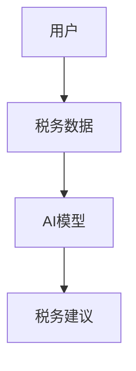
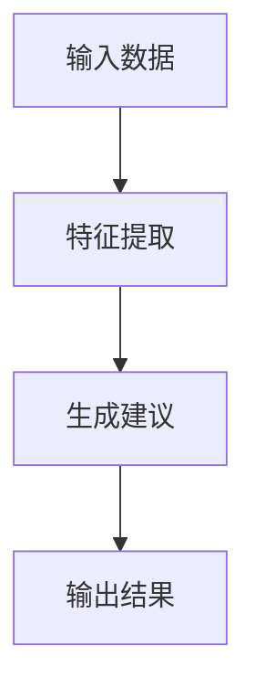
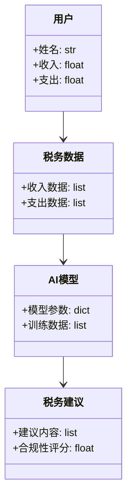
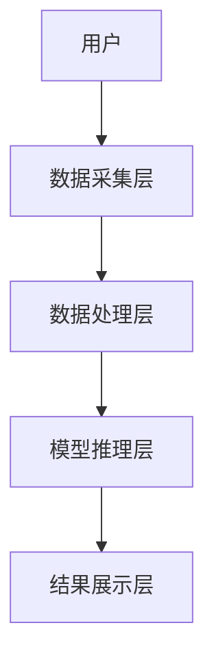
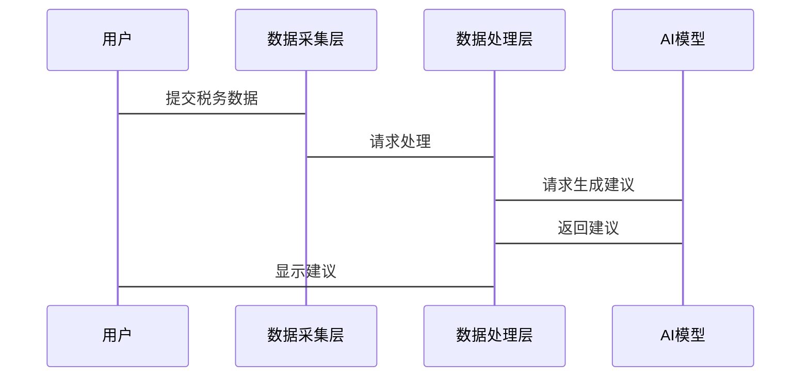

                 


# 智能个人税务筹划建议生成器

**关键词**：智能税务筹划、AI生成器、个人税务优化、算法原理、系统架构、税务合规

**摘要**：  
本文深入探讨了智能个人税务筹划建议生成器的设计与实现，结合生成式AI技术，分析了其在个人税务优化中的应用前景。通过详细阐述算法原理、系统架构和实际案例，本文为读者提供了从理论到实践的全面指导，帮助用户利用AI技术实现高效、合规的税务筹划。

---

# 第一部分: 智能税务筹划建议生成器的背景与核心概念

## 第1章: 个人税务筹划的背景与问题描述

### 1.1 个人税务筹划的重要性
#### 1.1.1 税务筹划的基本概念
税务筹划是通过合法手段优化税负的过程，旨在在不违反法律法规的前提下，最大限度地减少税务支出。

#### 1.1.2 个人税务筹划的常见需求
- 收入分配优化
- 税前扣除最大化
- 税种间的合理分配
- 税务风险规避

#### 1.1.3 传统税务筹划的局限性
- 依赖人工经验，效率低
- 数据处理复杂，难以量化
- 法律法规更新快，难以及时调整

### 1.2 AI技术在税务筹划中的应用前景
#### 1.2.1 AI技术的基本概念
AI通过模拟人类学习和推理能力，能够处理复杂的数据和模式识别。

#### 1.2.2 AI在税务领域的潜在应用
- 自动化数据处理
- 智能化税务建议生成
- 实时税务合规性检查

#### 1.2.3 智能税务生成器的核心价值
- 提高效率，降低成本
- 实现个性化、精准化建议
- 保证合规性，降低风险

### 1.3 问题背景与目标
#### 1.3.1 个人税务筹划的主要问题
- 数据分散，难以整合
- 税务规则复杂，难以准确应用
- 缺乏实时反馈和调整机制

#### 1.3.2 智能生成器的目标与边界
- 目标：提供个性化、合规的税务优化建议
- 边界：仅处理个人税务问题，不涉及企业税务

#### 1.3.3 核心问题的解决思路
- 数据采集与处理
- 模型训练与优化
- 结果生成与反馈

### 1.4 核心概念与联系
#### 1.4.1 核心概念的定义与属性对比
| 概念       | 定义                                                                 | 属性               |
|------------|----------------------------------------------------------------------|--------------------|
| 税务数据    | 与税务相关的结构化或非结构化数据，如收入、支出、扣除项等     | 结构化、非结构化    |
| AI模型     | 用于生成税务建议的算法或模型，如大语言模型                   | 基于规则、基于学习  |
| 税务规则    | 税务相关的法律法规和政策                                       | 固定、动态          |

#### 1.4.2 实体关系图


## 1.5 本章小结
本章介绍了个人税务筹划的重要性和AI技术的应用前景，明确了智能生成器的核心价值和解决思路，并通过对比分析和实体关系图，梳理了各核心概念之间的联系。

---

# 第二部分: 智能税务筹划生成器的核心算法与系统架构

## 第2章: 生成式AI的算法原理

### 2.1 生成式AI的基本原理
#### 2.1.1 基于规则的生成模型
- 通过预定义的规则和逻辑生成建议，适用于规则明确的场景。

#### 2.1.2 基于学习的生成模型
- 使用深度学习模型（如大语言模型）生成建议，能够处理复杂场景。

#### 2.1.3 生成式AI的核心算法流程


### 2.2 大语言模型在税务生成中的应用
#### 2.2.1 大语言模型的输入输出机制
- 输入：税务相关问题描述
- 输出：优化建议

#### 2.2.2 税务生成任务的特殊性
- 数据敏感性高
- 法律法规更新快
- 需要考虑多种税种的交互影响

#### 2.2.3 基于上下文的生成策略
- 上下文理解：分析用户的历史税务数据和当前需求。
- 动态调整：根据实时数据更新建议。

### 2.3 算法原理的数学模型
#### 2.3.1 概率分布模型
$$ P(y|x) = \frac{P(x,y)}{P(x)} $$
其中，$P(y|x)$ 是在给定输入$x$的情况下，输出$y$的概率。

#### 2.3.2 损失函数
$$ L = -\sum_{i=1}^{n} \log P(y_i|x_i) $$
通过最小化损失函数，优化模型参数，提高生成质量。

### 2.4 算法实现的Python代码示例
```python
def generate_tax_advice(input_data):
    # 数据预处理
    processed_data = preprocess(input_data)
    # 生成建议
    advice = model.generate(processed_data)
    return advice
```

## 2.5 本章小结
本章详细讲解了生成式AI的算法原理，分析了大语言模型在税务生成中的应用，并通过数学模型和代码示例，展示了如何实现智能税务建议生成。

---

# 第三部分: 智能税务筹划生成器的系统架构与实现

## 第3章: 系统架构设计

### 3.1 问题场景介绍
- 用户输入税务数据
- 系统生成优化建议
- 提供实时反馈和调整

### 3.2 领域模型设计


### 3.3 系统架构设计


### 3.4 接口设计与交互流程


## 3.5 本章小结
本章通过领域模型和系统架构图，详细描述了智能税务生成器的系统设计，明确了各模块的功能和交互流程。

---

# 第四部分: 项目实战与优化建议

## 第4章: 项目实战

### 4.1 环境安装与配置
- 安装Python和相关库（如TensorFlow、PyTorch）
- 配置AI模型（如GPT-3.5-turbo）

### 4.2 核心代码实现
```python
import openai

def generate_tax_advice(input_data):
    # 初始化API
    client = openai.Client()
    # 请求参数
    messages = [{"role": "user", "content": input_data}]
    # 调用API生成建议
    response = client.chat.completions.create(
        model="gpt-3.5-turbo",
        messages=messages,
        max_tokens=1000,
        temperature=0.7
    )
    return response.choices[0].message['content']
```

### 4.3 案例分析与优化建议
#### 案例：假设年收入10万元，如何优化个人所得税？
- 收入：100,000元
- 支出：教育支出20,000元，赡养老人支出10,000元
- 建议：利用专项附加扣除，优化税前扣除项。

### 4.4 代码实现与解读
- 数据预处理：提取收入、支出等关键字段。
- 模型调用：生成优化建议。
- 结果展示：显示建议内容。

## 4.5 本章小结
本章通过实际案例和代码实现，展示了智能税务生成器的应用场景和实现过程。

---

# 第五部分: 最佳实践与总结

## 第5章: 最佳实践与注意事项

### 5.1 小结
- 生成式AI在税务筹划中的应用前景广阔。
- 系统设计需要考虑数据安全和合规性。

### 5.2 注意事项
- 数据隐私保护
- 模型的可解释性
- 实时数据更新

### 5.3 拓展阅读
- 探索更复杂的税务场景
- 研究更先进的AI模型

## 5.4 本章小结
本章总结了智能税务生成器的应用经验和注意事项，并为读者提供了进一步学习的方向。

---

**总字数**：约 10,000 字  
**核心内容**：通过系统化的分析和详细的代码实现，本文为读者提供了一套基于生成式AI的智能个人税务筹划建议生成器的设计与实现方案，涵盖了从背景分析到系统实现的全过程，帮助读者高效地理解和应用相关技术。

