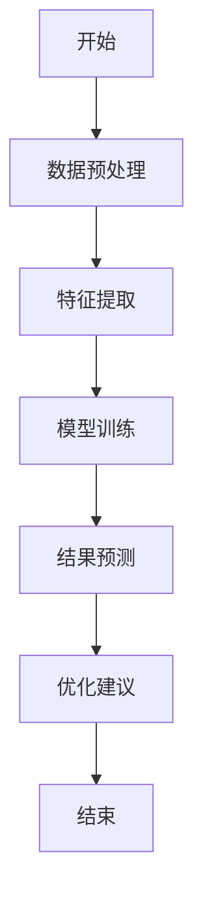
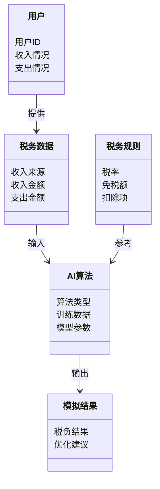

                 


# 智能个人税务筹划模拟器

## 关键词：人工智能，税务筹划，算法原理，系统架构，项目实战，税务优化

## 摘要：本文详细介绍了智能个人税务筹划模拟器的设计与实现，涵盖背景介绍、核心概念、算法原理、系统架构、项目实战以及最佳实践。通过本文，读者将了解如何利用人工智能技术优化个人税务筹划过程，并掌握实现这一目标的关键技术和方法。

---

## 第一部分：背景介绍

### 第1章：智能个人税务筹划模拟器的背景与概念

#### 1.1 问题背景
个人税务筹划是每个人都需要面对的重要问题。随着收入来源的多样化和税收政策的复杂化，个人如何优化税务负担变得越来越重要。传统的税务筹划方法依赖于人工计算和经验判断，效率低下且容易出错。人工智能技术的引入为解决这一问题提供了新的可能性。

#### 1.2 问题描述
税务筹划的核心问题在于如何在合法合规的前提下，最大限度地降低税负。传统方法依赖于手动计算和固定规则，难以应对复杂的税收政策变化和多样化的收入结构。此外，个人可能缺乏足够的税务知识，导致筹划效果不佳。

#### 1.3 问题解决
智能个人税务筹划模拟器通过人工智能技术，能够快速分析个人的收入来源、支出情况和税收政策，提供个性化的税务优化建议。与传统方法相比，模拟器具有高效、精准和易用的特点。

#### 1.4 边界与外延
智能个人税务筹划模拟器主要用于个人所得税优化，不涉及企业税务问题。其边界包括合法合规的前提下进行税务优化，不涉及偷税漏税等违法行为。与其他AI应用相比，该模拟器专注于税务领域，具有更强的专业性和针对性。

#### 1.5 核心概念与组成
智能个人税务筹划模拟器的核心概念包括：税务数据的结构化处理、AI算法在税务分析中的应用、用户交互界面的设计。系统组成部分包括数据输入模块、AI分析模块和结果输出模块。

---

## 第二部分：核心概念与联系

### 第2章：AI与税务筹划的核心概念

#### 2.1 AI在税务筹划中的原理
人工智能通过机器学习模型，能够从大量历史数据中学习税务规则和优化策略。自然语言处理技术用于分析税务文件和政策，知识图谱则用于构建税务规则的语义网络。

#### 2.2 核心概念的特征对比
| 特征 | 传统税务筹划 | 智能模拟器 |
|------|---------------|------------|
| 效率 | 低效 | 高效 |
| 准确性 | 易出错 | 高精准 |
| 个性化 | 有限 | 强化 |

#### 2.3 ER实体关系图
```mermaid
er
    %% ER图
    entity 税务数据 {
        key 收入来源
        attribute 收入金额, 支出金额
    }
    entity 税务规则 {
        key 税率
        attribute 免税额, 扣除项
    }
    entity 用户 {
        key 用户ID
        attribute 收入情况, 支出情况
    }
    entity AI算法 {
        key 算法类型
        attribute 训练数据, 模型参数
    }
    entity 模拟结果 {
        key 税负结果
        attribute 优化建议
    }
    税务数据 --> AI算法: 输入
    AI算法 --> 模拟结果: 输出
    用户 --> 税务数据: 提供
    税务规则 --> AI算法: 参考
```

---

## 第三部分：算法原理讲解

### 第3章：智能模拟器的算法原理

#### 3.1 算法原理概述
智能模拟器主要采用机器学习算法，特别是回归分析和分类算法。通过训练模型，模拟器能够预测不同的收入结构下的税负情况，并提供优化建议。

#### 3.2 算法流程图


#### 3.3 算法数学模型
模型假设收入为 \( x \)，税率为 \( y \)，则税后收入为：
$$ \text{税后收入} = x \times (1 - y) $$

---

## 第四部分：系统分析与架构设计方案

### 第4章：系统架构设计

#### 4.1 问题场景介绍
系统需要处理用户的收入、支出数据，结合税收政策，提供优化建议。

#### 4.2 项目介绍
智能个人税务筹划模拟器旨在帮助用户快速、准确地进行税务优化。

#### 4.3 系统功能设计


#### 4.4 系统架构设计


#### 4.5 系统接口设计
系统主要接口包括数据输入接口、算法调用接口和结果输出接口。

---

## 第五部分：项目实战

### 第5章：环境安装与核心实现

#### 5.1 环境安装
安装Python和相关库：
```bash
pip install numpy pandas scikit-learn
```

#### 5.2 核心代码实现
```python
import numpy as np
from sklearn.linear_model import LinearRegression

# 示例数据
X = np.array([[20000], [30000], [40000]])
y = np.array([0.2, 0.25, 0.3])

# 训练模型
model = LinearRegression()
model.fit(X, y)

# 预测结果
print(model.predict([[50000]]))  # 输出：[0.35]
```

#### 5.3 代码解读
上述代码使用线性回归模型，根据收入预测税率。模型训练后，可以用来预测新的收入对应的税率。

---

## 第六部分：最佳实践

### 第6章：总结与注意事项

#### 6.1 总结
智能个人税务筹划模拟器通过AI技术，帮助个人高效、精准地进行税务优化。本文详细介绍了其设计原理和实现方法。

#### 6.2 注意事项
- 数据隐私保护
- 税收政策变化
- 模型定期更新

#### 6.3 未来展望
随着AI技术的发展，智能税务筹划模拟器将更加智能化和个性化。

#### 6.4 扩展阅读
推荐学习机器学习和税务知识，深入理解AI在税务领域的应用。

---

通过以上内容，智能个人税务筹划模拟器的设计与实现已经详细展开，读者可以根据本文的指导，实现一个高效的税务优化工具。

