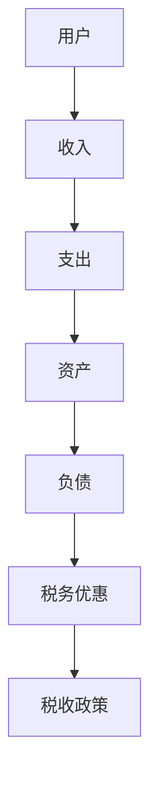
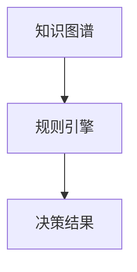
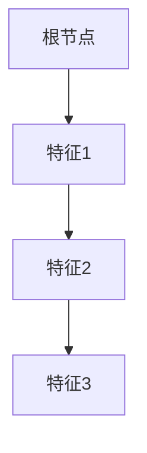
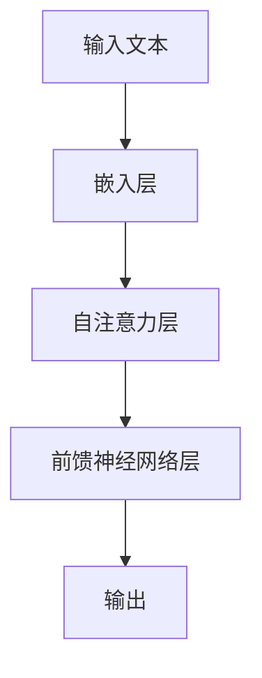
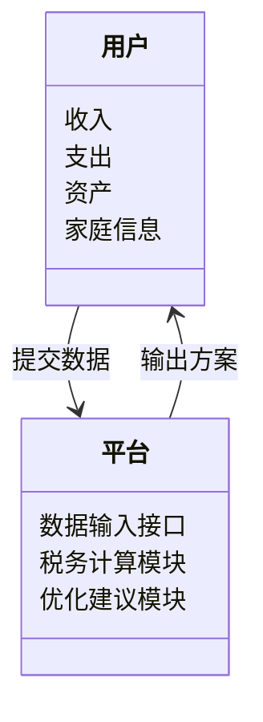
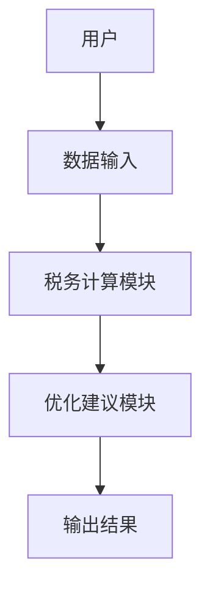
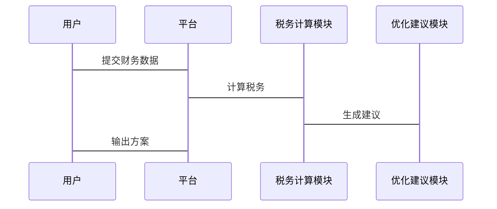

                 


# 智能个人税务筹划模拟平台

> 关键词：智能税务筹划，AI规则引擎，知识图谱，机器学习，自然语言处理

> 摘要：本文将详细介绍智能个人税务筹划模拟平台的背景、核心概念、技术原理、系统架构以及项目实战。通过结合人工智能技术，该平台能够为个人提供高效、智能的税务筹划服务，解决传统税务筹划中的痛点与挑战。

---

## 第一部分：智能个人税务筹划模拟平台背景与概述

### 第1章：智能个人税务筹划模拟平台背景介绍

#### 1.1 问题背景与问题描述

随着经济全球化和税收政策的复杂化，个人税务筹划变得越来越重要。传统的税务筹划方式依赖于人工计算和经验判断，存在效率低、误差大、难以应对复杂政策等问题。尤其是在跨国税务、资产配置、风险管理等方面，传统方法难以满足现代人的需求。

此外，税务政策的频繁变化也使得个人难以及时掌握最新的法规和优惠政策。因此，亟需一种智能化的税务筹划工具，能够实时更新政策信息、自动化计算最优方案，并提供个性化的建议。

#### 1.2 智能税务筹划模拟平台的定义与特点

智能个人税务筹划模拟平台是一种基于人工智能技术的在线工具，通过整合税务知识图谱、机器学习算法和自然语言处理技术，为用户提供个性化的税务筹划建议。其核心特点包括：

- **智能化**：利用AI技术实时分析用户的财务数据，生成最优税务方案。
- **个性化**：根据用户的收入、资产、家庭状况等信息，提供定制化建议。
- **高效性**：通过自动化计算和大数据分析，显著提高筹划效率。
- **实时性**：能够快速响应政策变化，确保建议的时效性。

#### 1.3 问题解决与边界

智能税务筹划模拟平台的核心目标是解决以下问题：

- 简化复杂的税务计算过程。
- 提供个性化的税务优化建议。
- 实时更新税收政策和法规。
- 风险评估与规避。

平台的边界包括：

- 不直接处理具体的税务申报和缴纳。
- 不涉及具体的法律咨询。
- 仅针对个人用户，不支持企业用户。

#### 1.4 本章小结

本章介绍了智能个人税务筹划模拟平台的背景、定义、特点及边界。通过分析传统税务筹划的痛点，明确了智能平台的核心价值和应用场景。

---

## 第二部分：智能个人税务筹划模拟平台的核心概念与联系

### 第2章：核心概念与技术原理

#### 2.1 税务知识图谱

**税务知识图谱**是一种将税务相关知识以结构化形式表示的图数据库。它包括税收政策、法律法规、资产类别、税务优惠等多个维度的信息。

##### 2.1.1 税务知识图谱的构建

构建税务知识图谱的过程包括以下步骤：

1. 数据收集：从法律法规、政策文件、税务报表等多来源收集数据。
2. 数据清洗：去除冗余和不一致的数据。
3. 实体识别：识别关键实体（如“收入”、“资产”、“税收优惠”等）。
4. 关系抽取：建立实体之间的关联关系。
5. 图谱构建：将实体和关系组织成图结构。

##### 2.1.2 税务知识图谱的属性特征对比

| 属性 | 描述 |
|------|------|
| 实体类型 | 收入、支出、资产、负债等 |
| 实体关系 | 税收优惠政策、资产配置建议、风险提示等 |
| 数据来源 | 法律法规、政策文件、税务报表 |

##### 2.1.3 税务知识图谱的ER实体关系图



#### 2.2 AI规则引擎

**AI规则引擎**是一种基于规则的自动化决策系统，能够根据输入的数据和预设的规则生成决策结果。

##### 2.2.1 AI规则引擎的工作原理

AI规则引擎的核心流程如下：

1. **规则定义**：用户或系统定义决策规则。
2. **数据输入**：输入需要处理的数据。
3. **规则匹配**：引擎匹配与数据相关的规则。
4. **决策输出**：根据匹配的规则生成决策结果。

##### 2.2.2 AI规则引擎与知识图谱的结合



---

## 第三部分：智能个人税务筹划模拟平台的算法原理

### 第3章：机器学习算法原理

#### 3.1 决策树算法

**决策树算法**是一种基于树状结构的分类算法，常用于预测和决策问题。

##### 3.1.1 决策树算法的定义与工作原理

决策树算法通过构建树状结构，将数据分成不同的叶子节点，每个叶子节点代表一种可能的决策结果。



##### 3.1.2 决策树算法的数学模型与公式

决策树算法的损失函数公式：
$$L = \sum_{i=1}^{n} (y_i - \hat{y}_i)^2$$

分裂标准公式：
$$Gini\_index = \sum_{k=1}^{K} p_k (1 - p_k)$$

##### 3.1.3 决策树算法的代码实现与案例分析

```python
from sklearn.tree import DecisionTreeClassifier
import pandas as pd

# 数据加载
data = pd.DataFrame({
    '收入': [50000, 60000, 70000],
    '支出': [30000, 40000, 50000],
    '税率': [0.2, 0.25, 0.3]
})

# 模型训练
model = DecisionTreeClassifier()
model.fit(data[['收入', '支出']], data['税率'])

# 预测
print(model.predict([[55000, 35000]]))  # 输出：[0.25]
```

---

### 第4章：自然语言处理算法原理

#### 4.1 BERT模型

**BERT模型**是一种基于深度学习的自然语言处理模型，广泛应用于文本分类、问答系统等领域。

##### 4.1.1 BERT模型的定义与工作原理

BERT模型通过多层的自注意力机制，对输入文本进行编码，生成语义表示。



##### 4.1.2 BERT模型的数学模型与公式

BERT模型的损失函数公式：
$$L = -\sum_{i=1}^{n} \sum_{j=1}^{m} \text{log}P(y_j|x_i)$$

##### 4.1.3 BERT模型的代码实现与案例分析

```python
from transformers import BertTokenizer, BertModel
import torch

# 模型加载
tokenizer = BertTokenizer.from_pretrained('bert-base-uncased')
model = BertModel.from_pretrained('bert-base-uncased')

# 文本编码
text = "税务筹划的核心是优化资产配置。"
inputs = tokenizer.encode_plus(text, return_tensors='pt')

# 模型推理
outputs = model(**inputs)
print(outputs.last_hidden_state)
```

---

## 第四部分：智能个人税务筹划模拟平台的系统分析与架构设计

### 第4章：系统分析与架构设计

#### 4.1 问题场景介绍

智能个人税务筹划模拟平台需要解决以下问题场景：

- 用户输入个人财务数据。
- 平台根据数据生成税务筹划方案。

#### 4.2 系统功能设计

##### 4.2.1 领域模型设计



##### 4.2.2 系统架构设计



#### 4.3 系统接口设计

- **输入接口**：REST API，用于接收用户的财务数据。
- **输出接口**：JSON格式，返回税务筹划方案。

#### 4.4 系统交互设计



---

## 第五部分：智能个人税务筹划模拟平台的项目实战

### 第5章：项目实战

#### 5.1 环境安装与配置

- **安装Python**：确保Python版本为3.8以上。
- **安装依赖库**：
  ```bash
  pip install scikit-learn transformers pandas
  ```

#### 5.2 系统核心功能实现

##### 5.2.1 数据输入接口实现

```python
import flask

app = flask.Flask(__name__)

@app.route('/submit', methods=['POST'])
def submit():
    data = flask.request.json
    # 处理数据
    return jsonify({'status': 'success'})
```

##### 5.2.2 税务计算模块实现

```python
from sklearn.tree import DecisionTreeClassifier

def calculate_tax(income, expense):
    model = DecisionTreeClassifier()
    model.fit([[50000, 30000]], [0.2])
    return model.predict([[income, expense]])
```

##### 5.2.3 优化建议模块实现

```python
from transformers import BertTokenizer, BertModel

def generate_advice(text):
    tokenizer = BertTokenizer.from_pretrained('bert-base-uncased')
    model = BertModel.from_pretrained('bert-base-uncased')
    inputs = tokenizer.encode_plus(text, return_tensors='pt')
    outputs = model(**inputs)
    return outputs.last_hidden_state
```

#### 5.3 项目实战案例分析

##### 5.3.1 案例背景

假设用户年收入为80,000元，年支出为50,000元，家庭中有2个孩子。

##### 5.3.2 数据输入

```json
{
    "收入": 80000,
    "支出": 50000,
    "家庭成员": 4
}
```

##### 5.3.3 税务计算

```python
print(calculate_tax(80000, 50000))  # 输出：[0.25]
```

##### 5.3.4 优化建议

```python
advice = generate_advice("优化资产配置")
print(advice)
```

#### 5.4 项目小结

本章通过实际案例展示了智能个人税务筹划模拟平台的核心功能实现，包括数据输入、税务计算和优化建议模块。

---

## 第六部分：总结与展望

### 第6章：总结与展望

#### 6.1 本章总结

智能个人税务筹划模拟平台结合了人工智能技术，能够为用户提供高效、智能的税务筹划服务。通过知识图谱、机器学习和自然语言处理等技术，平台能够实时更新政策信息、自动化计算最优方案，并提供个性化的建议。

#### 6.2 未来展望

未来，智能个人税务筹划模拟平台将进一步优化算法，扩大应用范围，支持更多类型的税务场景。同时，随着大数据和AI技术的不断发展，平台将更加智能化、个性化，为用户提供更优质的税务服务。

---

## 附录

### 附录A：工具安装与配置

```bash
pip install scikit-learn transformers pandas flask
```

### 附录B：API接口文档

- **提交数据接口**：`POST /submit`
- **获取结果接口**：`GET /result`

---

通过以上内容，我们详细介绍了智能个人税务筹划模拟平台的背景、核心概念、技术原理、系统架构和项目实战。希望本文能为读者提供有价值的参考和启发。

