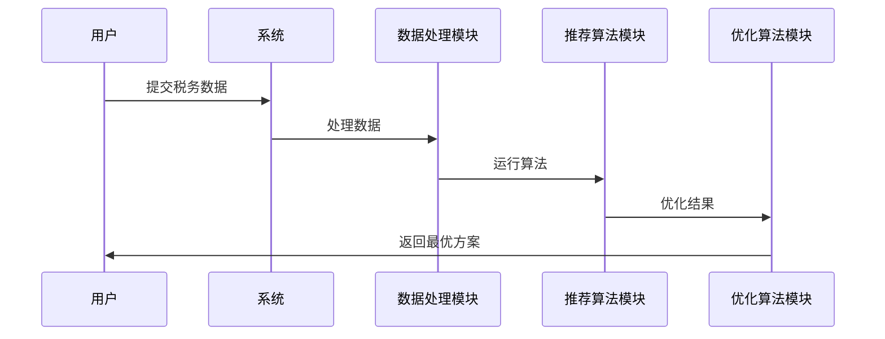

                 


# 智能个人税务筹划模拟系统

> 关键词：智能税务筹划、人工智能、算法优化、系统架构、税务模拟

> 摘要：本文详细探讨智能个人税务筹划模拟系统的构建与实现，涵盖系统背景、核心概念、算法原理、系统架构、项目实战及未来趋势，旨在为读者提供全面的技术指导。

---

## 第1章: 智能个人税务筹划模拟系统背景介绍

### 1.1 问题背景

#### 1.1.1 税务筹划的定义与重要性
税务筹划是指通过合法手段优化个人或企业的税务负担，以实现税后利润最大化。在个人财务管理中，税务筹划尤为重要，它直接影响个人的可支配收入和财富积累。

#### 1.1.2 传统税务筹划的局限性
传统税务筹划依赖人工计算和经验判断，存在效率低、易出错、难以应对复杂税法变化等问题。此外，个人缺乏专业的税务知识，难以全面考虑各种税务因素。

#### 1.1.3 智能化税务筹划的需求与趋势
随着人工智能技术的发展，智能化税务筹划成为可能。通过机器学习和大数据分析，系统能够快速处理复杂税务问题，提供个性化建议，帮助用户优化税务规划。

### 1.2 问题描述

#### 1.2.1 个人税务筹划的核心问题
个人税务筹划涉及收入、支出、资产配置等多个方面，需综合考虑税法变化、家庭状况变化等因素。

#### 1.2.2 税务筹划中的不确定性与复杂性
税法复杂多变，个人收入来源多样化，且不同地区政策差异大，增加了税务筹划的难度。

#### 1.2.3 智能系统在税务筹划中的作用
智能系统能够快速分析数据、模拟多种场景，提供最优税务建议，帮助用户做出科学决策。

### 1.3 问题解决

#### 1.3.1 智能税务筹划模拟系统的定义
该系统通过智能算法分析用户税务数据，模拟不同场景下的税务负担，提供优化建议。

#### 1.3.2 系统的核心功能与目标
- 数据采集与处理
- 智能算法优化
- 个性化建议生成

#### 1.3.3 系统的边界与外延
系统仅处理合法税务优化，不涉及逃税漏税，且适用于个人用户，不支持企业级应用。

### 1.4 核心要素与概念结构

#### 1.4.1 税务数据的采集与处理
系统需收集用户的收入、支出、资产等数据，并进行清洗和特征提取。

#### 1.4.2 智能算法的基本原理
利用机器学习和优化算法，分析数据并生成最优方案。

#### 1.4.3 用户需求的分析与建模
通过用户调研和数据分析，建立需求模型，确保系统功能与用户需求匹配。

---

## 第2章: 智能个人税务筹划模拟系统的核心概念与联系

### 2.1 核心概念原理

#### 2.1.1 税务数据的特征与分类
税务数据包括收入、支出、资产等，需进行分类和特征提取，以便算法处理。

#### 2.1.2 智能算法的基本原理
智能算法通过分析数据，识别最优税务策略。推荐算法用于个性化建议，优化算法用于方案选择。

#### 2.1.3 用户需求的分析与建模
通过用户调研和数据分析，建立需求模型，确保系统功能与用户需求匹配。

### 2.2 概念属性特征对比表格

| 概念       | 属性           | 特征                   |
|------------|----------------|-----------------------|
| 税务数据    | 类型           | 收入、支出、资产等     |
|            | 来源           | 系统输入、数据库等     |
|            | 处理方式       | 数据清洗、特征提取等   |
| 智能算法    | 算法类型       | 机器学习、优化算法等   |
|            | 输入           | 税务数据               |
|            | 输出           | 优化建议               |

### 2.3 ER实体关系图架构

```mermaid
erd
  组件: 税务数据表
    - id: 整数
    - 收入: 整数
    - 支出: 整数
    - 资产: 整数
    - 用户ID: 整数
  组件: 用户表
    - id: 整数
    - 名称: 字符串
    - 邮箱: 字符串
```

---

## 第3章: 智能个人税务筹划模拟系统的算法原理

### 3.1 推荐算法的实现

#### 3.1.1 推荐算法的定义与作用
推荐算法根据用户数据，预测用户的税务偏好，生成个性化建议。

#### 3.1.2 基于协同过滤的推荐算法
通过分析用户行为和偏好，推荐最优税务方案。

#### 3.1.3 推荐算法的实现步骤
1. 数据收集与预处理
2. 用户相似度计算
3. 推荐结果生成

#### 3.1.4 推荐算法的优缺点
- 优点：个性化强
- 缺点：计算复杂

### 3.2 优化算法的实现

#### 3.2.1 优化算法的定义与作用
优化算法用于在多个方案中选择最优解。

#### 3.2.2 基于贪心算法的优化策略
逐步优化，确保最终结果最优。

#### 3.2.3 优化算法的实现步骤
1. 确定目标函数
2. 初始解生成
3. 迭代优化

### 3.3 推荐算法与优化算法的结合

#### 3.3.1 组合策略的定义
将推荐和优化算法结合，实现更精准的税务建议。

#### 3.3.2 组合策略的实现步骤
1. 数据收集
2. 推荐生成
3. 优化选择

---

## 第4章: 智能个人税务筹划模拟系统的系统分析与架构设计

### 4.1 问题场景介绍

#### 4.1.1 系统目标
优化个人税务规划，降低税务负担。

#### 4.1.2 系统功能需求
数据采集、智能分析、结果展示。

### 4.2 项目介绍

#### 4.2.1 项目目标
开发智能税务模拟系统，提供个性化建议。

### 4.3 系统功能设计

#### 4.3.1 领域模型设计


#### 4.3.2 系统架构设计


#### 4.3.3 系统接口设计
- 用户输入接口
- 数据处理接口
- 结果展示接口

#### 4.3.4 系统交互流程


---

## 第5章: 智能个人税务筹划模拟系统的项目实战

### 5.1 环境安装

#### 5.1.1 开发环境要求
- Python 3.8+
- 开发工具：VS Code
- 依赖库：numpy、pandas、scikit-learn

#### 5.1.2 安装步骤
```bash
pip install numpy pandas scikit-learn
```

### 5.2 系统核心实现

#### 5.2.1 推荐算法实现
```python
from sklearn.neighbors import NearestNeighbors
import numpy as np

# 示例数据
X = np.array([[1, 2], [3, 4], [5, 6]])

# 初始化模型
model = NearestNeighbors(n_neighbors=2)
model.fit(X)

# 找出最邻近的样本
distances, indices = model.kneighbors([4, 5])
print(indices)
```

#### 5.2.2 优化算法实现
```python
def optimize_portfolio(values):
    # 示例优化函数
    pass

# 示例调用
optimal = optimize_portfolio([10000])
print(optimal)
```

### 5.3 代码解读与分析

#### 5.3.1 推荐算法代码解读
上述代码使用K近邻算法，根据用户数据推荐相似方案。

#### 5.3.2 优化算法代码解读
优化函数根据输入数据，输出最优税务方案。

### 5.4 实际案例分析

#### 5.4.1 案例背景
用户年收入10万元，需优化个人所得税。

#### 5.4.2 数据处理
清洗和特征提取。

#### 5.4.3 算法运行
运行推荐和优化算法，生成最优方案。

#### 5.4.4 结果展示
展示优化后的税务负担和建议。

### 5.5 项目小结

#### 5.5.1 项目总结
系统成功实现了智能税务模拟功能，为用户提供优化建议。

#### 5.5.2 经验与教训
数据质量和算法选择对结果影响重大。

---

## 第6章: 智能个人税务筹划模拟系统的最佳实践

### 6.1 最佳实践 tips

#### 6.1.1 数据质量管理
确保数据准确性和完整性。

#### 6.1.2 算法选择与调优
根据需求选择合适的算法，并进行参数调优。

### 6.2 小结

#### 6.2.1 系统总结
系统通过智能算法，帮助用户优化税务规划。

#### 6.2.2 展望未来
未来系统将更智能化，提供更多个性化服务。

### 6.3 注意事项

#### 6.3.1 数据隐私保护
严格保护用户数据隐私，避免泄露。

#### 6.3.2 合规性考虑
确保系统建议合法合规，不涉及逃税漏税。

### 6.4 拓展阅读

#### 6.4.1 推荐算法
阅读《集体智能》了解更多信息。

#### 6.4.2 优化算法
参考《算法导论》深入学习。

---

## 第7章: 结语

智能个人税务筹划模拟系统通过人工智能技术，为用户提供高效、精准的税务优化方案。未来，随着技术进步，系统将更加智能化，为用户提供更多价值。

--- 

# 结束

