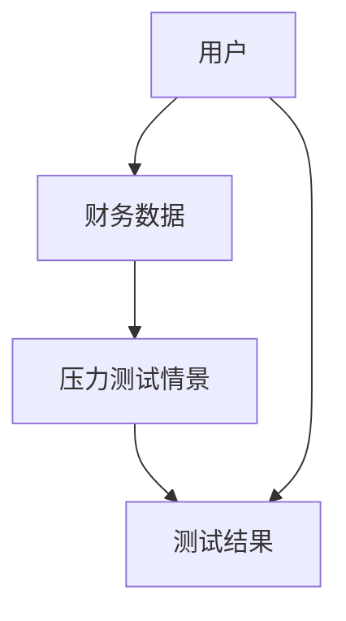
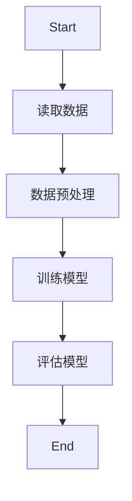
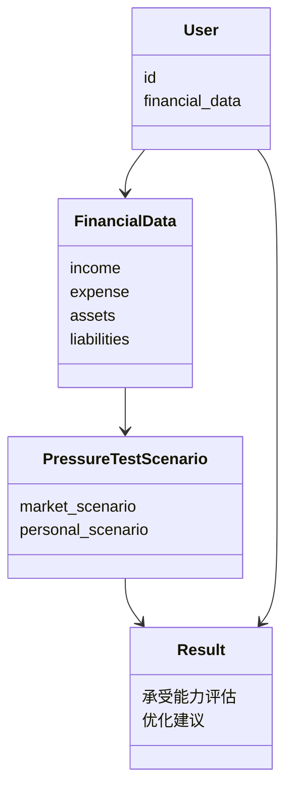

                 


# 智能个人财务压力测试工具

> 关键词：智能财务、压力测试、AI算法、个人理财、风险管理

> 摘要：本文详细介绍了智能个人财务压力测试工具的设计与实现，从背景介绍到系统架构设计，再到项目实战，全面解析了该工具的核心原理与应用场景。通过本文，读者可以深入了解如何利用AI技术提升个人财务风险管理能力。

---

## 第一部分：背景介绍

### 第1章：问题背景

#### 1.1 个人财务管理的现状与挑战

在当今经济环境下，个人财务管理变得越来越复杂。人们需要面对通货膨胀、市场波动、突发事件等多种不确定性因素，这些都可能对个人财务状况造成重大影响。传统的财务管理方法往往依赖人工计算和经验判断，难以应对复杂多变的经济环境。

#### 1.2 传统财务压力测试的局限性

传统的财务压力测试方法通常基于历史数据和固定模型，难以适应实时变化的市场情况。此外，传统方法往往需要大量人工干预，效率低下，且容易受到人为因素的影响。

#### 1.3 AI技术在个人财务管理中的应用潜力

随着人工智能技术的快速发展，AI在金融领域的应用越来越广泛。通过机器学习算法，可以实时分析海量数据，预测市场趋势，并提供个性化的财务建议。AI技术为个人财务压力测试提供了新的可能性。

### 第2章：问题描述

#### 2.1 个人财务压力测试的核心问题

个人财务压力测试的核心问题是评估个人在面对突发事件或市场波动时的财务承受能力。这需要考虑多种因素，包括收入、支出、资产、负债、投资组合等。

#### 2.2 传统压力测试方法的不足

传统压力测试方法通常基于假设情景，缺乏动态性和个性化。例如，传统方法可能假设失业率上升5%，但这种方法难以覆盖所有可能的极端情况，且不同个体的财务状况差异较大。

#### 2.3 智能工具在压力测试中的优势

智能个人财务压力测试工具可以通过机器学习算法，实时分析用户的财务数据，并根据市场动态生成个性化的压力测试情景。这种方法更加灵活、精准，能够更好地应对复杂多变的经济环境。

### 第3章：问题解决

#### 3.1 智能个人财务压力测试工具的定义

智能个人财务压力测试工具是一种基于AI技术的财务风险管理工具，旨在通过实时数据分析和智能算法，评估个人在各种极端情景下的财务承受能力，并提供优化建议。

#### 3.2 工具的核心功能与目标

- **数据采集与分析**：收集用户的财务数据，包括收入、支出、资产、负债等，并进行实时分析。
- **情景生成**：基于历史数据和市场动态，生成多种极端情景。
- **压力测试**：模拟用户在不同情景下的财务状况，评估其承受能力。
- **优化建议**：根据测试结果，提供个性化的财务优化建议。

#### 3.3 工具的适用场景与用户群体

- **适用场景**：个人财务规划、风险管理、投资决策等。
- **用户群体**：个人用户、家庭用户、理财顾问等。

### 第4章：边界与外延

#### 4.1 工具的边界

智能个人财务压力测试工具专注于个人财务领域的压力测试，不涉及企业财务或其他领域的压力测试。

#### 4.2 相关领域的区别与联系

- **区别**：与其他财务工具相比，智能压力测试工具更加注重极端情景下的财务评估。
- **联系**：与财务规划、风险管理等领域密切相关。

#### 4.3 工具的未来发展与扩展

随着技术的发展，智能个人财务压力测试工具将更加智能化、个性化，可能扩展到更多财务领域，如投资组合优化、税务规划等。

---

## 第二部分：核心概念与联系

### 第2章：核心概念与联系

#### 2.1 核心概念原理

智能个人财务压力测试工具的核心原理是通过机器学习算法，分析用户的财务数据，生成极端情景，并评估用户在这些情景下的财务状况。这种方法能够帮助用户更好地应对潜在的财务风险。

#### 2.2 核心概念属性对比

| 属性 | 传统压力测试 | 智能压力测试 |
|------|--------------|--------------|
| 数据来源 | 固定情景假设 | 实时数据分析 |
| 方法 | 静态分析 | 动态分析 |
| 精度 | 较低 | 较高 |
| 个性化 | 较差 | 较好 |

#### 2.3 ER实体关系图



---

## 第三部分：算法原理讲解

### 第3章：算法原理概述

#### 3.1 算法选择与原理

常用的算法包括随机森林、支持向量机（SVM）和神经网络等。本文采用随机森林算法，因为其在处理非线性关系和高维数据时表现优异。

#### 3.2 数据预处理

- 数据清洗：处理缺失值、异常值。
- 数据标准化：将数据标准化到统一范围。
- 数据分割：将数据分为训练集和测试集。

#### 3.3 算法实现



### 第4章：数学模型与公式

#### 4.1 风险价值（VaR）

$$ VaR_{\alpha}(P) = \text{最小的损失值，使得在}\alpha\text{置信水平下，损失不超过该值} $$

#### 4.2 信用风险价值（CVaR）

$$ CVaR_{\alpha}(P) = \frac{1}{1-\alpha} \int_{\alpha}^{1} VaR_{p}(P) dp $$

---

## 第四部分：系统分析与架构设计

### 第5章：系统分析

#### 5.1 问题场景介绍

用户需要一个工具，实时监控其财务状况，并在极端情景下评估其承受能力。

#### 5.2 系统功能设计



---

## 第五部分：项目实战

### 第6章：项目实战

#### 6.1 环境安装

- 安装Python
- 安装必要的库（如pandas、scikit-learn）

#### 6.2 核心实现

```python
import pandas as pd
from sklearn.ensemble import RandomForestRegressor
from sklearn.model_selection import train_test_split

# 数据加载
data = pd.read_csv('financial_data.csv')

# 数据预处理
X = data.drop('target', axis=1)
y = data['target']

# 划分训练集和测试集
X_train, X_test, y_train, y_test = train_test_split(X, y, test_size=0.2)

# 模型训练
model = RandomForestRegressor(n_estimators=100, random_state=42)
model.fit(X_train, y_train)

# 模型评估
score = model.score(X_test, y_test)
print(f'模型得分：{score}')
```

#### 6.3 代码解读

- 数据加载：读取CSV文件中的数据。
- 数据预处理：删除目标变量，将其余作为特征。
- 划分数据集：将数据分为训练集和测试集。
- 模型训练：使用随机森林算法训练模型。
- 模型评估：评估模型的准确性。

---

## 第六部分：总结

### 第7章：总结

#### 7.1 最佳实践

- 定期更新财务数据
- 根据测试结果调整财务计划
- 结合多种算法进行综合评估

#### 7.2 小结

智能个人财务压力测试工具通过AI技术，帮助用户更好地应对财务风险，提升财务管理效率。

#### 7.3 注意事项

- 数据隐私保护
- 确保模型的准确性
- 定期更新模型

#### 7.4 拓展阅读

- 《机器学习实战》
- 《风险管理与压力测试》

---

通过本文的详细讲解，读者可以全面了解智能个人财务压力测试工具的设计与实现，掌握其核心原理和实际应用。

