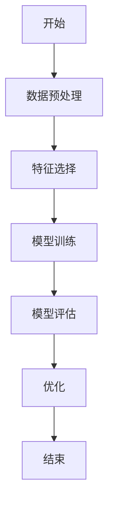
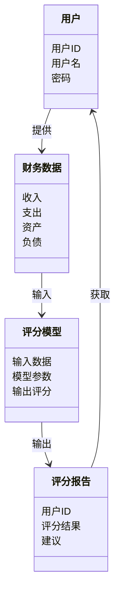
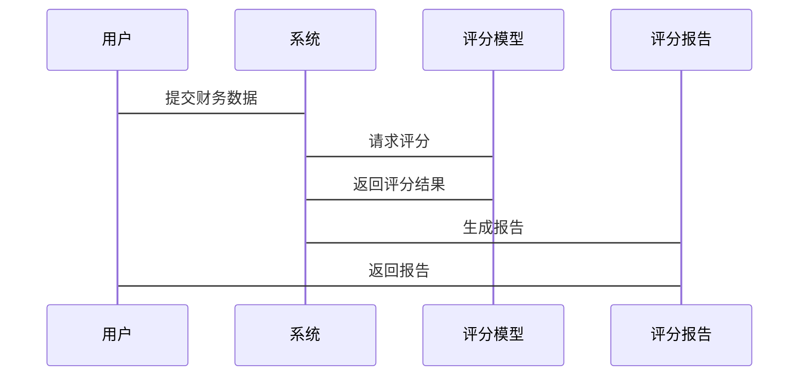

                 


# 《智能个人财务健康评分系统》

---

## 关键词：
智能评分系统、个人财务管理、数据特征分析、评分模型、机器学习算法、系统架构设计

---

## 摘要：
本文将深入探讨智能个人财务健康评分系统的构建与实现，从背景分析到核心算法，从系统架构设计到项目实战，全面解析如何利用人工智能技术帮助个人实现财务管理的智能化与个性化。文章将通过详细的步骤分析、直观的图表展示和实际案例解读，帮助读者理解并掌握智能评分系统的核心原理与实践方法。

---

## 目录大纲：

### 第一部分: 智能个人财务健康评分系统概述

### 第1章: 个人财务健康评分系统背景介绍

#### 1.1 问题背景与问题描述
- 1.1.1 个人财务管理的重要性
- 1.1.2 当前财务管理中的痛点
- 1.1.3 智能化评分系统的需求

#### 1.2 智能个人财务健康评分系统的定义
- 1.2.1 系统的核心目标
- 1.2.2 系统的边界与外延
- 1.2.3 系统的核心要素组成

#### 1.3 系统的技术基础与实现方式
- 1.3.1 数据采集与处理
- 1.3.2 评分模型构建
- 1.3.3 系统实现的技术路线

#### 1.4 当前智能评分系统的现状与发展趋势
- 1.4.1 现有系统的优缺点分析
- 1.4.2 智能评分系统的未来发展趋势

#### 1.5 本章小结

---

### 第2章: 智能个人财务健康评分系统的核心概念与联系

#### 2.1 核心概念原理
- 2.1.1 财务健康评分模型的构建原理
- 2.1.2 数据特征的提取与分析
- 2.1.3 评分标准的制定与优化

#### 2.2 核心概念属性特征对比表
- 2.2.1 数据特征对比表
- 2.2.2 评分标准对比表
- 2.2.3 系统功能对比表

#### 2.3 ER实体关系图架构
```mermaid
er
    actor: 用户
    system: 智能评分系统
    financial_data: 财务数据
    score_model: 评分模型
    report: 评分报告
    actor --> financial_data: 提供
    financial_data --> score_model: 输入
    score_model --> report: 输出
    actor <-- report: 获取
    system --> score_model: 调用
```

#### 2.4 本章小结

---

### 第3章: 智能个人财务健康评分系统的算法原理

#### 3.1 算法原理概述
- 3.1.1 评分模型的选择
- 3.1.2 算法的优缺点分析
- 3.1.3 算法实现的步骤

#### 3.2 算法原理详细讲解
- 3.2.1 数据预处理
  - 数据清洗
  - 数据标准化
  - 数据特征提取
- 3.2.2 特征选择
  - 单变量特征选择
  - 嵌入式特征选择
- 3.2.3 模型训练
  - 选择合适的机器学习算法（如决策树、随机森林）
  - 模型训练与优化
- 3.2.4 模型评估与优化
  - 交叉验证
  - 模型调参

#### 3.3 算法流程图


#### 3.4 数学模型与公式
- 信息增益公式：
  $$ \text{信息增益}(D, A) = H(D) - H(D|A) $$
- 熵公式：
  $$ H(D) = -\sum_{i=1}^{n} p_i \log p_i $$

#### 3.5 本章小结

---

### 第4章: 智能个人财务健康评分系统的系统分析与架构设计

#### 4.1 问题场景介绍
- 系统目标
- 使用场景
- 用户角色

#### 4.2 系统功能设计
- 领域模型类图


#### 4.3 系统架构设计
- 系统架构图


#### 4.4 系统接口设计
- 接口描述
- 接口交互流程
- 接口示例代码

#### 4.5 系统交互设计
- 交互流程图


#### 4.6 本章小结

---

### 第5章: 智能个人财务健康评分系统项目实战

#### 5.1 项目环境安装与配置
- Python安装与配置
- 开发工具安装
- 依赖库安装（如scikit-learn、pandas等）

#### 5.2 系统核心功能实现
- 数据采集与预处理代码
- 评分模型训练代码
- 评分报告生成代码

#### 5.3 代码实现与解读
- 数据预处理代码示例
```python
import pandas as pd
from sklearn.preprocessing import StandardScaler

data = pd.read_csv('financial_data.csv')
data = data.dropna()
scaler = StandardScaler()
data_scaled = scaler.fit_transform(data)
```

- 模型训练代码示例
```python
from sklearn.ensemble import RandomForestClassifier

model = RandomForestClassifier(n_estimators=100)
model.fit(data_scaled, labels)
```

#### 5.4 实际案例分析
- 数据分析与评分解读
- 模型优化与效果评估
- 实际应用中的问题与解决方案

#### 5.5 本章小结

---

### 第6章: 智能个人财务健康评分系统的最佳实践与总结

#### 6.1 最佳实践
- 数据质量管理
- 模型优化策略
- 系统维护与更新

#### 6.2 小结与展望
- 本文总结
- 系统未来发展方向
- 对读者的建议与鼓励

---

## 附录
- 代码库链接
- 参考文献
- 进一步阅读的资源

---

以上是《智能个人财务健康评分系统》的技术博客文章的完整目录大纲，涵盖了从理论到实践的各个方面，内容详实且结构清晰。

