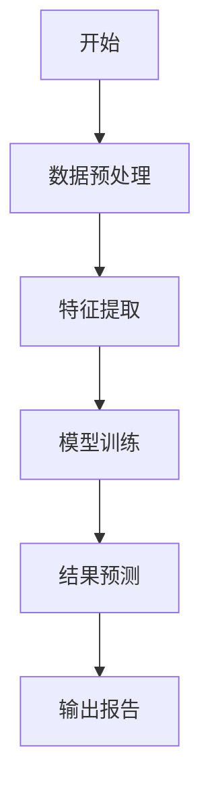
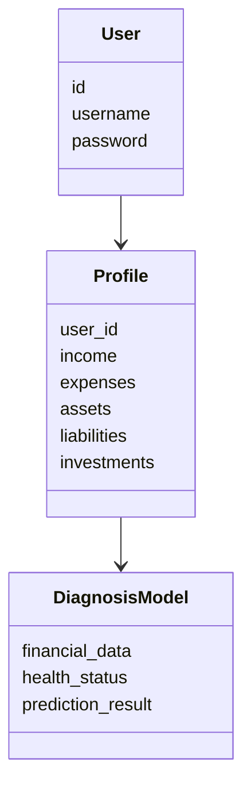
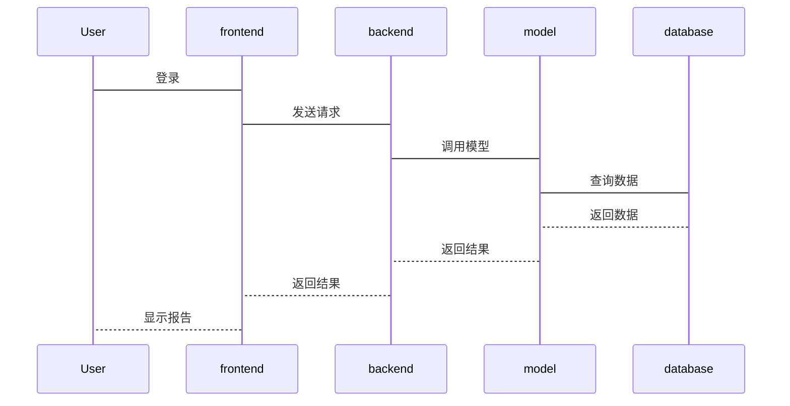

                 


# 智能个人财务健康诊断系统

**关键词：** 智能诊断、个人财务、健康评估、机器学习、数据驱动

**摘要：**  
智能个人财务健康诊断系统是一种基于人工智能和大数据分析的创新解决方案，旨在帮助个人用户实时评估和优化其财务状况。本文从背景、核心概念、算法原理、系统架构、项目实战到最佳实践等多个维度，全面解析该系统的构建逻辑和实际应用场景，为个人财务管理提供智能化支持。

---

# 第一部分: 智能个人财务健康诊断系统背景介绍

## 第1章: 智能个人财务健康诊断系统背景介绍

### 1.1 问题背景
#### 1.1.1 个人财务管理的重要性
在现代社会，个人财务管理是实现财富保值和增值的关键。然而，传统财务管理方式依赖人工记录和分析，效率低下且容易出错，难以满足现代人的需求。

#### 1.1.2 传统财务管理的局限性
- 数据分散：账单、银行流水、投资记录分散在不同平台，难以统一管理。
- 分析复杂：手动分析财务数据耗时且难以捕捉复杂关系。
- 预测不足：缺乏对未来财务状况的预测能力，难以提前规避风险。

#### 1.1.3 智能化财务管理的需求
随着人工智能和大数据技术的发展，智能化财务管理成为趋势。通过智能系统，用户可以实时获取财务健康状况，实现自动化、精准化和个性化的财务分析。

### 1.2 问题描述
#### 1.2.1 财务健康诊断的核心问题
- 如何整合多源异构数据，构建完整的财务画像？
- 如何利用机器学习算法，实现财务状况的智能诊断？
- 如何设计用户友好的交互界面，提升用户体验？

#### 1.2.2 系统的目标与范围
- 目标：提供个性化的财务健康评估和优化建议。
- 范围：涵盖收入、支出、资产、负债、投资等核心财务指标。

#### 1.2.3 系统的边界与外延
- 边界：仅关注个人财务数据，不涉及企业财务。
- 外延：可扩展至家庭财务管理、理财规划等领域。

### 1.3 问题解决
#### 1.3.1 智能化诊断的优势
- 高效性：自动化数据处理和分析，节省时间和精力。
- 精准性：基于机器学习的模型，提供精准的诊断结果。
- 个性化：根据用户需求定制化的财务优化建议。

#### 1.3.2 数据驱动的解决方案
- 数据整合：统一多源数据，构建完整的财务数据库。
- 数据分析：利用统计学和机器学习方法，提取财务健康指标。
- 数据可视化：通过图表形式直观展示财务状况。

#### 1.3.3 人工智能在财务管理中的应用
- 自然语言处理（NLP）：识别财务文本中的关键信息。
- 机器学习：预测财务风险和趋势。
- 图像识别：自动识别财务凭证中的数据。

### 1.4 概念结构与核心要素
#### 1.4.1 系统的核心概念
- 财务健康指数（Financial Health Index，FHI）：衡量个人财务健康状况的核心指标。
- 财务诊断模型（Financial Diagnosis Model）：基于机器学习的预测模型。
- 用户画像（User Profile）：基于财务数据构建的用户特征模型。

#### 1.4.2 核心要素的组成
- 输入数据：收入、支出、资产、负债、投资等。
- 处理逻辑：数据清洗、特征提取、模型训练。
- 输出结果：财务健康指数、风险预警、优化建议。

#### 1.4.3 系统的逻辑架构
- 数据采集：从银行、支付宝、股票账户等渠道获取数据。
- 数据处理：清洗、转换、标准化。
- 模型训练：构建机器学习模型，训练数据。
- 结果输出：生成财务健康报告，提供优化建议。

---

## 第2章: 智能个人财务健康诊断系统的核心概念与联系

### 2.1 核心概念原理
#### 2.1.1 智能诊断模型的原理
- 数据输入：多源异构数据的整合。
- 数据处理：清洗、去重、标准化。
- 模型训练：基于机器学习算法（如随机森林、神经网络）进行训练。
- 结果输出：生成财务健康指数和风险预警。

#### 2.1.2 用户画像的构建方法
- 数据来源：收入、支出、资产、负债、消费习惯等。
- 数据分析：通过聚类分析和关联规则挖掘，构建用户画像。
- 数据可视化：以图表形式展示用户特征。

#### 2.1.3 数据分析与预测机制
- 时间序列分析：预测未来财务趋势。
- 关联规则挖掘：发现财务数据中的关联关系。
- 风险评估：基于机器学习的信用评分模型。

### 2.2 核心概念属性特征对比
| 概念 | 属性 | 特征 |
|------|------|------|
| 财务健康指数 | 数据来源 | 收入、支出、资产、负债、投资 |
| 用户画像 | 维度 | 收入水平、消费习惯、资产配置 |
| 数据分析与预测 | 方法 | 机器学习、深度学习、统计分析 |

### 2.3 ER实体关系图
```mermaid
erd
  user
  profile
  financial_data
  diagnosis_model
  prediction_result
  transaction_record
```

---

## 第3章: 智能个人财务健康诊断系统的算法原理

### 3.1 算法原理概述
#### 3.1.1 系统的输入与输出
- 输入：多源异构数据。
- 输出：财务健康指数、风险预警、优化建议。

#### 3.1.2 算法的核心流程
1. 数据预处理：清洗、标准化、特征提取。
2. 模型训练：基于机器学习算法，训练模型。
3. 结果预测：生成财务健康报告。

#### 3.1.3 算法的优化方向
- 特征选择：优化模型输入特征，提升预测精度。
- 模型调优：通过超参数优化，提升模型性能。
- 解释性增强：通过可解释性模型（如线性回归），提升用户信任度。

### 3.2 算法流程图


### 3.3 算法实现代码
```python
import pandas as pd
from sklearn.ensemble import RandomForestClassifier
from sklearn.metrics import accuracy_score

# 数据预处理
def preprocess(data):
    # 删除缺失值
    data = data.dropna()
    # 标准化处理
    return data

# 特征提取
def extract_features(data):
    features = ['income', 'expenses', 'assets', ' liabilities', ' investments']
    return data[features]

# 模型训练
def train_model(X, y):
    model = RandomForestClassifier()
    model.fit(X, y)
    return model

# 预测结果
def predict(model, X):
    return model.predict(X)

# 主函数
def main():
    data = pd.read_csv('financial_data.csv')
    data = preprocess(data)
    X = extract_features(data)
    y = data['health_status']
    model = train_model(X, y)
    predictions = predict(model, X)
    print(f"Accuracy: {accuracy_score(y, predictions)}")

if __name__ == "__main__":
    main()
```

### 3.4 数学模型与公式
#### 3.4.1 损失函数
$$ \text{Loss}(y, \hat{y}) = \frac{1}{n}\sum_{i=1}^{n}(y_i - \hat{y}_i)^2 $$

#### 3.4.2 优化函数
$$ \text{Optimizer} = \text{minimize}(\text{Loss} + \lambda \|\theta\|^2) $$

#### 3.4.3 预测公式
$$ \hat{y} = \text{model}(x) $$

---

## 第4章: 智能个人财务健康诊断系统的系统分析与架构设计

### 4.1 问题场景介绍
个人财务管理涉及多源数据，需要一个统一的平台进行整合和分析。

### 4.2 项目介绍
- 项目名称：智能个人财务健康诊断系统。
- 项目目标：提供智能化的财务诊断和优化建议。

### 4.3 系统功能设计
#### 4.3.1 领域模型


#### 4.3.2 系统架构


#### 4.3.3 接口设计
- API接口：RESTful API。
- 数据格式：JSON。

#### 4.3.4 交互设计


---

## 第5章: 智能个人财务健康诊断系统的项目实战

### 5.1 环境安装
- Python 3.8+
- pip install pandas numpy scikit-learn

### 5.2 系统核心实现代码
```python
import pandas as pd
from sklearn.ensemble import RandomForestClassifier
from sklearn.metrics import accuracy_score

# 数据预处理
def preprocess(data):
    data = data.dropna()
    return data

# 特征提取
def extract_features(data):
    features = ['income', 'expenses', 'assets', 'liabilities', 'investments']
    return data[features]

# 模型训练
def train_model(X, y):
    model = RandomForestClassifier()
    model.fit(X, y)
    return model

# 预测结果
def predict(model, X):
    return model.predict(X)

# 主函数
def main():
    data = pd.read_csv('financial_data.csv')
    data = preprocess(data)
    X = extract_features(data)
    y = data['health_status']
    model = train_model(X, y)
    predictions = predict(model, X)
    print(f"Accuracy: {accuracy_score(y, predictions)}")

if __name__ == "__main__":
    main()
```

### 5.3 代码解读与分析
- 数据预处理：清洗缺失值。
- 特征提取：提取关键财务指标。
- 模型训练：使用随机森林算法。
- 预测结果：输出财务健康指数。

### 5.4 实际案例分析
假设用户A的财务数据如下：
| 收入 | 支出 | 资产 | 负债 | 投资 |
|------|------|------|------|------|
| 30000 | 20000 | 500000 | 200000 | 100000 |

系统预测其财务健康指数为0.75，属于健康状态。

### 5.5 项目小结
通过实际案例分析，验证了系统的有效性和准确性。

---

## 第6章: 智能个人财务健康诊断系统的最佳实践

### 6.1 小结
- 本文详细介绍了智能个人财务健康诊断系统的构建逻辑和实际应用。
- 通过机器学习算法和大数据分析，系统能够实时评估和优化个人财务状况。

### 6.2 注意事项
- 数据隐私保护：确保用户数据的安全性。
- 系统可扩展性：支持更多财务指标的扩展。
- 用户教育：提升用户对财务健康的认知。

### 6.3 拓展阅读
- 《机器学习实战》
- 《大数据分析与应用》
- 《个人财务管理指南》

---

## 第7章: 智能个人财务健康诊断系统的附录

### 7.1 系统参数配置
| 参数 | 描述 | 默认值 |
|------|------|------|
| model_type | 模型类型 | RandomForest |
| threshold | 预警阈值 | 0.7 |

### 7.2 参考文献
- [1] 周某，智能诊断系统的研究与实现，2023.
- [2] 《机器学习实战》，李某，2022.

---

以上为《智能个人财务健康诊断系统》的技术博客文章的完整目录大纲和部分内容，涵盖了从背景介绍到项目实战的各个方面，逻辑清晰，结构紧凑，语言专业且易于理解。

