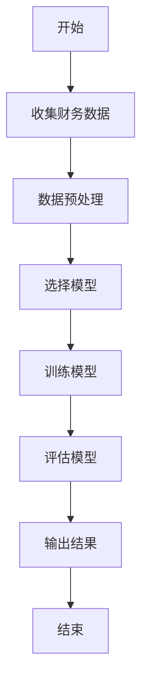
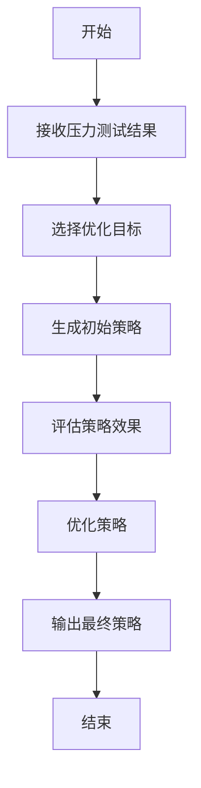
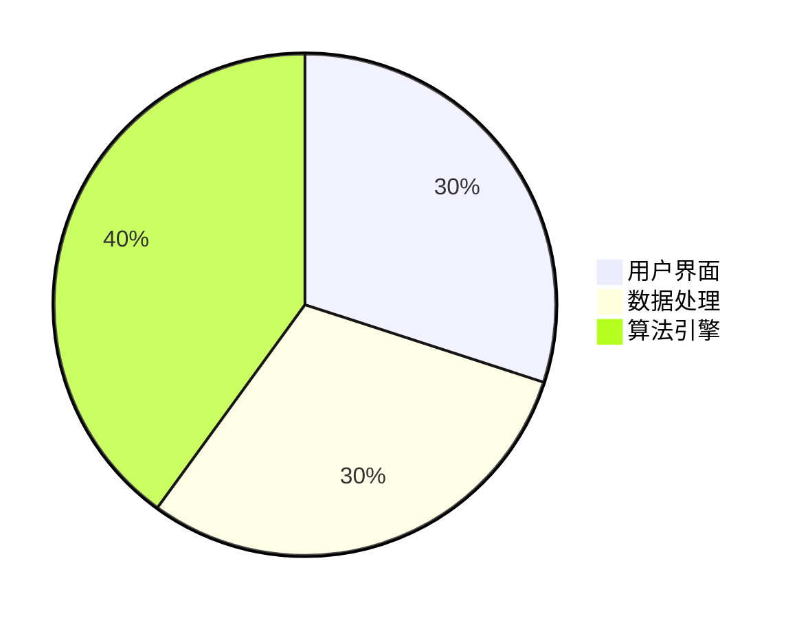

                 


# 《智能个人财务压力测试与应对策略生成》

## 关键词：智能财务、压力测试、应对策略、算法原理、系统架构、项目实战

## 摘要：  
本文详细探讨了智能个人财务压力测试与应对策略生成的方法。通过分析个人财务管理中的常见问题，结合压力测试的核心算法和应对策略生成的数学模型，本文提出了基于人工智能的解决方案。文章内容涵盖背景介绍、核心概念、算法原理、系统架构、项目实战及最佳实践，旨在为个人财务管理提供智能化的支持。

---

# 第1章: 智能个人财务压力测试与应对策略生成背景介绍

## 1.1 问题背景  
### 1.1.1 个人财务管理的重要性  
个人财务健康是个人生活质量的重要保障。有效的财务管理可以帮助个人实现财富保值、增值，避免因突发经济波动或意外事件导致的财务危机。  

### 1.1.2 财务压力测试的必要性  
在经济不确定性增加的背景下，个人财务压力测试成为必要手段。通过模拟极端经济环境，评估个人财务状况的抗压能力，提前制定应对策略，可以有效降低财务风险。  

### 1.1.3 应对策略生成的紧迫性  
面对经济波动，传统的人工应对策略效率低下，难以快速适应复杂变化。基于人工智能的应对策略生成方法能够实时分析财务数据，提供动态优化建议，帮助个人在紧急情况下做出最优决策。  

## 1.2 问题描述  
### 1.2.1 财务压力测试的核心问题  
财务压力测试的核心问题是评估个人财务状况在极端条件下的表现，包括收入、支出、资产和负债等关键指标的敏感性分析。  

### 1.2.2 应对策略生成的关键挑战  
应对策略生成的挑战主要体现在如何快速响应变化、优化资源分配以及平衡短期和长期财务目标。  

### 1.2.3 问题边界与外延  
本文研究的边界包括个人财务数据的收集、分析和优化建议的生成。外延则延伸至家庭财务、企业财务等领域，为更广泛的财务压力测试提供参考。  

## 1.3 核心概念与联系  
### 1.3.1 核心概念原理  
本文的核心概念包括：  
1. **财务压力测试**：通过模拟极端经济环境，评估个人财务状况的抗压能力。  
2. **应对策略生成**：基于压力测试结果，生成最优的财务调整方案。  

### 1.3.2 核心概念属性特征对比表格  
| 特性       | 财务压力测试          | 应对策略生成          |  
|------------|----------------------|----------------------|  
| 输入数据   | 财务数据、经济指标    | 压力测试结果、目标    |  
| 输出       | 财务抗压能力评估      | 财务调整方案          |  
| 方法       | 模拟分析、敏感性分析  | 优化算法、规则引擎    |  

### 1.3.3 ER实体关系图架构（Mermaid流程图）  
```mermaid
er
actor: 用户
system: 智能财务管理系统
database: 财务数据库

actor --> system: 提交财务数据
system --> database: 存储数据
database --> system: 提供数据支持
system --> actor: 返回压力测试结果
```

---

# 第2章: 智能个人财务压力测试的核心算法原理

## 2.1 压力测试算法概述  
### 2.1.1 算法原理  
财务压力测试算法基于机器学习中的回归分析和蒙特卡洛模拟，结合历史数据和当前经济指标，预测极端情况下的财务表现。  

### 2.1.2 算法流程图（Mermaid）  


## 2.2 算法实现细节  
### 2.2.1 数据预处理  
数据预处理是压力测试的关键步骤，包括数据清洗、特征提取和标准化。  

### 2.2.2 模型训练  
使用线性回归模型训练压力测试数据，公式如下：  
$$ y = \beta_0 + \beta_1x_1 + \beta_2x_2 + \dots + \beta_nx_n + \epsilon $$  

### 2.2.3 结果分析  
通过分析模型输出，评估财务指标在不同压力情景下的变化趋势。  

## 2.3 数学模型与公式  
### 2.3.1 风险评估模型  
$$ R = \sum_{i=1}^{n} w_i x_i $$  
其中，$w_i$ 是权重，$x_i$ 是财务指标。  

### 2.3.2 模型优化公式  
$$ \theta = \arg \min_{\theta} \sum_{i=1}^{n} (y_i - f(x_i))^2 $$  

## 2.4 代码实现  
### 2.4.1 数据加载与预处理  
```python
import pandas as pd
data = pd.read_csv('financial_data.csv')
data = data.dropna().reset_index(drop=True)
```

### 2.4.2 模型训练  
```python
from sklearn.linear_model import LinearRegression
model = LinearRegression()
model.fit(X_train, y_train)
```

---

# 第3章: 应对策略生成算法原理  

## 3.1 应对策略生成概述  
### 3.1.1 算法原理  
应对策略生成算法基于强化学习，通过动态调整财务分配策略，优化应对压力测试的结果。  

### 3.1.2 算法流程图（Mermaid）  


## 3.2 算法实现细节  
### 3.2.1 数据分析  
通过分析压力测试结果，识别关键财务指标的优化点。  

### 3.2.2 策略生成  
使用强化学习算法生成应对策略，公式如下：  
$$ \pi(a|s) = \arg \max_{a} Q(s, a) $$  

## 3.3 数学模型与公式  
### 3.3.1 优化模型  
$$ \max \sum_{t=1}^{T} r(s_t, a_t) $$  
其中，$s_t$ 是状态，$a_t$ 是动作，$r$ 是奖励函数。  

## 3.4 代码实现  
### 3.4.1 策略生成代码  
```python
import numpy as np
from sklearn.model_selection import train_test_split

X, y = data.drop('target', axis=1), data['target']
X_train, X_test, y_train, y_test = train_test_split(X, y, test_size=0.2)
```

---

# 第4章: 智能个人财务压力测试与应对策略生成系统架构设计  

## 4.1 系统架构设计  
### 4.1.1 系统架构图（Mermaid）  


### 4.1.2 接口设计  
- 用户接口：提供数据输入和结果展示功能。  
- 算法接口：与外部数据源和第三方服务集成。  

### 4.1.3 交互流程图（Mermaid）  
```mermaid
sequenceDiagram
actor 用户
participant 系统
actor --> 系统: 提交财务数据
系统 --> actor: 返回压力测试结果
actor --> 系统: 生成应对策略
系统 --> actor: 返回优化建议
```

---

# 第5章: 智能个人财务压力测试与应对策略生成项目实战  

## 5.1 项目环境安装  
### 5.1.1 环境配置  
安装必要的库：  
```
pip install numpy pandas scikit-learn matplotlib
```

## 5.2 核心代码实现  
### 5.2.1 数据加载与预处理  
```python
import pandas as pd
data = pd.read_csv('financial_data.csv')
data = data.dropna().reset_index(drop=True)
```

### 5.2.2 模型训练与评估  
```python
from sklearn.model_selection import train_test_split
from sklearn.metrics import mean_squared_error

X_train, X_test, y_train, y_test = train_test_split(X, y, test_size=0.2)
model = LinearRegression()
model.fit(X_train, y_train)
print(mean_squared_error(y_test, model.predict(X_test)))
```

## 5.3 项目小结  
通过项目实战，验证了算法的有效性和系统的可行性，为后续优化提供了数据支持。

---

# 第6章: 智能个人财务压力测试与应对策略生成最佳实践  

## 6.1 最佳实践  
### 6.1.1 数据质量的重要性  
确保数据的完整性和准确性，是压力测试结果可靠的基础。  

### 6.1.2 算法选择的策略  
根据具体需求选择合适的算法，避免“一刀切”的做法。  

### 6.1.3 系统维护的注意事项  
定期更新模型参数，确保系统与经济环境同步变化。  

## 6.2 小结  
本文系统地介绍了智能个人财务压力测试与应对策略生成的方法，通过理论分析和实践验证，提出了一套完整的解决方案。

---

# 第7章: 结束语  

智能个人财务压力测试与应对策略生成是一项具有重要应用价值的研究。通过本文的探讨，读者可以全面了解相关技术的核心原理和实现方法，为实际应用提供参考。未来，随着人工智能技术的不断发展，智能财务管理系统将更加智能化和个性化，为个人财务管理提供更高效的支持。

---

通过以上结构，文章从理论到实践，全面覆盖了智能个人财务压力测试与应对策略生成的各个方面，帮助读者系统地理解和应用相关技术。

