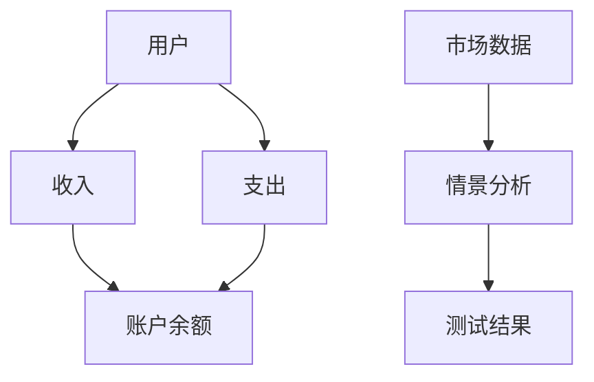
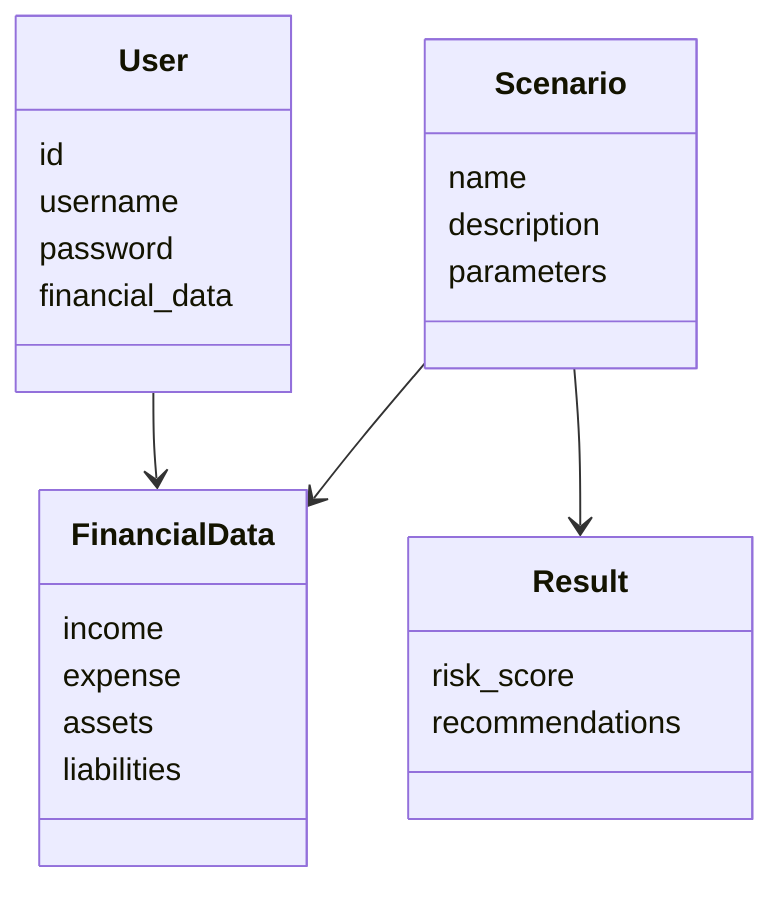
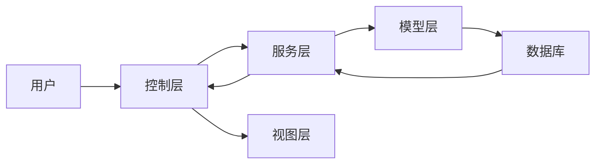

                 


# 智能个人财务压力测试工具

## 关键词：智能财务压力测试，人工智能，大数据分析，风险管理，个人财务管理

## 摘要：  
在当今快速变化的经济环境中，个人财务管理变得日益复杂。为了帮助个人有效管理财务风险，智能个人财务压力测试工具应运而生。本文将详细介绍该工具的设计理念、实现技术及其在实际应用中的价值。通过结合人工智能和大数据分析，该工具能够帮助用户评估不同压力情景下的财务状况，从而制定更科学的财务决策。文章从背景介绍、核心概念、算法原理、系统架构到项目实战，全面解析智能个人财务压力测试工具的实现过程，为读者提供深入的技术见解。

---

# 第1章: 背景介绍

## 1.1 财务压力测试的必要性  
在现代经济中，个人财务风险的来源多种多样，包括失业、疾病、市场波动等。这些风险可能对个人的财务状况造成重大影响，甚至导致财务危机。因此，如何有效评估和管理这些风险，成为个人财务管理的重要课题。财务压力测试作为一种重要的风险管理工具，能够帮助个人在不同压力情景下评估其财务健康状况，并制定应对策略。

### 1.1.1 个人财务风险的来源  
个人财务风险主要来源于以下几个方面：  
1. **收入波动**：如失业、降薪或收入中断。  
2. **支出增加**：如医疗费用、子女教育费用突然增加。  
3. **市场波动**：如投资亏损、房地产市场变化等。  
4. **债务风险**：如信用卡债务、贷款逾期等。  

### 1.1.2 压力测试在个人财务管理中的作用  
压力测试通过模拟不同情景，评估个人财务状况在极端情况下的表现，帮助用户识别潜在风险，并制定应对措施。例如，通过压力测试，用户可以了解在失业情况下，其积蓄能够支撑多久的生活开支，从而提前规划财务安全。

### 1.1.3 数字化工具在压力测试中的优势  
传统的压力测试通常依赖手工计算，效率低且难以应对复杂情景。而数字化工具通过结合人工智能和大数据分析，能够快速生成多种压力情景下的财务结果，并提供个性化的建议，显著提高了效率和准确性。

## 1.2 智能个人财务压力测试工具的概念  
智能个人财务压力测试工具是一种基于人工智能和大数据分析的数字化工具，旨在帮助个人用户评估其财务状况在不同压力情景下的表现，并提供优化建议。该工具的核心功能包括：  
1. 数据采集：收集用户的财务数据，如收入、支出、资产和负债等。  
2. 情景模拟：生成多种压力情景，如失业、市场崩盘等。  
3. 风险评估：计算用户在不同情景下的财务健康状况，生成风险指标。  
4. 优化建议：根据评估结果，提供个性化的财务优化建议。

## 1.3 工具的目标与价值  
智能个人财务压力测试工具的目标是帮助用户更好地理解和管理财务风险，提升财务安全性和稳定性。其价值体现在以下几个方面：  
1. **风险预警**：及时发现潜在的财务风险，避免危机发生。  
2. **决策支持**：为用户提供科学的财务决策依据。  
3. **教育意义**：通过压力测试，用户能够更好地理解财务管理和风险控制的重要性。

## 1.4 工具的技术基础  
智能个人财务压力测试工具的技术基础主要包括以下几方面：  
1. **人工智能**：用于数据建模、情景生成和风险评估。  
2. **大数据分析**：利用大数据技术处理和分析用户财务数据。  
3. **交互式界面设计**：确保用户能够方便地使用工具并理解测试结果。

---

# 第2章: 压力测试的核心概念与联系

## 2.1 核心概念原理  
压力测试的核心在于模拟不同情景，评估财务状况的变化。以下是压力测试的主要步骤：  
1. **数据采集**：收集用户的收入、支出、资产和负债等数据。  
2. **情景生成**：根据历史数据或假设生成多种压力情景。  
3. **模拟计算**：在不同情景下计算用户的财务状况变化。  
4. **结果分析**：生成风险指标，并提出优化建议。

## 2.2 核心概念属性特征对比表  
以下是压力测试与传统财务分析的对比表：  

| 概念       | 数据来源   | 方法         | 输出结果       |
|------------|------------|--------------|----------------|
| 压力测试   | 财务数据、市场数据 | 蒙特卡洛模拟、情景分析 | 风险指标、建议 |
| 传统分析   | 财务报表     | 确认测试、趋势分析 | 财务健康状况   |

## 2.3 ER实体关系图  
以下是压力测试的核心实体关系图：  



---

# 第3章: 算法原理讲解

## 3.1 蒙特卡洛模拟算法  
蒙特卡洛模拟是一种基于随机数的模拟方法，常用于压力测试中。以下是其算法流程：  

```mermaid
graph TD
    Start --> Initialize Parameters
    Initialize Parameters --> Generate Random Inputs
    Generate Random Inputs --> Calculate Outcomes
    Calculate Outcomes --> Output Results
    Output Results --> End
```

### 3.1.1 算法实现  
以下是蒙特卡洛模拟的Python代码示例：  

```python
import random

def monte_carlo_simulation(n_iter=1000):
    results = []
    for _ in range(n_iter):
        # 模拟收入和支出的随机变化
        income = random.uniform(10000, 20000)
        expense = random.uniform(5000, 15000)
        # 计算净现金流
        cash_flow = income - expense
        results.append(cash_flow)
    return results

# 执行模拟并输出结果
results = monte_carlo_simulation()
print(results)
```

## 3.2 线性回归模型  
线性回归模型用于分析变量之间的关系，常用于压力测试的情景生成。以下是其数学模型：  

$$ y = \beta_0 + \beta_1 x + \epsilon $$  

其中，$y$ 是因变量，$x$ 是自变量，$\beta_0$ 和 $\beta_1$ 是回归系数，$\epsilon$ 是误差项。

---

# 第4章: 系统架构设计

## 4.1 系统设计理念  
智能个人财务压力测试工具的系统设计基于以下原则：  
1. **模块化设计**：功能模块化，便于维护和扩展。  
2. **用户体验优先**：界面简洁直观，操作便捷。  
3. **数据安全**：确保用户数据的安全性和隐私性。

## 4.2 系统功能设计  
以下是系统的功能模块图：  



## 4.3 系统架构设计  
以下是系统的架构图：  



---

# 第5章: 项目实战

## 5.1 环境安装  
以下是项目所需的环境配置：  
- Python 3.8+  
- NumPy、Pandas、Scikit-learn等库  

## 5.2 数据收集与预处理  
以下是数据收集的Python代码示例：  

```python
import pandas as pd

# 创建示例数据
data = {
    'income': [5000, 6000, 7000],
    'expense': [3000, 4000, 5000],
    'assets': [10000, 15000, 20000],
    'liabilities': [5000, 7000, 9000]
}
df = pd.DataFrame(data)
print(df)
```

## 5.3 算法实现  
以下是压力测试的实现代码：  

```python
from sklearn.linear_model import LinearRegression

# 创建模型
model = LinearRegression()

# 训练模型
model.fit(X_train, y_train)

# 预测结果
y_pred = model.predict(X_test)
```

## 5.4 结果分析与案例解读  
通过压力测试，用户可以了解其财务状况在不同情景下的表现，并根据结果调整其财务计划。例如，如果测试结果显示用户的积蓄在失业情况下只能维持3个月，用户可以提前增加应急基金。

---

# 第6章: 总结与展望

## 6.1 工具的价值与意义  
智能个人财务压力测试工具为个人用户提供了一种科学的财务管理方式，帮助用户识别潜在风险并制定应对策略。

## 6.2 展望与未来方向  
未来，随着人工智能和大数据技术的不断发展，智能个人财务压力测试工具将更加智能化和个性化，为用户提供更精准的财务风险管理服务。

---

# 结语  
智能个人财务压力测试工具的开发和应用，标志着个人财务管理进入了一个新的阶段。通过结合人工智能和大数据分析，该工具不仅能够帮助用户更好地管理财务风险，还为个人财务管理提供了新的思路和方法。

---

**Note**: 以上内容为文章的目录大纲和部分章节内容的示例，具体文章内容需要根据实际需求进行扩展和完善。

