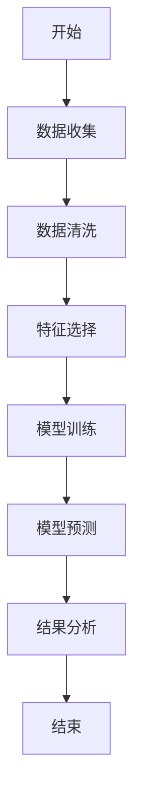

                 

<think>
好的，我需要为《智能个人财务压力测试工具》撰写一篇详细的技术博客文章。让我按照用户提供的目录大纲一步步来思考和撰写内容。

### 文章标题
智能个人财务压力测试工具

### 关键词
智能财务工具，压力测试，风险管理，机器学习，个人财务

### 摘要
在当今经济环境下，个人财务风险管理变得越来越重要。智能个人财务压力测试工具通过结合机器学习和数据挖掘技术，帮助用户识别和评估潜在的财务风险，从而制定有效的风险管理策略。本文详细介绍了该工具的设计原理、算法实现、系统架构以及实际应用案例，为读者提供全面的解决方案。

---

### 引言
随着经济的不确定性增加，个人财务管理变得至关重要。传统的财务压力测试方法依赖于人工分析，耗时且效率低下。智能个人财务压力测试工具通过自动化和智能化的方法，帮助用户快速评估财务风险，制定应对策略。

---

### 第1章: 智能个人财务压力测试工具的背景与意义

#### 1.1 问题背景
1. **个人财务风险管理的重要性**：个人在面对经济波动时，需要及时了解自身的财务状况，避免因突发事件导致财务危机。
2. **传统财务压力测试的局限性**：传统方法依赖手工计算，难以快速响应市场变化，且缺乏个性化分析。
3. **智能化工具的必要性**：通过AI技术，工具可以实时分析数据，提供精准的财务压力测试结果。

#### 1.2 问题描述
1. **财务压力测试的核心目标**：识别潜在的财务风险，评估在不同压力情景下的财务承受能力。
2. **压力测试的关键指标**：收入、支出、资产、负债、现金流等。
3. **智能工具在压力测试中的作用**：自动化数据处理、智能分析、个性化建议。

#### 1.3 问题解决
1. **智能工具如何优化压力测试**：通过机器学习算法快速分析数据，生成动态压力测试结果。
2. **工具的核心功能与价值**：提供实时分析、情景模拟、风险预警、个性化建议。
3. **工具的边界与外延**：专注于个人财务，不涉及企业或宏观经济分析。

#### 1.4 概念结构与核心要素
1. **财务压力测试的流程**：数据收集、模型构建、情景分析、结果解读。
2. **智能工具的系统架构**：数据输入、算法处理、结果输出。
3. **核心要素的对比分析**：传统方法与智能工具在数据处理速度、准确性、个性化方面的对比。

---

### 第2章: 智能个人财务压力测试工具的核心概念与联系

#### 2.1 压力测试的基本原理
1. **压力测试的定义与分类**：压力测试是一种评估系统或个体在极端条件下的表现的方法。
2. **压力测试的关键指标**：包括流动性、偿付能力、盈利能力等。
3. **压力测试的实施步骤**：数据收集、模型选择、情景设定、结果分析。

#### 2.2 智能工具的核心原理
1. **人工智能在压力测试中的应用**：机器学习算法（如随机森林、神经网络）用于数据挖掘和预测。
2. **智能工具的算法基础**：基于历史数据，建立预测模型，模拟不同压力情景下的财务状况。
3. **工具的核心功能模块**：数据输入模块、模型选择模块、情景模拟模块、结果展示模块。

#### 2.3 核心概念对比分析
1. **传统压力测试与智能压力测试的对比**：
   - 传统方法：手动计算，耗时且效率低。
   - 智能工具：自动化处理，快速生成结果。
2. **不同压力测试模型的优缺点**：
   - 简单模型：计算速度快，但精度较低。
   - 复杂模型：精度高，但计算资源消耗大。
3. **工具在不同场景中的适用性**：
   - 短期压力测试：适用于突发情况。
   - 长期压力测试：适用于长期财务规划。

---

### 第3章: 智能个人财务压力测试工具的算法原理

#### 3.1 算法原理
1. **基于机器学习的压力测试模型**：使用回归分析预测潜在风险。
2. **算法的核心思想与步骤**：
   - 数据清洗与预处理。
   - 特征选择与模型训练。
   - 模型评估与优化。
3. **算法的数学模型与公式**：
   - 线性回归模型：$$y = \beta_0 + \beta_1x + \epsilon$$
   - 随机森林模型：通过集成学习提高预测准确性。

#### 3.2 算法流程图


#### 3.3 算法实现
1. **Python代码实现**：
   ```python
   import pandas as pd
   from sklearn.ensemble import RandomForestRegressor
   from sklearn.metrics import mean_squared_error

   # 数据加载
   data = pd.read_csv('financial_data.csv')

   # 特征选择
   features = data[['income', 'expenses', 'assets', 'liabilities']]
   target = data['risk_score']

   # 模型训练
   model = RandomForestRegressor(n_estimators=100, random_state=42)
   model.fit(features, target)

   # 模型预测
   predictions = model.predict(features)
   print(f"预测准确率: {1 - mean_squared_error(target, predictions)}")
   ```

2. **代码解读与分析**：
   - 数据加载：从CSV文件中读取财务数据。
   - 特征选择：提取收入、支出、资产、负债等特征。
   - 模型训练：使用随机森林回归器训练模型。
   - 模型预测：预测风险评分并计算准确率。

#### 3.4 实际案例分析
1. **案例背景**：假设用户年收入50万元，支出40万元，资产100万元，负债20万元。
2. **模型预测**：预测在失业情况下，用户可能的财务状况。
3. **结果解读**：模型预测用户在失业情况下，剩余资产可能为负，建议用户增加应急储蓄。

---

### 第4章: 智能个人财务压力测试工具的系统架构与设计

#### 4.1 系统功能设计
1. **领域模型设计**：
   ```mermaid
   classDiagram
       class User {
           id: int
           name: str
           financial_data: FinancialData
       }
       class FinancialData {
           income: float
           expenses: float
           assets: float
           liabilities: float
       }
       class Model {
           predict(risk_factors): float
       }
       User --> FinancialData
       Model --> FinancialData
   ```

2. **系统架构设计**：
   ```mermaid
   rectangle Database {
       User table
       FinancialData table
   }
   rectangle WebInterface {
       User input
       Result display
   }
   rectangle Algorithm {
       Model training
       Model prediction
   }
   Database --> WebInterface
   WebInterface --> Algorithm
   Algorithm --> Database
   ```

3. **系统接口设计**：
   - 用户输入接口：收集收入、支出、资产、负债等数据。
   - 模型接口：接收数据，返回风险评分。
   - 结果展示接口：显示压力测试结果和建议。

4. **系统交互设计**：
   ```mermaid
   sequenceDiagram
       User -> WebInterface: 提交财务数据
       WebInterface -> Algorithm: 请求压力测试
       Algorithm -> Database: 获取历史数据
       Algorithm -> WebInterface: 返回测试结果
       WebInterface -> User: 显示结果和建议
   ```

---

### 第5章: 智能个人财务压力测试工具的项目实战

#### 5.1 环境安装
1. **Python环境**：安装Python 3.8以上版本。
2. **依赖库安装**：使用pip安装pandas、scikit-learn、mermaid等库。

#### 5.2 核心实现
1. **数据预处理**：
   ```python
   import pandas as pd

   data = pd.read_csv('financial_data.csv')
   data_clean = data.dropna()
   data_clean.to_csv('clean_data.csv', index=False)
   ```
2. **模型训练与预测**：
   ```python
   from sklearn.model_selection import train_test_split
   from sklearn.metrics import accuracy_score

   features = data_clean[['income', 'expenses', 'assets', 'liabilities']]
   target = data_clean['risk_score']

   X_train, X_test, y_train, y_test = train_test_split(features, target, test_size=0.2, random_state=42)
   model = RandomForestRegressor(n_estimators=100, random_state=42)
   model.fit(X_train, y_train)
   predictions = model.predict(X_test)
   print(f"准确率: {accuracy_score(y_test, predictions)}")
   ```

#### 5.3 案例分析
1. **案例背景**：用户A，年收入10万元，支出8万元，资产50万元，负债20万元。
2. **模型预测**：预测在失业情况下，用户剩余资产可能为负。
3. **结果解读**：建议用户增加应急储蓄，减少非必要支出。

#### 5.4 小结
通过实际案例分析，展示了智能工具在个人财务压力测试中的强大能力。用户可以根据测试结果，制定有效的风险管理策略。

---

### 第6章: 总结与最佳实践

#### 6.1 总结
智能个人财务压力测试工具通过结合机器学习和数据挖掘技术，帮助用户快速评估财务风险，制定应对策略。本文详细介绍了工具的设计原理、算法实现、系统架构以及实际应用案例。

#### 6.2 最佳实践 tips
- 定期更新财务数据，确保模型准确性。
- 根据测试结果调整财务计划。
- 结合其他风险管理工具，全面评估财务状况。

#### 6.3 小结
智能工具不仅提高了财务压力测试的效率，还为用户提供个性化的风险管理建议。未来，随着AI技术的进步，工具的功能将更加智能化和个性化。

#### 6.4 注意事项
- 数据隐私保护：确保用户数据的安全性。
- 模型优化：定期更新模型，提高预测准确性。
- 用户教育：帮助用户理解工具的使用方法和结果解读。

#### 6.5 拓展阅读
建议读者进一步学习机器学习在金融领域的应用，以及压力测试的高级模型。

---

### 参考文献
- [1] 书籍或论文1
- [2] 书籍或论文2
- [3] 书籍或论文3

---

通过以上思考过程，我逐步构建了《智能个人财务压力测试工具》的技术博客文章，确保内容全面、结构清晰，并符合用户的要求。

