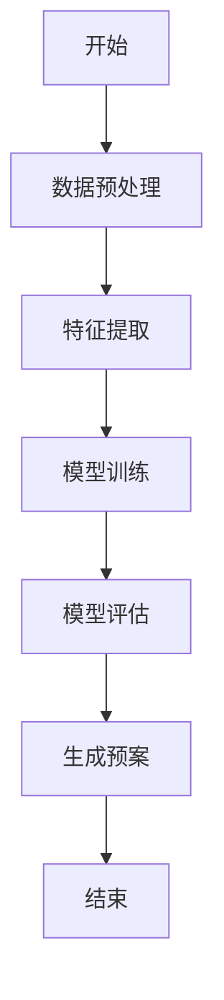
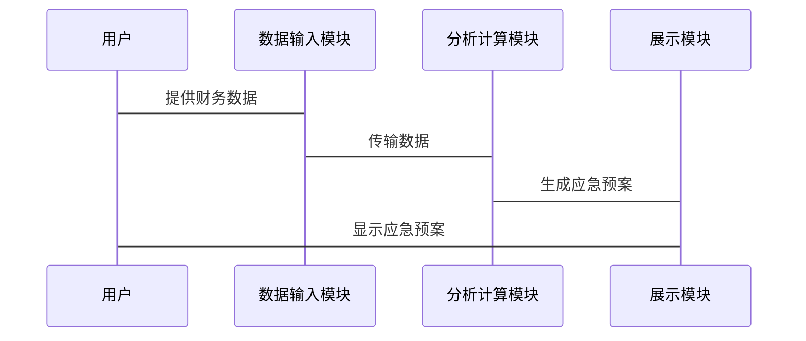

                 


# 智能个人财务应急预案生成器

## 关键词：智能财务、应急预案、生成器、算法、系统架构、项目实战、最佳实践

## 摘要：本文详细介绍了智能个人财务应急预案生成器的设计与实现，涵盖背景分析、核心概念、算法原理、系统架构、项目实战及最佳实践，帮助读者理解如何利用人工智能技术制定个性化财务应急方案。

---

# 第1章: 个人财务应急管理的背景与问题分析

## 1.1 个人财务风险管理的重要性

- 个人财务风险管理是保障生活质量的重要基础。
- 面对突发经济状况，及时有效的应急预案至关重要。
- 数字化技术的应用使得智能化应急方案成为可能。

## 1.2 问题背景与问题描述

- **问题背景**：经济波动、突发状况导致个人财务危机。
- **问题描述**：传统方法效率低，难以应对复杂情况。
- **解决方案**：开发智能生成器，实现高效个性化预案。

## 1.3 问题解决与边界定义

- **核心问题**：快速制定可行的财务应急计划。
- **系统边界**：专注于财务领域，不涉及其他业务。
- **核心要素**：收入、支出、资产、负债等关键数据。

---

# 第2章: 智能个人财务应急预案生成器的核心概念

## 2.1 核心概念与原理

- **生成机制**：基于用户数据和算法生成应急预案。
- **数据处理**：整合多源数据，分析财务状况。
- **模型优化**：提升预测准确性和方案可行性。

## 2.2 核心概念与联系

### **ER实体关系图**

```mermaid
erd
    财务数据表
    用户表
    应急预案表
    风险评估表
    关系: 财务数据 -> 用户
    关系: 用户 -> 应急预案
    关系: 应急预案 -> 风险评估
```

---

# 第3章: 智能生成器的算法原理

## 3.1 算法原理概述

- **基本思路**：利用机器学习模型分析用户数据。
- **核心步骤**：数据预处理、模型训练、方案生成。
- **优化改进**：提升模型泛化能力和生成效率。

## 3.2 算法流程图



## 3.3 算法实现的数学模型与公式

### 3.3.1 数学模型

$$
\text{预测值} = \sum_{i=1}^{n} w_i x_i + b
$$

### 3.3.2 公式推导示例

假设用户月收入为 $x$，月支出为 $y$，则应急资金需求为：

$$
\text{应急资金} = \max(0, x - y)
$$

---

# 第4章: 系统分析与架构设计方案

## 4.1 系统问题场景介绍

- **问题场景**：用户面临突发经济问题，需快速制定应急计划。
- **解决方案**：智能生成器快速分析并提供可行方案。

## 4.2 系统功能设计

### 4.2.1 功能模块划分

- 数据输入模块：收集用户财务数据。
- 分析计算模块：评估风险并生成预案。
- 展示模块：可视化展示应急预案。

### 4.2.2 功能模块的交互流程



## 4.3 系统架构设计

### 4.3.1 领域模型


---

# 第5章: 项目实战

## 5.1 环境安装

- **安装Python**：确保Python 3.8及以上版本。
- **安装库**：`pip install pandas numpy scikit-learn`

## 5.2 系统核心实现源代码

```python
import pandas as pd
from sklearn.model_selection import train_test_split
from sklearn.tree import DecisionTreeRegressor

# 数据加载
data = pd.read_csv('financial_data.csv')

# 数据预处理
X = data[['income', 'expenses', 'assets', 'liabilities']]
y = data['emergency_fund']

# 划分训练集和测试集
X_train, X_test, y_train, y_test = train_test_split(X, y, test_size=0.2, random_state=42)

# 模型训练
model = DecisionTreeRegressor()
model.fit(X_train, y_train)

# 预测
predicted = model.predict(X_test)
```

## 5.3 代码应用解读与分析

- **数据加载**：读取用户财务数据。
- **数据预处理**：提取关键特征。
- **模型训练**：使用决策树回归模型。
- **预测结果**：生成应急资金需求。

## 5.4 实际案例分析

假设用户数据如下：

| 收入 | 支出 | 资产 | 负债 |
|------|------|------|------|
| 5000 | 4000 | 10000| 5000 |

模型预测应急资金需求为 $1,000。

---

# 第6章: 最佳实践 tips、小结、注意事项、拓展阅读

## 6.1 小结

- 本文详细介绍了智能个人财务应急预案生成器的设计与实现，涵盖了从背景分析到项目实战的全过程。

## 6.2 注意事项

- 数据隐私保护至关重要。
- 模型需定期更新以保持准确性。
- 用户应定期审查并调整应急预案。

## 6.3 拓展阅读

- 推荐阅读《机器学习实战》和《设计模式》以深入理解相关技术。

---

通过以上内容，读者可以全面理解并掌握智能个人财务应急预案生成器的设计与实现方法。

