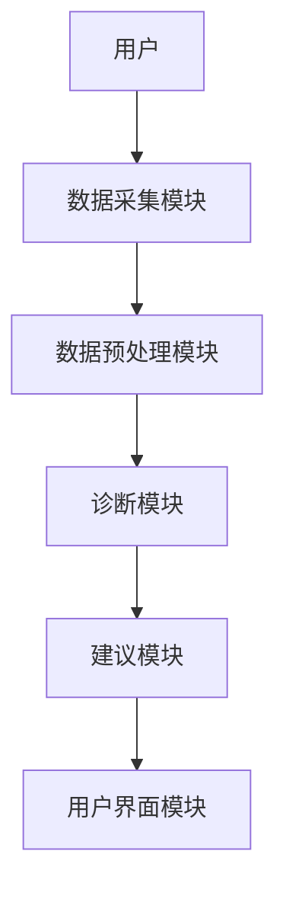

                 


---

# 智能个人财务状况诊断与建议系统

**关键词：** 智能诊断、个人财务、机器学习、系统架构、数据处理

**摘要：**  
本文系统地介绍了一种基于人工智能的智能个人财务状况诊断与建议系统。通过分析个人财务数据，利用机器学习算法，该系统能够诊断用户的财务健康状况，并提供建设性的财务建议。本文从背景介绍、核心概念、算法实现、系统架构到项目实战，全面解析了该系统的构建过程，同时提供了实际案例分析和优化建议。

---

# 第一部分: 智能个人财务状况诊断与建议系统概述

## 第1章: 问题背景与目标

### 1.1 财务管理的重要性  
在现代生活中，个人财务管理是实现财务自由的关键。然而，传统财务管理方式存在效率低、难以量化的问题，尤其是在面对复杂财务状况时，个人往往难以做出科学决策。

### 1.2 人工智能在财务管理中的应用  
人工智能技术的快速发展为财务管理带来了新的可能性。通过智能算法，可以自动化分析财务数据，发现潜在问题，并提供个性化建议。

### 1.3 系统的目标与核心功能  
本系统的目的是通过智能诊断技术，帮助用户实时了解财务状况，并提供优化建议。核心功能包括：  
1. **数据采集与处理**：收集用户的收入、支出、资产等数据。  
2. **财务诊断**：通过算法分析数据，诊断财务健康状况。  
3. **个性化建议**：根据诊断结果，提供针对性的财务优化建议。

---

# 第二部分: 数据采集与预处理

## 第2章: 数据采集与预处理

### 2.1 数据来源  
系统的数据来源包括：  
1. **用户输入**：用户手动输入收入、支出等数据。  
2. **第三方接口**：通过API获取银行、支付宝等平台的交易记录。  
3. **历史数据**：导入过去的财务记录。

### 2.2 数据清洗与标准化  
为了保证数据质量，需要进行以下处理：  
1. **去重**：去除重复的记录。  
2. **缺失值处理**：对缺失数据进行插值或删除。  
3. **标准化**：将不同格式的数据统一为标准格式。

### 2.3 数据特征提取  
从原始数据中提取有用的特征，例如：  
1. **收入与支出比**：收入 / 支出。  
2. **资产与负债比**：资产 / 负债。  
3. **消费类别分布**：各消费类别的比例。

---

# 第三部分: 财务诊断算法实现

## 第3章: 财务诊断算法实现

### 3.1 算法选择  
基于机器学习的分类算法，例如决策树、随机森林等。选择随机森林算法，因为其对数据分布的适应性强，适合分类问题。

### 3.2 算法实现流程  
1. **数据特征提取**：从数据中提取有用的特征。  
2. **模型训练**：使用训练数据训练随机森林模型。  
3. **模型预测**：对新数据进行分类预测。

### 3.3 算法代码实现  
以下是随机森林算法的Python实现示例：

```python
from sklearn.ensemble import RandomForestClassifier

# 训练数据
X_train = ...  # 特征矩阵
y_train = ...  # 标签

# 创建模型
model = RandomForestClassifier(n_estimators=100, random_state=42)
model.fit(X_train, y_train)

# 预测
X_test = ...  # 待预测数据
y_pred = model.predict(X_test)
```

### 3.4 算法优化与调优  
通过网格搜索（Grid Search）优化模型参数，例如调整 `n_estimators` 和 `max_depth`，以提高模型性能。

---

# 第四部分: 系统架构设计

## 第4章: 系统架构设计

### 4.1 系统功能模块  
系统主要模块包括：  
1. **数据采集模块**：负责数据的采集与预处理。  
2. **诊断模块**：利用机器学习算法进行诊断。  
3. **建议模块**：根据诊断结果生成财务建议。  
4. **用户界面模块**：提供友好的交互界面。

### 4.2 系统架构图  
以下为系统架构的Mermaid图：



### 4.3 数据流分析  
1. 用户输入数据或通过API获取数据。  
2. 数据经过清洗和特征提取后，进入诊断模块。  
3. 诊断模块输出结果后，建议模块生成建议。  
4. 用户通过界面查看结果和建议。

---

# 第五部分: 项目实战与优化

## 第5章: 项目实战

### 5.1 环境配置  
需要安装的工具和库：  
1. Python 3.8+  
2. Jupyter Notebook  
3. Scikit-learn、Pandas、Numpy  
4. Flask（用于部署）

### 5.2 核心代码实现  
以下是系统核心代码示例：

```python
import pandas as pd
from sklearn.model_selection import train_test_split
from sklearn.ensemble import RandomForestClassifier

# 数据加载
data = pd.read_csv('financial_data.csv')

# 特征与标签分离
X = data.drop('label', axis=1)
y = data['label']

# 数据划分
X_train, X_test, y_train, y_test = train_test_split(X, y, test_size=0.2)

# 模型训练
model = RandomForestClassifier()
model.fit(X_train, y_train)

# 模型预测
y_pred = model.predict(X_test)
```

### 5.3 模型评估  
通过准确率、召回率等指标评估模型性能。例如，使用混淆矩阵和分类报告：

```python
from sklearn.metrics import classification_report, confusion_matrix

print(classification_report(y_test, y_pred))
```

### 5.4 系统部署  
将模型部署到Web界面，用户可以通过网页输入数据，系统实时返回诊断结果和建议。

---

# 第六部分: 系统优化与注意事项

## 第6章: 系统优化

### 6.1 算法优化  
通过超参数调优、模型融合等方式提高算法性能。例如，使用网格搜索优化随机森林模型。

### 6.2 系统性能优化  
1. 数据预处理的优化：使用并行处理加速数据清洗。  
2. 模型优化：减少特征数量，降低计算复杂度。  
3. 系统架构优化：使用分布式架构提高处理能力。

### 6.3 安全注意事项  
1. 数据加密：保护用户隐私数据。  
2. 权限控制：确保只有授权用户可以访问系统。  
3. 日志记录：记录用户操作日志，便于审计和问题排查。

---

# 第七部分: 总结与展望

## 第7章: 总结与展望

### 7.1 本章总结  
本文详细介绍了智能个人财务诊断系统的构建过程，包括数据采集、算法实现、系统架构设计和项目实战。通过随机森林算法，系统能够有效地诊断财务状况并提供建议。

### 7.2 未来展望  
1. **模型优化**：引入深度学习算法，如神经网络，进一步提高诊断精度。  
2. **功能扩展**：增加财务规划、投资建议等功能。  
3. **用户界面优化**：提供更直观的可视化界面，提升用户体验。

---

# 附录: 工具与数据集

## 附录A: 工具安装指南  
1. 安装Python和必要的库：  
   ```bash
   pip install numpy pandas scikit-learn flask
   ```
2. 安装Jupyter Notebook：  
   ```bash
   pip install jupyter
   ```

## 附录B: 数据集格式  
数据集格式为CSV文件，包含以下字段：  
- `income`：收入  
- `expenses`：支出  
- `assets`：资产  
- ` liabilities`：负债  
- `label`：财务状况标签（正常/异常）

---

# 结语  
通过本系统的构建与实践，我们展示了人工智能在个人财务管理中的强大应用潜力。未来，随着技术的不断发展，智能财务诊断系统将更加智能化和个性化，为用户提供更高效、更精准的财务管理服务。

