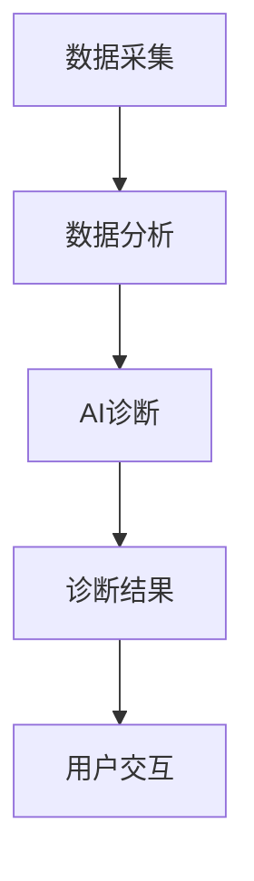
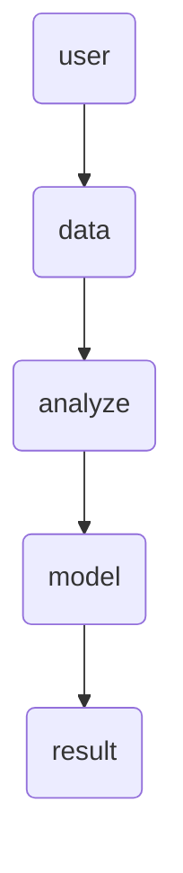
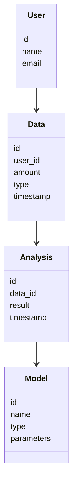
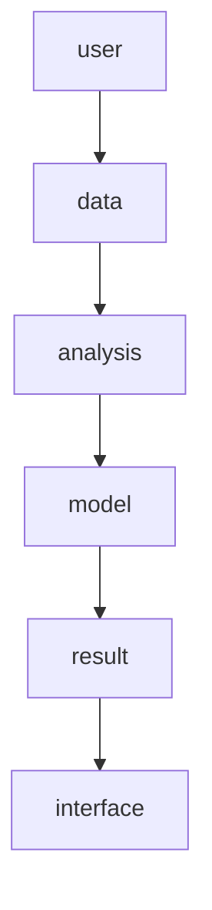
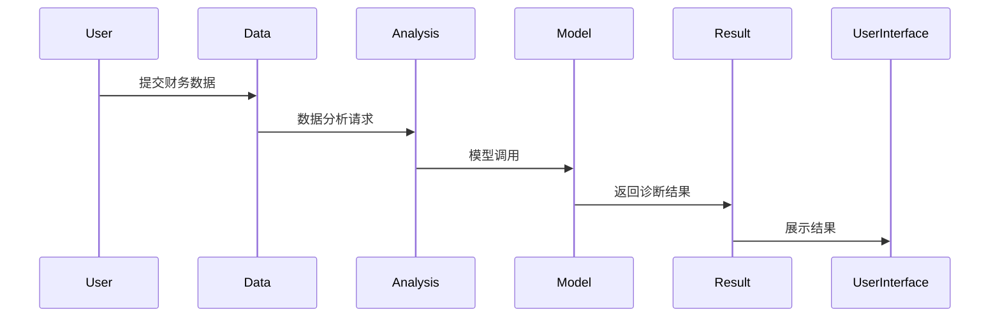
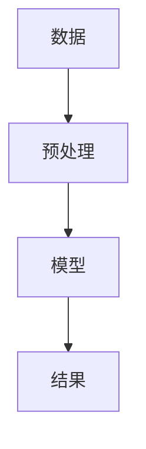

                 


# 智能个人财务状况诊断系统

> 关键词：智能财务诊断，人工智能，财务数据分析，系统架构设计，算法实现，项目实战

> 摘要：本文详细介绍了智能个人财务状况诊断系统的构建过程，从问题背景、系统架构设计、算法原理到项目实战，全面解析了如何利用人工智能技术实现个人财务状况的智能化诊断与优化。

---

# 第一部分：背景与概念

## 第1章：问题背景与需求分析

### 1.1 问题背景

#### 1.1.1 个人财务管理的现状与挑战
在现代生活中，个人财务管理变得越来越复杂。随着收入来源多样化、支出项目增加以及金融产品的丰富，传统的财务管理方式已难以满足人们对高效、精准财务管理的需求。

#### 1.1.2 传统财务诊断方法的局限性
传统的财务诊断方法通常依赖人工分析，存在效率低、主观性强、难以量化等问题。例如，通过手动记录和分析财务数据，容易出现遗漏和错误，且难以快速给出优化建议。

#### 1.1.3 智能化诊断的必要性
随着人工智能技术的快速发展，利用AI技术实现个人财务状况的智能化诊断成为可能。智能化诊断不仅可以提高效率，还能通过数据驱动的方式提供更精准的诊断结果和优化建议。

### 1.2 问题描述

#### 1.2.1 财务数据的多样性与复杂性
个人财务数据包括收入、支出、资产、负债等多类数据，且这些数据可能分布在不同的平台（如银行账户、支付宝、微信等）。

#### 1.2.2 用户需求的个性化与动态变化
不同用户的财务状况和需求差异较大，例如有些人关注资产配置优化，有些人则关注支出控制。

#### 1.2.3 系统功能的核心目标
系统的核心目标是通过分析用户的财务数据，提供个性化的诊断结果和优化建议。

### 1.3 问题解决思路

#### 1.3.1 智能化诊断的核心理念
利用AI技术对财务数据进行建模、分析和预测，帮助用户快速了解财务状况并优化财务管理。

#### 1.3.2 数据驱动的诊断方法
通过收集和分析用户的财务数据，提取关键指标并进行建模，从而实现对财务状况的智能诊断。

#### 1.3.3 AI技术在财务诊断中的应用潜力
AI技术可以应用于数据清洗、特征提取、模型训练、结果预测等多个环节，显著提高诊断效率和准确性。

### 1.4 边界与外延

#### 1.4.1 系统功能的边界
系统仅关注个人财务状况的诊断，不涉及具体的财务操作（如转账、投资）。

#### 1.4.2 与相关系统的区别
与传统财务软件相比，系统更注重智能化诊断和个性化建议。

#### 1.4.3 系统的可扩展性
系统设计充分考虑扩展性，未来可以加入更多的功能模块（如税务规划、投资建议等）。

### 1.5 核心要素与概念结构

#### 1.5.1 系统的核心要素
- 数据采集模块：负责收集用户的财务数据。
- 数据分析模块：对数据进行清洗、特征提取和建模。
- AI诊断模块：基于模型进行诊断和预测。
- 用户交互模块：与用户进行交互并展示结果。

#### 1.5.2 概念结构图


#### 1.5.3 核心要素的属性对比表
| 核心要素 | 属性 | 描述 |
|----------|------|------|
| 数据采集 | 数据类型 | 收入、支出、资产、负债等 |
| 数据分析 | 方法 | 数据清洗、特征提取、建模 |
| AI诊断 | 模型 | 分类、回归、聚类等 |
| 用户交互 | 方式 | 界面展示、语音反馈等 |

---

# 第二部分：智能个人财务状况诊断系统的架构与设计

## 第2章：系统核心概念与原理

### 2.1 核心概念原理

#### 2.1.1 数据采集与预处理
数据采集是系统的第一步，需要从多个来源（如银行账户、支付宝、微信等）获取数据，并进行清洗和标准化处理。

#### 2.1.2 财务指标分析方法
通过提取关键财务指标（如收支比、资产负债比等）进行分析，为诊断提供基础。

#### 2.1.3 AI诊断模型的构建逻辑
基于机器学习算法（如随机森林、支持向量机等）构建诊断模型，对用户财务状况进行分类或预测。

### 2.2 核心概念属性对比表
| 核心概念 | 属性 | 描述 |
|----------|------|------|
| 数据采集 | 数据源 | 银行账户、支付宝、微信等 |
| 数据分析 | 方法 | 数据清洗、特征提取、建模 |
| AI诊断 | 模型 | 分类、回归、聚类等 |
| 用户交互 | 方式 | 界面展示、语音反馈等 |

### 2.3 ER实体关系图


## 第3章：系统架构设计

### 3.1 系统功能模块

#### 3.1.1 数据采集模块
负责从多个数据源采集用户的财务数据，并进行清洗和预处理。

#### 3.1.2 数据分析模块
对数据进行特征提取、建模等处理，为诊断提供支持。

#### 3.1.3 AI诊断模块
基于机器学习模型对用户财务状况进行分类或预测。

#### 3.1.4 用户交互模块
与用户进行交互，展示诊断结果并提供优化建议。

### 3.2 系统功能设计

#### 3.2.1 领域模型


#### 3.2.2 系统架构设计


#### 3.2.3 系统接口设计
系统提供API接口，供第三方调用。

#### 3.2.4 系统交互流程图


---

# 第三部分：算法原理与数学模型

## 第4章：算法原理与数学模型

### 4.1 算法原理

#### 4.1.1 数据预处理
对数据进行清洗、标准化和特征提取。

#### 4.1.2 模型训练
使用机器学习算法（如随机森林、支持向量机等）进行模型训练。

#### 4.1.3 模型评估
通过交叉验证、准确率、召回率等指标评估模型性能。

### 4.2 算法流程图


### 4.3 数学模型

#### 4.3.1 分类算法
使用随机森林分类器进行财务状况分类。
$$
\text{随机森林} = \{树1, 树2, ..., 树n\}
$$

#### 4.3.2 回归算法
使用线性回归模型预测财务风险。
$$
y = \beta_0 + \beta_1x_1 + \beta_2x_2 + \dots + \beta_kx_k + \epsilon
$$

---

# 第四部分：系统设计与实现

## 第5章：系统设计与实现

### 5.1 系统设计

#### 5.1.1 系统功能设计
系统包括数据采集、数据分析、AI诊断和用户交互四大模块。

#### 5.1.2 系统架构实现
采用微服务架构，模块之间通过API进行通信。

#### 5.1.3 接口设计
提供RESTful API接口，支持JSON格式的数据交互。

#### 5.1.4 交互设计
用户通过Web界面提交数据，系统返回诊断结果和优化建议。

### 5.2 项目实战

#### 5.2.1 环境搭建
安装Python、Jupyter Notebook、Scikit-learn等工具。

#### 5.2.2 核心代码实现

##### 数据采集模块
```python
import requests

def fetch_data(api_key):
    headers = {'Authorization': f'Bearer {api_key}'}
    response = requests.get('https://api.financial.com/data', headers=headers)
    return response.json()
```

##### 数据分析模块
```python
from sklearn.preprocessing import StandardScaler

def preprocess(data):
    scaler = StandardScaler()
    processed_data = scaler.fit_transform(data)
    return processed_data
```

##### AI诊断模块
```python
from sklearn.ensemble import RandomForestClassifier

def train_model(X, y):
    model = RandomForestClassifier()
    model.fit(X, y)
    return model
```

##### 用户交互模块
```python
def show_result(result):
    print(f"诊断结果：{result}")
    print("优化建议：...")
```

#### 5.2.3 案例分析
以一个典型用户为例，展示系统如何进行诊断和优化建议。

---

# 第五部分：总结与扩展

## 第6章：总结与扩展

### 6.1 总结
本文详细介绍了智能个人财务状况诊断系统的构建过程，从问题背景、系统架构设计、算法实现到项目实战，全面解析了系统的实现细节。

### 6.2 注意事项
- 数据隐私保护
- 模型的可解释性
- 系统的扩展性

### 6.3 拓展阅读
- 《机器学习实战》
- 《深度学习入门》
- 《系统设计指南》

### 6.4 最佳实践 Tips
- 数据预处理是关键
- 模型选择要结合实际场景
- 系统设计要注重可扩展性

---

# 结语

智能个人财务状况诊断系统的实现，不仅提高了财务管理的效率，还为用户提供了个性化的优化建议。通过本文的介绍，读者可以全面了解系统的实现过程，并在此基础上进行更深入的研究和实践。

--- 

**全文完**

