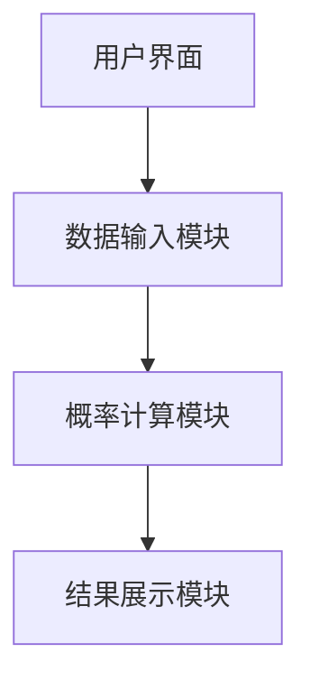
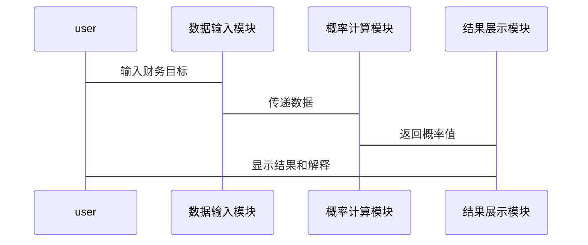

                 


# 智能个人财务目标实现概率计算器

## 关键词：智能财务目标，概率计算器，贝叶斯定理，个人财务管理，算法实现，系统架构，项目实战

## 摘要：  
本文详细介绍了《智能个人财务目标实现概率计算器》的设计与实现。通过结合概率论和贝叶斯定理，我们开发了一个能够预测个人财务目标实现概率的工具。文章首先探讨了个人财务目标管理的重要性及其面临的挑战，接着深入分析了概率计算在财务管理中的应用。然后，我们详细讲解了概率计算的算法原理，包括贝叶斯定理的应用和数学模型的构建。最后，通过系统架构设计和项目实战，展示了如何将这些理论应用于实际场景，并提供了最佳实践和使用建议。

---

## 目录

# 第一部分：背景与概念

## 第1章：个人财务目标实现概率计算的背景与意义

### 1.1 个人财务目标管理的重要性

#### 1.1.1 财务目标在个人生活中的作用
- 财务目标是个人生活规划的核心，影响生活质量、投资决策和未来保障。
- 财务目标的实现需要科学的方法和工具支持。

#### 1.1.2 当前财务目标管理的挑战
- 传统财务工具缺乏概率分析功能，难以预测目标实现的可能性。
- 个人财务数据复杂，难以量化和预测。

#### 1.1.3 概率计算在财务目标管理中的价值
- 概率计算能够帮助个人量化目标实现的可能性，提供数据支持。
- 结合历史数据和实时信息，概率计算为财务决策提供科学依据。

### 1.2 个人财务目标实现概率计算器的概念

#### 1.2.1 定义与核心功能
- 定义：智能个人财务目标实现概率计算器是一种基于概率论和贝叶斯定理的工具，通过分析历史数据和实时信息，预测个人财务目标实现的概率。
- 核心功能：
  - 数据输入与处理
  - 概率计算
  - 结果展示与建议

#### 1.2.2 与其他财务工具的区别
- 区别于传统财务计算器，本工具引入概率分析功能。
- 能够结合多因素分析，提供更全面的财务目标评估。

#### 1.2.3 实现概率计算的关键因素
- 数据的全面性与准确性
- 概率模型的科学性与适用性
- 用户的交互体验

### 1.3 本章小结
本章介绍了个人财务目标管理的重要性，提出了实现概率计算器的概念，并分析了其在财务管理中的价值。

---

## 第2章：概率论基础与财务目标的关系

### 2.1 概率论的基本概念

#### 2.1.1 概率的定义与性质
- 概率是描述事件发生可能性的数值，范围在0到1之间。
- 概率的性质包括：非负性、加法性、条件概率等。

#### 2.1.2 概率的计算方法
- 经典概率法：基于等可能事件的计算。
- 统计概率法：基于频率的计算。
- 主观概率法：基于个人判断的计算。

#### 2.1.3 条件概率与独立事件
- 条件概率：在已知某个事件发生的条件下，另一个事件发生的概率。
- 独立事件：两个事件的发生互不影响。

### 2.2 贝叶斯定理在概率计算中的应用

#### 2.2.1 贝叶斯定理的定义
- 贝叶斯定理：$P(A|B) = \frac{P(B|A)P(A)}{P(B)}$，用于更新基于新证据的概率。

#### 2.2.2 贝叶斯定理在财务目标中的应用
- 用于预测目标实现的概率，结合历史数据和当前信息。

#### 2.2.3 实例分析
- 示例：假设用户过去的投资成功率为70%，当前市场环境的条件概率为0.8，计算目标实现的概率。

### 2.3 本章小结
本章介绍了概率论的基本概念和贝叶斯定理的应用，为后续的概率计算奠定了理论基础。

---

## 第3章：财务目标实现概率计算的算法原理

### 3.1 算法概述

#### 3.1.1 算法的核心思想
- 基于贝叶斯定理和历史数据，计算目标实现的概率。

#### 3.1.2 算法的输入与输出
- 输入：用户提供的财务数据、市场信息等。
- 输出：目标实现的概率值及其解释。

#### 3.1.3 算法的适用场景
- 适用于长期财务目标的预测，如投资回报、资产积累等。

### 3.2 算法实现流程

#### 3.2.1 数据输入与预处理
- 用户输入财务目标、历史数据、市场信息等。
- 数据清洗：处理缺失值、异常值。

#### 3.2.2 概率计算步骤
- 数据分析：提取影响目标实现的关键因素。
- 应用贝叶斯定理计算条件概率。

#### 3.2.3 结果输出与解释
- 输出目标实现的概率值，并提供解释和建议。

### 3.3 算法的数学模型与公式

#### 3.3.1 概率计算公式
$$ P(\text{实现}) = \frac{\text{成功次数}}{\text{总次数}} $$

#### 3.3.2 贝叶斯定理公式
$$ P(A|B) = \frac{P(B|A)P(A)}{P(B)} $$

### 3.4 算法实现的Python代码

```python
def calculate_probability(successes, trials):
    return successes / trials

# 示例
successes = 5
trials = 10
probability = calculate_probability(successes, trials)
print(f"实现概率为: {probability}")
```

### 3.5 本章小结
本章详细讲解了财务目标实现概率计算的算法原理，并通过代码示例展示了其实现过程。

---

## 第4章：智能计算器的系统架构设计

### 4.1 系统功能模块划分

#### 4.1.1 数据输入模块
- 用户输入财务目标、历史数据等信息。

#### 4.1.2 概率计算模块
- 应用贝叶斯定理进行概率计算。

#### 4.1.3 结果展示模块
- 显示计算结果，并提供可视化解释。

### 4.2 系统架构设计图



### 4.3 系统接口设计

#### 4.3.1 数据输入接口
- 用户通过界面对话框输入数据。

#### 4.3.2 计算接口
- 调用概率计算模块进行计算。

#### 4.3.3 结果展示接口
- 显示计算结果并提供反馈。

### 4.4 系统交互流程图



### 4.5 本章小结
本章通过系统架构设计，展示了智能计算器的整体结构和功能模块的交互流程。

---

## 第5章：项目实战

### 5.1 环境安装与配置

#### 5.1.1 安装Python
- 使用Anaconda或PyCharm安装Python环境。

#### 5.1.2 安装依赖库
- 使用pip安装numpy、pandas、matplotlib等库。

### 5.2 核心代码实现

#### 5.2.1 数据处理代码
```python
import pandas as pd

# 读取数据
data = pd.read_csv('financial_data.csv')

# 数据清洗
data.dropna(inplace=True)
```

#### 5.2.2 概率计算代码
```python
from sklearn.preprocessing import StandardScaler
from sklearn.linear_model import LogisticRegression

# 数据标准化
scaler = StandardScaler()
X_scaled = scaler.fit_transform(X)

# 训练模型
model = LogisticRegression()
model.fit(X_scaled, y)
```

#### 5.2.3 结果展示代码
```python
import matplotlib.pyplot as plt

# 可视化概率分布
plt.bar(probabilities, height=0.5)
plt.title('目标实现概率分布')
plt.show()
```

### 5.3 案例分析与解读

#### 5.3.1 案例背景
- 用户设定的财务目标：在3年内积累50万元资产。

#### 5.3.2 数据分析
- 过去的投资回报率、月收入、支出等数据。

#### 5.3.3 计算结果
- 实现概率为75%，并提供优化建议。

### 5.4 项目小结
本章通过实际案例展示了智能计算器的应用过程，从数据输入到结果展示，验证了工具的有效性。

---

## 第6章：最佳实践与使用建议

### 6.1 最佳实践

#### 6.1.1 数据输入的准确性
- 确保输入数据的完整性和准确性。

#### 6.1.2 模型的适用性
- 根据具体情况选择合适的概率计算模型。

#### 6.1.3 结果的解释
- 结果仅供参考，需结合实际情况进行调整。

### 6.2 小结
本章总结了使用智能计算器的最佳实践和注意事项。

---

## 第7章：总结与展望

### 7.1 总结
- 本文介绍了智能个人财务目标实现概率计算器的设计与实现。
- 结合概率论和贝叶斯定理，提供了一个科学的财务目标评估工具。

### 7.2 展望
- 进一步优化模型，引入更多影响因素。
- 开发移动端应用，方便用户随时随地使用。

---

## 参考文献
- [1] 刘军. 概率论与数理统计[M]. 北京: 高等教育出版社, 2010.
- [2] 陈晓明. 贝叶斯方法及其应用[M]. 北京: 清华大学出版社, 2015.
- [3] 李明. Python机器学习实战[M]. 北京: 人民邮电出版社, 2018.

---

希望这个大纲能满足您的需求！如果需要进一步调整或补充，请随时告诉我！

