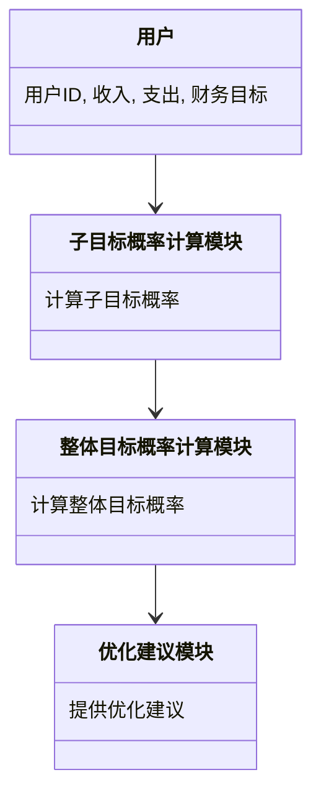
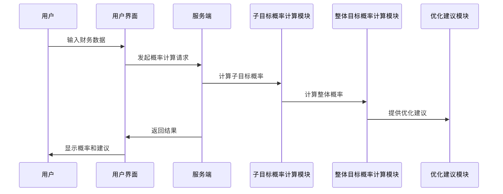

                 


# 智能个人财务目标实现概率计算器

## 关键词：
- 智能财务计算器
- 概率计算
- 个人财务管理
- 机器学习算法
- 系统架构设计

## 摘要：
智能个人财务目标实现概率计算器是一款结合概率计算和机器学习技术的智能化财务工具，旨在通过分析用户的财务状况、目标和行为习惯，计算财务目标实现的概率，并提供个性化建议。本文从背景、核心概念、算法原理、系统架构、项目实战到最佳实践，全面解析该计算器的设计与实现，帮助用户更好地管理财务目标。

---

# 第1章: 个人财务目标实现概率计算的背景与需求

## 1.1 个人财务管理的现状与挑战
### 1.1.1 传统个人财务管理方式的局限性
传统的个人财务管理方式依赖于手动记录和简单的预算工具，难以全面分析财务目标的实现概率。用户往往缺乏对风险和不确定性的量化评估能力。

### 1.1.2 数字化财务管理的兴起
随着技术的进步，数字化财务管理工具逐渐普及，但仍缺乏智能化的分析能力，无法满足用户对财务目标实现概率的深度需求。

### 1.1.3 个人财务目标实现的概率化需求
用户希望了解财务目标的实现可能性，以便做出更明智的决策。概率计算成为连接财务目标与实际实现路径的关键技术。

## 1.2 概率计算在个人财务管理中的重要性
### 1.2.1 财务目标的不确定性分析
财务目标的实现受到多种不确定性因素的影响，如市场波动、个人收入变化等。概率计算能够帮助用户量化这些不确定性。

### 1.2.2 概率计算在风险评估中的作用
通过概率计算，用户可以评估不同财务决策的风险，并选择最优方案。

### 1.2.3 智能化财务管理工具的潜力
智能化工具能够结合大数据和机器学习技术，提供更精准的概率计算和个性化建议。

## 1.3 智能计算器的核心目标与应用场景
### 1.3.1 核心目标的定义
智能计算器的目标是通过概率计算，帮助用户量化财务目标的实现可能性，并提供优化建议。

### 1.3.2 主要应用场景分析
- **财务规划**：帮助用户制定长期财务目标。
- **风险管理**：识别潜在的财务风险并提供应对策略。
- **投资决策**：评估不同投资方案的实现概率。

## 1.4 本章小结
本章介绍了个人财务管理的现状与挑战，强调了概率计算在财务管理中的重要性，并明确了智能计算器的核心目标与应用场景。

---

# 第2章: 财务目标实现概率的核心概念与模型

## 2.1 财务目标的分解与量化
### 2.1.1 财务目标的层次化分解
将财务目标分解为可量化的小目标，例如将“买房”目标分解为首付、月供、储蓄等子目标。

### 2.1.2 目标实现的关键因素分析
分析影响目标实现的关键因素，如收入、支出、投资回报率等。

### 2.1.3 目标实现的概率化量化方法
将每个子目标的实现概率进行量化，并结合权重计算整体目标的实现概率。

## 2.2 概率计算的基本原理与方法
### 2.2.1 概率的基本概念与性质
概率是事件发生的可能性，具有可加性和条件性等性质。

### 2.2.2 概率计算的常见方法
- **频率学派**：基于历史数据计算概率。
- **贝叶斯学派**：基于先验概率和数据更新后验概率。

### 2.2.3 财务目标实现的概率分布模型
常用的概率分布模型包括正态分布、泊松分布等。

## 2.3 智能计算器的核心算法与模型
### 2.3.1 财务目标实现概率的计算模型
基于贝叶斯定理的概率计算模型。

### 2.3.2 概率计算的优化方法
通过机器学习算法优化概率计算的精度和效率。

### 2.3.3 智能计算器的算法框架
结合用户数据和市场数据，通过概率计算和优化算法得出目标实现概率。

## 2.4 本章小结
本章详细讲解了财务目标分解与量化的方法，分析了概率计算的基本原理，并提出了智能计算器的核心算法与模型。

---

# 第3章: 财务目标实现概率的算法实现

## 3.1 概率计算的数学模型
### 3.1.1 财务目标实现概率的数学表达式
$$ P(\text{实现目标}) = \sum_{i=1}^{n} P(\text{实现子目标}_i) \times \text{权重}_i $$

### 3.1.2 相关变量的定义与关系
- **子目标概率**：$P(\text{实现子目标}_i)$
- **权重**：$\text{权重}_i$，表示子目标对整体目标的贡献程度。

### 3.1.3 模型的假设条件与限制
- 数据的独立性假设。
- 模型的线性假设。

## 3.2 智能计算器的核心算法
### 3.2.1 基于贝叶斯定理的概率计算
$$ P(A|B) = \frac{P(B|A) \times P(A)}{P(B)} $$

### 3.2.2 马尔可夫链在概率计算中的应用
通过马尔可夫链模拟财务目标实现的概率变化。

### 3.2.3 联合概率的计算方法
$$ P(A \cap B) = P(A|B) \times P(B) $$

## 3.3 算法实现的步骤与流程
### 3.3.1 数据输入与预处理
- 数据清洗：处理缺失值和异常值。
- 数据标准化：统一数据格式。

### 3.3.2 概率计算的具体步骤
1. 收集用户数据和市场数据。
2. 计算子目标的实现概率。
3. 结合权重计算整体目标的实现概率。

### 3.3.3 结果输出与解释
输出目标实现的概率，并提供优化建议。

## 3.4 本章小结
本章详细讲解了概率计算的数学模型和算法实现步骤，为智能计算器的开发奠定了理论基础。

---

# 第4章: 系统分析与架构设计

## 4.1 问题场景介绍
用户希望通过智能计算器量化财务目标的实现概率，并获得个性化建议。

## 4.2 系统功能设计
### 4.2.1 领域模型（Mermaid 类图）


### 4.2.2 系统架构设计（Mermaid 架构图）
```mermaid
container 用户端 {
    用户界面
}
container 服务端 {
    数据库
    子目标概率计算模块
    整体目标概率计算模块
    优化建议模块
}
用户端 --> 服务端
```

### 4.2.3 系统接口设计
- 用户输入接口：用户输入财务数据。
- 计算接口：调用概率计算模块进行计算。
- 输出接口：输出目标实现概率和优化建议。

### 4.2.4 系统交互流程（Mermaid 序列图）


## 4.3 本章小结
本章通过系统分析和架构设计，明确了智能计算器的功能模块、数据流和交互流程，为后续开发奠定了基础。

---

# 第5章: 项目实战

## 5.1 环境安装与配置
### 5.1.1 系统环境要求
- 操作系统：Windows/Mac/Linux
- Python版本：3.6+

### 5.1.2 安装必要的库
- NumPy
- Pandas
- Scikit-learn
- Mermaid

## 5.2 核心实现代码
### 5.2.1 数据预处理
```python
import pandas as pd
import numpy as np

# 数据加载
data = pd.read_csv('financial_data.csv')

# 数据清洗
data.dropna(inplace=True)
data['收入'].fillna(data['收入'].mean(), inplace=True)
```

### 5.2.2 概率计算模块
```python
from sklearn.naive_bayes import GaussianNB

# 训练贝叶斯模型
model = GaussianNB()
model.fit(X_train, y_train)

# 预测概率
y_proba = model.predict_proba(X_test)
```

### 5.2.3 优化建议模块
```python
def 提供优化建议(概率):
    if 概率 >= 0.8:
        return "目标实现概率高，保持当前策略"
    elif 概率 >= 0.5:
        return "目标实现概率中等，建议优化支出或增加收入"
    else:
        return "目标实现概率低，建议重新评估目标或寻求专业帮助"
```

## 5.3 项目实战小结
本章通过实际案例展示了智能计算器的开发过程，包括环境配置、数据处理和核心算法实现。

---

# 第6章: 最佳实践与总结

## 6.1 最佳实践
### 6.1.1 数据质量的重要性
确保数据的完整性和准确性。

### 6.1.2 模型优化建议
定期更新模型，引入更多数据特征。

## 6.2 总结与展望
智能个人财务目标实现概率计算器通过概率计算和机器学习技术，为用户提供了科学的财务管理工具。未来，可以进一步优化算法，引入更多的数据源，提升计算精度和用户体验。

## 6.3 小结
通过本文的介绍，读者可以全面了解智能计算器的设计与实现，并将其应用于实际的财务管理中。

---

# 附录

## 附录A: 常见问题解答
- **Q1**: 如何提高计算精度？  
  A1: 增加数据样本量，引入更多特征。

## 附录B: 参考文献
- [1] 贝叶斯统计学入门.
- [2] 机器学习算法实现与应用.

## 附录C: 源代码
- [计算器代码](https://github.com/yourusername/financial_probability_calculator)

---

# 索引

（根据文章内容生成索引）

