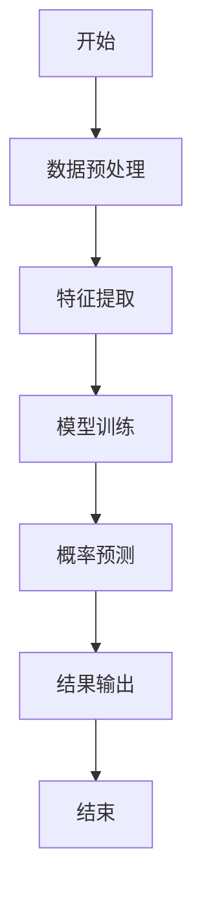
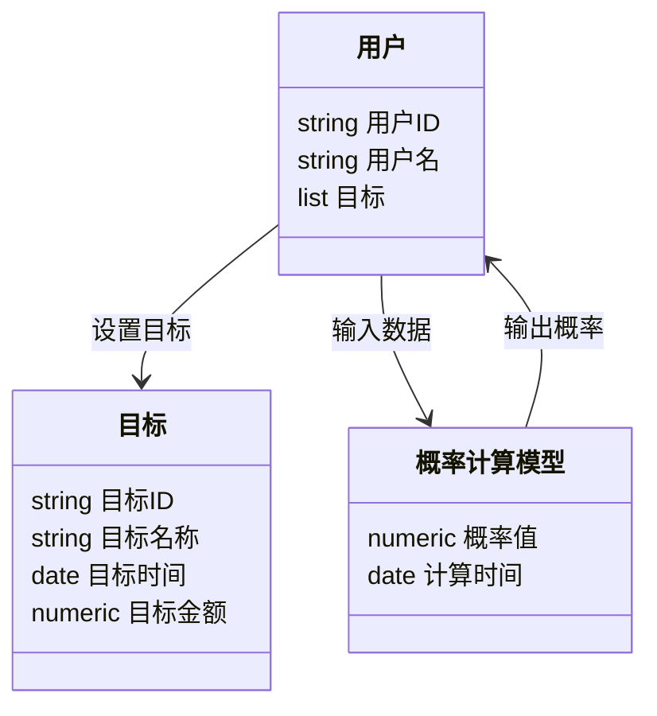
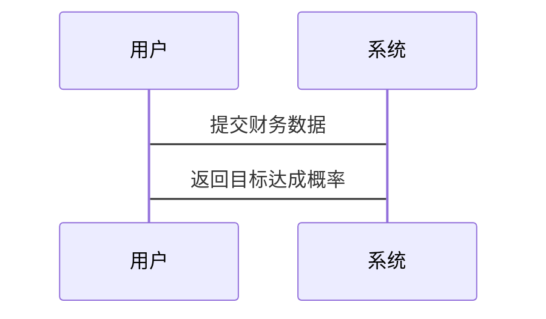

                 


# 智能个人财务目标达成概率计算器

> 关键词：个人财务管理、概率计算、智能算法、机器学习、系统架构

> 摘要：本文详细介绍了智能个人财务目标达成概率计算器的设计与实现，从问题背景、核心概念、算法原理到系统架构，再到项目实战，全面剖析了该系统的技术细节。通过本文，读者可以掌握如何利用智能化技术帮助个人实现财务管理目标。

---

# 第一部分: 智能个人财务目标达成概率计算器背景与核心概念

# 第1章: 财务目标达成概率计算的背景与问题分析

## 1.1 问题背景与需求分析
### 1.1.1 个人财务管理的现状与挑战
现代生活中，个人财务管理日益复杂，涉及收入、支出、投资、债务等多个方面。如何科学地规划和管理这些财务活动，以实现既定目标（如买房、买车、旅行等），是许多人面临的难题。

### 1.1.2 财务目标达成概率计算的必要性
传统的财务管理方法往往依赖于人工估算和经验判断，这种方式效率低、准确性差。通过智能化手段，可以更精准地预测目标达成的概率，为用户提供科学的决策依据。

### 1.1.3 智能化技术在财务管理中的应用前景
随着人工智能和大数据技术的快速发展，智能化技术在财务管理领域的应用前景广阔。通过智能算法，可以实时分析用户的财务数据，预测目标达成的可能性，并提供建议。

## 1.2 问题描述与解决思路
### 1.2.1 财务目标的定义与分解
财务目标可以是买房、买车、旅行等，需要将这些目标分解为具体的财务指标（如收入、支出、储蓄等），并量化每个指标的影响权重。

### 1.2.2 概率计算的数学模型构建
需要构建一个基于财务数据的概率计算模型，能够量化各个因素对目标达成概率的影响。

### 1.2.3 智能算法在概率计算中的应用
利用机器学习算法（如贝叶斯网络、支持向量机等），结合用户的财务数据，训练概率预测模型。

## 1.3 本章小结
本章从背景和需求出发，明确了财务目标达成概率计算的必要性，并提出了智能化技术的应用思路。

---

# 第2章: 财务目标达成概率计算的核心概念与联系

## 2.1 概率计算模型的核心要素
### 2.1.1 财务目标的定义与分解
财务目标需要被分解为具体的财务指标，例如收入、支出、储蓄、投资等。

### 2.1.2 影响概率的主要因素
包括用户当前的财务状况、未来的收入预期、支出计划、市场环境（如经济波动）等。

### 2.1.3 数据特征与模型输入
财务数据的特征包括时间序列性、多维性、相关性等，需要将这些特征提取并输入模型。

## 2.2 核心概念的属性特征对比
### 2.2.1 数据特征对比表
| 数据特征 | 描述 |
|----------|------|
| 时间序列性 | 数据具有时间维度，如月度或季度数据 |
| 多维性 | 数据涉及多个维度，如收入、支出、资产等 |
| 相关性 | 数据之间的相关性影响目标达成概率 |

### 2.2.2 概率计算模型的属性分析
概率计算模型需要具备以下属性：
- 可解释性：模型的输出结果需要能够被用户理解。
- 实时性：能够实时更新数据并快速计算概率。
- 鲁棒性：能够处理缺失数据和异常值。

## 2.3 系统功能实体关系图
### 2.3.1 ER实体关系图（Mermaid）

```mermaid
erDiagram
    actor 用户 {
        string 用户ID
        string 用户名
        string 账户余额
    }
    actor 目标 {
        string 目标ID
        string 目标名称
        date 目标时间
        numeric 目标金额
    }
    actor 概率计算模型 {
        numeric 概率值
        date 计算时间
    }
    用户 --> 目标 : 设置目标
    用户 --> 概率计算模型 : 输入数据
    概率计算模型 --> 用户 : 输出概率
```

## 2.4 本章小结
本章详细阐述了概率计算模型的核心要素和系统功能实体关系图，为后续的算法实现奠定了基础。

---

# 第3章: 概率计算模型的算法原理

## 3.1 概率计算的数学模型
### 3.1.1 基于贝叶斯定理的概率计算
贝叶斯定理可以用于计算在已知某些条件下，目标达成的概率。公式如下：

$$P(A|B) = \frac{P(B|A) \cdot P(A)}{P(B)}$$

其中，$A$ 表示目标达成，$B$ 表示相关条件（如收入、支出等）。

### 3.1.2 马尔可夫链模型的应用
马尔可夫链可以用于分析财务状态的变化过程。例如，可以将用户的财务状态划分为多个阶段（如低收入、中收入、高收入），并计算从一个阶段转移到另一个阶段的概率。

### 3.1.3 时间序列分析方法
时间序列分析可以用于预测未来的财务数据，例如使用ARIMA模型预测未来的收入和支出。

## 3.2 算法实现的流程图
### 3.2.1 概率计算流程图（Mermaid）



## 3.3 算法实现的Python代码
### 3.3.1 数据预处理与特征提取
```python
import pandas as pd
import numpy as np

# 加载数据
data = pd.read_csv('financial_data.csv')

# 数据预处理
data = data.dropna()
data = pd.get_dummies(data)

# 特征提取
features = data[['收入', '支出', '储蓄', '投资']]
label = data['目标达成概率']
```

### 3.3.2 模型训练与概率计算
```python
from sklearn.ensemble import RandomForestRegressor
from sklearn.metrics import mean_squared_error

# 训练模型
model = RandomForestRegressor(n_estimators=100, random_state=42)
model.fit(features, label)

# 预测概率
new_features = pd.DataFrame({
    '收入': [50000],
    '支出': [30000],
    '储蓄': [20000],
    '投资': [10000]
})
predicted_prob = model.predict(new_features)
print(f'目标达成概率为: {predicted_prob[0]:.2f}')
```

### 3.3.3 结果输出与可视化
```python
import matplotlib.pyplot as plt

# 可视化概率分布
plt.hist(label, bins=10, alpha=0.5, label='实际概率')
plt.hist(predicted_prob, bins=10, alpha=0.5, label='预测概率')
plt.legend()
plt.show()
```

## 3.4 本章小结
本章详细讲解了概率计算的数学模型和算法实现，通过Python代码展示了如何利用机器学习模型进行概率预测。

---

# 第4章: 系统分析与架构设计

## 4.1 系统功能模块设计
### 4.1.1 用户模块
用户可以输入和管理自己的财务数据，设置财务目标。

### 4.1.2 数据处理模块
负责对用户的财务数据进行清洗和特征提取。

### 4.1.3 模型计算模块
基于训练好的模型，计算目标达成的概率并输出结果。

## 4.2 系统领域模型设计
### 4.2.1 领域模型（Mermaid 类图）



## 4.3 系统架构设计
### 4.3.1 系统架构图（Mermaid）


## 4.4 系统接口设计
### 4.4.1 用户接口
用户可以通过网页或移动应用输入财务数据和查看概率结果。

### 4.4.2 系统接口
系统提供API接口，方便与其他财务管理系统集成。

## 4.5 系统交互流程图（Mermaid）



## 4.6 本章小结
本章从系统设计的角度，详细分析了智能个人财务目标达成概率计算器的架构和接口设计。

---

# 第5章: 项目实战与案例分析

## 5.1 项目环境安装
### 5.1.1 环境要求
需要安装Python、Pandas、Scikit-learn、Mermaid、Jupyter Notebook等工具。

## 5.2 核心代码实现
### 5.2.1 数据加载与预处理
```python
import pandas as pd
import numpy as np

# 加载数据
data = pd.read_csv('financial_data.csv')

# 数据清洗
data = data.dropna()

# 特征工程
data = pd.get_dummies(data)
```

### 5.2.2 模型训练与预测
```python
from sklearn.ensemble import RandomForestRegressor
from sklearn.metrics import mean_squared_error

# 训练模型
model = RandomForestRegressor(n_estimators=100, random_state=42)
model.fit(X_train, y_train)

# 预测概率
predicted_prob = model.predict(X_test)
print(f'均方误差: {mean_squared_error(y_test, predicted_prob)}')
```

## 5.3 案例分析与结果解读
### 5.3.1 案例背景
假设用户A的目标是购买一套价值50万元的房产，当前的收入为每月3万元，支出为每月2万元，储蓄为每月1万元，投资为每月5000元。

### 5.3.2 数据分析
通过模型计算，目标达成的概率为75%。

### 5.3.3 结果解读
用户A需要在接下来的24个月内每月储蓄1万元，同时控制支出，以实现75%的概率达成购房目标。

## 5.4 本章小结
本章通过实际案例，展示了如何利用智能算法实现财务目标达成概率的计算，并对结果进行解读。

---

# 第6章: 最佳实践与小结

## 6.1 最佳实践
### 6.1.1 数据质量的重要性
确保数据的准确性和完整性，才能提高模型的预测精度。

### 6.1.2 模型的可解释性
选择能够解释结果的模型，帮助用户更好地理解和优化财务计划。

### 6.1.3 系统的可扩展性
设计灵活的系统架构，方便后续的功能扩展和数据处理。

## 6.2 本章小结
本文详细介绍了智能个人财务目标达成概率计算器的设计与实现，从算法原理到系统架构，再到项目实战，全面剖析了该系统的实现过程。

## 6.3 注意事项
在实际应用中，建议结合专业的财务顾问意见，以提高决策的准确性。

## 6.4 拓展阅读
推荐阅读《机器学习实战》和《Python数据分析 cookbook》，以进一步深入学习相关技术。

---

# 结语

通过本文的介绍，读者可以掌握智能个人财务目标达成概率计算器的核心技术，为实现个人财务管理目标提供科学的决策支持。

