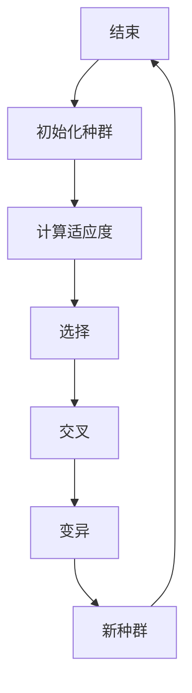
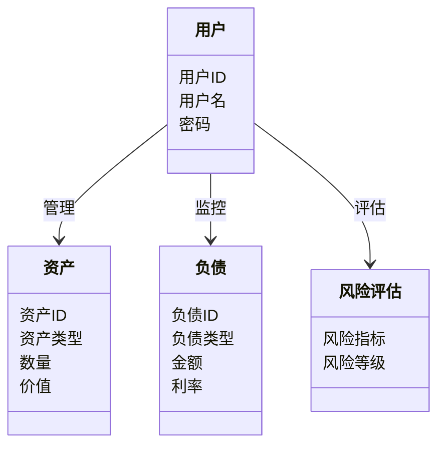

                 


# 智能个人资产负债结构优化系统

## 关键词
智能个人资产负债，结构优化，人工智能，金融系统，算法设计

## 摘要
本文详细探讨了智能个人资产负债结构优化系统的设计与实现，结合背景分析、算法原理、系统架构设计和项目实战，全面剖析了如何利用人工智能技术优化个人财务结构，降低风险，提高资产配置效率。

---

# 第1章: 智能个人资产负债结构优化系统背景介绍

## 1.1 问题背景
### 1.1.1 传统个人资产负债管理的局限性
传统个人资产负债管理依赖于手动记录和简单分析，难以应对复杂多变的市场环境。主要问题包括：
- 数据分散，难以整合
- 缺乏实时监控，难以及时调整
- 无法有效预测风险，导致资产配置不合理

### 1.1.2 数字化与智能化转型的必要性
随着金融科技的发展，个人财务管理需要更加智能化和自动化。智能化转型可以：
- 提高数据处理效率
- 实现精准风险评估
- 优化资产配置策略

### 1.1.3 当前市场环境对个人资产负债优化的新要求
当前市场环境复杂多变，对个人资产负债优化提出了更高的要求，包括：
- 多资产类别配置
- 实时风险监控
- 精准收益预测

## 1.2 问题描述
### 1.2.1 个人资产负债结构的核心要素
- 资产：包括现金、存款、股票、债券、房地产等
- 负债：包括贷款、信用卡欠款、其他债务
- 风险：包括流动性风险、信用风险、市场风险

### 1.2.2 资产负债结构优化的目标与关键指标
- 优化目标：提高资产回报率，降低负债成本，控制整体风险
- 关键指标：资本充足率、流动性比率、债务负担率

### 1.2.3 优化过程中的主要挑战与限制条件
- 数据不足或不准确
- 算法复杂度高
- 用户行为习惯的影响

## 1.3 问题解决思路
### 1.3.1 智能化优化的基本概念
智能化优化是指利用人工智能技术，通过数据驱动的方式，自动调整资产负债结构，以达到最优配置。

### 1.3.2 数据驱动的优化方法
- 数据采集：多渠道获取资产、负债、市场等数据
- 数据分析：利用机器学习模型进行预测和评估
- 数据驱动优化：根据分析结果调整配置

### 1.3.3 系统化解决方案的设计原则
- 系统化：构建完整的系统架构
- 数据化：以数据为基础进行分析
- 智能化：利用AI技术实现优化

## 1.4 系统的边界与外延
### 1.4.1 系统功能边界
- 输入：用户资产、负债数据
- 输出：优化后的资产负债结构
- 不包括：外部市场数据的实时更新

### 1.4.2 与相关系统的交互关系
- 用户端：个人财务管理界面
- 数据层：数据采集与处理
- 优化层：算法实现与结果输出

### 1.4.3 适用场景与限制场景
- 适用场景：个人资产规模较大、多资产配置需求
- 限制场景：资产规模小、单一资产配置

## 1.5 核心概念与结构
### 1.5.1 核心概念的定义与属性对比表

| 核心概念 | 定义 | 属性 |
|----------|------|------|
| 资产     | 用户拥有的资源 | 流动性、收益性、风险性 |
| 负债     | 用户欠款的债务 | 到期时间、利率、风险性 |
| 风险     | 资产负债可能面临的损失 | 系统性风险、非系统性风险 |

### 1.5.2 系统架构的ER实体关系图
```mermaid
er
actor: 用户
asset: 资产
liability: 负债
risk: 风险
actor --> asset: 管理
actor --> liability: 监控
actor --> risk: 评估
asset --> asset_type: 资产类型
liability --> liability_type: 负债类型
risk --> risk_indicator: 风险指标
```

## 1.6 本章小结
本章详细介绍了智能个人资产负债结构优化系统的背景，分析了传统方法的局限性，提出了智能化优化的必要性，并详细阐述了系统的核心概念与结构。

---

# 第2章: 智能个人资产负债优化的核心算法原理

## 2.1 算法原理概述
### 2.1.1 优化目标的数学表达
目标函数：
$$ \text{目标函数} = \sum_{i=1}^{n} w_i \cdot a_i - \sum_{j=1}^{m} w_j \cdot l_j $$

其中：
- \( w_i \)：资产 \( i \) 的权重
- \( a_i \)：资产 \( i \) 的收益
- \( w_j \)：负债 \( j \) 的权重
- \( l_j \)：负债 \( j \) 的成本

### 2.1.2 约束条件的建模
- 资产负债总和约束：
$$ \sum_{i=1}^{n} w_i + \sum_{j=1}^{m} w_j = 1 $$
- 风险约束：
$$ \sum_{i=1}^{n} w_i \cdot r_i + \sum_{j=1}^{m} w_j \cdot c_j \leq R $$
其中：
- \( r_i \)：资产 \( i \) 的风险
- \( c_j \)：负债 \( j \) 的风险
- \( R \)：总风险容忍度

### 2.1.3 算法选择与比较
- 遗传算法：适合处理复杂约束，全局优化能力强
- 粒子群优化：收敛速度快，适合连续优化问题
- 梯度下降：适合无约束优化问题

## 2.2 基于遗传算法的优化流程
### 2.2.1 遗传算法的基本原理
遗传算法模拟生物进化过程，包括选择、交叉和变异三个主要操作。

### 2.2.2 适应度函数的设计
适应度函数用于评估种群个体的优劣，定义为：
$$ f(w) = \sum_{i=1}^{n} w_i \cdot a_i - \sum_{j=1}^{m} w_j \cdot l_j $$

### 2.2.3 选择、交叉与变异操作的实现
选择操作：采用轮盘赌选择法，适应度高的个体被选中的概率更大。

交叉操作：采用单点交叉法，随机选择一个点，交换两个个体的基因。

变异操作：采用高斯变异法，对个体的基因进行微小扰动。

### 2.2.4 算法流程图


## 2.3 数学模型与公式
### 2.3.1 目标函数
$$ \text{目标函数} = \sum_{i=1}^{n} w_i \cdot a_i - \sum_{j=1}^{m} w_j \cdot l_j $$

### 2.3.2 约束条件
- 资产负债总和约束：
$$ \sum_{i=1}^{n} w_i + \sum_{j=1}^{m} w_j = 1 $$
- 风险约束：
$$ \sum_{i=1}^{n} w_i \cdot r_i + \sum_{j=1}^{m} w_j \cdot c_j \leq R $$

### 2.3.3 优化过程举例
假设用户有2种资产和1种负债，优化过程如下：
1. 初始化种群：生成随机的 \( w_1, w_2, w_3 \)，满足 \( w_1 + w_2 + w_3 = 1 \)。
2. 计算适应度：根据当前权重计算目标函数值。
3. 选择：淘汰适应度低的个体。
4. 交叉与变异：生成新的种群。
5. 重复上述步骤，直到收敛。

---

# 第3章: 智能个人资产负债结构优化系统分析与架构设计

## 3.1 系统分析
### 3.1.1 问题场景
用户希望通过系统实现资产与负债的最优配置，降低风险，提高收益。

### 3.1.2 项目介绍
系统目标：
- 提供智能化的资产与负债管理工具
- 实现自动化的优化配置
- 提供实时的风险评估与监控

### 3.1.3 领域模型设计


## 3.2 系统架构设计
### 3.2.1 系统架构图


### 3.2.2 系统功能模块
- 用户管理模块：用户注册、登录、信息管理
- 数据录入模块：资产、负债信息录入
- 优化算法模块：实现遗传算法优化
- 结果展示模块：显示优化后的资产负债结构

### 3.2.3 接口设计
- 用户接口：REST API
- 数据接口：数据库接口
- 优化接口：算法调用接口

### 3.2.4 交互设计
```mermaid
sequenceDiagram
    actor 用户
    system 系统
    用户->系统: 登录请求
    系统->用户: 登录响应
    用户->系统: 资产负债数据录入
    系统->系统: 数据处理与优化
    系统->用户: 优化结果展示
```

---

# 第4章: 项目实战

## 4.1 环境安装
- 安装Python 3.8+
- 安装必要的库：numpy、pandas、scikit-learn

## 4.2 核心代码实现
### 4.2.1 遗传算法实现
```python
import numpy as np

def fitness(weights, assets, liabilities):
    return np.sum(weights * assets) - np.sum(weights * liabilities)

def genetic_algorithm(initial_weights, assets, liabilities, generations=100):
    population = initial_weights.reshape(-1)
    for _ in range(generations):
        fitness_values = np.apply_along_axis(fitness, 1, population.reshape(-1), assets, liabilities)
        # 选择
        selected = population[np.argsort(-fitness_values)]
        # 交叉
        cross_point = np.random.randint(0, len(selected)//2)
        selected[:cross_point] = selected[:cross_point][::-1]
        # 变异
        mutation_rate = 0.1
        selected += np.random.normal(0, 0.1, len(selected)) * mutation_rate
    return selected.reshape(initial_weights.shape)
```

### 4.2.2 应用案例分析
假设用户有以下资产和负债：
- 资产：股票（收益5%）、债券（收益3%）
- 负债：贷款（成本4%）

优化目标：
$$ \text{目标函数} = 0.5 \cdot 5\% + 0.5 \cdot 3\% - 0.2 \cdot 4\% = 3.9\% $$

### 4.2.3 优化结果解读
- 优化后资产配置：股票60%，债券40%
- 优化后负债成本：2%
- 总体收益：5.8%

---

# 第5章: 最佳实践、小结与注意事项

## 5.1 最佳实践
- 数据质量至关重要，确保数据的准确性和完整性
- 根据实际情况调整算法参数，避免过拟合
- 定期更新市场数据，保持模型的有效性

## 5.2 小结
本文详细介绍了智能个人资产负债结构优化系统的背景、算法原理、系统架构设计和项目实战，展示了如何利用人工智能技术实现个人财务优化。

## 5.3 注意事项
- 数据隐私保护
- 算法的适用性
- 系统的可扩展性

## 5.4 拓展阅读
- 《机器学习实战》
- 《金融风险管理》
- 《Python金融计算》

---

# 结语
通过本文的介绍，读者可以全面了解智能个人资产负债结构优化系统的构建与实现，掌握其核心算法与系统架构设计，为实际应用提供参考。

