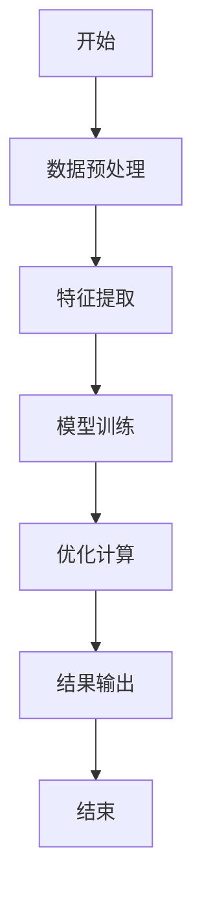
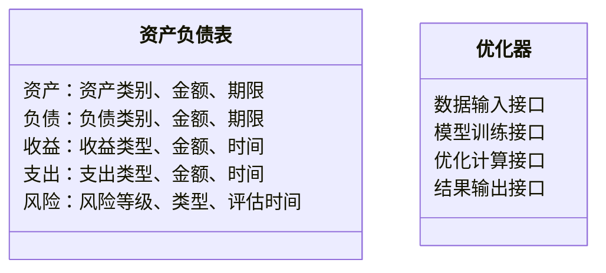
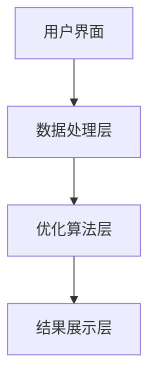

                 


# 智能个人资产负债表优化器

## 关键词：智能优化、个人财务、机器学习、资产配置、风险管理

## 摘要：本文介绍了一种基于人工智能的智能个人资产负债表优化器，通过数据驱动的方法，利用机器学习算法和优化模型，帮助个人用户实现资产配置和风险管理的智能化，提升财务健康状况。

---

# 目录

## 第一章：智能个人资产负债表优化器的背景与概念

### 1.1 问题背景
#### 1.1.1 传统个人资产负债表的局限性
#### 1.1.2 数字化与智能化的必要性
#### 1.1.3 人工智能在财务优化中的应用潜力

### 1.2 问题描述
#### 1.2.1 资产负债表的核心要素
#### 1.2.2 个人财务优化的主要挑战
#### 1.2.3 智能优化器的目标与范围

### 1.3 问题解决
#### 1.3.1 智能优化器的核心功能
#### 1.3.2 数据驱动的优化方法
#### 1.3.3 多目标优化的实现路径

### 1.4 边界与外延
#### 1.4.1 优化器的适用场景
#### 1.4.2 与传统财务工具的区别
#### 1.4.3 与其他智能财务工具的对比

### 1.5 概念结构与核心要素组成
#### 1.5.1 核心概念的定义
#### 1.5.2 核心要素的特征对比
#### 1.5.3 概念结构的ER实体关系图

---

## 第二章：智能个人资产负债表优化器的核心概念与原理

### 2.1 核心概念原理
#### 2.1.1 数据预处理与特征提取
#### 2.1.2 智能优化算法的选择
#### 2.1.3 多目标优化的实现方式

### 2.2 核心概念属性特征对比表
| 概念 | 属性 | 特征 |
|------|------|------|
| 资产 | 类型 | 金融资产、实物资产 |
| 负债 | 类型 | 短期负债、长期负债 |
| 收益 | 来源 | 投资收益、经营收益 |

### 2.3 ER实体关系图
```mermaid
erd
    左右对齐
    table 资产负债表 {

        cchunk
        左右对齐
        left
        table 资产负债表 {

            field 资产：资产类别、资产金额、资产期限
            field 负债：负债类别、负债金额、负债期限
            field 收益：收益类型、收益金额、收益时间
            field 支出：支出类型、支出金额、支出时间
            field 风险：风险等级、风险类型、风险评估时间
            field 目标：财务目标、目标金额、目标时间

            relation 资产与负债的关系：资产 >-> 负债：拥有
            relation 负债与收益的关系：负债 >-> 收益：产生
            relation 收益与支出的关系：收益 >-> 支出：支持
            relation 风险与目标的关系：风险 >-> 目标：影响
        }
    }
```

---

## 第三章：智能个人资产负债表优化器的算法原理

### 3.1 算法原理
#### 3.1.1 算法选择与优化目标
#### 3.1.2 优化模型的构建
#### 3.1.3 算法流程图


### 3.2 算法实现
#### 3.2.1 Python代码实现
```python
import numpy as np
from scipy.optimize import minimize

def objective_function(weights, assets, liabilities, risks):
    # 目标函数：最大化收益或最小化风险
    return -np.dot(weights, assets) + np.dot(weights, risks)

def constraints(weights, total_assets, total_liabilities):
    # 约束条件：资产与负债的平衡
    return np.dot(weights, total_assets) - np.dot(weights, total_liabilities) >= 0

# 优化器调用
result = minimize(objective_function, initial_weights, method='SLSQP', constraints=constraints)
```

### 3.3 数学模型与公式
#### 3.3.1 目标函数
$$ \text{max} \sum w_i \cdot a_i - \sum w_i \cdot r_i $$
其中，\( w_i \) 是资产 \( i \) 的权重，\( a_i \) 是资产的收益，\( r_i \) 是资产的风险。

#### 3.3.2 约束条件
$$ \sum w_i \cdot a_i = 1 $$
$$ \sum w_i \cdot l_i \leq 0 $$
其中，\( l_i \) 是负债的金额。

---

## 第四章：智能个人资产负债表优化器的系统分析与架构设计

### 4.1 问题场景介绍
#### 4.1.1 系统需求分析
#### 4.1.2 功能模块划分
#### 4.1.3 系统边界与交互

### 4.2 系统功能设计
#### 4.2.1 领域模型


### 4.3 系统架构设计
#### 4.3.1 系统架构图


### 4.4 接口设计
#### 4.4.1 数据输入接口
#### 4.4.2 优化算法接口
#### 4.4.3 结果输出接口

### 4.5 交互流程图
```mermaid
sequenceDiagram
    User -> 数据处理层：输入资产负债数据
    数据处理层 -> 优化算法层：调用优化算法
    优化算法层 -> 数据处理层：返回优化结果
    数据处理层 -> 用户：展示优化结果
```

---

## 第五章：智能个人资产负债表优化器的项目实战

### 5.1 环境安装与配置
#### 5.1.1 Python环境搭建
#### 5.1.2 库的安装：numpy, scipy.optimize

### 5.2 核心代码实现
#### 5.2.1 数据预处理代码
```python
import pandas as pd

# 读取数据
data = pd.read_csv('balance_sheet.csv')
# 数据清洗
data.dropna(inplace=True)
```

#### 5.2.2 优化器核心代码
```python
def optimize_portfolio(asset_returns, asset_risks, initial_weights):
    # 定义目标函数
    def objective(weights):
        return -np.dot(weights, asset_returns) + np.dot(weights, asset_risks)
    
    # 定义约束条件
    constraints = [
        {'type': 'eq', 'fun': lambda w: np.sum(w) - 1},
        {'type': 'ineq', 'fun': lambda w: np.dot(w, asset_returns) - np.dot(w, asset_risks) >= 0}
    ]
    
    # 优化
    result = minimize(objective, initial_weights, method='SLSQP', constraints=constraints)
    return result.x

# 调用优化函数
optimized_weights = optimize_portfolio(asset_returns, asset_risks, initial_weights)
```

### 5.3 实际案例分析
#### 5.3.1 案例背景
#### 5.3.2 数据准备
#### 5.3.3 优化过程
#### 5.3.4 结果解读

---

## 第六章：最佳实践与总结

### 6.1 小结
#### 6.1.1 核心知识点回顾
#### 6.1.2 系统设计要点总结

### 6.2 注意事项
#### 6.2.1 数据质量的重要性
#### 6.2.2 模型调优的注意事项
#### 6.2.3 风险管理的必要性

### 6.3 拓展阅读
#### 6.3.1 更复杂的优化算法
#### 6.3.2 高阶财务模型
#### 6.3.3 与其他智能财务工具的集成

---

## 附录：完整的Python代码实现

### 附录A：数据预处理代码
```python
import pandas as pd
import numpy as np

# 读取数据
data = pd.read_csv('balance_sheet.csv')

# 删除缺失值
data.dropna(inplace=True)

# 数据标准化
data = (data - data.mean()) / data.std()

# 保存处理后的数据
data.to_csv('processed_balance_sheet.csv', index=False)
```

### 附录B：优化器核心代码
```python
import numpy as np
from scipy.optimize import minimize

def optimize_portfolio(asset_returns, asset_risks, initial_weights):
    # 定义目标函数
    def objective(weights):
        return -np.dot(weights, asset_returns) + np.dot(weights, asset_risks)
    
    # 定义约束条件
    constraints = [
        {'type': 'eq', 'fun': lambda w: np.sum(w) - 1},
        {'type': 'ineq', 'fun': lambda w: np.dot(w, asset_returns) - np.dot(w, asset_risks) >= 0}
    ]
    
    # 优化
    result = minimize(objective, initial_weights, method='SLSQP', constraints=constraints)
    return result.x

# 示例调用
initial_weights = np.array([0.5, 0.3, 0.2])
asset_returns = np.array([0.1, 0.2, 0.15])
asset_risks = np.array([0.1, 0.15, 0.05])
optimized_weights = optimize_portfolio(asset_returns, asset_risks, initial_weights)
print("Optimized Weights:", optimized_weights)
```

---

## 参考文献
1. 《Python优化算法》
2. 《机器学习在金融中的应用》
3. 《智能财务系统设计与实现》

