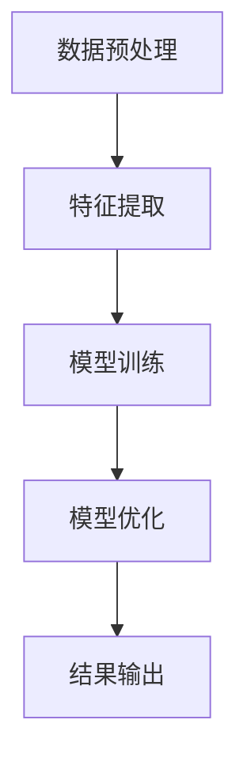
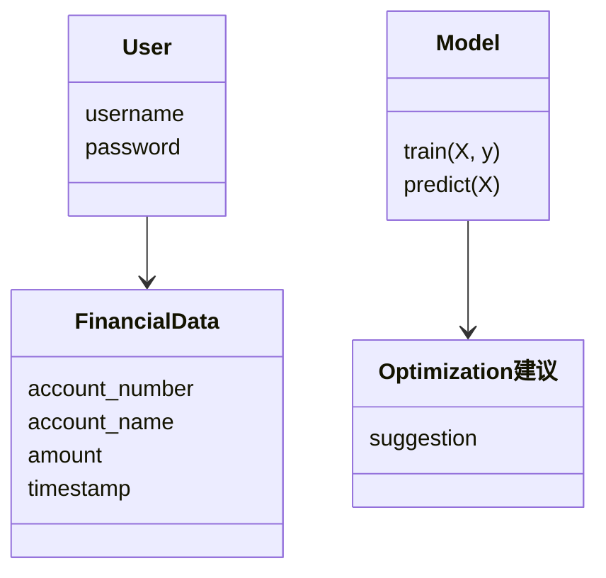
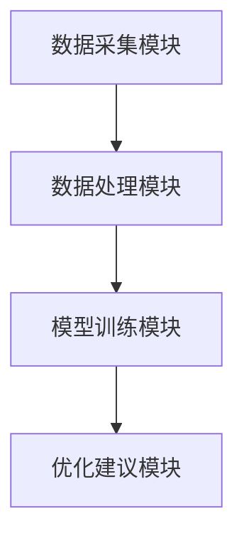
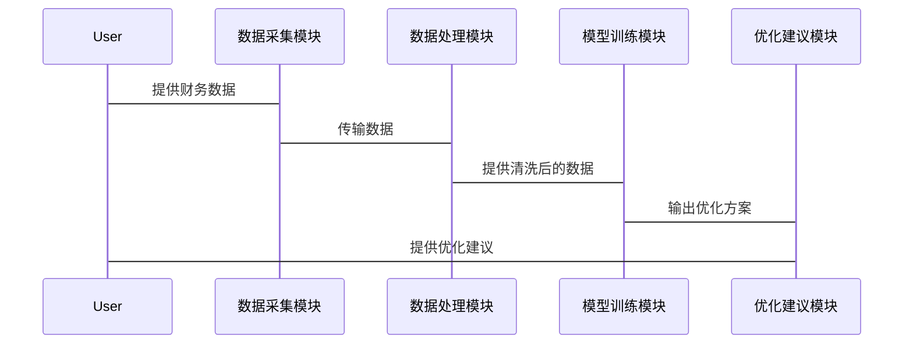

                 


# 智能个人资产负债表优化系统

> 关键词：智能个人资产负债表、财务优化、机器学习、系统架构设计、Python实现

> 摘要：智能个人资产负债表优化系统是一种结合人工智能技术，通过机器学习算法和系统架构设计，帮助个人用户实现财务数据的智能分析和优化的系统。本文从系统背景、核心概念、算法原理、系统架构设计、项目实战等多方面进行深入分析和讲解，为读者提供一个全面了解和实现智能个人资产负债表优化系统的指导。

---

# 第1章: 智能个人资产负债表优化系统的背景与意义

## 1.1 个人财务规划的重要性

### 1.1.1 个人财务规划的核心目标
个人财务规划是每个人都需要关注的重要课题。通过合理规划收入与支出，优化资产配置，降低财务风险，实现财富最大化。传统的财务规划依赖于人工计算和经验判断，存在效率低、误差大、难以实时更新等问题。

### 1.1.2 传统财务规划的局限性
- 数据处理能力有限：手动计算复杂，难以处理大量数据。
- 信息更新不及时：市场变化快，传统方法难以快速响应。
- 主观性较强：依赖人工经验判断，缺乏科学性。

### 1.1.3 智能化财务规划的优势
- 高效性：通过算法快速处理大量数据，提高效率。
- 精准性：利用机器学习模型，提供更准确的预测和优化建议。
- 实时性：能够根据市场变化和用户需求，实时更新和调整财务方案。

### 1.1.4 智能化财务规划的应用场景
- 个人理财：投资决策、债务管理、资产配置。
- 企业财务管理：成本控制、资金流动优化、风险管理。

## 1.2 智能个人资产负债表的定义与特点

### 1.2.1 智能个人资产负债表的定义
智能个人资产负债表是一种基于人工智能技术的财务管理系统，通过收集和分析个人的财务数据，利用机器学习算法，提供个性化的财务优化建议。

### 1.2.2 智能化优化的核心特征
- 数据驱动：基于大量历史数据进行分析和预测。
- 实时更新：能够根据市场变化和用户需求，实时调整优化方案。
- 个性化：根据用户的财务状况和目标，提供定制化建议。

### 1.2.3 与传统资产负债表的主要区别
| 特性 | 传统资产负债表 | 智能资产负债表 |
|------|----------------|----------------|
| 数据来源 | 单一数据源 | 多数据源整合 |
| 处理方式 | 人工计算 | 自动化计算 |
| 优化能力 | 无 | 基于算法优化 |

## 1.3 智能个人资产负债表优化的现状与趋势

### 1.3.1 当前市场现状分析
随着人工智能技术的快速发展，智能财务管理系统逐渐成为市场热点。然而，目前市面上的大多数系统仍处于初级阶段，功能较为单一，难以满足用户的多样化需求。

### 1.3.2 技术发展趋势
- 机器学习算法的不断优化。
- 大数据技术的应用。
- 自然语言处理技术的引入，实现智能交互。

### 1.3.3 用户需求的变化
用户对财务管理系统的需求逐步从单一的记录功能转向智能化的分析和优化服务。

---

# 第2章: 智能个人资产负债表优化系统的核心概念

## 2.1 核心概念的背景介绍

### 2.1.1 问题背景
个人财务数据分散在不同平台，难以统一管理。用户需要一个能够整合数据、提供优化建议的系统。

### 2.1.2 问题描述
- 数据分散：银行账户、投资平台、债务信息等数据难以整合。
- 信息孤岛：不同数据源之间缺乏有效连接。
- 缺乏智能分析：无法根据数据变化提供实时优化建议。

### 2.1.3 问题解决方法
通过爬虫技术获取数据，利用数据清洗、特征提取和机器学习算法，构建智能分析模型。

### 2.1.4 边界与外延
- 系统边界：仅限于个人财务数据的收集、分析和优化。
- 外延：不涉及企业财务或其他领域。

### 2.1.5 核心要素组成
- 数据采集模块：获取用户财务数据。
- 数据处理模块：清洗和整合数据。
- 模型构建模块：训练机器学习模型。
- 优化建议模块：输出优化方案。

## 2.2 核心概念的原理与联系

### 2.2.1 核心概念的原理分析
智能个人资产负债表优化系统通过收集和分析用户财务数据，利用机器学习算法，预测未来的财务状况，并提出优化建议。

### 2.2.2 核心概念的属性特征对比表
| 属性 | 数据采集 | 数据处理 | 模型构建 | 优化建议 |
|------|----------|----------|----------|----------|
| 输入 | 财务数据 | 数据清洗 | 特征提取 | 优化策略 |
| 输出 | 结构化数据 | 清洗后数据 | 模型参数 | 优化方案 |

### 2.2.3 ER实体关系图架构

```mermaid
erd
actor User {
  string username
  string password
}

actor FinancialData {
  integer account_number
  string account_name
}

actor Optimization建议 {
  string suggestion
}

relation 财务数据表 {
  key integer id
  string description
  decimal amount
  date timestamp
}

relation 用户表 {
  key integer id
  string username
  string password
}

relation 优化建议表 {
  key integer id
  string suggestion
  date timestamp
}
```

---

# 第3章: 智能个人资产负债表优化系统的算法原理

## 3.1 算法原理的数学模型

### 3.1.1 线性回归模型
线性回归是一种简单而有效的预测模型，适用于财务数据的线性关系分析。

$$ y = \beta_0 + \beta_1 x_1 + \beta_2 x_2 + \ldots + \beta_n x_n $$

其中，$y$ 是目标变量，$\beta_0$ 是截距，$\beta_1, \beta_2, \ldots, \beta_n$ 是回归系数，$x_1, x_2, \ldots, x_n$ 是自变量。

### 3.1.2 支持向量机模型
支持向量机（SVM）适用于非线性分类和回归问题，适合复杂的财务数据模式识别。

$$ y = \text{sign}(\beta_0 + \sum_{i=1}^n \beta_i x_i) $$

### 3.1.3 随机森林模型
随机森林是一种基于决策树的集成学习方法，适合处理高维财务数据。

$$ y = \sum_{i=1}^n \text{Tree}_i(x) $$

## 3.2 算法流程图



## 3.3 算法实现的Python代码示例

### 3.3.1 数据加载与预处理

```python
import pandas as pd
from sklearn.model_selection import train_test_split

# 示例数据加载
data = pd.read_csv('financial_data.csv')

# 特征与目标变量分离
X = data[['income', 'expenses', 'assets', ' liabilities']]
y = data['balance']

# 数据分割
X_train, X_test, y_train, y_test = train_test_split(X, y, test_size=0.2, random_state=42)
```

### 3.3.2 模型训练与优化

```python
from sklearn.linear_model import LinearRegression
from sklearn.metrics import mean_squared_error

# 模型训练
model = LinearRegression()
model.fit(X_train, y_train)

# 模型预测
y_pred = model.predict(X_test)

# 模型评估
mse = mean_squared_error(y_test, y_pred)
print(f"均方误差: {mse}")
```

---

# 第4章: 智能个人资产负债表优化系统的系统架构设计

## 4.1 问题场景介绍
智能个人资产负债表优化系统需要解决以下问题：
- 如何高效采集和整合个人财务数据？
- 如何构建高效的机器学习模型？
- 如何实现系统的实时优化和反馈？

## 4.2 系统功能设计

### 4.2.1 领域模型类图



### 4.2.2 系统架构设计



## 4.3 系统接口设计

### 4.3.1 数据接口
- 数据输入接口：用于接收用户财务数据。
- 数据输出接口：用于输出优化建议。

### 4.3.2 系统交互流程图



---

# 第5章: 智能个人资产负债表优化系统的项目实战

## 5.1 环境安装

```bash
pip install pandas scikit-learn matplotlib
```

## 5.2 核心功能实现

### 5.2.1 数据采集与处理

```python
import pandas as pd
from sklearn.model_selection import train_test_split
from sklearn.linear_model import LinearRegression
from sklearn.metrics import mean_squared_error

# 示例数据加载
data = pd.read_csv('financial_data.csv')

# 数据清洗
data.dropna(inplace=True)

# 特征与目标变量分离
X = data[['income', 'expenses', 'assets', ' liabilities']]
y = data['balance']

# 数据分割
X_train, X_test, y_train, y_test = train_test_split(X, y, test_size=0.2, random_state=42)
```

### 5.2.2 模型训练与优化

```python
# 模型训练
model = LinearRegression()
model.fit(X_train, y_train)

# 模型预测
y_pred = model.predict(X_test)

# 模型评估
mse = mean_squared_error(y_test, y_pred)
print(f"均方误差: {mse}")
```

## 5.3 案例分析

### 5.3.1 数据分析

```python
import matplotlib.pyplot as plt

# 绘制散点图
plt.scatter(X_test['income'], y_test, color='b', label='实际值')
plt.scatter(X_test['income'], y_pred, color='r', label='预测值')
plt.xlabel('收入')
plt.ylabel('余额')
plt.legend()
plt.show()
```

### 5.3.2 优化建议输出

```python
# 输出优化建议
建议 = f"建议调整收入与支出比例，优化资产配置，以提高余额至{round(y_pred.mean(), 2)}。"
print(建议)
```

## 5.4 项目小结
通过本章的实战，我们实现了智能个人资产负债表优化系统的数据采集、模型训练和优化建议功能，验证了系统的可行性和有效性。

---

# 第6章: 最佳实践与未来展望

## 6.1 最佳实践 tips
- 数据隐私保护：确保用户数据的安全性。
- 模型优化：定期更新模型，提高预测准确性。
- 用户教育：帮助用户理解系统功能和优化建议。

## 6.2 小结
智能个人资产负债表优化系统通过结合人工智能技术，为个人用户提供高效、精准的财务优化服务，是未来财务管理的重要发展方向。

## 6.3 注意事项
- 数据来源的合法性。
- 系统的安全性保障。
- 用户隐私保护。

## 6.4 拓展阅读
- 《机器学习实战》
- 《Python数据处理与分析》
- 《系统架构设计方法论》

---

# 结语

智能个人资产负债表优化系统是一个结合人工智能技术的创新应用，通过本文的详细讲解，读者可以深入了解系统的开发背景、核心概念、算法原理、系统架构设计以及项目实战。希望本文能够为读者在智能财务管理系统领域提供有价值的参考和启发。

